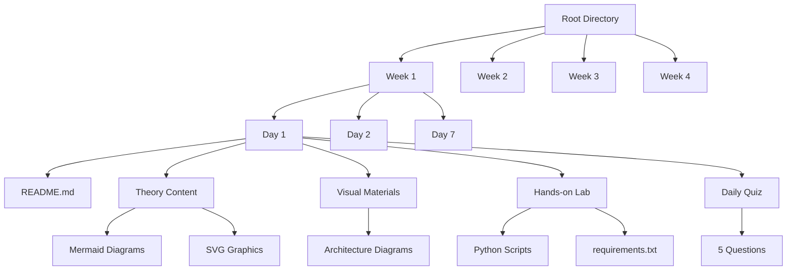

# Design Document: AWS SAA-C03 Study Materials System

## Overview

AWS Solutions Architect Associate (SAA-C03) 시험을 위한 체계적인 1달 학습 시스템을 설계합니다. 이 시스템은 주차별/일별 구조화된 학습 경로, 시각화 자료, Python 기반 실습, 그리고 일별 퀴즈를 통한 진도 확인 기능을 제공합니다.

학습자는 대학교 막학기 컴퓨터공학과 학생 수준으로, 이론적 배경은 있지만 AWS 실무 경험은 제한적일 것으로 가정합니다. 따라서 개념 설명은 친근하고 이해하기 쉽게, 실습은 단계별로 상세하게 구성합니다.

## Architecture

시스템은 다음과 같은 계층 구조로 설계됩니다:



### 폴더 구조 설계

```
aws-saa-study-materials/
├── README.md (전체 과정 개요)
├── week1/
│   ├── README.md (주차 개요)
│   ├── day1/
│   │   ├── README.md (일일 학습 가이드)
│   │   ├── theory.md (이론 내용)
│   │   ├── visuals/ (시각화 자료)
│   │   ├── hands-on/ (실습 자료)
│   │   └── quiz.md (일일 퀴즈)
│   └── ... (day2-day7)
├── week2/ (동일 구조)
├── week3/ (동일 구조)
├── week4/ (동일 구조)
└── resources/ (공통 자료)
    ├── cheat-sheets/
    ├── templates/
    └── progress-tracker.md
```

## Components and Interfaces

### 1. Content Management System

**ContentGenerator 클래스**
- 역할: 일별 학습 콘텐츠 생성 및 관리
- 주요 메서드:
  - `generate_theory_content(topic, difficulty_level)`
  - `create_visual_materials(concept, diagram_type)`
  - `format_content_for_students(content, style="conversational")`

**ProgressTracker 클래스**
- 역할: 학습 진도 및 성취도 추적
- 주요 메서드:
  - `track_daily_completion(week, day)`
  - `calculate_quiz_score(answers, correct_answers)`
  - `generate_progress_report()`

### 2. Quiz Management System

**QuizGenerator 클래스**
- 역할: 일별 5문제 퀴즈 생성 및 관리
- 주요 메서드:
  - `generate_daily_quiz(topics, difficulty="intermediate")`
  - `create_scenario_questions(aws_service, use_case)`
  - `validate_answers(user_answers, correct_answers)`

### 3. Hands-on Lab System

**LabManager 클래스**
- 역할: Python 기반 실습 환경 관리
- 주요 메서드:
  - `setup_lab_environment(requirements)`
  - `generate_lab_instructions(aws_service, objectives)`
  - `create_sample_code(service_type, complexity_level)`

### 4. Visual Content Generator

**VisualizationEngine 클래스**
- 역할: Mermaid, SVG 등 시각화 자료 생성
- 주요 메서드:
  - `create_mermaid_diagram(architecture_type, services)`
  - `generate_svg_graphic(concept, style="educational")`
  - `create_interactive_diagram(components, relationships)`

## Data Models

### 학습 콘텐츠 구조

```python
@dataclass
class DailyContent:
    week: int
    day: int
    title: str
    learning_objectives: List[str]
    theory_content: str
    visual_materials: List[str]
    hands_on_lab: LabContent
    quiz: QuizContent
    estimated_time: int  # minutes
    prerequisites: List[str]
    
@dataclass
class LabContent:
    title: str
    description: str
    requirements: List[str]  # Python packages
    setup_instructions: str
    code_examples: List[str]
    exercises: List[str]
    
@dataclass
class QuizContent:
    questions: List[Question]
    total_score: int
    passing_score: int
    time_limit: int  # minutes
    
@dataclass
class Question:
    id: str
    type: str  # "multiple_choice", "scenario", "true_false"
    question_text: str
    options: List[str]
    correct_answer: str
    explanation: str
    difficulty: str
    aws_domain: str
```

### 4주 학습 커리큘럼 구조

**Week 1: AWS 기초 및 핵심 서비스**
- Day 1: AWS 개요 및 글로벌 인프라
- Day 2: IAM (Identity and Access Management)
- Day 3: EC2 (Elastic Compute Cloud) 기초
- Day 4: EC2 고급 기능 및 스토리지
- Day 5: VPC (Virtual Private Cloud) 기초
- Day 6: VPC 고급 및 네트워킹
- Day 7: 주간 복습 및 실습 프로젝트

**Week 2: 스토리지 및 데이터베이스**
- Day 8: S3 (Simple Storage Service)
- Day 9: EBS, EFS, FSx
- Day 10: RDS (Relational Database Service)
- Day 11: DynamoDB 및 NoSQL
- Day 12: 데이터 마이그레이션 서비스
- Day 13: 백업 및 재해 복구
- Day 14: 주간 복습 및 실습 프로젝트

**Week 3: 애플리케이션 서비스 및 배포**
- Day 15: Load Balancing 및 Auto Scaling
- Day 16: CloudFront 및 CDN
- Day 17: Route 53 및 DNS
- Day 18: API Gateway 및 Lambda
- Day 19: ECS, EKS, Fargate
- Day 20: 배포 및 관리 도구
- Day 21: 주간 복습 및 실습 프로젝트

**Week 4: 모니터링, 보안 및 최적화**
- Day 22: CloudWatch 및 모니터링
- Day 23: CloudTrail 및 보안 서비스
- Day 24: 비용 최적화 및 관리
- Day 25: Well-Architected Framework
- Day 26: 종합 실습 프로젝트
- Day 27: 모의고사 및 최종 복습
- Day 28: 시험 준비 및 팁

## Correctness Properties

*A property is a characteristic or behavior that should hold true across all valid executions of a system-essentially, a formal statement about what the system should do. Properties serve as the bridge between human-readable specifications and machine-verifiable correctness guarantees.*

### Property 1: Folder Structure Consistency
*For any* week and day combination in the 4-week curriculum, the folder structure should follow the week(n)/day(n) naming pattern and contain all required files
**Validates: Requirements 1.1, 1.5**

### Property 2: README File Presence
*For any* folder created in the study system, it should contain a README.md file for content indexing and navigation
**Validates: Requirements 1.2**

### Property 3: Content Organization Verification
*For any* daily content, it should be properly categorized under the correct weekly theme and contain all required content sections
**Validates: Requirements 1.3**

### Property 4: Navigation Completeness
*For any* folder in the system, it should provide clear navigation links and indexing information to related content
**Validates: Requirements 1.4**

### Property 5: Visual Materials Integration
*For any* theoretical content, it should include appropriate visual materials using Mermaid diagrams or SVG graphics
**Validates: Requirements 2.3**

### Property 6: Exam Domain Coverage
*For any* SAA-C03 exam domain, it should be represented in the curriculum with appropriate depth and coverage
**Validates: Requirements 2.5**

### Property 7: Python Lab Structure
*For any* hands-on lab, it should contain Python scripts, requirements.txt file, and implementation guides
**Validates: Requirements 3.1, 3.2, 3.3**

### Property 8: Lab Code Completeness
*For any* lab directory, it should include working code examples and templates that students can execute
**Validates: Requirements 3.4**

### Property 9: AWS Lab Setup Instructions
*For any* lab that uses AWS services, it should provide clear setup instructions and prerequisites
**Validates: Requirements 3.5**

### Property 10: Daily Quiz Question Count
*For any* daily quiz, it should contain exactly 5 questions covering the day's learning objectives
**Validates: Requirements 4.1**

### Property 11: Quiz Feedback System
*For any* quiz completion, the system should provide immediate feedback and performance scoring
**Validates: Requirements 4.3**

### Property 12: Question Type Diversity
*For any* quiz, it should include multiple question types (multiple choice, scenario-based, true/false)
**Validates: Requirements 4.4**

### Property 13: Progress Tracking Functionality
*For any* learning activity completion, the system should update and maintain progress statistics
**Validates: Requirements 4.5**

### Property 14: Mermaid Diagram Integration
*For any* AWS service relationship explanation, it should include appropriate Mermaid diagrams
**Validates: Requirements 5.1**

### Property 15: SVG Graphics for Architecture
*For any* architectural pattern explanation, it should include clear SVG graphics for visualization
**Validates: Requirements 5.2**

### Property 16: Interactive Visual Elements
*For any* complex concept explanation, it should include interactive visual elements where appropriate
**Validates: Requirements 5.4**

### Property 17: Practical Examples Inclusion
*For any* theoretical concept, it should include practical examples and real-world scenarios
**Validates: Requirements 6.2**

### Property 18: Learning Objectives Clarity
*For any* daily content, it should provide clear learning objectives and expected outcomes
**Validates: Requirements 6.3**

### Property 19: Prerequisite Information
*For any* learning content, it should include prerequisite knowledge and learning outcome information
**Validates: Requirements 6.4**

### Property 20: Navigation System Completeness
*For any* content section, it should provide clear navigation links to related weeks and days
**Validates: Requirements 7.1**

### Property 21: Progress Indicator Display
*For any* content access, the system should display appropriate progress indicators
**Validates: Requirements 7.2**

### Property 22: Reference Materials Availability
*For any* study system, it should include quick reference materials and cheat sheets
**Validates: Requirements 7.3**

### Property 23: Document Formatting Consistency
*For any* document in the system, it should follow consistent formatting patterns and styles
**Validates: Requirements 7.4**

### Property 24: Content Search Capability
*For any* content search request, the system should enable easy content discovery and review
**Validates: Requirements 7.5**

## Error Handling

### Content Generation Errors
- **Missing Prerequisites**: When content references concepts not yet covered, provide clear prerequisite links
- **Invalid AWS Service References**: Validate all AWS service names and features against current documentation
- **Broken Visual Elements**: Implement fallback text descriptions when diagrams fail to render
- **Quiz Answer Validation**: Ensure all quiz questions have correct answers and explanations

### File System Errors
- **Missing Directories**: Automatically create required folder structure if missing
- **Permission Issues**: Provide clear error messages for file access problems
- **Corrupted Content**: Implement content validation and recovery mechanisms
- **Dependency Conflicts**: Handle Python package conflicts in requirements.txt files

### User Experience Errors
- **Navigation Failures**: Provide alternative navigation paths when links are broken
- **Progress Tracking Issues**: Maintain backup progress data and recovery options
- **Quiz Submission Problems**: Allow quiz retakes and progress preservation
- **Content Loading Delays**: Implement progressive loading and offline capabilities

## Testing Strategy

### Dual Testing Approach
The system will use both unit testing and property-based testing to ensure comprehensive coverage:

**Unit Tests**: Verify specific examples, edge cases, and error conditions
- Test specific folder creation scenarios
- Validate individual quiz question formats
- Check specific visual content generation cases
- Test error handling for common failure scenarios

**Property Tests**: Verify universal properties across all inputs
- Test folder structure consistency across all weeks/days
- Validate content completeness across all curriculum topics
- Verify quiz generation across all difficulty levels and topics
- Test visual content generation across all AWS services

### Property-Based Testing Configuration
- **Testing Framework**: Use Hypothesis for Python-based property testing
- **Minimum Iterations**: 100 iterations per property test
- **Test Tagging**: Each property test tagged with format: **Feature: aws-saa-study-materials, Property {number}: {property_text}**
- **Coverage Requirements**: Each correctness property implemented by a single property-based test

### Testing Implementation Guidelines
- Property tests will generate random combinations of weeks, days, topics, and content types
- Unit tests will focus on specific integration points and error conditions
- Both test types are complementary and necessary for comprehensive system validation
- Tests will validate both content structure and educational effectiveness