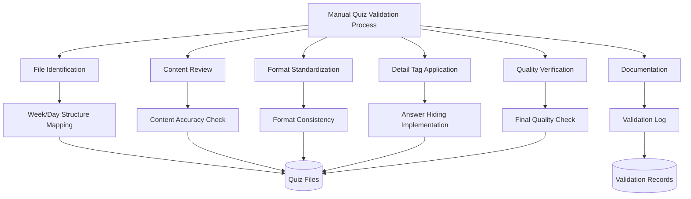

# Design Document: Manual Quiz Validation Process

## Overview

AWS SAA-C03 스터디 자료 프로젝트의 퀴즈 품질을 보장하기 위한 수동 검증 및 개선 프로세스입니다. 이 프로세스는 모든 퀴즈 파일을 직접 검토하고, 내용을 검증하며, 사용자 경험을 향상시키기 위해 정답을 `<details>` 태그로 숨기는 작업을 수행합니다.

## Architecture



## Components and Interfaces

### 1. Manual Validation Workflow
**Purpose**: 체계적인 수동 검증 프로세스를 통해 모든 퀴즈 파일의 품질을 보장

**Process Steps**:
1. 파일 식별 및 목록 작성
2. 내용 검토 및 정확성 확인
3. 형식 표준화 적용
4. Detail 태그 적용
5. 최종 품질 검증
6. 검증 결과 문서화

### 2. File Identification Process
**Purpose**: 모든 퀴즈 파일을 체계적으로 식별하고 검증 순서를 결정

**Manual Steps**:
- week1/day1부터 week4/day28까지 순차적으로 quiz.md 파일 확인
- 각 파일의 존재 여부 및 접근 가능성 확인
- 파일 크기 및 기본 구조 점검

### 3. Content Review Process
**Purpose**: 퀴즈 내용의 정확성과 완성도를 수동으로 검증

**Manual Steps**:
- 각 질문의 AWS SAA-C03 시험 관련성 확인
- 정답의 정확성 검증
- 해설의 완성도 및 정확성 점검
- 한국어 표현의 자연스러움 확인

### 4. Format Standardization Process
**Purpose**: 모든 퀴즈 파일의 형식을 일관되게 표준화

**Manual Steps**:
- 질문 번호 체계 통일 (1, 2, 3, ...)
- 일반 퀴즈: 선택지 라벨 표준화 (A, B, C, D)
- 주 마지막 종합 퀴즈: 선택지 라벨 표준화 (A, B, C, D, E)
- 주 마지막 종합 퀴즈 복수 정답 확인 (15문항 중 30% = 약 4-5문항)
- 정답 섹션 헤더 통일
- 마크다운 형식 일관성 확보

### 5. Weekly Comprehensive Quiz Validation
**Purpose**: 주 마지막 종합 퀴즈의 특별 요구사항 검증

**Manual Steps**:
- Day 7, 14, 21, 27 퀴즈가 15문항인지 확인
- 각 문항이 5개 선택지 (A, B, C, D, E)를 가지는지 확인
- 복수 정답 문항이 전체의 30% (4-5문항)인지 확인
- 복수 정답 표기 형식 통일 ("정답: A, C" 형식)
- 복수 정답 문항의 해설이 각 정답에 대해 설명하는지 확인

### 5. Detail Tag Application Process
**Purpose**: 정답 섹션에 `<details>` 태그를 수동으로 적용

**Manual Steps**:
- 각 정답 섹션 식별
- `<details>` 태그로 정답 내용 감싸기
- 적절한 `<summary>` 텍스트 작성
- HTML 태그 구문 검증

### 6. Quality Verification Process
**Purpose**: 모든 변경사항의 품질을 최종 검증

**Manual Steps**:
- 수정된 파일의 마크다운 렌더링 확인
- Detail 태그 동작 테스트
- 내용 누락 여부 점검
- 전체적인 일관성 확인

## Data Models

### Quiz File Structure

#### 일반 퀴즈 (5문항)
```markdown
# Day X Quiz

## Question 1
질문 내용...

A) 선택지 1
B) 선택지 2  
C) 선택지 3
D) 선택지 4

<details>
<summary>정답 및 해설 보기</summary>

**정답: A**

해설: 상세한 설명...
</details>
```

#### 주 마지막 종합 퀴즈 (15문항, Day 7, 14, 21, 27)
```markdown
# Week X 종합 Quiz

## Question 1
질문 내용...

A) 선택지 1
B) 선택지 2  
C) 선택지 3
D) 선택지 4
E) 선택지 5

<details>
<summary>정답 및 해설 보기</summary>

**정답: A, C** (복수 정답 - 전체 문항의 30% 해당)

해설: 상세한 설명...
</details>
```

### Validation Checklist
```markdown
#### 일반 퀴즈 (Day 1-6, 8-13, 15-20, 22-26, 28)
- [ ] 파일 존재 확인
- [ ] 5문항 구성 확인
- [ ] 4개 선택지 (A, B, C, D) 확인
- [ ] 단일 정답 확인
- [ ] 질문 구조 검증
- [ ] 정답 정확성 확인
- [ ] 해설 완성도 점검
- [ ] 형식 표준화 적용
- [ ] Detail 태그 적용
- [ ] 최종 품질 검증

#### 주 마지막 종합 퀴즈 (Day 7, 14, 21, 27)
- [ ] 파일 존재 확인
- [ ] 15문항 구성 확인
- [ ] 5개 선택지 (A, B, C, D, E) 확인
- [ ] 복수 정답 문항 30% (4-5문항) 확인
- [ ] 복수 정답 표기 형식 확인
- [ ] 질문 구조 검증
- [ ] 정답 정확성 확인
- [ ] 복수 정답 해설 완성도 점검
- [ ] 형식 표준화 적용
- [ ] Detail 태그 적용
- [ ] 최종 품질 검증
```

### Progress Tracking
```markdown
| Week | Day | File Path | Type | Questions | Multi-Answer | Status | Issues | Notes |
|------|-----|-----------|------|-----------|--------------|--------|--------|-------|
| 1    | 1   | week1/day1/quiz.md | Regular | 5 | 0 | ✅ | None | Complete |
| 1    | 7   | week1/day7/quiz.md | Weekly | 15 | 4-5 | 🔄 | Format | In Progress |
| 2    | 14  | week2/day14/quiz.md | Weekly | 15 | 4-5 | ❌ | Missing | Not Started |
```

## Correctness Properties

*A property is a characteristic or behavior that should hold true across all valid executions of a system-essentially, a formal statement about what the system should do. Properties serve as the bridge between human-readable specifications and machine-verifiable correctness guarantees.*

### Property 1: File Coverage Completeness
*For any* manual validation process, all quiz.md files in week{n}/day{n} folders (where n is 1-4 for weeks and 1-28 for days) should be identified and processed
**Validates: Requirements 1.1, 1.5**

### Property 2: Content Structure Preservation
*For any* quiz file that undergoes manual review, the original question content, options, and explanations should be preserved while only improving formatting and presentation
**Validates: Requirements 1.2, 1.3**

### Property 3: Detail Tag Structure Validity
*For any* answer section wrapped in detail tags during manual processing, the resulting HTML should contain properly nested `<details>` and `<summary>` tags with valid syntax
**Validates: Requirements 2.1, 2.2**

### Property 4: Content Preservation During Manual Editing
*For any* quiz file manually edited to add detail tags, the original question text, options, and explanation content should remain unchanged
**Validates: Requirements 2.5**

### Property 5: Format Standardization Consistency
*For any* set of quiz files processed through manual standardization, all files should follow the same question numbering scheme (1, 2, 3...), option labeling format (A, B, C, D), and answer section structure
**Validates: Requirements 4.1, 4.2, 4.3**

### Property 6: Korean Content Preservation
*For any* quiz file containing Korean language content, the manual editing process should preserve all Korean text without modification or corruption
**Validates: Requirements 4.4**

### Property 7: Manual Validation Completeness
*For any* quiz file that undergoes manual content review, every question should be checked for proper structure, correct answer marking, and explanation completeness
**Validates: Requirements 3.2, 3.4**

### Property 8: Progress Tracking Accuracy
*For any* manual validation session, the progress tracking should accurately reflect the number of files processed, issues identified, and completion status
**Validates: Requirements 5.1, 5.3**

### Property 9: Issue Documentation Completeness
*For any* problems identified during manual review, specific issues should be documented with clear descriptions and improvement recommendations
**Validates: Requirements 5.2, 5.4**

### Property 10: Validation Record Persistence
*For any* completed manual validation process, the results and progress should be saved in a structured format for future reference and tracking
**Validates: Requirements 5.5**

## Error Handling

### Manual Process Error Prevention
- **File Access Issues**: 파일이 존재하지 않거나 접근할 수 없는 경우 진행 상황 기록에 표시
- **Content Corruption**: 수동 편집 중 실수로 내용이 손상된 경우를 대비한 백업 전략
- **Format Inconsistency**: 표준화 과정에서 놓친 형식 불일치 사항에 대한 재검토 프로세스

### Quality Assurance Measures
- **Double-Check Process**: 중요한 변경사항에 대한 이중 확인 절차
- **Content Validation**: 수정된 내용의 정확성 재검증
- **Backup Strategy**: 원본 파일의 안전한 백업 및 복원 방법

### Documentation Requirements
- **Change Log**: 모든 수정사항에 대한 상세한 기록
- **Issue Tracking**: 발견된 문제점과 해결 방법 문서화
- **Progress Monitoring**: 전체 진행 상황의 체계적 추적

## Testing Strategy

### Manual Validation Testing
- 수정된 각 퀴즈 파일의 마크다운 렌더링 테스트
- Detail 태그의 정상 동작 확인
- 한국어 콘텐츠의 올바른 표시 검증
- 전체적인 형식 일관성 점검

### Quality Verification Testing
- 원본 내용과 수정된 내용의 비교 검증
- HTML 태그 구문의 유효성 확인
- 링크 및 참조의 정상 작동 테스트
- 다양한 마크다운 렌더러에서의 호환성 테스트

### Process Validation Testing
- 수동 검증 프로세스의 완성도 확인
- 진행 상황 추적의 정확성 검증
- 문서화 품질의 일관성 점검

### Test Configuration
- 각 퀴즈 파일에 대한 개별 검증 수행
- 주차별/일별 그룹 단위의 일관성 테스트
- 전체 프로젝트 수준의 통합 검증
- **Feature: quiz-validation, Manual Process Validation** 형식으로 검증 기록 관리