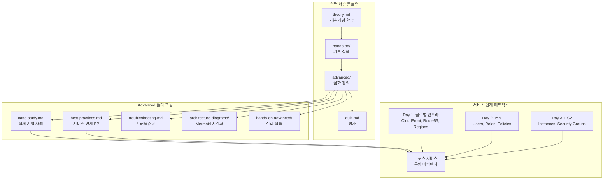
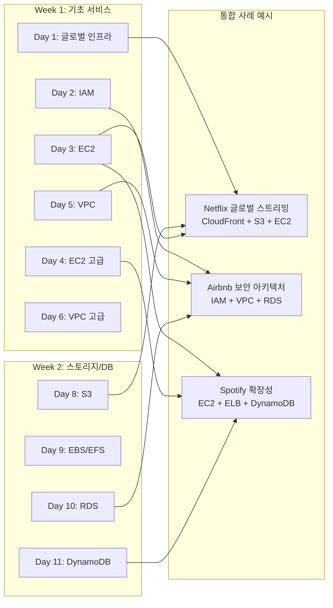
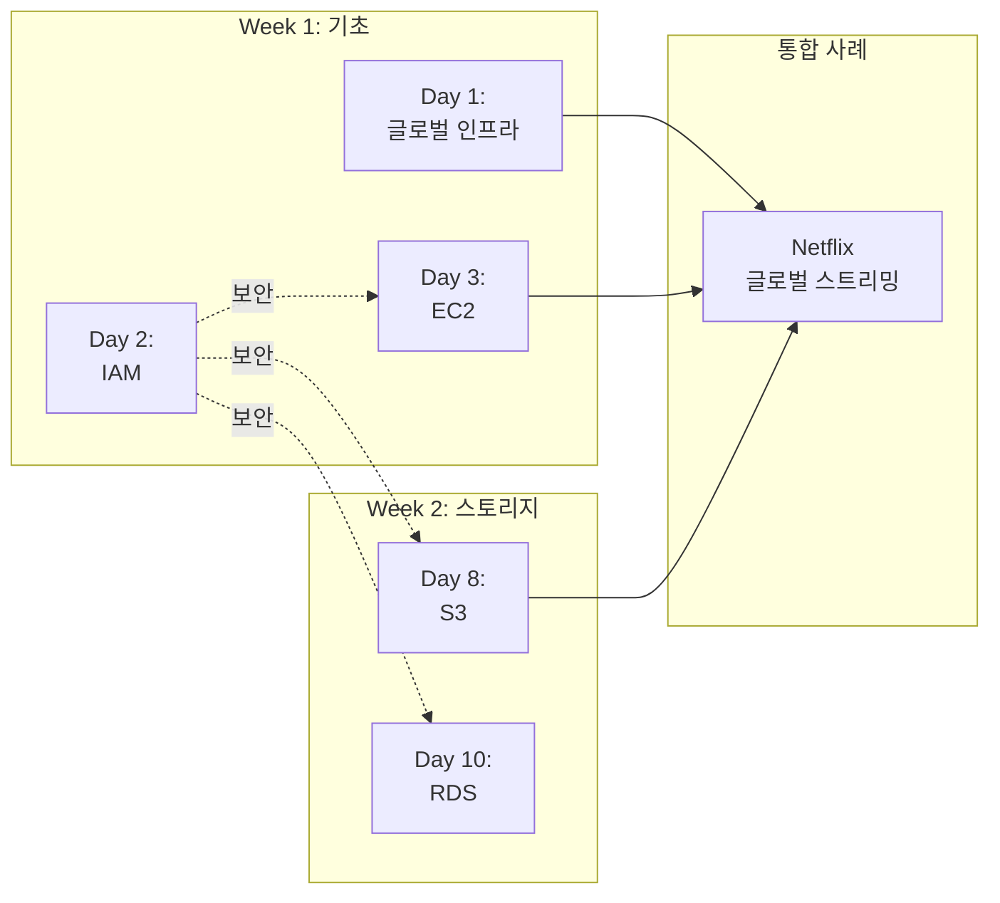
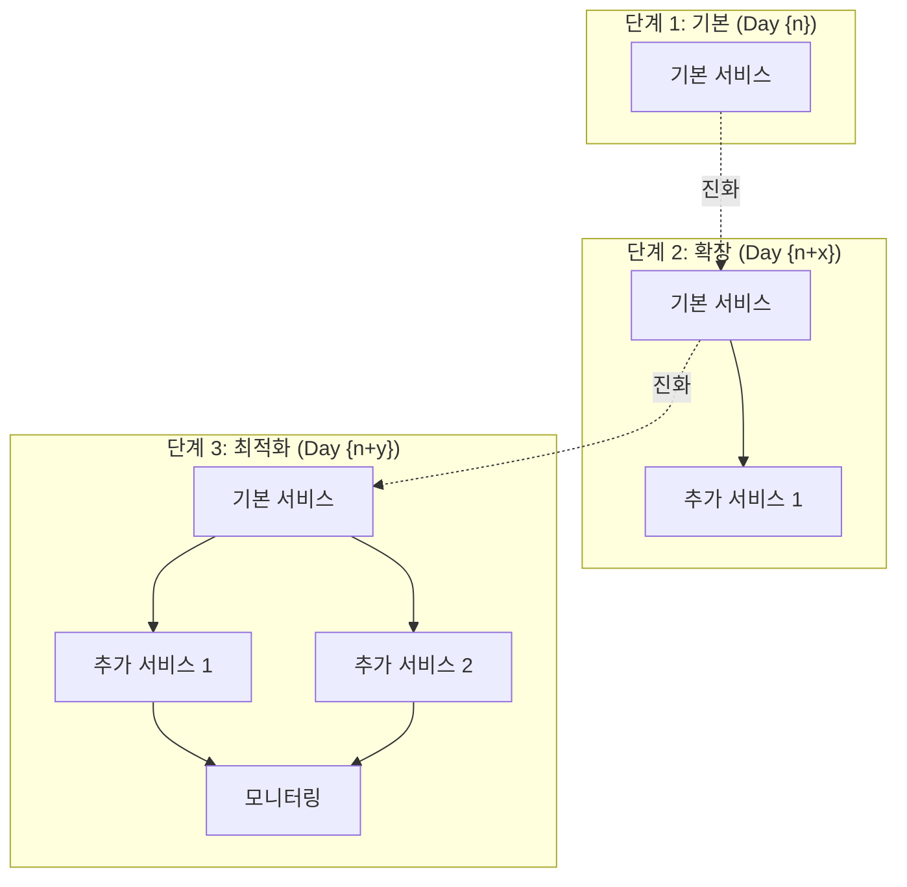

# Design Document: 스타트업 사례 기반 심화 강의 시스템

## Overview

기존 `aws-saa-study-materials/week{n}/day{n}/` 폴더 구조에 `advanced/` 폴더를 추가하여, **각 일별 학습 주제(Day 1-28)와 연계된** 실제 기업 사례 기반 심화 강의를 제공합니다. 이 시스템은 `theory.md`에서 학습한 기본 개념을 바탕으로, 실제 기업들이 해당 AWS 서비스를 어떻게 활용했는지에 대한 심도 있는 분석과 다른 서비스와의 연계를 통한 Best Practice를 제공하며, 실제 운영 환경에서 발생하는 트러블슈팅 시나리오까지 포함합니다.

**중요**: 각 일별 콘텐츠는 해당 일의 `theory.md`에서 다루는 특정 AWS 서비스를 기반으로 개별적으로 작성되어야 하며, AWS Console 기반 실습과 재사용 가능한 사전 요구사항 문서를 포함해야 합니다.

## Architecture

### File Structure Integration

기존 폴더 구조에 `advanced/` 폴더를 추가하여 심화 강의를 통합합니다:

```
aws-saa-study-materials/
├── resources/
│   └── prerequisites/          # 재사용 가능한 사전 요구사항 문서
│       ├── aws-account-setup.md
│       ├── iam-user-setup.md
│       ├── cli-configuration.md
│       └── console-navigation.md
├── week1/
│   ├── day1/                    # AWS 개요 및 글로벌 인프라
│   │   ├── theory.md           # 기본 이론 (기존)
│   │   ├── advanced/           # 새로 추가되는 심화 강의
│   │   │   ├── case-study.md   # 기업 사례 분석 (Netflix 글로벌 인프라)
│   │   │   ├── best-practices.md # 서비스 연계 베스트 프랙티스
│   │   │   ├── troubleshooting.md # 트러블슈팅 시나리오
│   │   │   ├── architecture-diagrams/ # Mermaid 다이어그램
│   │   │   │   ├── global-infrastructure.mmd
│   │   │   │   ├── multi-region-architecture.mmd
│   │   │   │   └── disaster-recovery-flow.mmd
│   │   │   └── hands-on-console/ # AWS Console 기반 실습
│   │   │       ├── README.md   # 실습 개요 및 사전 요구사항 링크
│   │   │       ├── exercise-1-region-exploration.md
│   │   │       └── exercise-2-multi-region-setup.md
│   │   ├── visuals/            # 기존 시각화 자료
│   │   ├── hands-on/           # 기존 기본 실습
│   │   ├── quiz.md             # 기존 퀴즈
│   │   └── README.md           # 업데이트된 일일 가이드
│   ├── day2/                    # IAM
│   │   ├── advanced/
│   │   │   ├── case-study.md   # Airbnb IAM 보안 아키텍처
│   │   │   └── ...
│   └── day3-7/                 # 각 일별로 개별 콘텐츠
├── week2-4/                    # 모든 주차에 동일한 구조 적용 (Day 8-28)
```

**중요 원칙**:
- 각 day의 `case-study.md`는 해당 일의 `theory.md` 주제를 기반으로 작성
- `hands-on-console/` 폴더는 AWS Console 기반 실습 가이드 포함
- 사전 요구사항은 `resources/prerequisites/`에서 재사용 가능하도록 링크

### Content Flow Architecture



### Cross-Service Integration Architecture



## Components and Interfaces

### 0. Daily Topic Mapping Component

**책임**: 28일간의 일별 주제와 AWS 서비스 매핑 관리

**주요 기능**:
- 각 일별 주제 및 주요 AWS 서비스 정의
- 서비스 간 의존성 및 연계 정보 관리
- 실제 기업 사례 매칭

**일별 주제 매핑 예시**:
```python
DAILY_TOPICS = {
    1: {
        "title": "AWS 개요 및 글로벌 인프라",
        "primary_services": ["Regions", "Availability Zones", "Edge Locations", "CloudFront"],
        "case_study_company": "Netflix",
        "case_study_focus": "글로벌 스트리밍을 위한 멀티 리전 아키텍처",
        "related_days": [16, 17],  # CloudFront(Day 16), Route 53(Day 17)
    },
    2: {
        "title": "IAM (Identity and Access Management)",
        "primary_services": ["IAM Users", "Groups", "Roles", "Policies"],
        "case_study_company": "Airbnb",
        "case_study_focus": "대규모 조직의 IAM 보안 아키텍처",
        "related_days": [3, 5, 23],  # EC2(Day 3), VPC(Day 5), CloudTrail(Day 23)
    },
    8: {
        "title": "S3 (Simple Storage Service)",
        "primary_services": ["S3 Buckets", "Storage Classes", "Lifecycle Policies", "Versioning"],
        "case_study_company": "Dropbox",
        "case_study_focus": "페타바이트급 파일 스토리지 아키텍처",
        "related_days": [1, 16, 18],  # CloudFront(Day 1,16), Lambda(Day 18)
    },
    # ... Day 3-28 매핑 계속
}
```

### 1. Content Generation Component

**책임**: 각 일별 주제에 맞는 심화 강의 콘텐츠 생성 및 관리

**주요 기능**:
- 기업 사례 분석 문서 생성 (`case-study.md`)
- 서비스 연계 베스트 프랙티스 문서 생성 (`best-practices.md`)
- 트러블슈팅 시나리오 문서 생성 (`troubleshooting.md`)
- Mermaid 다이어그램 생성 및 관리
- AWS Console 기반 실습 가이드 생성

**파일 구조 (명확한 템플릿)**:
```markdown
# case-study.md 구조 (각 일별로 개별 작성)

## 📋 사례 개요
- **기업명**: [실제 기업명 또는 "Best Practice 기반 가상 사례"]
- **업종**: [산업 분야]
- **규모**: [Startup/Medium/Enterprise]
- **주요 AWS 서비스**: [Day {n}의 theory.md에서 다룬 서비스]
- **사례 출처**: [공개 자료 링크 또는 "AWS Well-Architected Framework 기반"]

## 🎯 비즈니스 도전과제
### 문제 상황
- 구체적인 비즈니스 문제 설명
- 기술적 제약사항
- 기존 인프라의 한계

### 요구사항
- 성능 요구사항 (예: 응답시간 < 100ms)
- 확장성 요구사항 (예: 동시 사용자 100만명)
- 보안 및 규정 준수 요구사항
- 비용 제약사항

## 🏗️ AWS 솔루션 아키텍처
### 아키텍처 다이어그램
```mermaid
[해당 일의 서비스를 중심으로 한 아키텍처]
```

### 핵심 서비스 구성
#### [Day {n} 주요 서비스]
- **선택 이유**: 왜 이 서비스를 선택했는가
- **구성 방법**: 구체적인 설정 (AWS Console 기준)
- **다른 서비스와의 연계**: 어떻게 통합되는가

### 서비스 간 데이터 플로우
1. 사용자 요청 → [서비스 A]
2. [서비스 A] → [서비스 B] (Day {n}의 주요 서비스)
3. [서비스 B] → [서비스 C]
...

## 💻 구현 세부사항
### AWS Console 기반 설정
#### 1단계: [서비스] 생성
- Console 경로: Services > [Category] > [Service]
- 설정 항목:
  - 항목 1: 값
  - 항목 2: 값
- 스크린샷 참조: [선택사항]

#### 2단계: [연계 서비스] 구성
...

### 설정 파일 예시 (참고용)
```yaml
# CloudFormation 또는 Terraform 예시 (선택사항)
```

### 모니터링 설정
- CloudWatch 메트릭 설정
- 알람 임계값
- 대시보드 구성

## 📊 비즈니스 임팩트
### 성능 개선
- 지표 1: 개선 전 vs 개선 후
- 지표 2: 개선 전 vs 개선 후

### 비용 최적화
- 월간 비용: $X → $Y (Z% 절감)
- 비용 절감 요인 분석

### 운영 효율성
- 배포 시간 단축
- 장애 복구 시간 개선
- 운영 인력 최적화

## 🔗 다른 서비스와의 연계
### 이전 학습 내용과의 연결
- Day {n-x}: [서비스명] - 어떻게 연계되는가
- Day {n-y}: [서비스명] - 어떻게 연계되는가

### 향후 학습 내용 예고
- Day {n+x}: [서비스명] - 이 사례가 어떻게 확장되는가
- Day {n+y}: [서비스명] - 추가로 통합될 서비스

### 전체 아키텍처에서의 역할
```mermaid
[크로스 데이 통합 다이어그램]
```

## 📚 참고 자료
- [AWS 공식 문서 링크]
- [AWS 아키텍처 센터 사례]
- [기업 공식 블로그 포스트]
- [AWS re:Invent 발표 자료]

## 🎓 학습 포인트
1. [Day {n} 서비스]의 실제 활용 방법
2. 대규모 시스템에서의 고려사항
3. 다른 서비스와의 통합 패턴
4. 비용 최적화 전략
5. 운영 및 모니터링 베스트 프랙티스
```

### 2. Troubleshooting Scenario Component

**책임**: 실제 운영 환경에서 발생하는 문제 상황과 해결 방법 제공

**주요 기능**:
- 실제 장애 사례 기반 시나리오 생성
- 단계별 문제 진단 및 해결 가이드
- 예방 조치 및 모니터링 설정
- 성능 최적화 시나리오

**파일 구조**:
```markdown
# troubleshooting.md 구조 (각 일별로 개별 작성)

## 🔍 일반적인 문제 상황들

### 문제 1: [Day {n} 서비스] 성능 저하
**증상**:
- 응답 시간 증가 (구체적 수치)
- 에러율 상승
- 사용자 불만 증가

**진단 단계** (AWS Console 기반):
1. **CloudWatch 메트릭 확인**
   - Console 경로: CloudWatch > Metrics > [Service]
   - 확인할 메트릭: [구체적 메트릭명]
   - 정상 범위: [수치]

2. **로그 분석**
   - Console 경로: CloudWatch > Log groups
   - 검색 쿼리: [구체적 쿼리]
   - 주의할 에러 패턴: [패턴]

3. **네트워크 연결 상태 점검**
   - Console 경로: VPC > Network ACLs / Security Groups
   - 확인 사항: [구체적 항목]

**해결 방법**:
1. **즉시 조치** (임시 해결)
   - Console에서 [설정] 변경
   - 예상 효과: [효과]
   - 소요 시간: [시간]

2. **근본 원인 해결**
   - 원인 분석: [분석 결과]
   - 영구 해결책: [해결책]
   - 구현 방법: [Console 기반 단계]

3. **재발 방지 조치**
   - 모니터링 강화: [설정 방법]
   - 자동화 구성: [자동화 방법]

**예방 조치**:
- **모니터링 알람 설정**
  - Console 경로: CloudWatch > Alarms > Create alarm
  - 알람 조건: [조건]
  - 알림 대상: [SNS 토픽 등]

- **자동 스케일링 구성** (해당되는 경우)
  - Console 경로: [서비스] > Auto Scaling
  - 스케일링 정책: [정책]

- **정기적인 성능 검토**
  - 주간/월간 리뷰 체크리스트
  - 성능 벤치마크 기준

### 문제 2: 보안 이슈
[동일한 구조로 반복]

### 문제 3: 비용 급증
[동일한 구조로 반복]

## 🧪 실습 시나리오 (AWS Console 기반)
### 시나리오 1: [Day {n} 서비스] 트래픽 급증 대응
**상황 설정**:
- 예상치 못한 트래픽 10배 증가
- 현재 리소스로는 처리 불가
- 즉각적인 대응 필요

**단계별 대응 방법** (Console 기반):
1. 현재 상태 확인
   - Console 경로: [경로]
   - 확인 항목: [항목]

2. 긴급 스케일 아웃
   - Console 경로: [경로]
   - 설정 변경: [변경 사항]

3. 모니터링 및 검증
   - Console 경로: [경로]
   - 확인 메트릭: [메트릭]

**결과 검증 방법**:
- 성능 지표 확인
- 비용 영향 분석
- 사용자 경험 개선 확인

## 📊 모니터링 및 알람 설정
### CloudWatch 대시보드 구성
**Console 경로**: CloudWatch > Dashboards > Create dashboard

**핵심 메트릭 정의** (Day {n} 서비스 기준):
1. **메트릭 1**: [메트릭명]
   - 정상 범위: [범위]
   - 경고 임계값: [임계값]
   - 위험 임계값: [임계값]

2. **메트릭 2**: [메트릭명]
   ...

### 알람 임계값 설정
**Console 경로**: CloudWatch > Alarms > Create alarm

**알람 구성**:
```yaml
알람명: [Day{n}-Service]-Performance-Alert
메트릭: [메트릭명]
조건: [조건]
기간: [기간]
알림: [SNS 토픽]
```

## 🔗 관련 AWS 문서
- [AWS 공식 트러블슈팅 가이드]
- [CloudWatch 모니터링 베스트 프랙티스]
- [서비스별 성능 최적화 가이드]
```

### 3. Prerequisites Documentation Component

**책임**: 재사용 가능한 사전 요구사항 문서 관리

**주요 기능**:
- 공통 사전 요구사항 문서 생성 및 관리
- 일별 실습에서 링크로 참조 가능
- 학습자가 미리 준비할 수 있도록 명확한 가이드 제공

**파일 위치**: `aws-saa-study-materials/resources/prerequisites/`

**문서 구조**:
```markdown
# aws-account-setup.md
## AWS 계정 설정 가이드

### 1. AWS Free Tier 계정 생성
- 단계별 가이드
- 필요한 정보
- 주의사항

### 2. 결제 알람 설정
- Console 경로: Billing > Billing preferences
- 알람 설정 방법
- 권장 임계값

### 3. 루트 계정 보안 강화
- MFA 활성화
- 액세스 키 삭제
- 루트 계정 사용 최소화

---

# iam-user-setup.md
## IAM 사용자 설정 가이드

### 1. 관리자 IAM 사용자 생성
- Console 경로: IAM > Users > Add user
- 권한 설정: AdministratorAccess
- 액세스 키 생성 (선택사항)

### 2. IAM 사용자로 로그인
- 계정 ID 확인
- 로그인 URL
- 비밀번호 변경

---

# console-navigation.md
## AWS Console 탐색 가이드

### 1. 주요 메뉴 구조
- Services 메뉴
- 리전 선택
- 검색 기능

### 2. 즐겨찾기 설정
- 자주 사용하는 서비스 추가
- 커스텀 메뉴 구성

### 3. 도움말 활용
- 문서 링크
- 지원 센터
- 서비스 상태 확인
```

### 4. AWS Console Hands-On Component

**책임**: AWS Console 기반 실습 가이드 생성 및 관리

**주요 기능**:
- 각 일별 주제에 맞는 Console 기반 실습 생성
- 단계별 스크린샷 및 설명 포함
- 사전 요구사항 링크 제공
- 실습 완료 검증 방법 제공

**파일 구조**:
```markdown
# hands-on-console/README.md (각 일별)

## 🎯 실습 개요
이 실습에서는 Day {n}에서 학습한 [서비스명]을 AWS Console을 통해 직접 구성하고 테스트합니다.

## 📋 사전 요구사항
실습을 시작하기 전에 다음 사항을 준비해주세요:

- [ ] [AWS 계정 설정](../../../resources/prerequisites/aws-account-setup.md)
- [ ] [IAM 사용자 설정](../../../resources/prerequisites/iam-user-setup.md)
- [ ] [Console 탐색 기본](../../../resources/prerequisites/console-navigation.md)
- [ ] 예상 비용: $X.XX (Free Tier 범위 내 / 초과)
- [ ] 소요 시간: 약 X분

## 🏗️ 실습 아키텍처
```mermaid
[실습에서 구축할 아키텍처 다이어그램]
```

## 📝 실습 목표
1. [목표 1]
2. [목표 2]
3. [목표 3]

## 🚀 실습 진행

### Exercise 1: [실습명]
**목표**: [구체적 목표]

**단계**:
1. **[서비스] 생성**
   - Console 경로: Services > [Category] > [Service]
   - 클릭: "Create [resource]" 버튼
   
2. **기본 설정**
   - Name: `day{n}-[resource-name]`
   - Region: `ap-northeast-2` (서울)
   - [기타 설정]: [값]
   
3. **고급 설정** (선택사항)
   - [설정 1]: [값]
   - [설정 2]: [값]
   
4. **생성 확인**
   - "Create" 버튼 클릭
   - 생성 완료까지 대기 (약 X분)
   - 상태 확인: [확인 방법]

**검증**:
- [ ] [리소스]가 "Available" 상태인가?
- [ ] [설정]이 올바르게 적용되었는가?
- [ ] [테스트]가 성공하는가?

### Exercise 2: [실습명]
[동일한 구조로 반복]

## ✅ 실습 완료 체크리스트
- [ ] Exercise 1 완료
- [ ] Exercise 2 완료
- [ ] 모든 검증 항목 통과
- [ ] 비용 확인 (Billing Dashboard)

## 🧹 리소스 정리
**중요**: 불필요한 비용 발생을 방지하기 위해 실습 후 반드시 리소스를 삭제하세요.

### 정리 순서:
1. **[리소스 1] 삭제**
   - Console 경로: [경로]
   - 선택: [리소스명]
   - Actions > Delete
   - 확인: 삭제 완료

2. **[리소스 2] 삭제**
   [동일한 구조]

### 정리 확인:
- [ ] 모든 리소스 삭제 완료
- [ ] Billing Dashboard에서 비용 확인
- [ ] 예상 비용: $0.00 (Free Tier) 또는 $X.XX

## 🎓 학습 포인트
1. [학습 포인트 1]
2. [학습 포인트 2]
3. [학습 포인트 3]

## 🔗 다음 단계
- [case-study.md](../case-study.md)에서 실제 기업 사례 확인
- [best-practices.md](../best-practices.md)에서 프로덕션 환경 고려사항 학습
- [troubleshooting.md](../troubleshooting.md)에서 문제 해결 방법 학습
```

### 5. Best Practices Integration Component

**책임**: 일별 학습 서비스를 다른 AWS 서비스와 연계하는 베스트 프랙티스 제공

**주요 기능**:
- 서비스 간 통합 패턴 문서화
- 아키텍처 진화 경로 제시
- 비용 최적화 전략
- 보안 및 컴플라이언스 가이드

**파일 구조**:
```markdown
# best-practices.md 구조 (각 일별로 개별 작성)

## 🔗 서비스 연계 패턴

### 패턴 1: [Day {n} 서비스] + [연계 서비스 from Day {m}]
**사용 사례**:
- 언제 이 패턴을 사용하는가
- 어떤 문제를 해결하는가
- 실제 적용 예시

**구현 방법** (AWS Console 기반):
1. **[Day {n} 서비스] 설정**
   - Console 경로: [경로]
   - 주요 설정: [설정]

2. **[연계 서비스] 통합**
   - Console 경로: [경로]
   - 연결 설정: [설정]

3. **통합 검증**
   - 테스트 방법: [방법]
   - 예상 결과: [결과]

**장단점**:
- ✅ 장점:
  - 성능: [구체적 개선사항]
  - 비용: [비용 영향]
  - 관리 용이성: [관리 측면]
  
- ⚠️ 단점:
  - 복잡성: [복잡도 증가]
  - 제약사항: [제약사항]
  - 비용: [추가 비용]

- 🔄 대안:
  - 대안 1: [대안 설명]
  - 대안 2: [대안 설명]

**실제 사례**:
- 기업: [기업명]
- 적용 결과: [결과]
- 참고 자료: [링크]

### 패턴 2: 멀티 서비스 통합
[동일한 구조로 반복]

## 📈 아키텍처 진화 경로

### 단계 1: 기본 구성 (Day {n} 학습 내용)
**아키텍처**:
```mermaid
[기본 아키텍처 다이어그램]
```

**특징**:
- 단순한 구조
- 빠른 구현
- 제한적인 확장성

**적합한 경우**:
- 프로토타입 단계
- 소규모 트래픽
- 학습 목적

### 단계 2: 서비스 추가 (Day {n+x}, {n+y} 연계)
**아키텍처**:
```mermaid
[확장된 아키텍처 다이어그램]
```

**추가된 서비스**:
- [서비스 1]: [역할 및 이유]
- [서비스 2]: [역할 및 이유]

**개선 사항**:
- 성능: [개선 내용]
- 확장성: [개선 내용]
- 안정성: [개선 내용]

### 단계 3: 최적화 및 고도화
**아키텍처**:
```mermaid
[최적화된 아키텍처 다이어그램]
```

**최적화 포인트**:
- 비용 최적화: [방법]
- 성능 최적화: [방법]
- 보안 강화: [방법]

## 💰 비용 최적화 전략

### 리소스 사이징
**현재 상태 분석**:
- CloudWatch 메트릭 확인
- 사용률 분석
- 낭비 요소 식별

**최적화 방법**:
1. **[Day {n} 서비스] 사이징**
   - 현재 설정: [설정]
   - 권장 설정: [설정]
   - 예상 절감: [금액]

2. **자동 스케일링 활용**
   - Console 경로: [경로]
   - 정책 설정: [정책]
   - 예상 효과: [효과]

### 예약 인스턴스 활용 (해당되는 경우)
- 사용 패턴 분석
- 예약 옵션 비교
- ROI 계산

### 스팟 인스턴스 전략 (해당되는 경우)
- 적합한 워크로드
- 중단 처리 방법
- 비용 절감 효과

### 데이터 전송 최적화
- 리전 간 전송 최소화
- CloudFront 활용
- VPC 엔드포인트 사용

## 🔒 보안 베스트 프랙티스

### IAM 권한 최소화
**원칙**: 최소 권한 원칙 (Principle of Least Privilege)

**구현 방법**:
1. **서비스별 역할 생성**
   - Console 경로: IAM > Roles
   - 정책: [구체적 정책]

2. **정기적 권한 검토**
   - IAM Access Analyzer 활용
   - 불필요한 권한 제거

### 네트워크 보안
**Security Group 설정**:
- Console 경로: VPC > Security Groups
- 인바운드 규칙: [최소한의 규칙]
- 아웃바운드 규칙: [필요한 규칙만]

**Network ACL 설정** (필요시):
- 서브넷 레벨 보안
- Stateless 규칙

### 데이터 암호화
**전송 중 암호화**:
- HTTPS/TLS 사용
- Certificate Manager 활용

**저장 시 암호화**:
- Console에서 암호화 활성화
- KMS 키 관리
- 키 로테이션 정책

### 로깅 및 모니터링
**CloudTrail 설정**:
- Console 경로: CloudTrail > Trails
- 모든 리전 활성화
- S3 버킷 로그 저장

**CloudWatch 로그**:
- 서비스별 로그 그룹
- 로그 보관 기간 설정
- 로그 분석 쿼리

## 📊 운영 우수성 (Operational Excellence)

### 자동화
- Infrastructure as Code (CloudFormation)
- 배포 자동화
- 백업 자동화

### 모니터링 및 알람
- 핵심 메트릭 정의
- 알람 임계값 설정
- 대시보드 구성

### 문서화
- 아키텍처 문서
- 운영 절차서
- 트러블슈팅 가이드

## 🔗 관련 학습 내용
- Day {n-x}: [서비스] - [연계 내용]
- Day {n+x}: [서비스] - [확장 내용]
- [case-study.md](./case-study.md) - 실제 적용 사례
- [troubleshooting.md](./troubleshooting.md) - 문제 해결 방법
```

### 6. Mermaid Diagram Generator

**책임**: 복잡한 아키텍처와 플로우를 시각화하는 Mermaid 다이어그램 생성

**주요 기능**:
- 아키텍처 다이어그램 생성 (각 일별 서비스 중심)
- 데이터 플로우 시각화
- 트러블슈팅 플로우차트
- 비용 최적화 다이어그램
- 크로스 데이 서비스 통합 다이어그램

**다이어그램 유형 및 예시**:

#### 1. 서비스 아키텍처 다이어그램 (각 일별)
```mermaid
# Day 1 예시: 글로벌 인프라
graph TB
    subgraph "사용자 계층"
        Users[전 세계 사용자]
    end
    
    subgraph "AWS 글로벌 인프라"
        subgraph "Region: us-east-1"
            CF1[CloudFront<br/>Edge Location]
            AZ1[Availability Zone 1]
            AZ2[Availability Zone 2]
        end
        
        subgraph "Region: ap-northeast-2"
            CF2[CloudFront<br/>Edge Location]
            AZ3[Availability Zone 1]
            AZ4[Availability Zone 2]
        end
    end
    
    Users --> CF1
    Users --> CF2
    CF1 --> AZ1
    CF1 --> AZ2
    CF2 --> AZ3
    CF2 --> AZ4

# Day 8 예시: S3 아키텍처
graph TB
    A[사용자/애플리케이션] --> B[S3 Bucket]
    B --> C[Standard 클래스]
    B --> D[Standard-IA]
    B --> E[Glacier]
    
    F[Lifecycle Policy] --> C
    F --> D
    F --> E
    
    G[CloudFront] --> B
    H[Lambda] --> B
```

#### 2. 트러블슈팅 플로우차트
```mermaid
flowchart TD
    Start[문제 발생:<br/>Day {n} 서비스 성능 저하] --> Check1{CloudWatch<br/>메트릭 확인}
    Check1 -->|CPU > 80%| Fix1[인스턴스 타입<br/>업그레이드]
    Check1 -->|정상| Check2{로그 확인}
    Check2 -->|에러 발견| Fix2[애플리케이션<br/>코드 수정]
    Check2 -->|정상| Check3{네트워크<br/>확인}
    Check3 -->|지연 발생| Fix3[리전/AZ<br/>재배치]
    Check3 -->|정상| Check4{비용<br/>확인}
    
    Fix1 --> Verify[검증]
    Fix2 --> Verify
    Fix3 --> Verify
    
    Verify --> Success{해결됨?}
    Success -->|Yes| End[모니터링 강화]
    Success -->|No| Escalate[AWS Support<br/>문의]
```

#### 3. 크로스 데이 통합 다이어그램


#### 4. 비용 플로우 다이어그램
```mermaid
%%{init: {'theme':'base'}}%%
sankey-beta
    
    사용자 요청,100,CloudFront
    CloudFront,60,S3 스토리지
    CloudFront,40,EC2 컴퓨팅
    EC2 컴퓨팅,30,RDS 데이터베이스
    EC2 컴퓨팅,10,ElastiCache
    
    S3 스토리지,10,데이터 전송
    EC2 컴퓨팅,5,데이터 전송
```

#### 5. 아키텍처 진화 다이어그램


**다이어그램 파일 구조**:
```
architecture-diagrams/
├── main-architecture.mmd          # 주요 아키텍처
├── data-flow.mmd                  # 데이터 플로우
├── troubleshooting-flow.mmd       # 트러블슈팅 플로우
├── cost-optimization.mmd          # 비용 최적화
├── cross-day-integration.mmd      # 크로스 데이 통합
└── evolution-path.mmd             # 아키텍처 진화
```

### 7. Cross-Service Integration Manager

**책임**: 여러 일차에 걸친 서비스들의 통합 시나리오 관리

**주요 기능**:
- 서비스 의존성 매핑 (Day 1-28)
- 통합 시나리오 생성
- 진화 경로 추적
- 호환성 검증

**통합 매트릭스 예시**:
```python
CROSS_DAY_INTEGRATIONS = {
    "netflix_global_streaming": {
        "name": "Netflix 글로벌 스트리밍 아키텍처",
        "primary_days": [1, 16, 8],  # 글로벌 인프라, CloudFront, S3
        "supporting_days": [3, 5, 10],  # EC2, VPC, RDS
        "description": "멀티 리전 콘텐츠 배포 및 스트리밍",
        "evolution_stages": [
            {
                "stage": 1,
                "days": [1],
                "description": "단일 리전 기본 인프라"
            },
            {
                "stage": 2,
                "days": [1, 8, 16],
                "description": "멀티 리전 + CDN + 스토리지"
            },
            {
                "stage": 3,
                "days": [1, 8, 16, 3, 5],
                "description": "완전한 글로벌 아키텍처"
            }
        ]
    },
    "airbnb_security": {
        "name": "Airbnb IAM 보안 아키텍처",
        "primary_days": [2, 5, 23],  # IAM, VPC, CloudTrail
        "supporting_days": [3, 10],  # EC2, RDS
        "description": "대규모 조직의 보안 및 규정 준수",
    },
    # ... 더 많은 통합 시나리오
}
```

**통합 시나리오 문서 구조**:
```markdown
# Cross-Day Integration: [시나리오명]

## 관련 일차
- **Primary**: Day {n}, Day {m}, Day {k}
- **Supporting**: Day {x}, Day {y}

## 통합 아키텍처
```mermaid
[크로스 데이 통합 다이어그램]
```

## 서비스 플로우
1. Day {n} 서비스 → Day {m} 서비스
2. Day {m} 서비스 → Day {k} 서비스
...

## 구현 가이드
### 단계 1: Day {n} 서비스 설정
[Console 기반 가이드]

### 단계 2: Day {m} 서비스 통합
[Console 기반 가이드]

### 단계 3: 통합 검증
[검증 방법]

## 학습 경로
1. Day {n} 학습 완료
2. Day {m} 학습 완료
3. 통합 시나리오 실습
```

## Data Models

### Advanced Content Structure

각 `advanced/` 폴더의 파일들은 다음과 같은 구조를 가집니다:

```typescript
interface AdvancedContent {
  dayNumber: number
  weekNumber: number
  primaryServices: string[]
  
  caseStudy: CaseStudyContent
  bestPractices: BestPracticesContent
  troubleshooting: TroubleshootingContent
  architectureDiagrams: MermaidDiagram[]
  advancedHandsOn: HandsOnContent[]
}

interface CaseStudyContent {
  // 기업 정보
  company: CompanyInfo
  businessContext: BusinessContext
  
  // 기술적 솔루션
  awsSolution: AWSSolutionDetails
  architecture: ArchitectureDetails
  implementation: ImplementationDetails
  
  // 결과 및 영향
  businessImpact: BusinessImpactMetrics
  lessonsLearned: string[]
  
  // 서비스 연계
  serviceIntegrations: ServiceIntegration[]
  crossDayConnections: CrossDayConnection[]
}

interface CompanyInfo {
  name: string
  industry: string
  size: 'startup' | 'medium' | 'enterprise'
  region: string
  isRealCompany: boolean
  publicReferences: string[]  // 공개된 자료 링크
}

interface BusinessContext {
  challenge: string
  requirements: BusinessRequirement[]
  constraints: string[]
  successCriteria: string[]
  timeline: string
}

interface AWSSolutionDetails {
  primaryServices: AWSServiceUsage[]
  supportingServices: AWSServiceUsage[]
  architecture: ArchitecturePattern
  designDecisions: DesignDecision[]
  alternatives: AlternativeApproach[]
}

interface TroubleshootingContent {
  commonIssues: TroubleshootingCase[]
  diagnosticFlows: DiagnosticFlow[]
  preventiveMeasures: PreventiveMeasure[]
  monitoringSetup: MonitoringConfiguration
  performanceTuning: PerformanceTuningGuide[]
}

interface TroubleshootingCase {
  id: string
  title: string
  severity: 'low' | 'medium' | 'high' | 'critical'
  
  // 문제 상황
  symptoms: Symptom[]
  affectedServices: string[]
  businessImpact: string
  
  // 진단 과정
  diagnosticSteps: DiagnosticStep[]
  toolsUsed: string[]
  
  // 해결 방법
  immediateActions: Action[]
  rootCauseAnalysis: string
  permanentSolution: Solution
  
  // 예방 조치
  preventionMeasures: PreventiveMeasure[]
  monitoringImprovements: MonitoringImprovement[]
  
  // 학습 포인트
  keyTakeaways: string[]
  relatedCases: string[]
}

interface DiagnosticFlow {
  name: string
  description: string
  triggerConditions: string[]
  steps: DiagnosticStep[]
  expectedOutcomes: string[]
  escalationCriteria: string[]
}

interface DiagnosticStep {
  stepNumber: number
  description: string
  toolsRequired: string[]
  expectedResults: string[]
  nextSteps: ConditionalStep[]
  timeEstimate: string
}

interface Solution {
  type: 'immediate' | 'temporary' | 'permanent'
  description: string
  steps: ActionStep[]
  requiredPermissions: string[]
  estimatedTime: string
  riskLevel: 'low' | 'medium' | 'high'
  rollbackPlan: string[]
}

interface BestPracticesContent {
  integrationPatterns: IntegrationPattern[]
  evolutionPaths: EvolutionPath[]
  costOptimization: CostOptimizationStrategy[]
  securityBestPractices: SecurityBestPractice[]
  operationalExcellence: OperationalPractice[]
}

interface IntegrationPattern {
  name: string
  description: string
  
  // 서비스 조합
  primaryService: string
  integratedServices: string[]
  
  // 사용 사례
  useCases: UseCase[]
  benefits: string[]
  tradeoffs: string[]
  
  // 구현 가이드
  implementationSteps: ImplementationStep[]
  configurationExamples: ConfigurationExample[]
  codeSnippets: CodeSnippet[]
  
  // 실제 사례
  realWorldExamples: RealWorldExample[]
  
  // 연관 일차
  relatedDays: number[]
  prerequisites: string[]
}

interface EvolutionPath {
  name: string
  description: string
  stages: EvolutionStage[]
  decisionPoints: DecisionPoint[]
  migrationStrategies: MigrationStrategy[]
}

interface EvolutionStage {
  stage: number
  name: string
  description: string
  servicesInvolved: string[]
  complexity: 'low' | 'medium' | 'high'
  estimatedEffort: string
  businessValue: string
  prerequisites: string[]
  deliverables: string[]
}
```

### Cross-Day Service Integration Model

```typescript
interface CrossDayIntegration {
  integrationId: string
  name: string
  description: string
  
  // 관련 일차들
  involvedDays: DayReference[]
  primaryDay: number
  
  // 서비스 매핑
  serviceFlow: ServiceFlowStep[]
  dataFlow: DataFlowStep[]
  
  // 아키텍처 패턴
  architecturePattern: string
  designPrinciples: string[]
  
  // 구현 세부사항
  implementationGuide: ImplementationGuide
  configurationFiles: ConfigurationFile[]
  
  // 운영 고려사항
  monitoringStrategy: MonitoringStrategy
  troubleshootingGuide: TroubleshootingGuide
  scalingConsiderations: ScalingConsideration[]
}

interface DayReference {
  dayNumber: number
  weekNumber: number
  primaryServices: string[]
  role: 'primary' | 'supporting' | 'dependent'
}

interface ServiceFlowStep {
  stepNumber: number
  service: string
  action: string
  inputData: string[]
  outputData: string[]
  nextSteps: string[]
  errorHandling: string[]
}
```

## Correctness Properties

*A property is a characteristic or behavior that should hold true across all valid executions of a system-essentially, a formal statement about what the system should do. Properties serve as the bridge between human-readable specifications and machine-verifiable correctness guarantees.*

### Property Reflection

prework 분석을 통해 50개의 수용 기준을 검토한 결과, 다음과 같은 중복성과 통합 기회를 식별했습니다:

**중복성 제거:**
- 여러 속성이 "콘텐츠 완전성"을 다루고 있음 (1.2, 1.3, 1.5, 3.3) → 통합된 사례 콘텐츠 완전성 속성으로 결합
- 기술 분석 관련 속성들이 유사함 (3.1, 3.2, 3.4) → 기술 분석 완전성 단일 속성으로 통합
- 서비스 통합 설명 속성들이 겹침 (1.4, 4.2) → 서비스 통합 설명 완전성으로 통합
- 크로스 서비스 관련 속성들 (4.1, 4.3, 4.4, 4.5) → 크로스 서비스 아키텍처 시각화로 통합
- 시각화 관련 속성들이 겹침 (5.1, 5.2, 5.3, 5.4, 5.5) → Mermaid 시각화 생성 통합 속성으로 처리
- AWS 문서 연동 관련 속성들이 유사함 (6.1, 6.2, 6.4, 6.5) → AWS 문서 연동 단일 속성으로 통합
- 실습 환경 관련 속성들 (7.3, 7.4, 7.5) → 비용 관리 및 모니터링 통합 속성으로 결합
- 학습 진도 추적 속성들 (8.1, 8.2, 8.3, 8.4, 8.5) → 학습 진도 추적 완전성으로 통합
- 대화형 학습 속성들 (9.1, 9.2, 9.4, 9.5) → 대화형 학습 기능으로 통합
- 한국어 현지화 속성들 (10.1, 10.2, 10.3, 10.4, 10.5) → 한국어 현지화 완전성으로 통합

### Correctness Properties

다음은 prework 분석을 바탕으로 도출된 핵심 correctness properties입니다:

**Property 1: 일별 강의-사례 연계 완전성**
*For any* 일별 강의 (day1부터 day28까지)에 대해, 시스템은 해당 일의 주요 AWS 서비스를 실제로 활용하는 최소 하나의 관련 기업 사례 파일(case-study.md)을 advanced/ 폴더에 제공해야 한다
**Validates: Requirements 1.1**

**Property 2: 사례 콘텐츠 완전성**
*For any* case-study.md 파일에 대해, 기업 개요, 비즈니스 도전과제, 기술적 요구사항, AWS 솔루션 아키텍처, 구현 세부사항(설정 파일, 코드 스니펫, 배포 전략), 성능 메트릭, 비용 분석, 비즈니스 임팩트 섹션이 모두 포함되어야 한다
**Validates: Requirements 1.2, 1.3, 1.5, 3.3**

**Property 3: 서비스 통합 설명 완전성**
*For any* case-study.md 파일에 대해, 사용된 AWS 서비스들의 통합 방식, 데이터 플로우, 보안 경계, 통신 패턴을 설명하는 섹션이 포함되어야 한다
**Validates: Requirements 1.4, 4.2**

**Property 4: 사례 유형 구분 명확성**
*For any* case-study.md 파일에 대해, 실제 기업 사례인지 베스트 프랙티스 기반 가상 사례인지 명확하게 표시하는 메타데이터 또는 섹션이 포함되어야 한다
**Validates: Requirements 2.3**

**Property 5: 현재 AWS 서비스 반영**
*For any* case-study.md 파일의 코드 예제 및 설정에 대해, 현재 AWS 서비스 API 및 기능을 사용하고, 가격 정보는 현재 AWS 가격 페이지로 링크되어야 한다
**Validates: Requirements 2.5, 6.3**

**Property 6: 기술 분석 완전성**
*For any* case-study.md 파일에 대해, 아키텍처 결정 근거, 보안 고려사항, 확장성 계획, 재해 복구 전략, 대안 및 트레이드오프를 설명하는 섹션이 포함되어야 한다
**Validates: Requirements 3.1, 3.2, 3.4**

**Property 7: 트러블슈팅 시나리오 포함**
*For any* advanced/ 폴더에 대해, troubleshooting.md 파일이 존재하고 실제 운영 환경 기반의 문제 상황, 진단 단계, 해결 방법, 예방 조치를 포함해야 한다
**Validates: Requirements 3.5, 9.3**

**Property 8: 크로스 서비스 아키텍처 시각화**
*For any* case-study.md 파일에 대해, 여러 일별 학습 서비스들이 전체 시스템에서 어떻게 연결되는지 보여주는 end-to-end 시나리오, 서비스 의존성, 장애 처리 전략, 크로스 서비스 모니터링 전략이 포함되어야 한다
**Validates: Requirements 4.1, 4.3, 4.4, 4.5**

**Property 9: Mermaid 시각화 생성**
*For any* advanced/architecture-diagrams/ 폴더에 대해, 다층 아키텍처 다이어그램, 시퀀스 다이어그램, 비용 플로우 다이어그램, before/after 비교 다이어그램, 장애 시나리오 다이어그램을 포함하는 Mermaid 파일들이 존재해야 한다
**Validates: Requirements 5.1, 5.2, 5.3, 5.4, 5.5**

**Property 10: AWS 공식 문서 연동**
*For any* 기술 구현 섹션, 아키텍처 결정 섹션, 비용 분석 섹션에 대해, 해당하는 AWS 공식 문서, API 레퍼런스, Well-Architected Framework, 가격 계산기, 공식 화이트페이퍼로의 링크가 포함되어야 한다
**Validates: Requirements 6.1, 6.2, 6.4, 6.5**

**Property 11: 실습 환경 일관성**
*For any* advanced/hands-on-advanced/ 폴더에 대해, case-study.md에 설명된 아키텍처를 재현하는 CloudFormation 템플릿이 존재하고, 템플릿의 서비스 구성이 사례 연구와 일치해야 한다
**Validates: Requirements 7.1, 7.2**

**Property 12: 비용 관리 및 모니터링**
*For any* hands-on-advanced/ 폴더의 실습 자료에 대해, AWS Free Tier 리소스 사용 명시, 비용 추정 정보, 실시간 비용 모니터링 설정, 자동 정리 스크립트가 포함되어야 한다
**Validates: Requirements 7.3, 7.4, 7.5**

**Property 13: 학습 진도 추적 완전성**
*For any* 사용자의 사례 학습 활동에 대해, progress-tracker.md 파일이 완료 상태, 소요 시간, 서비스별 숙련도, 개인화된 추천, 마스터리 레벨, 학습 분석 리포트를 기록하고 제공해야 한다
**Validates: Requirements 8.1, 8.2, 8.3, 8.4, 8.5**

**Property 14: 대화형 학습 기능**
*For any* 복잡한 개념 또는 아키텍처 결정 지점에 대해, 대화형 의사결정 지점, 대안 설명, 트러블슈팅 단계별 가이드, 시뮬레이션, 협업 기능이 제공되어야 한다
**Validates: Requirements 9.1, 9.2, 9.4, 9.5**

**Property 15: 한국어 현지화 완전성**
*For any* 콘텐츠 파일 및 인터페이스 요소에 대해, 전문적인 한국어 번역, 기술 용어 한영 병기, 표준화된 용어집 사용, AWS Korea 공식 서비스명 사용이 일관되게 적용되어야 한다
**Validates: Requirements 10.1, 10.2, 10.3, 10.4, 10.5**

## Error Handling

### 1. 콘텐츠 생성 및 관리 오류 처리

**시나리오**: 사례 연구 파일이 손상되거나 불완전한 경우
- **감지**: 파일 구조 및 콘텐츠 완전성 검증을 통한 자동 감지
- **복구**: 템플릿 기반 기본 구조 재생성 또는 백업 콘텐츠로 복원
- **알림**: 콘텐츠 관리자에게 파일 품질 이슈 알림 및 수정 가이드 제공

**시나리오**: Mermaid 다이어그램 파일 오류
- **감지**: 다이어그램 구문 검증을 통한 렌더링 오류 감지
- **복구**: 기본 다이어그램 템플릿으로 대체 또는 텍스트 기반 설명 제공
- **알림**: 다이어그램 수정 필요 알림 및 구문 오류 위치 표시

### 2. AWS 서비스 정보 동기화 오류 처리

**시나리오**: AWS 서비스 정보 불일치 또는 구버전 정보
- **감지**: 정기적인 AWS 공식 문서 및 API 변경사항 모니터링
- **복구**: 자동화된 콘텐츠 업데이트 스크립트를 통한 최신 정보 반영
- **알림**: 업데이트된 서비스 정보에 대한 콘텐츠 검토 요청

**시나리오**: CloudFormation 템플릿 호환성 문제
- **감지**: 템플릿 검증 도구를 통한 구문 및 리소스 호환성 검사
- **복구**: 호환 가능한 대체 리소스 또는 구성으로 자동 수정
- **알림**: 템플릿 업데이트 필요성 및 변경사항 안내

### 3. 파일 구조 및 접근 오류 처리

**시나리오**: 필수 파일 누락 (case-study.md, best-practices.md 등)
- **감지**: 폴더 구조 검증을 통한 필수 파일 존재 여부 확인
- **복구**: 템플릿 기반 기본 파일 자동 생성
- **알림**: 누락된 파일 목록 및 생성된 템플릿 파일 안내

**시나리오**: 파일 권한 또는 접근 문제
- **감지**: 파일 시스템 접근 권한 검사
- **복구**: 적절한 권한 설정 또는 대체 경로 사용
- **알림**: 시스템 관리자에게 권한 문제 보고

### 4. 크로스 서비스 연계 오류 처리

**시나리오**: 일별 서비스 간 연계 정보 불일치
- **감지**: 서비스 의존성 매트릭스 검증을 통한 연계 정보 일관성 확인
- **복구**: 기본 연계 패턴으로 대체 또는 사용자 정의 연계 정보 요청
- **알림**: 연계 정보 업데이트 필요성 및 수정 가이드 제공

### 5. 한국어 현지화 오류 처리

**시나리오**: 번역 품질 문제 또는 기술 용어 불일치
- **감지**: 용어집 기반 일관성 검사 및 번역 품질 검증
- **복구**: 표준 용어집 기반 자동 수정 또는 영문 원본으로 대체
- **알림**: 번역 검토 필요 항목 및 수정 제안 제공

## Testing Strategy

### Dual Testing Approach

이 시스템은 **단위 테스트**와 **속성 기반 테스트**를 모두 활용하여 포괄적인 테스트 커버리지를 달성합니다:

**단위 테스트**:
- 특정 파일 구조 및 콘텐츠 형식 검증
- 개별 컴포넌트의 파일 생성 및 처리 로직 테스트
- Mermaid 다이어그램 구문 검증 및 렌더링 테스트
- AWS 문서 링크 유효성 검증
- 한국어 현지화 품질 검사

**속성 기반 테스트**:
- 모든 일별 강의에 대한 사례 연구 존재 검증
- 콘텐츠 완전성 및 일관성 검증
- 크로스 서비스 연계 정보 일관성 검증
- 파일 구조 표준 준수 검증

### Property-Based Testing Configuration

**테스트 프레임워크**: Hypothesis (Python) - 파일 기반 콘텐츠 생성 및 검증에 적합
**최소 반복 횟수**: 각 속성 테스트당 100회 실행
**태그 형식**: **Feature: startup-case-study-lectures, Property {number}: {property_text}**

**예시 속성 테스트**:
```python
@given(daily_lecture_numbers())
def test_daily_lecture_case_mapping(day_number):
    """
    Feature: startup-case-study-lectures, Property 1: 일별 강의-사례 연계 완전성
    """
    advanced_folder = f"aws-saa-study-materials/week{get_week(day_number)}/day{day_number}/advanced/"
    case_study_file = os.path.join(advanced_folder, "case-study.md")
    
    assert os.path.exists(case_study_file), f"Case study file missing for day {day_number}"
    
    with open(case_study_file, 'r', encoding='utf-8') as f:
        content = f.read()
        daily_services = get_daily_services(day_number)
        assert any(service in content for service in daily_services), \
            f"No daily services found in case study for day {day_number}"

@given(case_study_files())
def test_case_content_completeness(case_study_path):
    """
    Feature: startup-case-study-lectures, Property 2: 사례 콘텐츠 완전성
    """
    with open(case_study_path, 'r', encoding='utf-8') as f:
        content = f.read()
    
    required_sections = [
        "기업 개요", "비즈니스 도전과제", "기술적 요구사항", 
        "AWS 솔루션 아키텍처", "구현 세부사항", 
        "성능 메트릭", "비용 분석", "비즈니스 임팩트"
    ]
    
    for section in required_sections:
        assert section in content, f"Required section '{section}' missing in {case_study_path}"

@given(mermaid_diagram_files())
def test_mermaid_diagram_generation(diagram_path):
    """
    Feature: startup-case-study-lectures, Property 9: Mermaid 시각화 생성
    """
    with open(diagram_path, 'r', encoding='utf-8') as f:
        content = f.read()
    
    # Mermaid 다이어그램 유형 검증
    diagram_types = ["graph", "flowchart", "sequenceDiagram", "sankey-beta"]
    assert any(diagram_type in content for diagram_type in diagram_types), \
        f"No valid Mermaid diagram type found in {diagram_path}"
    
    # 기본 구문 검증
    assert "```mermaid" in content, f"Mermaid code block not found in {diagram_path}"
    assert "```" in content, f"Mermaid code block not properly closed in {diagram_path}"
```

### Unit Testing Focus Areas

**파일 구조 및 콘텐츠 테스트**:
- **AdvancedContentGenerator**: 특정 일별 주제에 대한 심화 콘텐츠 생성 검증
- **MermaidDiagramGenerator**: 알려진 아키텍처에 대한 다이어그램 파일 생성
- **TroubleshootingScenarioGenerator**: 실제 운영 시나리오 기반 트러블슈팅 콘텐츠 생성
- **CrossServiceIntegrationMapper**: 서비스 간 연계 정보 매핑 및 일관성 검증
- **KoreanLocalizationValidator**: 한국어 번역 품질 및 용어 일관성 검증

**파일 시스템 통합 테스트**:
- 전체 폴더 구조 생성 및 검증 (week1/day1/advanced/ ~ week4/day28/advanced/)
- 파일 간 상호 참조 및 링크 유효성 검증
- CloudFormation 템플릿과 사례 연구 간 일관성 검증
- 진도 추적 파일과 실제 콘텐츠 간 동기화 검증

**콘텐츠 품질 테스트**:
- AWS 공식 문서 링크 유효성 정기 검증
- 코드 예제 및 설정 파일 구문 검증
- Mermaid 다이어그램 렌더링 가능성 검증
- 한국어 기술 용어 표준화 검증

**성능 및 확장성 테스트**:
- 대량 콘텐츠 생성 시 파일 시스템 성능
- 동시 다중 사용자 파일 접근 시나리오
- 콘텐츠 업데이트 시 전체 시스템 일관성 유지

### 테스트 데이터 생성 전략

**Smart Generators for Property Testing**:
```python
@composite
def daily_lecture_numbers(draw):
    """1일차부터 28일차까지의 유효한 일별 강의 번호 생성"""
    return draw(integers(min_value=1, max_value=28))

@composite
def aws_service_combinations(draw):
    """실제 AWS 서비스 조합을 기반으로 한 현실적인 아키텍처 생성"""
    primary_services = draw(sampled_from([
        "EC2", "S3", "RDS", "Lambda", "CloudFront", "Route53", "VPC", "IAM"
    ]))
    supporting_services = draw(lists(
        sampled_from(["CloudWatch", "CloudTrail", "ELB", "Auto Scaling"]),
        min_size=1, max_size=3
    ))
    return {"primary": primary_services, "supporting": supporting_services}

@composite
def korean_technical_terms(draw):
    """한국어 기술 용어 및 영문 대응 용어 쌍 생성"""
    term_pairs = [
        ("가용 영역", "Availability Zone"),
        ("탄력적 컴퓨팅", "Elastic Compute"),
        ("관계형 데이터베이스", "Relational Database"),
        ("콘텐츠 전송 네트워크", "Content Delivery Network")
    ]
    return draw(sampled_from(term_pairs))
```

이러한 테스트 전략을 통해 파일 기반 콘텐츠 시스템의 품질과 일관성을 보장하며, 사용자에게 신뢰할 수 있는 학습 자료를 제공할 수 있습니다.