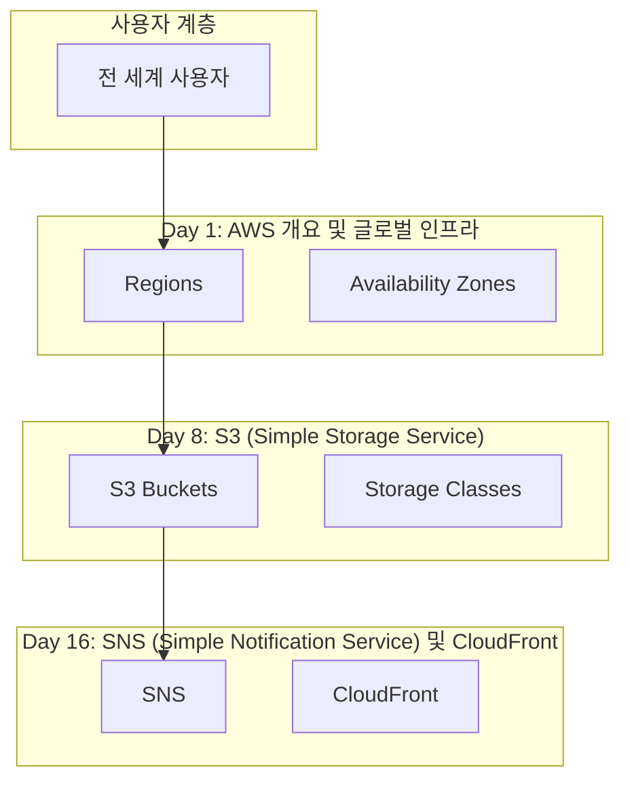
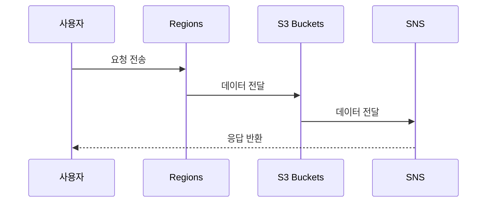

# Netflix 글로벌 스트리밍 아키텍처

> **통합 시나리오**: netflix_streaming
> **사용 사례**: 대규모 비디오 스트리밍 서비스

---

## 📋 시나리오 개요

- **시나리오 ID**: `netflix_streaming`
- **시나리오명**: Netflix 글로벌 스트리밍 아키텍처
- **설명**: 멀티 리전 콘텐츠 배포 및 스트리밍
- **관련 일차**: Day 1, Day 8, Day 16
- **주요 일차**: Day 1
- **핵심 서비스**: CloudFront, S3, Regions
- **통합 패턴**: CDN + Storage + Global Infrastructure
- **사용 사례**: 대규모 비디오 스트리밍 서비스

---

## 📅 관련 일차

### Day 1: AWS 개요 및 글로벌 인프라 **(주요)**

**주요 서비스**: Regions, Availability Zones, Edge Locations, CloudFront

**역할**: 이 시나리오의 핵심 서비스를 제공합니다.

**학습 링크**: [Day 1 학습 자료](../week1/day1/README.md)

### Day 8: S3 (Simple Storage Service)

**주요 서비스**: S3 Buckets, Storage Classes, Lifecycle Policies, Versioning

**역할**: 통합 아키텍처의 지원 서비스를 제공합니다.

**학습 링크**: [Day 8 학습 자료](../week2/day8/README.md)

### Day 16: SNS (Simple Notification Service) 및 CloudFront

**주요 서비스**: SNS, CloudFront, Edge Locations, Lambda@Edge

**역할**: 통합 아키텍처의 지원 서비스를 제공합니다.

**학습 링크**: [Day 16 학습 자료](../week3/day16/README.md)

---

## 🏗️ 서비스 아키텍처

---

## 🔄 서비스 플로우

### End-to-End 요청 처리 흐름

1. **사용자 요청 수신**
   - 서비스: CloudFront (Day 1, 16)
   - 처리: 가장 가까운 엣지 로케이션에서 요청 수신
   - 다음 단계: 캐시 확인

2. **콘텐츠 캐시 확인**
   - 서비스: CloudFront
   - 처리: 엣지 캐시에 콘텐츠 존재 여부 확인
   - 다음 단계: 캐시 히트 시 즉시 반환, 미스 시 오리진 요청

3. **오리진 콘텐츠 조회**
   - 서비스: S3 (Day 8)
   - 처리: 원본 비디오 파일을 S3에서 조회
   - 다음 단계: 콘텐츠 스트리밍

4. **콘텐츠 전송**
   - 서비스: CloudFront → 사용자
   - 처리: 최적화된 경로로 콘텐츠 스트리밍
   - 다음 단계: 완료

### 시퀀스 다이어그램

---

## 💻 구현 가이드

### 단계별 구현 방법

#### 단계 1: Day 1 - AWS 개요 및 글로벌 인프라 구성

**주요 서비스**: Regions, Availability Zones, Edge Locations, CloudFront

**구현 방법**:
1. AWS Console에서 Regions 생성
2. 기본 설정 구성 (Region: ap-northeast-2)
3. 보안 및 접근 제어 설정
4. 모니터링 및 알람 구성

**검증**:
- 리소스 상태 확인
- 연결 테스트 수행

**상세 가이드**: [Day 1 실습 자료](../week1/day1/hands-on-console/README.md)

#### 단계 2: Day 8 - S3 (Simple Storage Service) 구성

**주요 서비스**: S3 Buckets, Storage Classes, Lifecycle Policies, Versioning

**구현 방법**:
1. AWS Console에서 S3 Buckets 생성
2. 기본 설정 구성 (Region: ap-northeast-2)
3. 보안 및 접근 제어 설정
4. 모니터링 및 알람 구성

**검증**:
- 리소스 상태 확인
- 연결 테스트 수행

**상세 가이드**: [Day 8 실습 자료](../week2/day8/hands-on-console/README.md)

#### 단계 3: Day 16 - SNS (Simple Notification Service) 및 CloudFront 구성

**주요 서비스**: SNS, CloudFront, Edge Locations, Lambda@Edge

**구현 방법**:
1. AWS Console에서 SNS 생성
2. 기본 설정 구성 (Region: ap-northeast-2)
3. 보안 및 접근 제어 설정
4. 모니터링 및 알람 구성

**검증**:
- 리소스 상태 확인
- 연결 테스트 수행

**상세 가이드**: [Day 16 실습 자료](../week3/day16/hands-on-console/README.md)

### 통합 검증

**End-to-End 테스트**:
1. 사용자 시나리오 기반 테스트 수행
2. 각 서비스 간 연결 확인
3. 성능 및 응답 시간 측정
4. 에러 처리 및 장애 조치 테스트

---

## 🎓 학습 경로

### 권장 학습 순서

1. **Day 1: AWS 개요 및 글로벌 인프라 **(핵심)****
   - 학습 내용: Regions, Availability Zones, Edge Locations, CloudFront
   - 예상 시간: 2-3시간
   - 학습 자료: [Day 1 README](../week1/day1/README.md)

2. **Day 8: S3 (Simple Storage Service)**
   - 학습 내용: S3 Buckets, Storage Classes, Lifecycle Policies, Versioning
   - 예상 시간: 2-3시간
   - 학습 자료: [Day 8 README](../week2/day8/README.md)

3. **Day 16: SNS (Simple Notification Service) 및 CloudFront**
   - 학습 내용: SNS, CloudFront, Edge Locations, Lambda@Edge
   - 예상 시간: 2-3시간
   - 학습 자료: [Day 16 README](../week3/day16/README.md)

### 실습 순서

1. **개별 서비스 실습**: 각 일차의 hands-on-console 실습 완료
2. **서비스 통합 실습**: 서비스 간 연결 및 통합 구성
3. **End-to-End 테스트**: 전체 시나리오 검증
4. **최적화 및 튜닝**: 성능 및 비용 최적화

### 학습 목표

이 통합 시나리오를 완료하면 다음을 이해하게 됩니다:

- 대규모 비디오 스트리밍 서비스를 위한 AWS 아키텍처 설계
- CDN + Storage + Global Infrastructure 통합 패턴 구현
- 여러 AWS 서비스를 조합한 실제 솔루션 구축
- 프로덕션 환경 운영 및 모니터링

---

## ✅ 베스트 프랙티스

### 아키텍처 설계

- **고가용성**: 멀티 AZ 배포로 장애 대응
- **확장성**: Auto Scaling 및 로드 밸런싱 활용
- **보안**: 최소 권한 원칙 및 네트워크 격리
- **모니터링**: CloudWatch를 통한 포괄적 모니터링

### 비용 최적화

- 예약 인스턴스 및 Savings Plans 활용
- 자동 스케일링으로 리소스 최적화
- S3 Lifecycle 정책으로 스토리지 비용 절감
- CloudWatch 알람으로 비정상 비용 감지

### 운영 효율성

- Infrastructure as Code (CloudFormation/Terraform) 사용
- CI/CD 파이프라인 구축
- 자동화된 백업 및 복구 절차
- 정기적인 보안 감사 및 패치

---

## 🔧 트러블슈팅

### 일반적인 문제

#### 문제 1: 서비스 간 연결 실패

**증상**: 한 서비스에서 다른 서비스로 요청이 전달되지 않음

**진단**:
1. Security Group 규칙 확인
2. IAM 권한 검증
3. 네트워크 ACL 설정 확인

**해결**:
- 필요한 포트 및 프로토콜 허용
- 적절한 IAM 역할 및 정책 부여
- VPC 피어링 또는 엔드포인트 구성

#### 문제 2: 성능 저하

**증상**: 응답 시간 증가, 처리량 감소

**진단**:
1. CloudWatch 메트릭 확인 (CPU, 메모리, 네트워크)
2. 병목 지점 식별
3. 로그 분석

**해결**:
- 리소스 스케일 업/아웃
- 캐싱 전략 적용
- 데이터베이스 쿼리 최적화

#### 문제 3: 비용 급증

**증상**: 예상보다 높은 AWS 비용

**진단**:
1. Cost Explorer에서 비용 분석
2. 리소스 사용률 확인
3. 불필요한 리소스 식별

**해결**:
- 미사용 리소스 삭제
- 예약 인스턴스 구매
- Auto Scaling 정책 최적화

---

## 📚 참고 자료

### AWS 공식 문서

- [Regions 사용 설명서](https://docs.aws.amazon.com/)
- [S3 Buckets 사용 설명서](https://docs.aws.amazon.com/)
- [SNS 사용 설명서](https://docs.aws.amazon.com/)

### 아키텍처 패턴

- [AWS 아키텍처 센터 - CDN + Storage + Global Infrastructure](https://aws.amazon.com/architecture/)
- [AWS Well-Architected Framework](https://aws.amazon.com/architecture/well-architected/)
- [AWS 솔루션 라이브러리](https://aws.amazon.com/solutions/)

### 관련 학습 자료

- [Day 1: AWS 개요 및 글로벌 인프라](../week1/day1/README.md)
- [Day 8: S3 (Simple Storage Service)](../week2/day8/README.md)
- [Day 16: SNS (Simple Notification Service) 및 CloudFront](../week3/day16/README.md)

---

**생성일**: 2026-01-14
**버전**: 1.0
