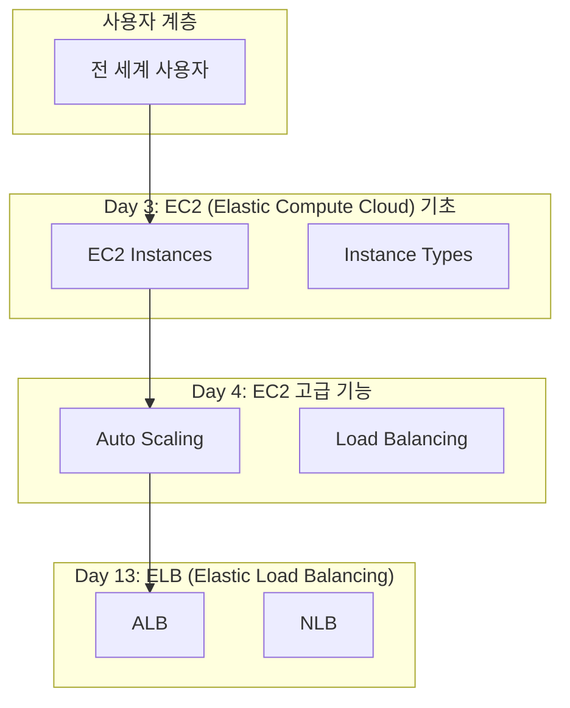
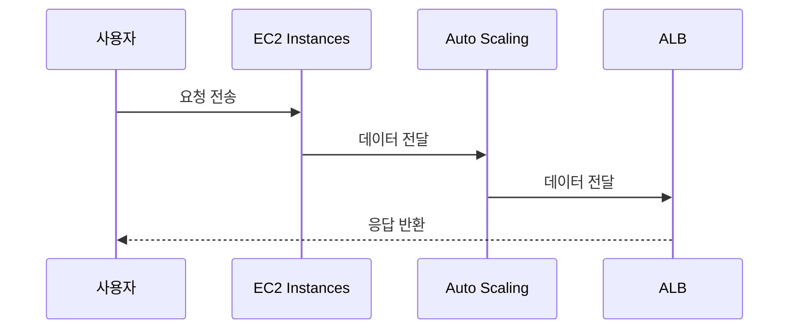

# Spotify 확장 가능한 컴퓨팅

> **통합 시나리오**: spotify_scalability
> **사용 사례**: 고가용성 웹 애플리케이션

---

## 📋 시나리오 개요

- **시나리오 ID**: `spotify_scalability`
- **시나리오명**: Spotify 확장 가능한 컴퓨팅
- **설명**: 음악 스트리밍을 위한 Auto Scaling 아키텍처
- **관련 일차**: Day 3, Day 4, Day 13
- **주요 일차**: Day 3
- **핵심 서비스**: EC2, Auto Scaling, ELB
- **통합 패턴**: Compute + Scaling + Load Balancing
- **사용 사례**: 고가용성 웹 애플리케이션

---

## 📅 관련 일차

### Day 3: EC2 (Elastic Compute Cloud) 기초 **(주요)**

**주요 서비스**: EC2 Instances, Instance Types, AMI, Security Groups

**역할**: 이 시나리오의 핵심 서비스를 제공합니다.

**학습 링크**: [Day 3 학습 자료](../week1/day3/README.md)

### Day 4: EC2 고급 기능

**주요 서비스**: Auto Scaling, Load Balancing, Placement Groups, Elastic IP

**역할**: 통합 아키텍처의 지원 서비스를 제공합니다.

**학습 링크**: [Day 4 학습 자료](../week1/day4/README.md)

### Day 13: ELB (Elastic Load Balancing)

**주요 서비스**: ALB, NLB, CLB, Target Groups

**역할**: 통합 아키텍처의 지원 서비스를 제공합니다.

**학습 링크**: [Day 13 학습 자료](../week2/day13/README.md)

---

## 🏗️ 서비스 아키텍처

---

## 🔄 서비스 플로우

### End-to-End 요청 처리 흐름

1. **로드 밸런싱**
   - 서비스: ELB (Day 13)
   - 처리: 트래픽을 여러 인스턴스에 분산
   - 다음 단계: 인스턴스 처리

2. **요청 처리**
   - 서비스: EC2 (Day 3, 4)
   - 처리: 애플리케이션 로직 실행
   - 다음 단계: Auto Scaling 평가

3. **자동 확장**
   - 서비스: Auto Scaling (Day 4)
   - 처리: 부하에 따라 인스턴스 자동 조정
   - 다음 단계: 완료

### 시퀀스 다이어그램

---

## 💻 구현 가이드

### 단계별 구현 방법

#### 단계 1: Day 3 - EC2 (Elastic Compute Cloud) 기초 구성

**주요 서비스**: EC2 Instances, Instance Types, AMI, Security Groups

**구현 방법**:
1. AWS Console에서 EC2 Instances 생성
2. 기본 설정 구성 (Region: ap-northeast-2)
3. 보안 및 접근 제어 설정
4. 모니터링 및 알람 구성

**검증**:
- 리소스 상태 확인
- 연결 테스트 수행

**상세 가이드**: [Day 3 실습 자료](../week1/day3/hands-on-console/README.md)

#### 단계 2: Day 4 - EC2 고급 기능 구성

**주요 서비스**: Auto Scaling, Load Balancing, Placement Groups, Elastic IP

**구현 방법**:
1. AWS Console에서 Auto Scaling 생성
2. 기본 설정 구성 (Region: ap-northeast-2)
3. 보안 및 접근 제어 설정
4. 모니터링 및 알람 구성

**검증**:
- 리소스 상태 확인
- 연결 테스트 수행

**상세 가이드**: [Day 4 실습 자료](../week1/day4/hands-on-console/README.md)

#### 단계 3: Day 13 - ELB (Elastic Load Balancing) 구성

**주요 서비스**: ALB, NLB, CLB, Target Groups

**구현 방법**:
1. AWS Console에서 ALB 생성
2. 기본 설정 구성 (Region: ap-northeast-2)
3. 보안 및 접근 제어 설정
4. 모니터링 및 알람 구성

**검증**:
- 리소스 상태 확인
- 연결 테스트 수행

**상세 가이드**: [Day 13 실습 자료](../week2/day13/hands-on-console/README.md)

### 통합 검증

**End-to-End 테스트**:
1. 사용자 시나리오 기반 테스트 수행
2. 각 서비스 간 연결 확인
3. 성능 및 응답 시간 측정
4. 에러 처리 및 장애 조치 테스트

---

## 🎓 학습 경로

### 권장 학습 순서

1. **Day 3: EC2 (Elastic Compute Cloud) 기초 **(핵심)****
   - 학습 내용: EC2 Instances, Instance Types, AMI, Security Groups
   - 예상 시간: 2-3시간
   - 학습 자료: [Day 3 README](../week1/day3/README.md)

2. **Day 4: EC2 고급 기능**
   - 학습 내용: Auto Scaling, Load Balancing, Placement Groups, Elastic IP
   - 예상 시간: 2-3시간
   - 학습 자료: [Day 4 README](../week1/day4/README.md)

3. **Day 13: ELB (Elastic Load Balancing)**
   - 학습 내용: ALB, NLB, CLB, Target Groups
   - 예상 시간: 2-3시간
   - 학습 자료: [Day 13 README](../week2/day13/README.md)

### 실습 순서

1. **개별 서비스 실습**: 각 일차의 hands-on-console 실습 완료
2. **서비스 통합 실습**: 서비스 간 연결 및 통합 구성
3. **End-to-End 테스트**: 전체 시나리오 검증
4. **최적화 및 튜닝**: 성능 및 비용 최적화

### 학습 목표

이 통합 시나리오를 완료하면 다음을 이해하게 됩니다:

- 고가용성 웹 애플리케이션를 위한 AWS 아키텍처 설계
- Compute + Scaling + Load Balancing 통합 패턴 구현
- 여러 AWS 서비스를 조합한 실제 솔루션 구축
- 프로덕션 환경 운영 및 모니터링

---

## ✅ 베스트 프랙티스

### 아키텍처 설계

- **고가용성**: 멀티 AZ 배포로 장애 대응
- **확장성**: Auto Scaling 및 로드 밸런싱 활용
- **보안**: 최소 권한 원칙 및 네트워크 격리
- **모니터링**: CloudWatch를 통한 포괄적 모니터링

### 비용 최적화

- 예약 인스턴스 및 Savings Plans 활용
- 자동 스케일링으로 리소스 최적화
- S3 Lifecycle 정책으로 스토리지 비용 절감
- CloudWatch 알람으로 비정상 비용 감지

### 운영 효율성

- Infrastructure as Code (CloudFormation/Terraform) 사용
- CI/CD 파이프라인 구축
- 자동화된 백업 및 복구 절차
- 정기적인 보안 감사 및 패치

---

## 🔧 트러블슈팅

### 일반적인 문제

#### 문제 1: 서비스 간 연결 실패

**증상**: 한 서비스에서 다른 서비스로 요청이 전달되지 않음

**진단**:
1. Security Group 규칙 확인
2. IAM 권한 검증
3. 네트워크 ACL 설정 확인

**해결**:
- 필요한 포트 및 프로토콜 허용
- 적절한 IAM 역할 및 정책 부여
- VPC 피어링 또는 엔드포인트 구성

#### 문제 2: 성능 저하

**증상**: 응답 시간 증가, 처리량 감소

**진단**:
1. CloudWatch 메트릭 확인 (CPU, 메모리, 네트워크)
2. 병목 지점 식별
3. 로그 분석

**해결**:
- 리소스 스케일 업/아웃
- 캐싱 전략 적용
- 데이터베이스 쿼리 최적화

#### 문제 3: 비용 급증

**증상**: 예상보다 높은 AWS 비용

**진단**:
1. Cost Explorer에서 비용 분석
2. 리소스 사용률 확인
3. 불필요한 리소스 식별

**해결**:
- 미사용 리소스 삭제
- 예약 인스턴스 구매
- Auto Scaling 정책 최적화

---

## 📚 참고 자료

### AWS 공식 문서

- [EC2 Instances 사용 설명서](https://docs.aws.amazon.com/)
- [Auto Scaling 사용 설명서](https://docs.aws.amazon.com/)
- [ALB 사용 설명서](https://docs.aws.amazon.com/)

### 아키텍처 패턴

- [AWS 아키텍처 센터 - Compute + Scaling + Load Balancing](https://aws.amazon.com/architecture/)
- [AWS Well-Architected Framework](https://aws.amazon.com/architecture/well-architected/)
- [AWS 솔루션 라이브러리](https://aws.amazon.com/solutions/)

### 관련 학습 자료

- [Day 3: EC2 (Elastic Compute Cloud) 기초](../week1/day3/README.md)
- [Day 4: EC2 고급 기능](../week1/day4/README.md)
- [Day 13: ELB (Elastic Load Balancing)](../week2/day13/README.md)

---

**생성일**: 2026-01-14
**버전**: 1.0
