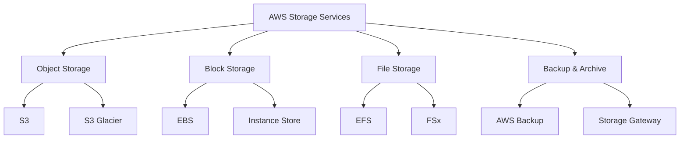
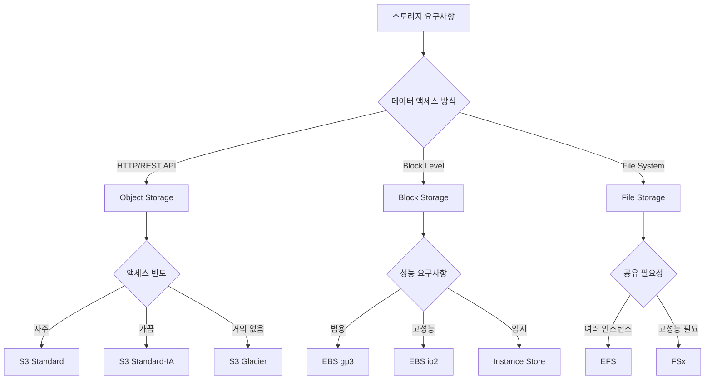
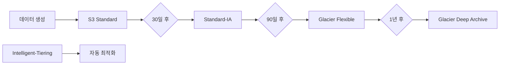
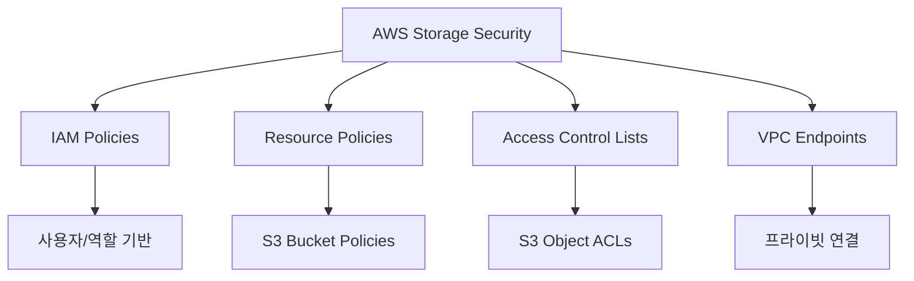
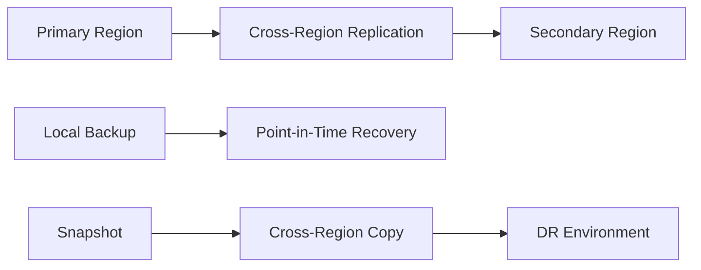
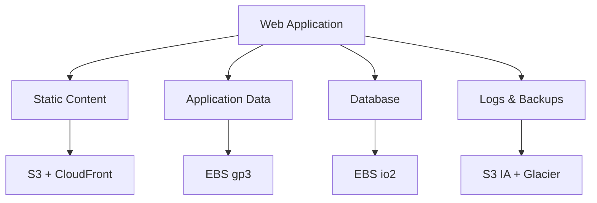

# AWS 스토리지 서비스 비교 치트 시트

## 📋 개요
이 치트 시트는 AWS의 주요 스토리지 서비스들을 비교하여 적절한 서비스 선택을 돕습니다. SAA-C03 시험과 실무에서 활용할 수 있는 핵심 정보를 제공합니다.

---

## 🗂️ 스토리지 서비스 분류



---

## 📊 주요 스토리지 서비스 비교표

| 서비스 | 타입 | 용량 | 내구성 | 가용성 | 주요 사용 사례 |
|--------|------|------|--------|--------|----------------|
| **S3 Standard** | Object | 무제한 | 99.999999999% | 99.99% | 웹사이트, 콘텐츠 배포, 백업 |
| **S3 IA** | Object | 무제한 | 99.999999999% | 99.9% | 장기 백업, 재해 복구 |
| **S3 Glacier** | Object | 무제한 | 99.999999999% | 99.99% | 아카이브, 규정 준수 |
| **EBS gp3** | Block | 1GB-16TB | 99.999% | 99.999% | 범용 워크로드, 부팅 볼륨 |
| **EBS io2** | Block | 4GB-64TB | 99.999% | 99.999% | 고성능 데이터베이스 |
| **EFS** | File | 페타바이트 | 99.999999999% | 99.99% | 공유 파일 시스템 |
| **FSx** | File | 테라바이트 | 99.999999999% | 99.99% | 고성능 컴퓨팅 |

---

## 🎯 서비스 선택 결정 트리



---

## 📈 성능 특성 비교

### EBS 볼륨 타입별 성능

| 볼륨 타입 | 최대 IOPS | 최대 처리량 | 지연시간 | 사용 사례 |
|-----------|-----------|-------------|----------|-----------|
| **gp3** | 16,000 | 1,000 MiB/s | 한 자리 ms | 범용, 가상 데스크톱 |
| **gp2** | 16,000 | 250 MiB/s | 한 자리 ms | 범용, 개발/테스트 |
| **io2** | 64,000 | 1,000 MiB/s | 한 자리 ms | 고성능 DB, 파일 시스템 |
| **io1** | 64,000 | 1,000 MiB/s | 한 자리 ms | 고성능 DB (레거시) |
| **st1** | 500 | 500 MiB/s | 두 자리 ms | 빅데이터, 로그 처리 |
| **sc1** | 250 | 250 MiB/s | 두 자리 ms | 콜드 데이터, 아카이브 |

### S3 스토리지 클래스별 특성

| 스토리지 클래스 | 검색 시간 | 최소 보관 기간 | 가용성 | 사용 사례 |
|----------------|-----------|----------------|--------|-----------|
| **Standard** | 즉시 | 없음 | 99.99% | 자주 액세스하는 데이터 |
| **Standard-IA** | 즉시 | 30일 | 99.9% | 가끔 액세스하는 데이터 |
| **One Zone-IA** | 즉시 | 30일 | 99.5% | 재생성 가능한 데이터 |
| **Glacier Instant** | 즉시 | 90일 | 99.9% | 아카이브, 즉시 액세스 |
| **Glacier Flexible** | 1분-12시간 | 90일 | 99.99% | 백업, 재해 복구 |
| **Glacier Deep** | 12시간 | 180일 | 99.99% | 장기 아카이브 |

---

## 💰 비용 최적화 가이드

### S3 비용 최적화 전략



**비용 절감 팁:**
- **S3 Intelligent-Tiering**: 예측 불가능한 액세스 패턴
- **수명 주기 정책**: 자동 티어 전환
- **멀티파트 업로드**: 대용량 파일 효율성
- **S3 Transfer Acceleration**: 업로드 속도 향상

### EBS 비용 최적화

| 최적화 방법 | 절약 효과 | 적용 시나리오 |
|-------------|-----------|---------------|
| **gp2 → gp3 전환** | 최대 20% | 모든 범용 워크로드 |
| **볼륨 크기 최적화** | 10-50% | 과도하게 프로비저닝된 볼륨 |
| **스냅샷 관리** | 30-70% | 불필요한 스냅샷 정리 |
| **Reserved Instances** | 최대 72% | 예측 가능한 워크로드 |

---

## 🔒 보안 및 암호화

### 암호화 지원 현황

| 서비스 | 저장 시 암호화 | 전송 시 암호화 | 키 관리 |
|--------|----------------|----------------|---------|
| **S3** | ✅ AES-256, KMS | ✅ HTTPS/TLS | SSE-S3, SSE-KMS, SSE-C |
| **EBS** | ✅ AES-256 | ✅ 인스턴스-볼륨 간 | AWS KMS |
| **EFS** | ✅ AES-256 | ✅ TLS 1.2 | AWS KMS |
| **FSx** | ✅ AES-256 | ✅ TLS | AWS KMS |

### 액세스 제어



---

## 🌐 가용성 및 내구성

### 데이터 보호 메커니즘

| 서비스 | 복제 방식 | AZ 분산 | 리전 간 복제 |
|--------|-----------|---------|--------------|
| **S3** | 자동 (3개 이상 AZ) | ✅ | ✅ CRR/SRR |
| **EBS** | 단일 AZ 내 자동 복제 | ❌ | ✅ 스냅샷 |
| **EFS** | 자동 (3개 이상 AZ) | ✅ | ✅ 백업 |
| **FSx** | 자동 백업 | ✅ | ✅ 백업 |

### 재해 복구 전략



---

## 🚀 성능 최적화 모범 사례

### S3 성능 최적화

**업로드 최적화:**
- 멀티파트 업로드 (100MB 이상)
- Transfer Acceleration 활용
- 적절한 프리픽스 분산

**다운로드 최적화:**
- CloudFront CDN 활용
- Range GET 요청 사용
- 적절한 스토리지 클래스 선택

### EBS 성능 최적화

**IOPS 최적화:**
- 적절한 볼륨 타입 선택
- 볼륨 워밍업 수행
- 인스턴스 타입과 매칭

**처리량 최적화:**
- 여러 볼륨 스트라이핑
- 적절한 I/O 크기 설정
- EBS 최적화 인스턴스 사용

---

## 📋 사용 사례별 권장 사항

### 웹 애플리케이션



### 빅데이터 분석

| 구성 요소 | 권장 스토리지 | 이유 |
|-----------|---------------|------|
| **Raw Data** | S3 Standard | 높은 처리량, 무제한 용량 |
| **Processing** | EBS st1 | 순차 읽기 최적화 |
| **Results** | S3 IA | 가끔 액세스, 비용 효율적 |
| **Archive** | S3 Glacier | 장기 보관, 규정 준수 |

### 고성능 컴퓨팅 (HPC)

| 워크로드 | 권장 스토리지 | 특징 |
|----------|---------------|------|
| **Scratch Space** | Instance Store | 최고 성능, 임시 데이터 |
| **Shared Data** | FSx Lustre | 병렬 파일 시스템 |
| **Home Directories** | EFS | POSIX 호환, 자동 확장 |
| **Results** | S3 | 내구성, 분석 도구 연동 |

---

## 🔍 문제 해결 가이드

### 일반적인 성능 문제

**S3 성능 저하:**
```
증상: 느린 업로드/다운로드
해결책:
1. 멀티파트 업로드 사용
2. Transfer Acceleration 활성화
3. 프리픽스 분산 확인
4. CloudFront 캐싱 활용
```

**EBS 성능 저하:**
```
증상: 높은 지연시간, 낮은 IOPS
해결책:
1. 볼륨 타입 확인 (gp3 권장)
2. 인스턴스 타입 확인
3. EBS 최적화 활성화
4. 볼륨 워밍업 수행
```

### 비용 최적화 체크리스트

- [ ] S3 수명 주기 정책 설정
- [ ] 불필요한 EBS 볼륨 정리
- [ ] 오래된 스냅샷 삭제
- [ ] gp2 → gp3 마이그레이션
- [ ] S3 Intelligent-Tiering 활용
- [ ] Reserved Instances 구매 검토

---

## 📚 추가 학습 자료

### AWS 공식 문서
- [S3 사용자 가이드](https://docs.aws.amazon.com/s3/)
- [EBS 사용자 가이드](https://docs.aws.amazon.com/ebs/)
- [EFS 사용자 가이드](https://docs.aws.amazon.com/efs/)

### 성능 벤치마킹 도구
- **S3**: s3-benchmark, s3-dist-cp
- **EBS**: fio, dd, iostat
- **EFS**: fio, iozone

### 모니터링 도구
- **CloudWatch**: 기본 메트릭
- **AWS X-Ray**: 애플리케이션 추적
- **VPC Flow Logs**: 네트워크 트래픽

---

## 🎯 시험 팁

### SAA-C03 출제 포인트

**자주 출제되는 시나리오:**
1. 스토리지 클래스 선택 (액세스 패턴 기반)
2. 성능 요구사항에 따른 EBS 타입 선택
3. 비용 최적화 전략
4. 재해 복구 및 백업 전략
5. 보안 및 암호화 요구사항

**핵심 암기 사항:**
- S3 스토리지 클래스별 최소 보관 기간
- EBS 볼륨 타입별 최대 IOPS/처리량
- 각 서비스의 내구성/가용성 수치
- 암호화 옵션 및 키 관리 방식

---

**마지막 업데이트**: 2024년 1월  
**다음 업데이트 예정**: Week 3 완료 후 애플리케이션 서비스 연동 부분 추가