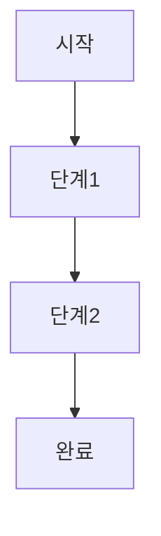
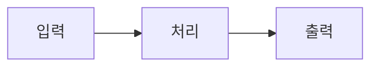

# Day X: [서비스명/주제명]

## 📚 학습 개요

[해당 일의 학습 내용에 대한 간단한 개요]

## 🎯 학습 목표

- [학습 목표 1]
- [학습 목표 2]
- [학습 목표 3]
- [학습 목표 4]

## 📖 학습 내용

### 1. [주요 개념 1]
- **[세부 개념 1]**: [설명]
- **[세부 개념 2]**: [설명]
- **[세부 개념 3]**: [설명]

### 2. [주요 개념 2]
- **[세부 개념 1]**: [설명]
- **[세부 개념 2]**: [설명]

### 3. [주요 개념 3]
- **[세부 개념 1]**: [설명]
- **[세부 개념 2]**: [설명]

## 🛠️ 실습 내용

### 실습 1: [실습명]
1. [단계 1]
2. [단계 2]
3. [단계 3]
4. [단계 4]

### 실습 2: [실습명]
1. [단계 1]
2. [단계 2]
3. [단계 3]

## 📊 시각화 자료

### 다이어그램 1: [다이어그램명]

### 다이어그램 2: [다이어그램명]

## 📝 일일 퀴즈

### 문제 1 (객관식)
[문제 내용]
1. [선택지 1]
2. [선택지 2]
3. [선택지 3]
4. [선택지 4]

**정답: [번호]**
**해설**: [정답 해설]

### 문제 2 (시나리오)
[시나리오 문제 내용]
1. [선택지 1]
2. [선택지 2]
3. [선택지 3]
4. [선택지 4]

**정답: [번호]**
**해설**: [정답 해설]

### 문제 3 (참/거짓)
[문제 내용]
1. 참
2. 거짓

**정답: [번호]**
**해설**: [정답 해설]

### 문제 4 (객관식)
[문제 내용]
1. [선택지 1]
2. [선택지 2]
3. [선택지 3]
4. [선택지 4]

**정답: [번호]**
**해설**: [정답 해설]

### 문제 5 (다중 선택)
[문제 내용] (정답이 2개 이상인 경우)
1. [선택지 1]
2. [선택지 2]
3. [선택지 3]
4. [선택지 4]
5. [선택지 5]

**정답: [번호들]**
**해설**: [정답 해설]

## 📚 추가 학습 자료

- [AWS 공식 문서 링크]
- [관련 백서 링크]
- [추가 참고 자료 링크]

## ✅ 학습 완료 체크리스트

- [ ] [학습 목표 1] 이해
- [ ] [학습 목표 2] 이해
- [ ] [학습 목표 3] 이해
- [ ] [실습 1] 완료
- [ ] [실습 2] 완료
- [ ] 일일 퀴즈 80% 이상 정답률 달성

## 🔗 다음 학습

내일은 [Day X+1: [다음 주제]](../dayX+1/README.md)에서 [다음 학습 내용]을 학습합니다.

---

**[격려 메시지 또는 학습 팁]**