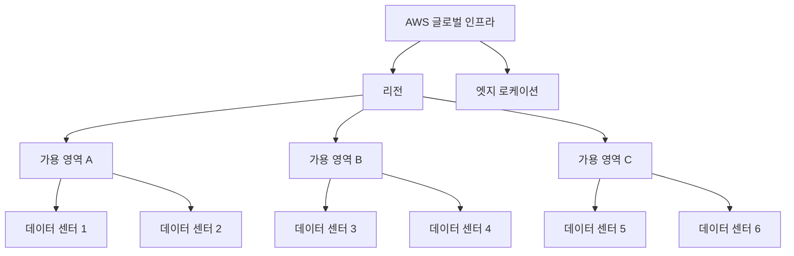
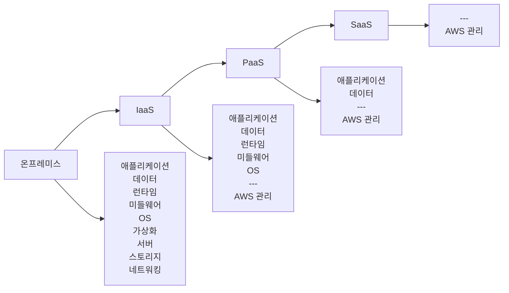

# Day 1: AWS 개요 및 글로벌 인프라

## 📚 학습 개요

AWS 클라우드 컴퓨팅의 기본 개념과 글로벌 인프라 구조를 이해합니다. 클라우드 서비스의 장점과 AWS의 핵심 서비스 카테고리를 학습하여 전체적인 AWS 생태계를 파악합니다.

## 🎯 학습 목표

- 클라우드 컴퓨팅의 기본 개념과 장점 이해
- AWS 글로벌 인프라 (리전, 가용 영역, 엣지 로케이션) 구조 파악
- AWS 서비스 카테고리별 주요 서비스 개요 학습
- AWS 콘솔 기본 사용법 익히기

## 📖 학습 내용

### 1. 클라우드 컴퓨팅 기초
- **온프레미스 vs 클라우드**: 전통적인 IT 인프라와 클라우드의 차이점
- **클라우드 서비스 모델**: IaaS, PaaS, SaaS의 개념과 특징
- **클라우드 배포 모델**: 퍼블릭, 프라이빗, 하이브리드 클라우드
- **클라우드의 6가지 장점**: 비용 절감, 속도, 글로벌 확장성, 생산성, 안정성, 보안

### 2. AWS 글로벌 인프라
- **리전 (Region)**: 지리적으로 분리된 데이터 센터 클러스터
- **가용 영역 (Availability Zone)**: 리전 내 독립적인 데이터 센터
- **엣지 로케이션 (Edge Location)**: CDN을 위한 캐시 서버 위치
- **리전 선택 기준**: 지연 시간, 법적 요구사항, 서비스 가용성, 비용

### 3. AWS 서비스 카테고리
- **컴퓨팅**: EC2, Lambda, ECS, EKS
- **스토리지**: S3, EBS, EFS, Glacier
- **데이터베이스**: RDS, DynamoDB, ElastiCache
- **네트워킹**: VPC, CloudFront, Route 53
- **보안**: IAM, KMS, CloudTrail
- **관리 도구**: CloudWatch, CloudFormation, Systems Manager

## 🛠️ 실습 내용

### 실습 1: AWS 계정 설정 및 콘솔 탐색
1. AWS Free Tier 계정 생성
2. 루트 계정 보안 설정 (MFA 활성화)
3. AWS 콘솔 주요 메뉴 탐색
4. 리전 선택 및 변경 실습

### 실습 2: AWS 서비스 둘러보기
1. 각 서비스 카테고리별 콘솔 화면 확인
2. 서비스 검색 및 즐겨찾기 설정
3. AWS 문서 및 도움말 활용법

## 📊 시각화 자료

### 다이어그램 1: AWS 글로벌 인프라 구조

### 다이어그램 2: 클라우드 서비스 모델

## 📝 일일 퀴즈

### 문제 1 (객관식)
AWS 리전을 선택할 때 고려해야 할 주요 요소가 아닌 것은?
1. 지연 시간 (Latency)
2. 법적 요구사항 (Compliance)
3. 서비스 가용성 (Service Availability)
4. 개발자 선호도 (Developer Preference)

**정답: 4번**
**해설**: 리전 선택은 기술적, 법적, 비즈니스적 요구사항을 기반으로 해야 하며, 개인적 선호도는 고려 요소가 아닙니다.

### 문제 2 (객관식)
AWS 가용 영역(AZ)에 대한 설명으로 올바른 것은?
1. 각 리전에는 반드시 2개의 AZ만 존재한다
2. AZ는 물리적으로 분리되어 있지만 낮은 지연 시간으로 연결된다
3. 모든 AZ는 동일한 데이터 센터 건물에 위치한다
4. AZ 간 데이터 전송은 항상 무료이다

**정답: 2번**
**해설**: AZ는 물리적으로 분리되어 있어 장애 격리가 가능하지만, 고속 네트워크로 연결되어 낮은 지연 시간을 제공합니다.

### 문제 3 (시나리오)
글로벌 e-커머스 회사가 AWS를 도입하려고 합니다. 주요 고객이 미국, 유럽, 아시아에 분포되어 있을 때, 가장 적절한 전략은?
1. 비용 절약을 위해 단일 리전 사용
2. 각 지역별로 리전을 선택하여 다중 리전 배포
3. 가장 큰 시장인 미국에만 배포
4. 모든 리전에 동일한 서비스 배포

**정답: 2번**
**해설**: 글로벌 서비스를 위해서는 각 지역의 고객에게 최적의 성능을 제공하기 위해 지역별 리전 선택이 필요합니다.

### 문제 4 (참/거짓)
AWS 엣지 로케이션은 CloudFront CDN 서비스에만 사용된다.
1. 참
2. 거짓

**정답: 2번 (거짓)**
**해설**: 엣지 로케이션은 CloudFront뿐만 아니라 Route 53, AWS Shield, AWS WAF 등 다양한 서비스에서 활용됩니다.

### 문제 5 (객관식)
클라우드 컴퓨팅의 주요 장점이 아닌 것은?
1. 탄력적 확장성
2. 초기 투자 비용 절감
3. 물리적 하드웨어 완전 제어
4. 글로벌 배포 용이성

**정답: 3번**
**해설**: 클라우드에서는 물리적 하드웨어를 직접 제어할 수 없으며, 이는 클라우드의 특성상 추상화된 서비스를 제공하기 때문입니다.

## 📚 추가 학습 자료

- [AWS 글로벌 인프라](https://aws.amazon.com/about-aws/global-infrastructure/)
- [AWS 서비스 개요](https://aws.amazon.com/products/)
- [클라우드 컴퓨팅이란?](https://aws.amazon.com/what-is-cloud-computing/)

## ✅ 학습 완료 체크리스트

- [ ] 클라우드 컴퓨팅 기본 개념 이해
- [ ] AWS 글로벌 인프라 구조 파악
- [ ] AWS 서비스 카테고리 개요 학습
- [ ] AWS 콘솔 기본 사용법 실습
- [ ] 일일 퀴즈 80% 이상 정답률 달성

## 🔗 다음 학습

내일은 [Day 2: IAM (Identity and Access Management)](../day2/README.md)에서 AWS의 보안과 권한 관리에 대해 학습합니다.

---

**오늘 학습을 완료하셨나요? 퀴즈를 풀고 다음 단계로 진행하세요! 🚀**