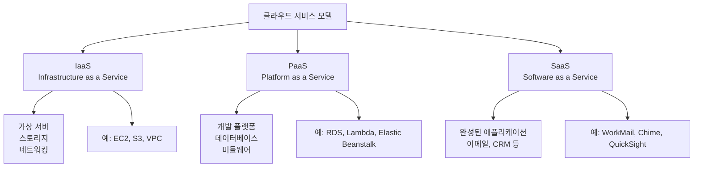
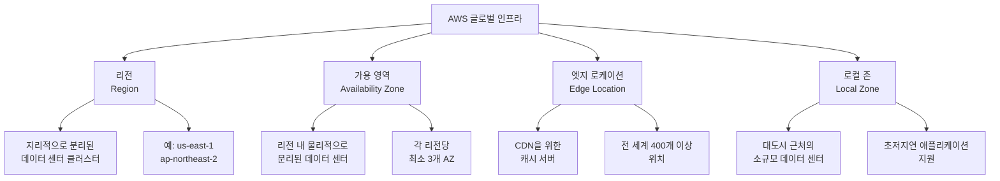
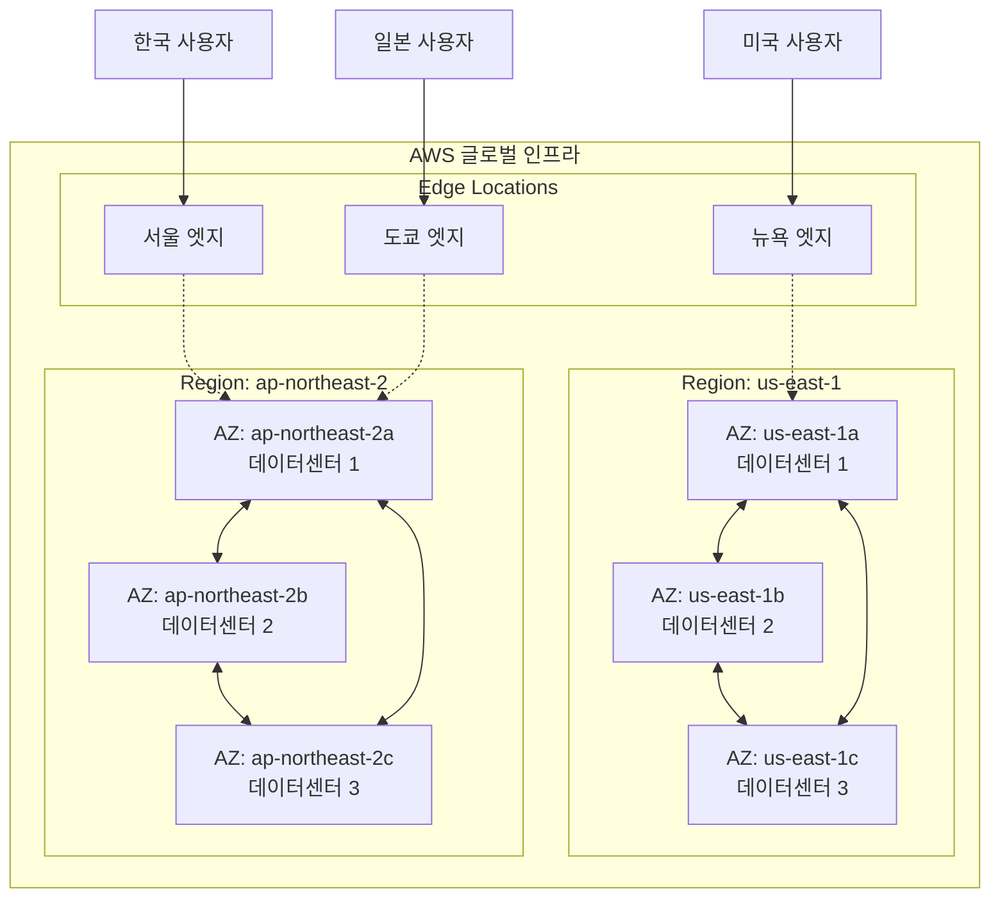
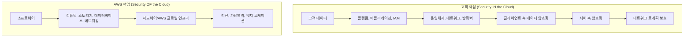
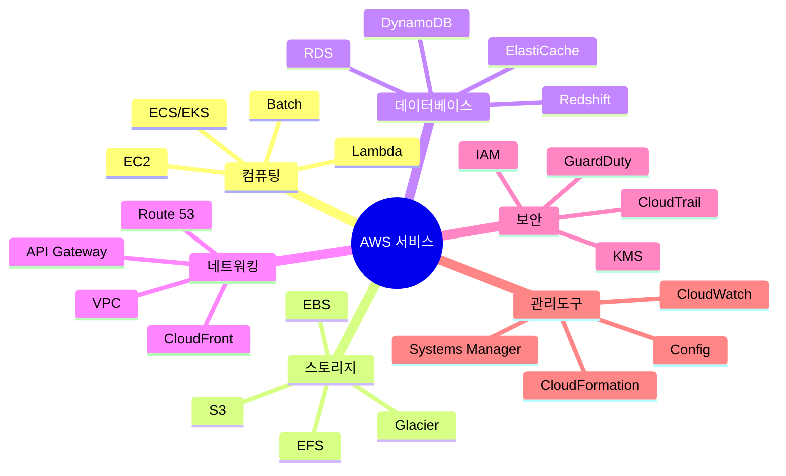

# Day 1: AWS 개요 및 글로벌 인프라

## 학습 목표
- AWS 클라우드 컴퓨팅의 기본 개념 이해
- AWS 글로벌 인프라 구조 파악
- 클라우드 서비스 모델 (IaaS, PaaS, SaaS) 구분
- AWS의 주요 장점과 특징 설명

## 1. 클라우드 컴퓨팅이란?

클라우드 컴퓨팅은 인터넷을 통해 컴퓨팅 리소스(서버, 스토리지, 데이터베이스, 네트워킹, 소프트웨어 등)를 온디맨드로 제공하는 서비스입니다. 

### 전통적인 IT vs 클라우드 컴퓨팅

**전통적인 IT 환경의 문제점:**
- 높은 초기 투자 비용 (서버, 네트워크 장비 구매)
- 용량 계획의 어려움 (과소/과대 프로비저닝)
- 유지보수 및 관리 부담
- 확장성의 한계

**클라우드 컴퓨팅의 장점:**
- 초기 투자 비용 없음 (CAPEX → OPEX)
- 필요한 만큼만 사용하고 지불
- 빠른 확장/축소 가능
- 글로벌 배포 용이

## 2. 클라우드 서비스 모델

### IaaS (Infrastructure as a Service)
- **정의**: 가상화된 컴퓨팅 리소스를 인터넷을 통해 제공
- **특징**: 가장 기본적인 클라우드 서비스, 높은 유연성
- **AWS 예시**: EC2 (가상 서버), S3 (스토리지), VPC (네트워킹)
- **사용자 책임**: OS, 미들웨어, 런타임, 데이터, 애플리케이션

### PaaS (Platform as a Service)
- **정의**: 애플리케이션 개발 및 배포를 위한 플랫폼 제공
- **특징**: 개발에 집중 가능, 인프라 관리 불필요
- **AWS 예시**: Lambda (서버리스), RDS (관리형 데이터베이스), Elastic Beanstalk
- **사용자 책임**: 데이터, 애플리케이션

### SaaS (Software as a Service)
- **정의**: 완성된 소프트웨어 애플리케이션을 서비스로 제공
- **특징**: 즉시 사용 가능, 최소한의 관리 필요
- **AWS 예시**: WorkMail (이메일), Chime (화상회의), QuickSight (BI)
- **사용자 책임**: 데이터 입력 및 설정

## 3. AWS 소개

Amazon Web Services(AWS)는 2006년에 시작된 아마존의 클라우드 컴퓨팅 플랫폼입니다.

### AWS의 주요 특징

**1. 광범위한 서비스 포트폴리오**
- 200개 이상의 서비스 제공
- 컴퓨팅, 스토리지, 데이터베이스, 네트워킹, 분석, 머신러닝 등

**2. 글로벌 인프라**
- 전 세계 33개 리전, 105개 가용 영역 (2024년 기준)
- 낮은 지연시간과 높은 가용성 보장

**3. 보안 및 규정 준수**
- 다양한 보안 인증 (SOC, PCI DSS, HIPAA 등)
- 공동 책임 모델을 통한 보안 관리

**4. 비용 효율성**
- 사용한 만큼만 지불 (Pay-as-you-go)
- 다양한 요금 모델 (온디맨드, 예약 인스턴스, 스팟 인스턴스)

## 4. AWS 글로벌 인프라

AWS 글로벌 인프라는 물리적으로 분리된 데이터 센터들의 네트워크로 구성됩니다.

### 리전 (Region)
- **정의**: 지리적으로 분리된 AWS 데이터 센터의 클러스터
- **특징**: 
  - 각 리전은 완전히 독립적
  - 최소 3개의 가용 영역으로 구성
  - 데이터는 명시적 허가 없이 리전 간 이동하지 않음
- **명명 규칙**: `지역-방향-번호` (예: us-east-1, ap-northeast-2)

**주요 리전 예시:**
- **us-east-1** (버지니아 북부): 가장 오래된 리전, 많은 서비스 최초 출시
- **ap-northeast-2** (서울): 한국 사용자를 위한 리전
- **eu-west-1** (아일랜드): 유럽 사용자를 위한 주요 리전

### 가용 영역 (Availability Zone, AZ)
- **정의**: 리전 내에서 물리적으로 분리된 데이터 센터
- **특징**:
  - 각 AZ는 독립적인 전력, 냉각, 네트워킹 시설
  - AZ 간 고속 네트워크로 연결 (지연시간 < 10ms)
  - 단일 장애점 제거를 위한 설계
- **명명 규칙**: 리전명 + 알파벳 (예: us-east-1a, ap-northeast-2c)

### 엣지 로케이션 (Edge Location)
- **정의**: CloudFront CDN 서비스를 위한 캐시 서버 위치
- **특징**:
  - 전 세계 400개 이상의 위치
  - 사용자와 가장 가까운 위치에서 콘텐츠 제공
  - 지연시간 최소화 및 성능 향상

### 로컬 존 (Local Zone)
- **정의**: 대도시 근처에 위치한 소규모 데이터 센터
- **특징**:
  - 초저지연이 필요한 애플리케이션 지원
  - 특정 AWS 서비스만 제공
  - 부모 리전과 연결되어 운영

## 5. AWS 글로벌 인프라 아키텍처 다이어그램

## 6. 리전 선택 기준

적절한 AWS 리전을 선택하는 것은 애플리케이션의 성능과 비용에 큰 영향을 미칩니다.

### 주요 고려사항

**1. 지연시간 (Latency)**
- 사용자와 가장 가까운 리전 선택
- 네트워크 지연시간 최소화

**2. 법적 요구사항 (Compliance)**
- 데이터 주권 및 규정 준수
- 특정 국가/지역 내 데이터 보관 요구사항

**3. 서비스 가용성 (Service Availability)**
- 필요한 AWS 서비스가 해당 리전에서 제공되는지 확인
- 신규 서비스는 주로 us-east-1에서 먼저 출시

**4. 비용 (Cost)**
- 리전별로 서비스 요금이 다름
- 일반적으로 us-east-1이 가장 저렴

### 리전별 특징 비교

| 리전 | 장점 | 단점 | 주요 용도 |
|------|------|------|-----------|
| us-east-1 | 최저 비용, 모든 서비스 제공 | 한국에서 높은 지연시간 | 글로벌 서비스, 개발/테스트 |
| ap-northeast-2 | 한국 사용자 최적화 | 일부 서비스 미제공, 높은 비용 | 한국 대상 서비스 |
| ap-northeast-1 | 아시아 허브, 안정성 | 일본 규제, 높은 비용 | 아시아 태평양 서비스 |

## 7. AWS 공동 책임 모델

AWS와 고객 간의 보안 책임을 명확히 구분하는 모델입니다.

### AWS 책임 영역 (Security OF the Cloud)
- **물리적 보안**: 데이터 센터 보안, 하드웨어 관리
- **네트워크 인프라**: 글로벌 네트워크, 가용 영역 간 연결
- **가상화 인프라**: 하이퍼바이저, 호스트 운영체제
- **서비스 운영**: AWS 서비스의 패치, 업데이트

### 고객 책임 영역 (Security IN the Cloud)
- **데이터 보호**: 암호화, 백업, 접근 제어
- **애플리케이션 보안**: 코드, 설정, 패치 관리
- **운영체제**: 게스트 OS 업데이트, 보안 패치
- **네트워크 설정**: 방화벽, 보안 그룹 설정

## 8. AWS 서비스 카테고리 개요

AWS는 다양한 카테고리의 서비스를 제공합니다.

### 주요 서비스 카테고리

**1. 컴퓨팅 (Compute)**
- EC2: 가상 서버
- Lambda: 서버리스 컴퓨팅
- ECS/EKS: 컨테이너 서비스

**2. 스토리지 (Storage)**
- S3: 객체 스토리지
- EBS: 블록 스토리지
- EFS: 파일 스토리지

**3. 데이터베이스 (Database)**
- RDS: 관계형 데이터베이스
- DynamoDB: NoSQL 데이터베이스
- ElastiCache: 인메모리 캐시

**4. 네트워킹 (Networking)**
- VPC: 가상 사설 클라우드
- CloudFront: CDN
- Route 53: DNS 서비스

## 9. AWS 요금 모델

AWS는 다양한 요금 모델을 제공하여 비용 최적화를 지원합니다.

### 기본 요금 원칙
- **Pay-as-you-go**: 사용한 만큼만 지불
- **Pay less when you reserve**: 예약 시 할인
- **Pay even less per unit by using more**: 사용량 증가 시 단가 할인

### 주요 요금 모델

**1. 온디맨드 (On-Demand)**
- 초기 비용 없음
- 시간당 또는 초당 요금
- 예측 불가능한 워크로드에 적합

**2. 예약 인스턴스 (Reserved Instances)**
- 1년 또는 3년 약정
- 온디맨드 대비 최대 75% 할인
- 안정적인 워크로드에 적합

**3. 스팟 인스턴스 (Spot Instances)**
- 여유 용량 활용
- 온디맨드 대비 최대 90% 할인
- 중단 가능한 워크로드에 적합

## 10. 학습 정리

### 핵심 개념 요약
1. **클라우드 컴퓨팅**: 인터넷을 통한 온디맨드 IT 리소스 제공
2. **서비스 모델**: IaaS, PaaS, SaaS의 구분과 특징
3. **AWS 글로벌 인프라**: 리전, 가용 영역, 엣지 로케이션의 계층 구조
4. **공동 책임 모델**: AWS와 고객 간의 보안 책임 분담
5. **요금 모델**: 다양한 요금 옵션을 통한 비용 최적화

### 다음 학습 예고
내일(Day 2)에는 AWS의 보안과 접근 관리의 핵심인 **IAM (Identity and Access Management)**에 대해 학습합니다. IAM을 통해 AWS 리소스에 대한 안전한 접근 제어 방법을 배우게 됩니다.

### 추가 학습 자료
- [AWS 글로벌 인프라 공식 문서](https://aws.amazon.com/about-aws/global-infrastructure/)
- [AWS 공동 책임 모델](https://aws.amazon.com/compliance/shared-responsibility-model/)
- [AWS 요금 계산기](https://calculator.aws/)

---

**학습 시간**: 약 60분  
**난이도**: 초급  
**전제 조건**: 기본적인 IT 지식