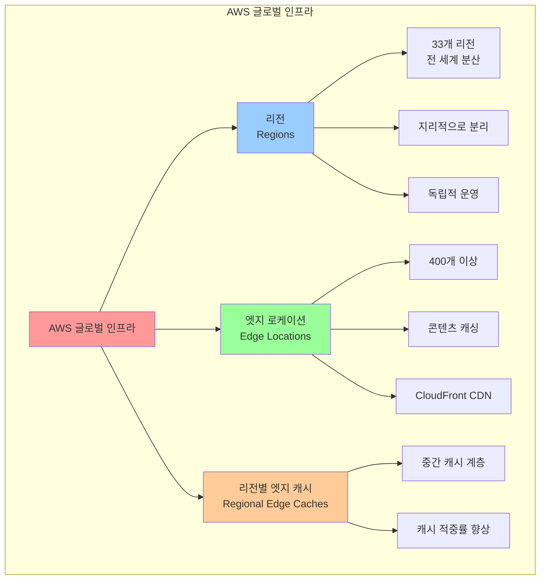
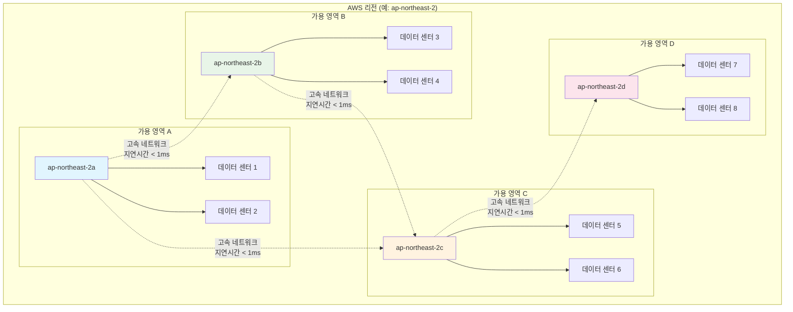
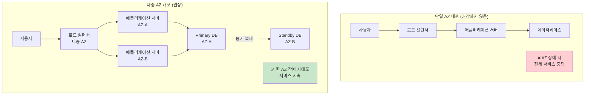
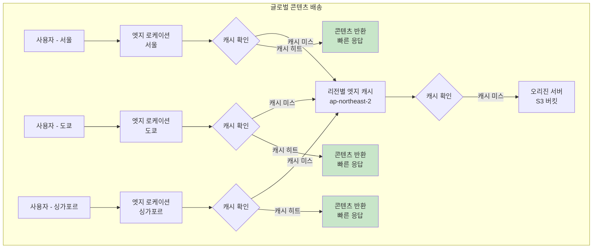
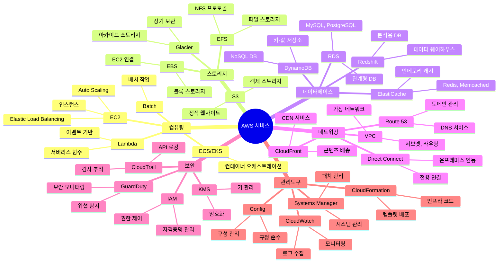
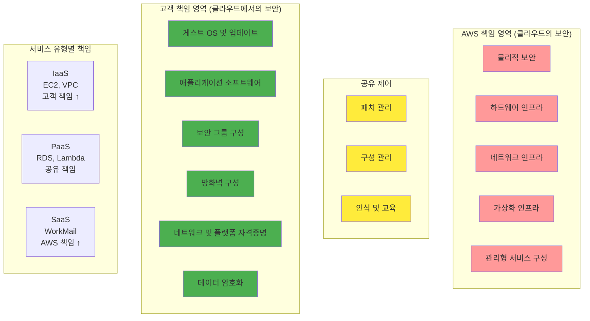
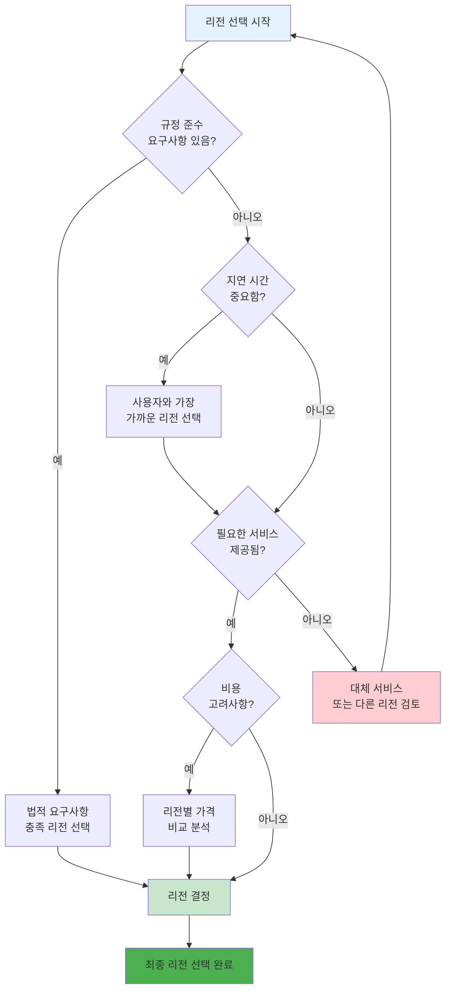

# AWS 글로벌 인프라 시각화 자료

## 1. AWS 글로벌 인프라 개요

## 2. 리전과 가용 영역 구조

## 3. 고가용성 아키텍처 설계

## 4. 엣지 로케이션과 CloudFront

## 5. AWS 서비스 카테고리 맵

## 6. AWS 공동 책임 모델

## 7. 리전 선택 기준

## 8. AWS Well-Architected Framework 5 Pillars

```mermaid
graph LR
    subgraph "AWS Well-Architected Framework"
        PILLAR1[운영 우수성<br/>Operational Excellence]
        PILLAR2[보안<br/>Security]
        PILLAR3[안정성<br/>Reliability]
        PILLAR4[성능 효율성<br/>Performance Efficiency]
        PILLAR5[비용 최적화<br/>Cost Optimization]
        
        PILLAR1 --> P1_1[시스템 운영 및 모니터링]
        PILLAR1 --> P1_2[지속적인 개선]
        PILLAR1 --> P1_3[자동화]
        
        PILLAR2 --> P2_1[정보 및 시스템 보호]
        PILLAR2 --> P2_2[위험 평가 및 완화]
        PILLAR2 --> P2_3[다층 보안]
        
        PILLAR3 --> P3_1[장애 복구 능력]
        PILLAR3 --> P3_2[동적 수요 충족]
        PILLAR3 --> P3_3[자동 복구]
        
        PILLAR4 --> P4_1[효율적 리소스 사용]
        PILLAR4 --> P4_2[기술 발전 활용]
        PILLAR4 --> P4_3[성능 모니터링]
        
        PILLAR5 --> P5_1[불필요한 비용 방지]
        PILLAR5 --> P5_2[최적 가격 달성]
        PILLAR5 --> P5_3[비용 투명성]
    end
    
    style PILLAR1 fill:#e3f2fd
    style PILLAR2 fill:#ffebee
    style PILLAR3 fill:#e8f5e8
    style PILLAR4 fill:#fff3e0
    style PILLAR5 fill:#f3e5f5
```

이러한 시각화 자료들은 AWS의 복잡한 개념들을 이해하기 쉽게 도식화한 것입니다. 각 다이어그램을 통해 AWS 글로벌 인프라의 구조와 서비스 관계를 명확히 파악할 수 있습니다.