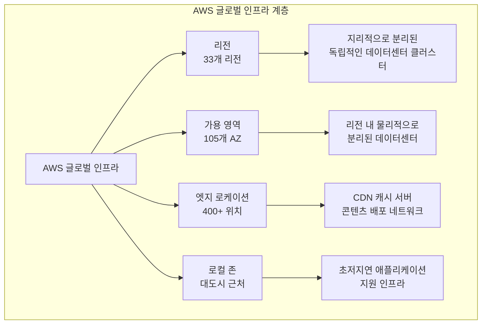
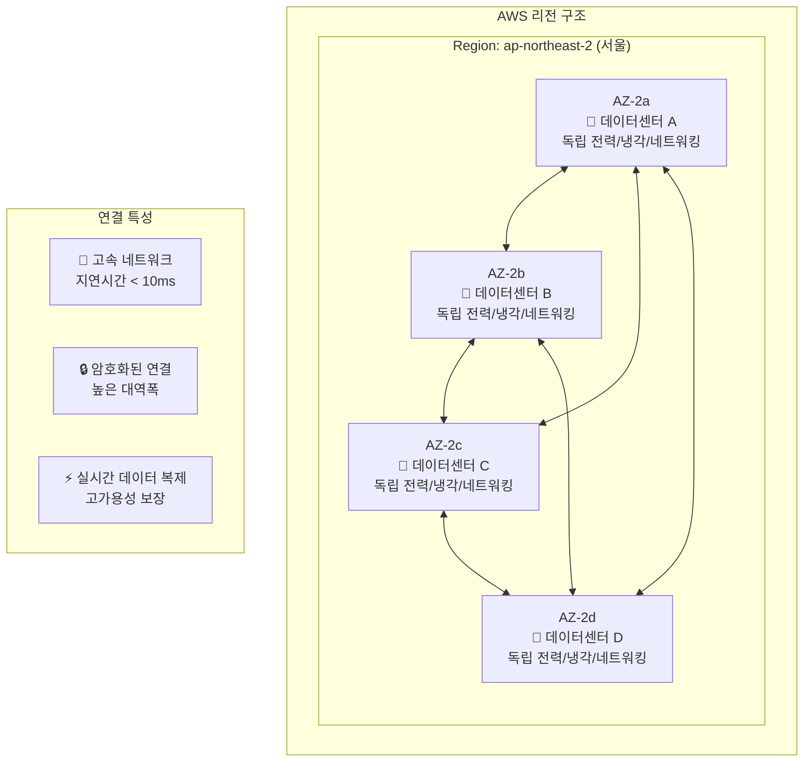
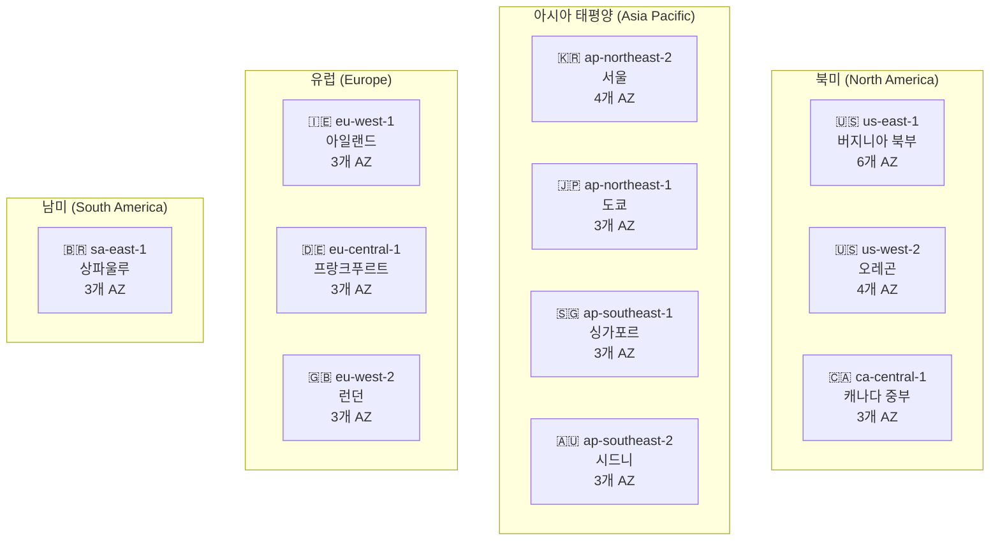
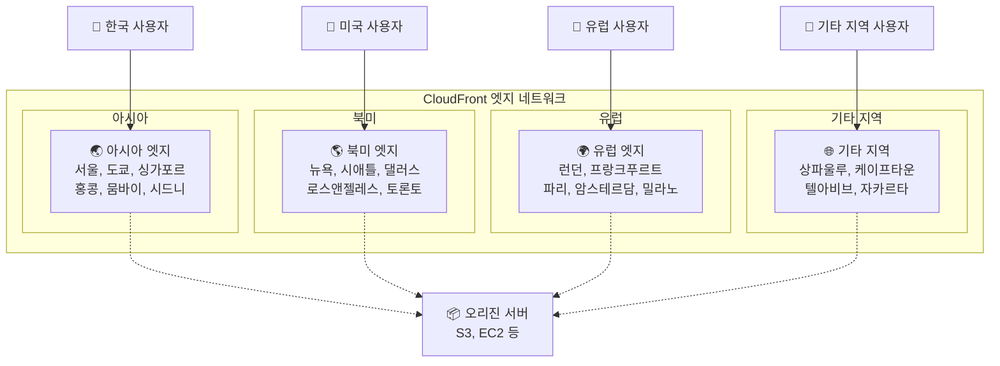
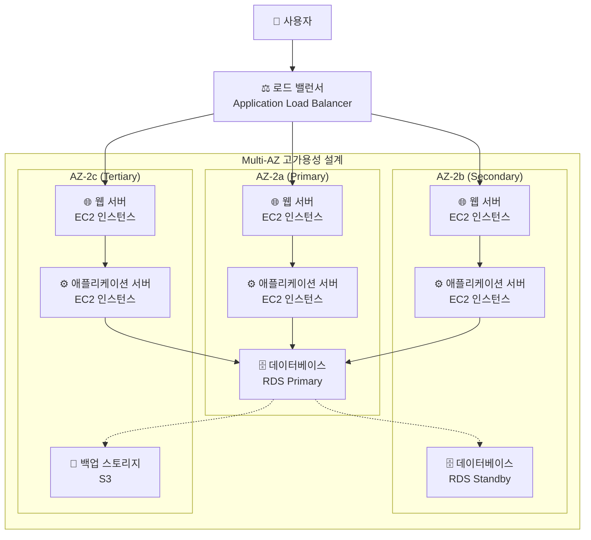
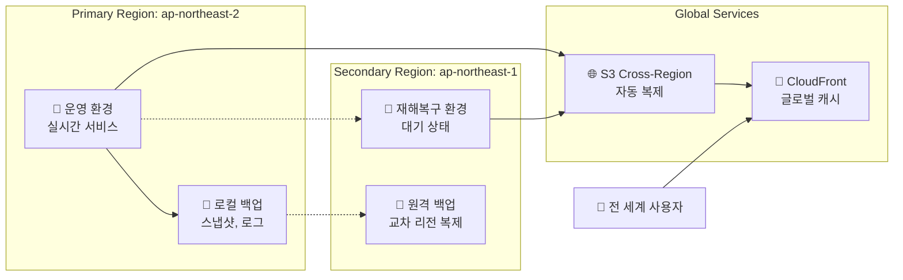
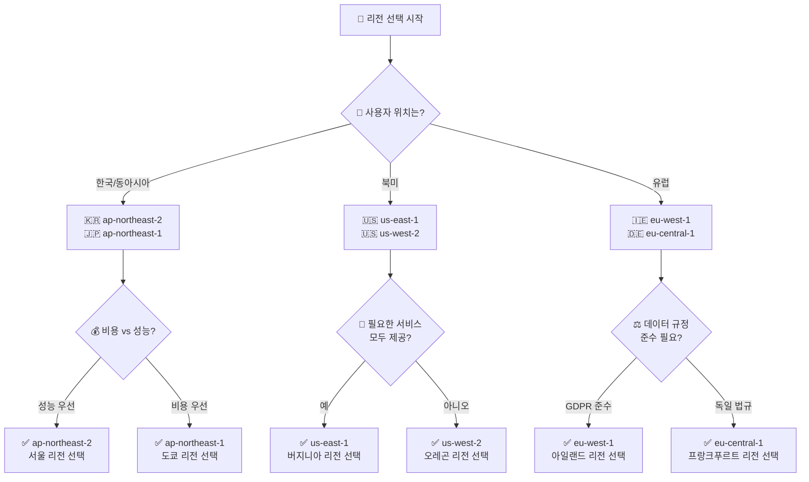
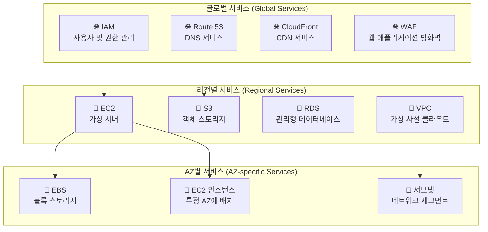
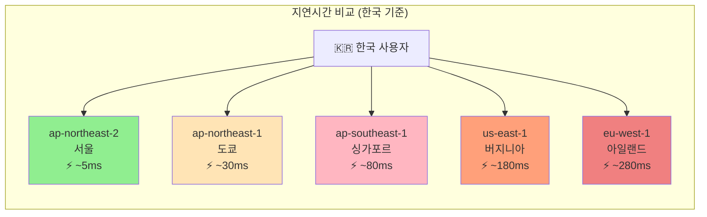
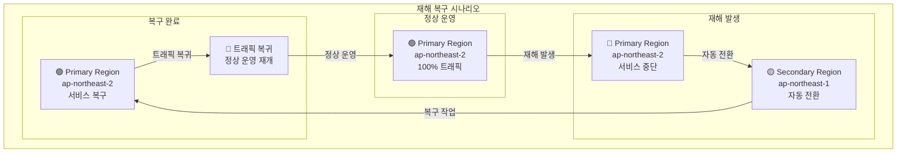

# AWS 글로벌 인프라 시각화 자료

## 1. AWS 글로벌 인프라 전체 구조

## 2. 리전과 가용 영역 관계

## 3. 전 세계 주요 리전 분포

## 4. 엣지 로케이션 네트워크

## 5. 고가용성 아키텍처 예시

## 6. 데이터 복제 및 백업 전략

## 7. 리전 선택 의사결정 트리

## 8. AWS 서비스별 글로벌 vs 리전별 분류

## 9. 네트워크 지연시간 비교

## 10. 재해 복구 전략 시각화

---

**참고사항**: 이 시각화 자료들은 AWS 글로벌 인프라의 핵심 개념을 이해하기 위한 교육용 다이어그램입니다. 실제 AWS 인프라는 더욱 복잡하고 정교한 구조를 가지고 있습니다.