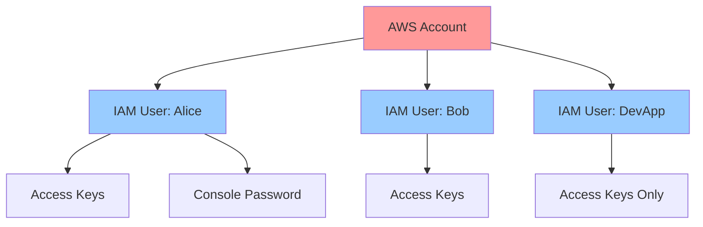
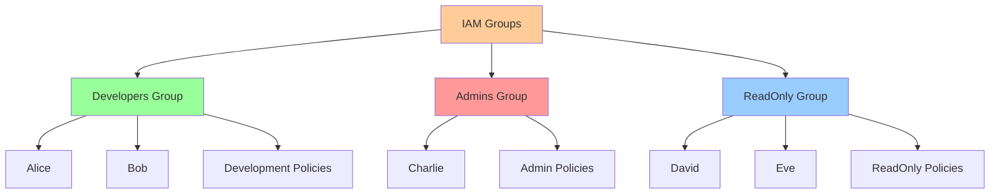
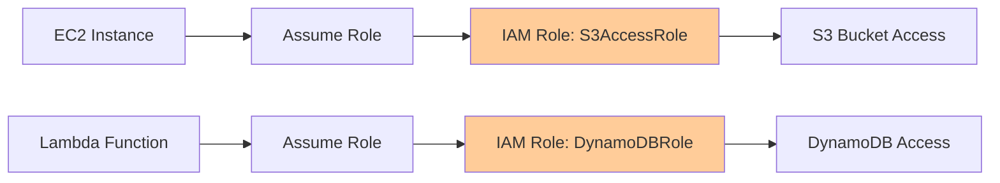
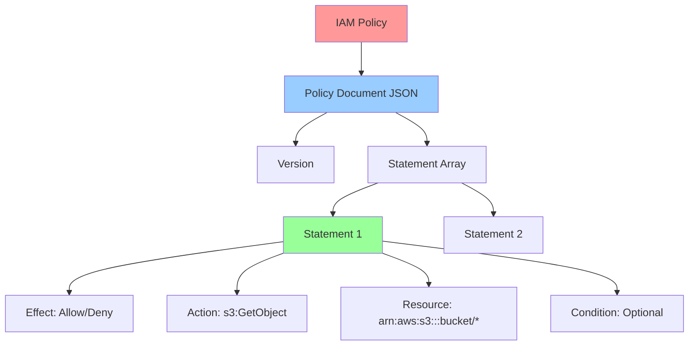
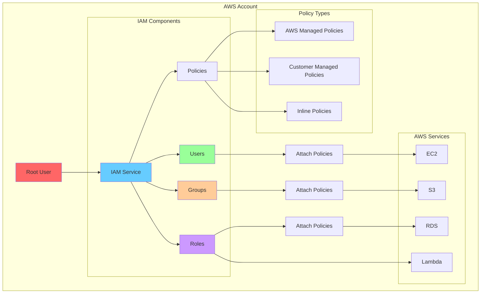
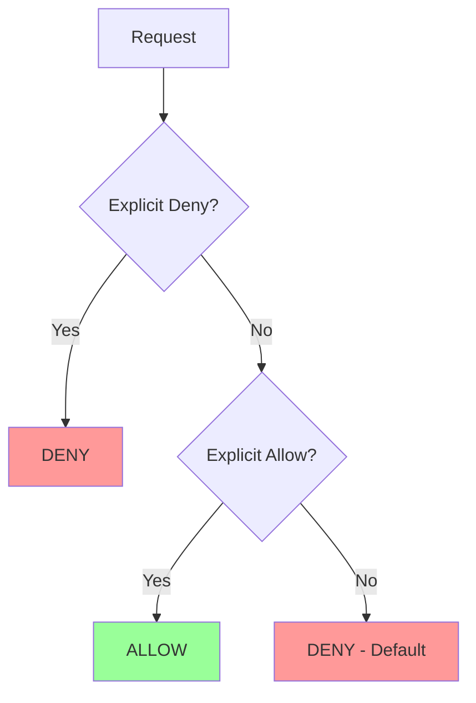
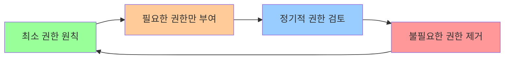
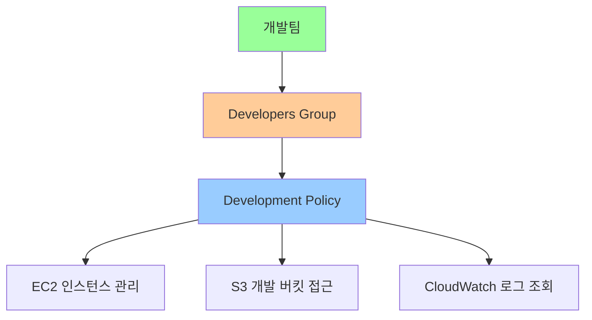
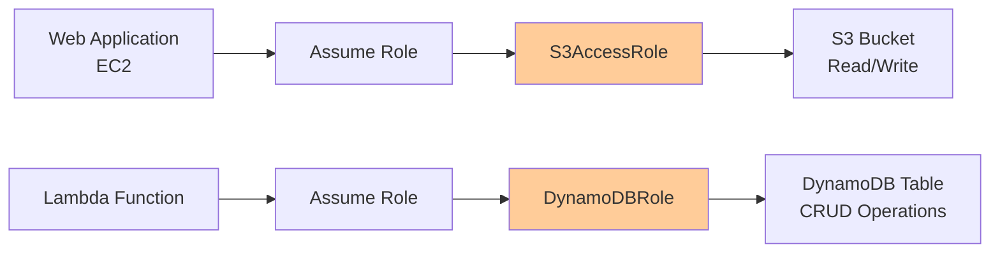

# Day 2: AWS IAM (Identity and Access Management)

## 학습 목표
- AWS IAM의 핵심 개념과 구성 요소 이해
- 사용자, 그룹, 역할, 정책의 차이점과 사용법 학습
- IAM 보안 모범 사례 적용
- AWS 계정 보안 강화 방법 습득

## 1. IAM이란?

AWS Identity and Access Management(IAM)는 AWS 리소스에 대한 액세스를 안전하게 제어할 수 있는 웹 서비스입니다. 쉽게 말해, "누가 무엇을 할 수 있는지"를 관리하는 시스템이라고 생각하면 됩니다.

### IAM의 핵심 기능
- **인증(Authentication)**: 사용자가 누구인지 확인
- **권한 부여(Authorization)**: 인증된 사용자가 무엇을 할 수 있는지 결정
- **중앙 집중식 관리**: 모든 AWS 서비스에 대한 액세스를 한 곳에서 관리

## 2. IAM 핵심 구성 요소

### 2.1 사용자(Users)
개별 사람이나 애플리케이션을 나타내는 엔티티입니다.



**사용자 특징:**
- 고유한 이름과 ARN(Amazon Resource Name)을 가짐
- 영구적인 자격 증명(비밀번호, 액세스 키)을 가질 수 있음
- 직접 정책을 연결하거나 그룹을 통해 권한을 부여받음

### 2.2 그룹(Groups)
사용자들의 집합으로, 권한 관리를 단순화합니다.



**그룹의 장점:**
- 여러 사용자에게 동일한 권한을 쉽게 부여
- 권한 변경 시 그룹 정책만 수정하면 됨
- 조직 구조를 반영한 권한 관리 가능

### 2.3 역할(Roles)
임시로 권한을 부여받을 수 있는 엔티티입니다.



**역할의 특징:**
- 영구적인 자격 증명이 없음
- 임시 보안 자격 증명을 제공
- AWS 서비스, 다른 AWS 계정, 외부 사용자가 사용 가능

### 2.4 정책(Policies)
권한을 정의하는 JSON 문서입니다.



**정책 예시:**
```json
{
  "Version": "2012-10-17",
  "Statement": [
    {
      "Effect": "Allow",
      "Action": [
        "s3:GetObject",
        "s3:PutObject"
      ],
      "Resource": "arn:aws:s3:::my-bucket/*"
    }
  ]
}
```

## 3. IAM 아키텍처 전체 구조



## 4. IAM 정책 평가 로직

AWS는 다음과 같은 순서로 정책을 평가합니다:



**평가 원칙:**
1. **기본적으로 거부**: 명시적 허용이 없으면 거부
2. **명시적 거부가 우선**: Deny가 있으면 무조건 거부
3. **최소 권한 원칙**: 필요한 최소한의 권한만 부여

## 5. IAM 보안 모범 사례

### 5.1 Root 계정 보안
- Root 계정은 초기 설정 후 사용 금지
- MFA(Multi-Factor Authentication) 활성화
- 강력한 비밀번호 설정

### 5.2 사용자 관리
- 개별 사용자 계정 생성 (공유 계정 금지)
- 정기적인 액세스 키 로테이션
- 불필요한 권한 제거

### 5.3 권한 관리


### 5.4 모니터링 및 감사
- CloudTrail을 통한 API 호출 로깅
- IAM Access Analyzer 사용
- 정기적인 권한 검토

## 6. 실제 사용 시나리오

### 시나리오 1: 개발팀 권한 설정


### 시나리오 2: 애플리케이션 서비스 간 통신


## 7. IAM 비용 및 제한사항

### 비용
- IAM 서비스 자체는 **무료**
- 추가 보안 기능(예: AWS SSO)은 별도 요금

### 제한사항
- 계정당 최대 5,000명의 IAM 사용자
- 사용자당 최대 10개의 관리형 정책 연결
- 정책 문서 최대 크기: 6,144자

## 8. 다음 단계 준비

내일은 EC2(Elastic Compute Cloud)에 대해 학습합니다. IAM에서 배운 역할(Role) 개념이 EC2 인스턴스에 권한을 부여하는 데 어떻게 사용되는지 확인해보세요.

### 예습 키워드
- EC2 인스턴스
- 인스턴스 프로파일
- 보안 그룹
- 키 페어

---

**💡 핵심 포인트**
- IAM은 AWS 보안의 핵심이며, 모든 AWS 서비스와 연동됩니다
- 최소 권한 원칙을 항상 기억하세요
- 역할(Role)은 AWS 서비스 간 안전한 통신의 핵심입니다
- 정기적인 권한 검토와 모니터링이 중요합니다