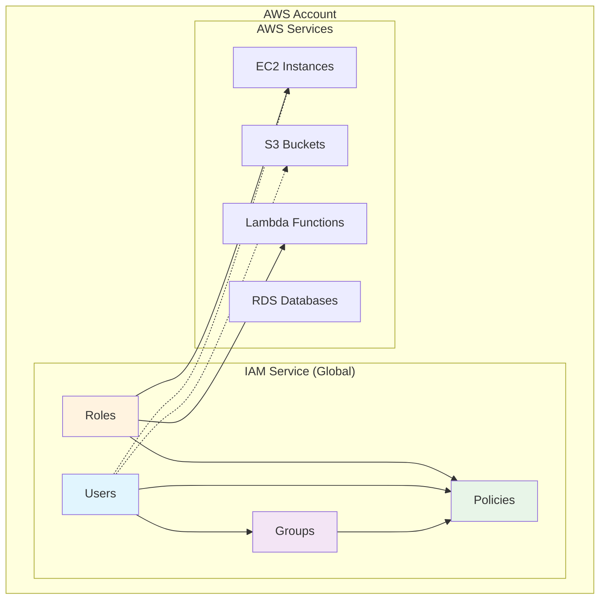
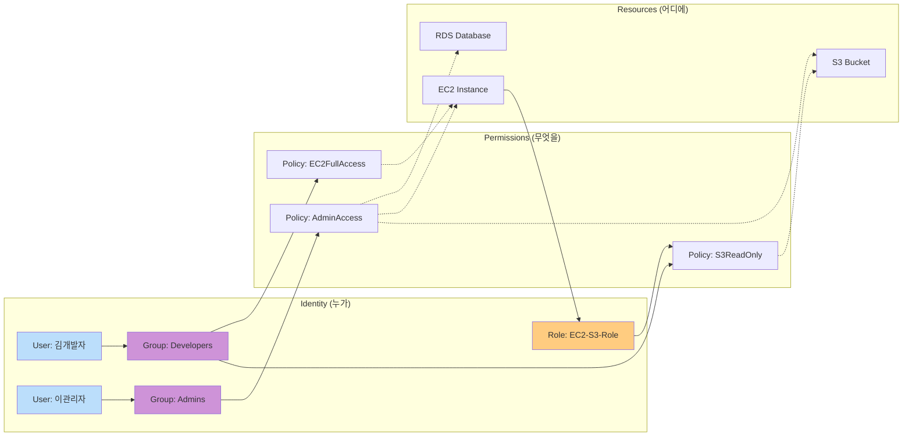
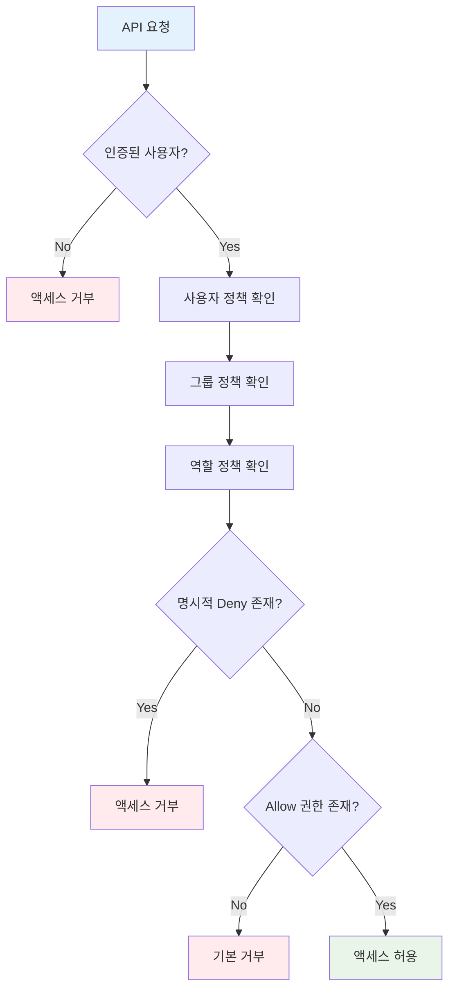
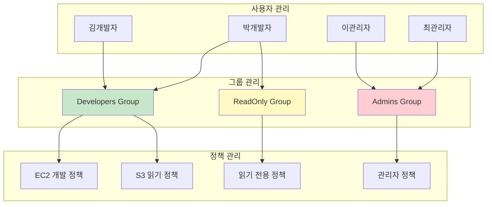
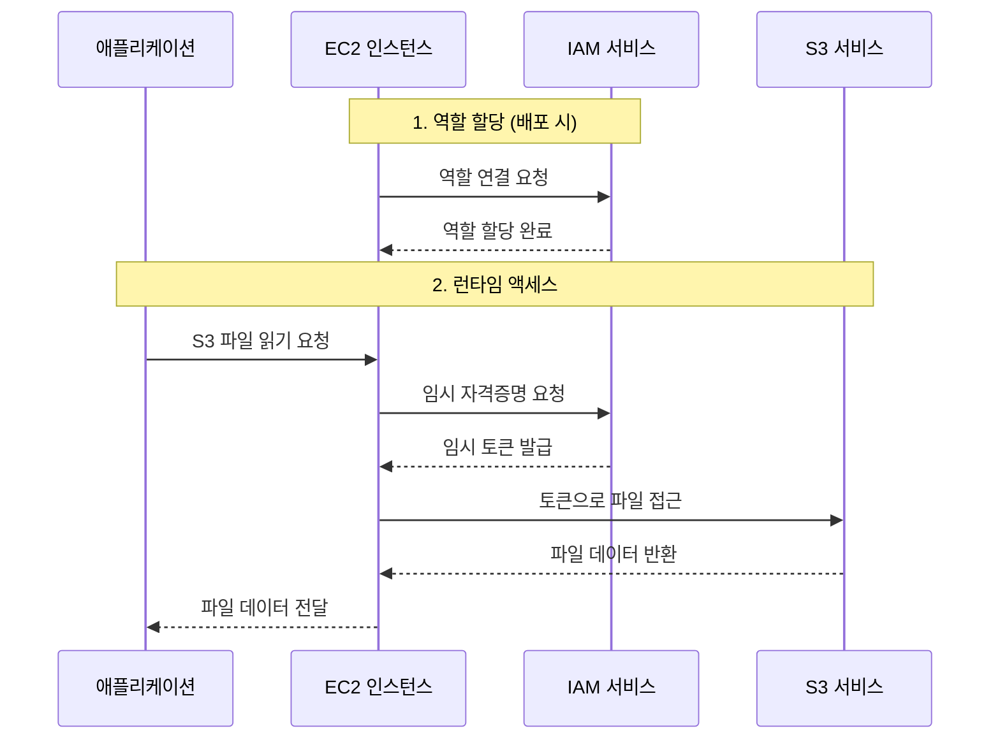
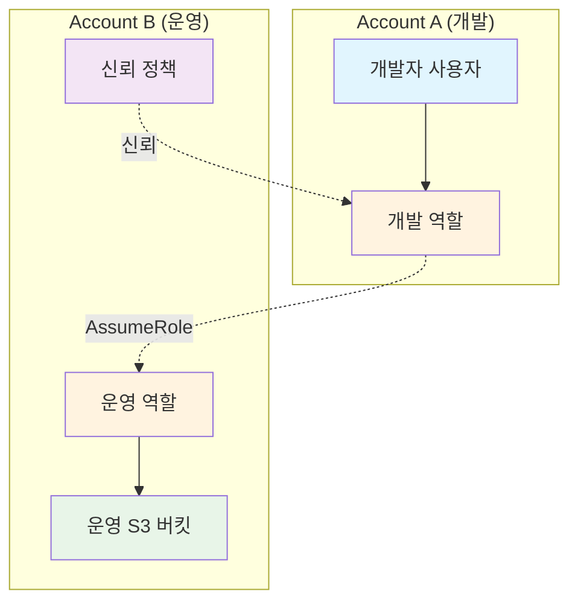
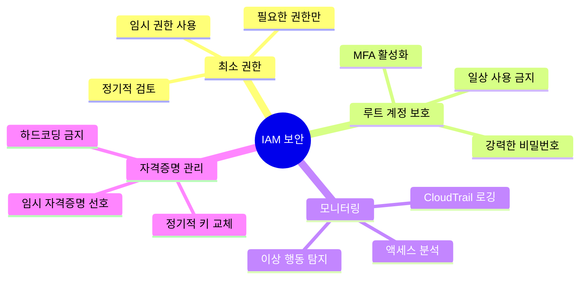
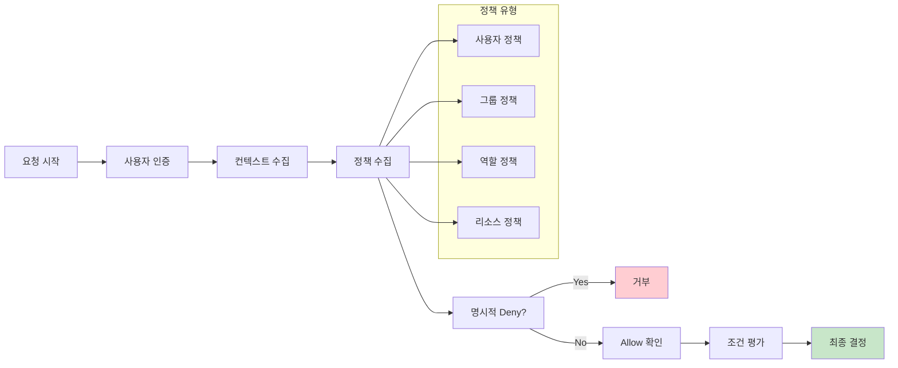
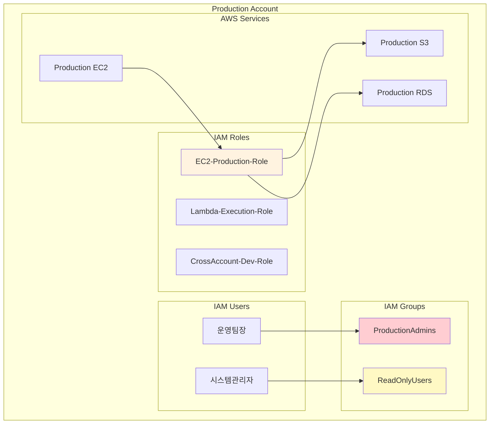

# IAM 아키텍처 시각화 자료

## 1. IAM 전체 구조 개요

## 2. IAM 구성 요소 관계도

## 3. IAM 정책 작동 방식

## 4. 사용자-그룹-정책 관계

## 5. IAM 역할 사용 시나리오

## 6. 교차 계정 액세스 패턴

## 7. IAM 보안 모범 사례 다이어그램

## 8. IAM 정책 평가 흐름

## 9. 실제 환경 IAM 구조 예시

이러한 시각화 자료들은 IAM의 복잡한 개념들을 이해하기 쉽게 도와줍니다. 각 다이어그램은 특정 측면에 초점을 맞춰 IAM의 전체적인 작동 방식을 보여줍니다.