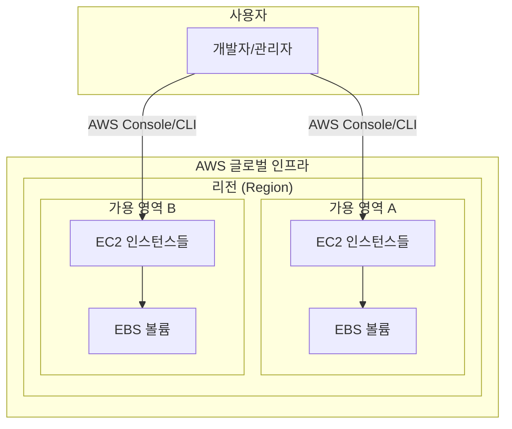
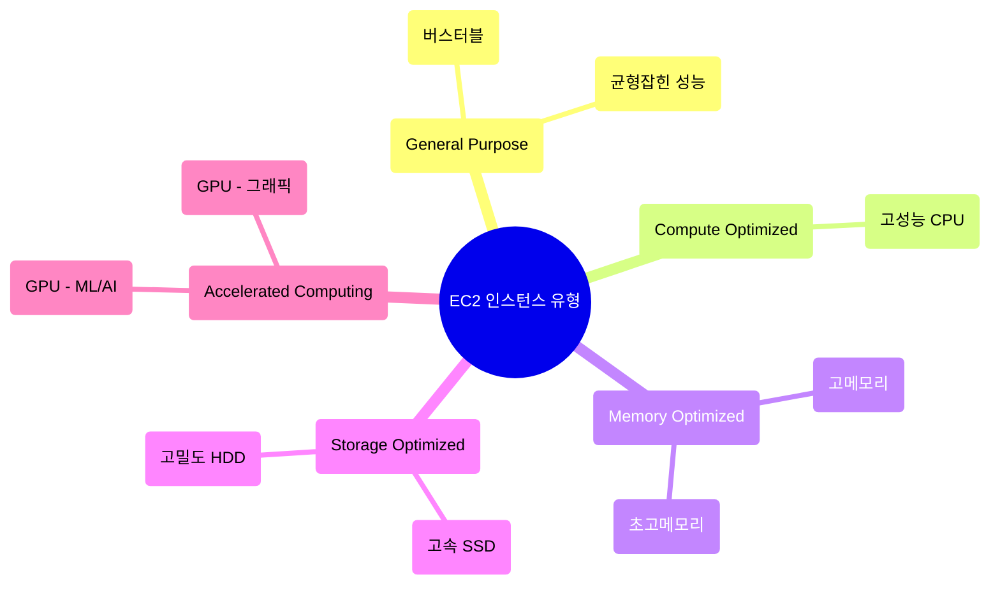
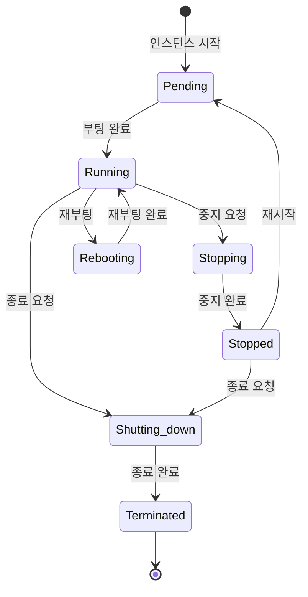
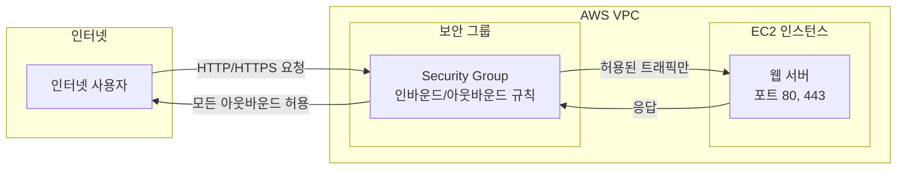
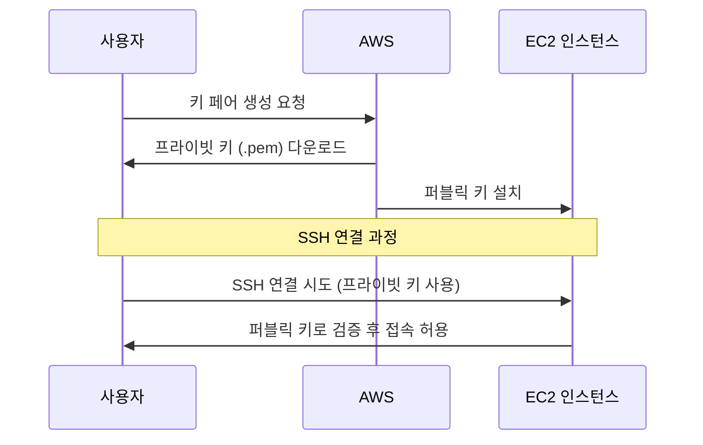
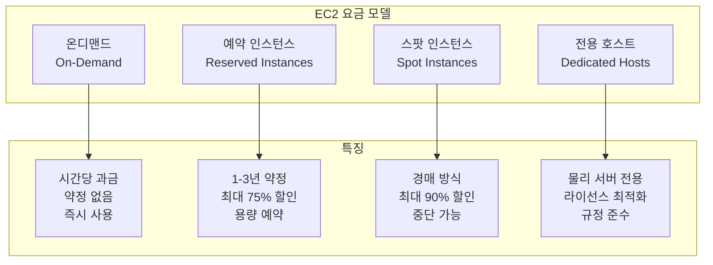
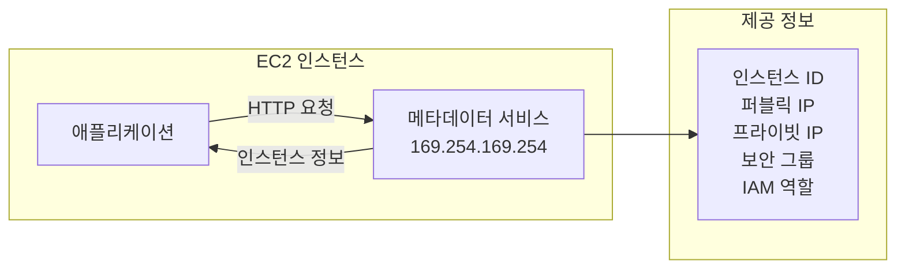

# Day 3: EC2 (Elastic Compute Cloud) 기초

## 학습 목표
- EC2의 기본 개념과 핵심 기능 이해
- EC2 인스턴스 유형과 선택 기준 파악
- EC2 생명주기와 상태 관리 이해
- 보안 그룹과 키 페어의 역할 이해
- EC2 요금 모델과 최적화 방법 학습

## 전제 조건
- AWS 계정 및 기본 콘솔 사용법 (Day 1)
- IAM 사용자 및 권한 관리 (Day 2)
- 기본적인 네트워킹 개념

---

## 1. EC2란 무엇인가?

Amazon Elastic Compute Cloud (EC2)는 AWS의 핵심 컴퓨팅 서비스입니다. 쉽게 말해, 클라우드에서 가상 서버를 빌려 사용하는 서비스라고 생각하면 됩니다.

### EC2의 핵심 개념

**가상화 기술**
- 물리적 서버 하나에서 여러 개의 가상 서버 운영
- 각 가상 서버는 독립적인 운영체제와 애플리케이션 실행
- 하드웨어 자원을 효율적으로 공유

**탄력성 (Elasticity)**
- 필요에 따라 컴퓨팅 용량을 늘리거나 줄일 수 있음
- 트래픽 증가 시 인스턴스 추가, 감소 시 제거
- 사용한 만큼만 비용 지불

### EC2 아키텍처 개요



---

## 2. EC2 인스턴스 유형

EC2는 다양한 워크로드에 최적화된 여러 인스턴스 유형을 제공합니다. 각 유형은 특정 용도에 맞게 CPU, 메모리, 스토리지, 네트워크 성능이 조정되어 있습니다.

### 주요 인스턴스 패밀리



### 인스턴스 명명 규칙

EC2 인스턴스 이름은 일정한 패턴을 따릅니다:

**예시: m5.large**
- **m**: 인스턴스 패밀리 (범용)
- **5**: 세대 (5세대)
- **large**: 크기 (CPU, 메모리 용량)

### 주요 인스턴스 유형 상세

**1. T3/T4g (버스터블 성능)**
- **용도**: 웹 서버, 소규모 데이터베이스, 개발 환경
- **특징**: 기본 성능 + 필요시 CPU 버스트
- **장점**: 비용 효율적, 가변적 워크로드에 적합
- **주의사항**: CPU 크레딧 소진 시 성능 저하

**2. M5/M6i (범용)**
- **용도**: 웹 애플리케이션, 마이크로서비스, 엔터프라이즈 앱
- **특징**: CPU, 메모리, 네트워크의 균형잡힌 성능
- **장점**: 대부분의 워크로드에 적합

**3. C5/C6i (컴퓨팅 최적화)**
- **용도**: 고성능 웹 서버, 과학 계산, 게임 서버
- **특징**: 고성능 프로세서, 높은 CPU 대 메모리 비율
- **장점**: CPU 집약적 작업에 최적화

**4. R5/R6i (메모리 최적화)**
- **용도**: 인메모리 데이터베이스, 빅데이터 분석
- **특징**: 높은 메모리 대 CPU 비율
- **장점**: 메모리 집약적 애플리케이션에 최적

---

## 3. EC2 인스턴스 생명주기

EC2 인스턴스는 생성부터 종료까지 여러 상태를 거칩니다.

### 인스턴스 상태 다이어그램



### 각 상태별 특징

**Pending (대기 중)**
- 인스턴스가 시작되는 중
- 하드웨어 할당 및 부팅 과정
- 요금 부과 시작

**Running (실행 중)**
- 정상 작동 상태
- SSH/RDP 연결 가능
- 애플리케이션 실행 가능

**Stopping (중지 중)**
- 인스턴스 중지 과정
- 데이터 저장 및 정리 작업

**Stopped (중지됨)**
- 인스턴스 완전 중지
- EBS 볼륨은 유지됨
- 컴퓨팅 요금 부과 중단 (스토리지 요금은 계속)

**Terminated (종료됨)**
- 인스턴스 완전 삭제
- 인스턴스 스토어 데이터 영구 손실
- EBS 루트 볼륨도 삭제 (설정에 따라)

---

## 4. 보안 그룹 (Security Groups)

보안 그룹은 EC2 인스턴스의 가상 방화벽 역할을 합니다.

### 보안 그룹 작동 원리



### 보안 그룹 규칙 구성

**인바운드 규칙 (Inbound Rules)**
- 외부에서 인스턴스로 들어오는 트래픽 제어
- 기본적으로 모든 인바운드 트래픽 차단
- 필요한 포트와 소스만 명시적으로 허용

**아웃바운드 규칙 (Outbound Rules)**
- 인스턴스에서 외부로 나가는 트래픽 제어
- 기본적으로 모든 아웃바운드 트래픽 허용

### 일반적인 보안 그룹 설정

| 서비스 | 포트 | 프로토콜 | 소스 |
|--------|------|----------|------|
| SSH | 22 | TCP | 내 IP |
| HTTP | 80 | TCP | 0.0.0.0/0 |
| HTTPS | 443 | TCP | 0.0.0.0/0 |
| RDP | 3389 | TCP | 내 IP |
| MySQL | 3306 | TCP | 웹 서버 보안 그룹 |

---

## 5. 키 페어 (Key Pairs)

키 페어는 EC2 인스턴스에 안전하게 접속하기 위한 암호화 키입니다.

### 키 페어 작동 원리



### 키 페어 보안 모범 사례

**프라이빗 키 관리**
- 안전한 위치에 저장 (예: ~/.ssh/)
- 적절한 권한 설정 (chmod 400)
- 절대 공유하지 않기
- 정기적인 키 교체

**Linux 인스턴스 접속**
```bash
# 키 파일 권한 설정
chmod 400 my-key-pair.pem

# SSH 접속
ssh -i my-key-pair.pem ec2-user@public-ip-address
```

**Windows 인스턴스 접속**
- RDP 연결 시 키 페어로 관리자 비밀번호 복호화
- 복호화된 비밀번호로 RDP 접속

---

## 6. EC2 요금 모델

EC2는 다양한 요금 모델을 제공하여 비용 최적화를 지원합니다.

### 요금 모델 비교



### 각 요금 모델 상세

**1. 온디맨드 (On-Demand)**
- **특징**: 사용한 시간만큼 지불, 약정 없음
- **장점**: 유연성, 예측 가능한 비용
- **단점**: 가장 비싼 요금
- **적합한 경우**: 개발/테스트, 예측 불가능한 워크로드

**2. 예약 인스턴스 (Reserved Instances)**
- **특징**: 1년 또는 3년 약정으로 할인
- **할인율**: 1년 약정 최대 40%, 3년 약정 최대 60%
- **유형**: 
  - Standard RI: 최대 할인, 변경 제한
  - Convertible RI: 유연성, 할인율 낮음
- **적합한 경우**: 안정적인 워크로드, 장기 운영

**3. 스팟 인스턴스 (Spot Instances)**
- **특징**: AWS 여유 용량을 경매 방식으로 제공
- **할인율**: 온디맨드 대비 최대 90% 할인
- **위험**: 용량 부족 시 2분 전 통지 후 중단
- **적합한 경우**: 배치 작업, 내결함성 애플리케이션

**4. 전용 호스트 (Dedicated Hosts)**
- **특징**: 물리 서버를 독점 사용
- **장점**: 라이선스 최적화, 규정 준수
- **단점**: 높은 비용
- **적합한 경우**: 라이선스 제약, 보안 요구사항

---

## 7. EC2 모니터링과 관리

### CloudWatch 메트릭

EC2 인스턴스는 기본적으로 다음 메트릭을 제공합니다:

**기본 메트릭 (5분 간격)**
- CPU 사용률
- 네트워크 입출력
- 디스크 읽기/쓰기 (인스턴스 스토어만)

**상세 모니터링 (1분 간격)**
- 추가 비용 발생
- 더 세밀한 모니터링 가능
- Auto Scaling에 유용

### 인스턴스 메타데이터



**메타데이터 활용 예시**
```bash
# 인스턴스 ID 조회
curl http://169.254.169.254/latest/meta-data/instance-id

# 퍼블릭 IP 조회
curl http://169.254.169.254/latest/meta-data/public-ipv4

# IAM 역할 자격 증명 조회
curl http://169.254.169.254/latest/meta-data/iam/security-credentials/role-name
```

---

## 8. EC2 모범 사례

### 보안 모범 사례

**1. 최소 권한 원칙**
- 필요한 포트만 보안 그룹에서 허용
- SSH/RDP 접근을 특정 IP로 제한
- IAM 역할을 통한 권한 관리

**2. 정기적인 업데이트**
- 운영체제 보안 패치 적용
- 애플리케이션 업데이트
- AMI 정기적 갱신

**3. 백업 및 스냅샷**
- EBS 볼륨 정기 스냅샷
- AMI 생성을 통한 전체 백업
- 자동화된 백업 스케줄

### 성능 최적화

**1. 적절한 인스턴스 유형 선택**
- 워크로드 특성 분석
- 성능 모니터링을 통한 최적화
- 필요시 인스턴스 유형 변경

**2. 배치 그룹 (Placement Groups)**
- 클러스터: 고성능 컴퓨팅을 위한 저지연
- 파티션: 대규모 분산 워크로드
- 스프레드: 고가용성을 위한 분산 배치

**3. 네트워크 최적화**
- Enhanced Networking 활성화
- SR-IOV 지원 인스턴스 사용
- 적절한 인스턴스 크기 선택

### 비용 최적화

**1. 인스턴스 크기 최적화**
- CloudWatch 메트릭 분석
- 과소/과대 프로비저닝 방지
- 정기적인 사용률 검토

**2. 스케줄링 활용**
- 개발/테스트 환경 자동 중지
- 업무 시간 외 인스턴스 중지
- Lambda를 통한 자동화

**3. 예약 인스턴스 활용**
- 안정적인 워크로드 식별
- 적절한 예약 기간 선택
- 예약 인스턴스 마켓플레이스 활용

---

## 9. 실습 준비

내일 실습에서는 다음 내용을 다룰 예정입니다:

### 실습 목표
1. **EC2 인스턴스 생성**: 웹 서버용 인스턴스 생성
2. **보안 그룹 설정**: HTTP, SSH 접근 허용
3. **키 페어 생성**: 안전한 SSH 접근 설정
4. **인스턴스 연결**: SSH를 통한 서버 접속
5. **웹 서버 설치**: Apache 웹 서버 설치 및 설정
6. **모니터링 확인**: CloudWatch 메트릭 확인

### 필요한 사전 지식
- Linux 기본 명령어 (ls, cd, sudo, yum/apt)
- SSH 클라이언트 사용법
- 기본적인 웹 서버 개념

### 예상 비용
- t3.micro 인스턴스 1시간: 약 $0.0104
- EBS 볼륨 8GB: 약 $0.80/월
- 데이터 전송: 1GB까지 무료

---

## 학습 정리

### 핵심 개념 요약

1. **EC2는 AWS의 핵심 컴퓨팅 서비스**로 가상 서버를 제공
2. **다양한 인스턴스 유형**이 있어 워크로드에 맞게 선택 가능
3. **보안 그룹**은 가상 방화벽 역할로 트래픽 제어
4. **키 페어**를 통해 안전한 인스턴스 접속 가능
5. **여러 요금 모델**로 비용 최적화 가능

### 다음 학습 내용 (Day 4)
- EBS (Elastic Block Store) 상세
- 인스턴스 스토어 vs EBS
- 스냅샷과 AMI
- EC2 고급 기능 (배치 그룹, Enhanced Networking)

### 추가 학습 자료
- [AWS EC2 사용자 가이드](https://docs.aws.amazon.com/ec2/)
- [EC2 인스턴스 유형](https://aws.amazon.com/ec2/instance-types/)
- [EC2 요금](https://aws.amazon.com/ec2/pricing/)
- [보안 그룹 모범 사례](https://docs.aws.amazon.com/vpc/latest/userguide/VPC_SecurityGroups.html)

---

**예상 학습 시간**: 2-3시간  
**난이도**: 중급  
**실습 시간**: 1-2시간