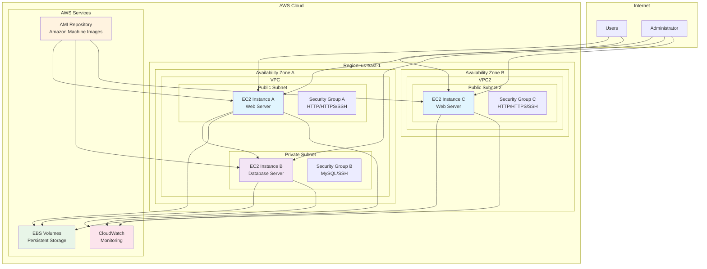
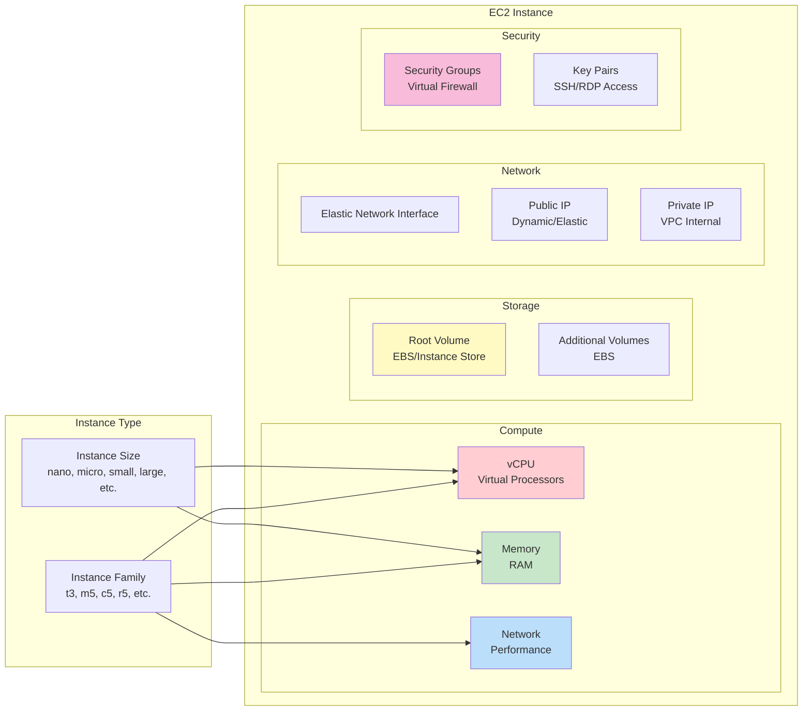
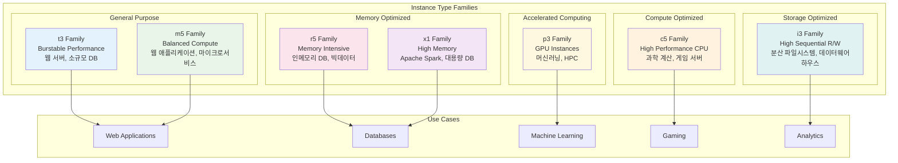
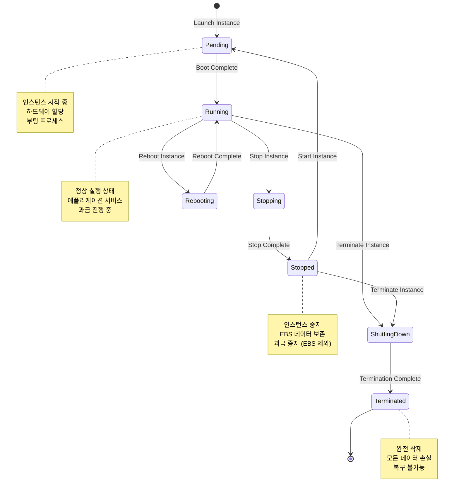
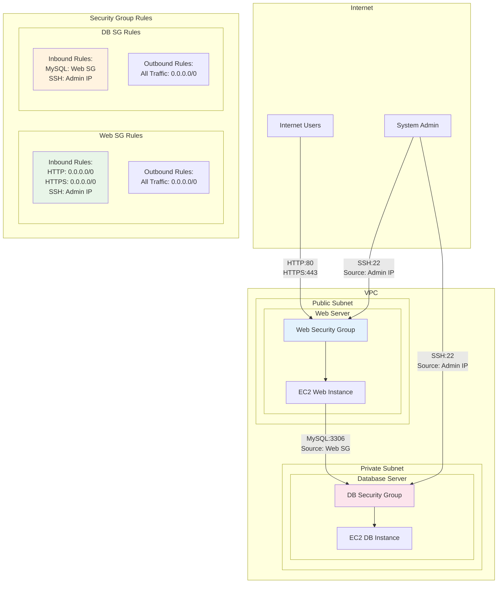
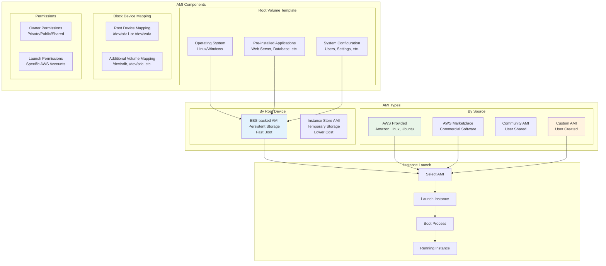
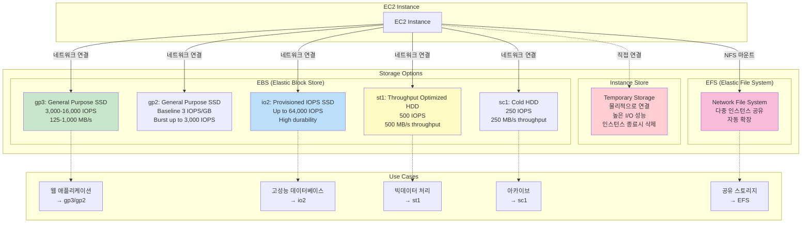
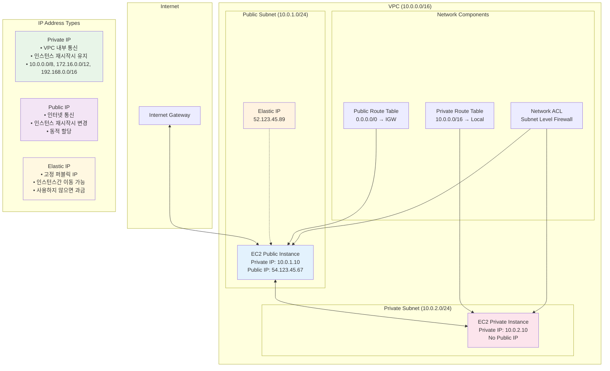
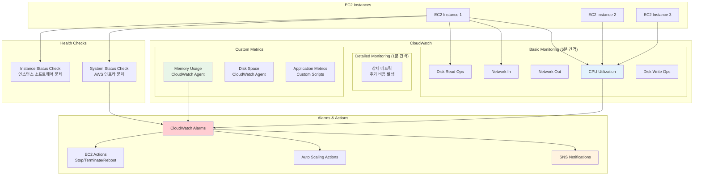
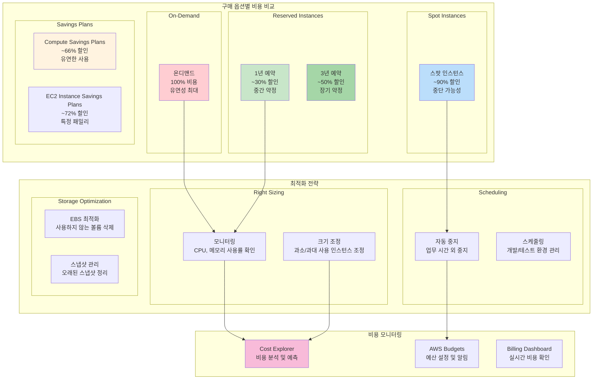

# EC2 아키텍처 시각화 자료

## 1. EC2 전체 아키텍처 개요

## 2. EC2 인스턴스 구성 요소

## 3. 인스턴스 타입 패밀리 비교

## 4. EC2 인스턴스 생명주기

## 5. 보안 그룹 아키텍처

## 6. AMI (Amazon Machine Image) 구조

## 7. EC2 스토리지 옵션

## 8. EC2 네트워킹 개념

## 9. EC2 모니터링 아키텍처

## 10. EC2 비용 최적화 전략

---

이러한 시각화 자료들은 EC2의 복잡한 개념들을 이해하기 쉽게 도와줍니다. 각 다이어그램을 참고하여 EC2 아키텍처의 전체적인 구조와 세부 구성 요소들의 관계를 파악해보세요.