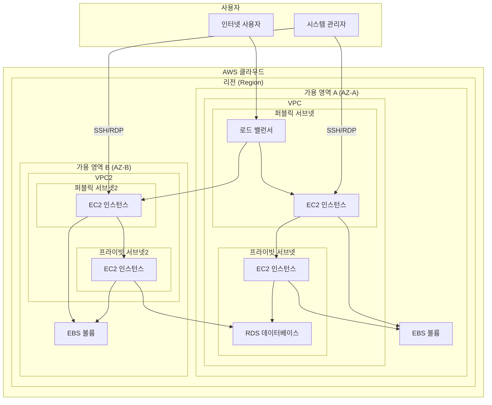
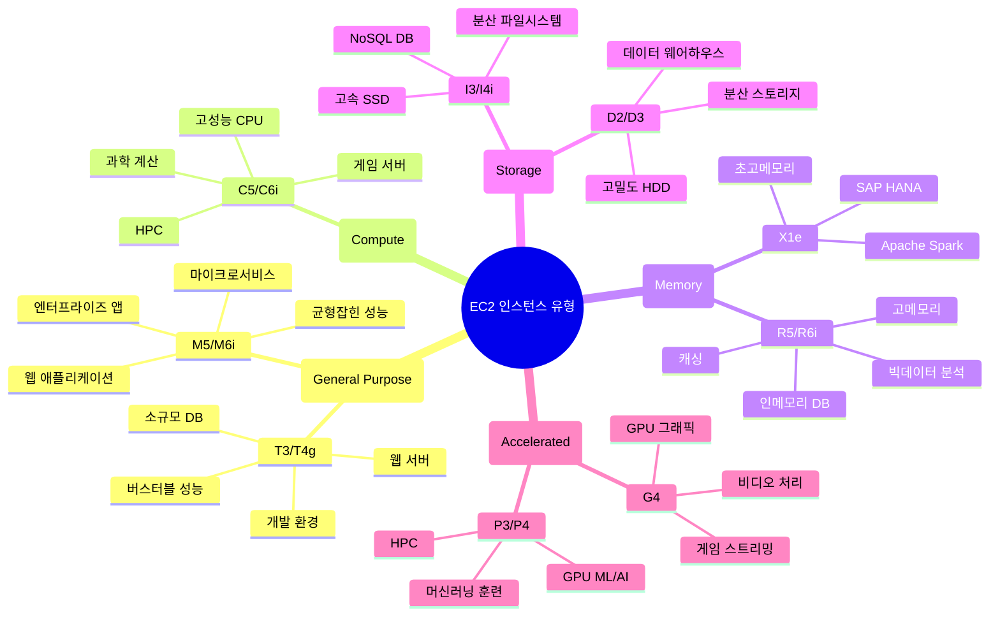
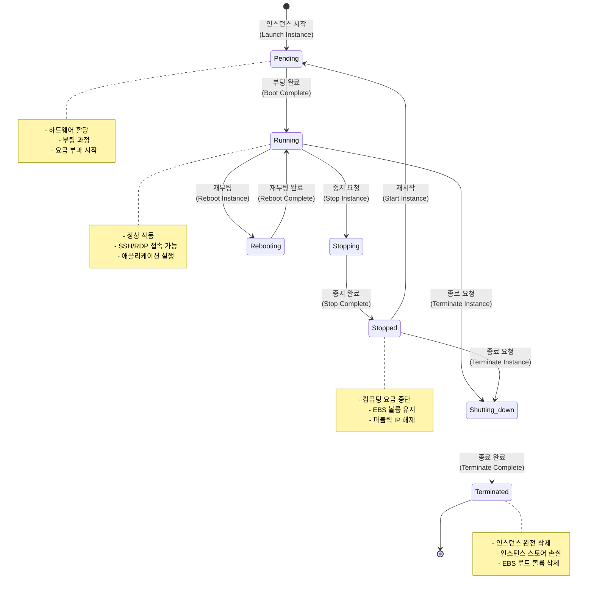
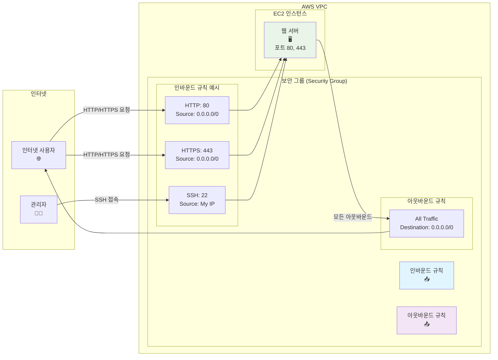
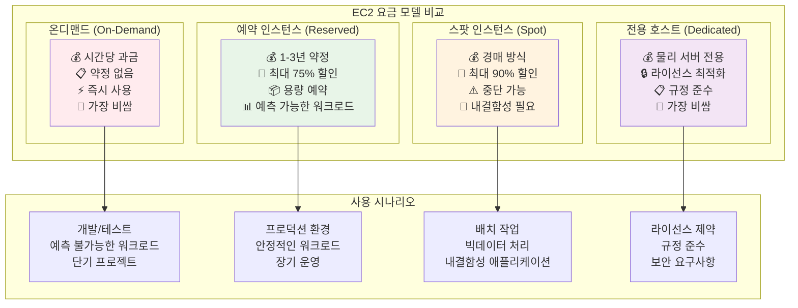
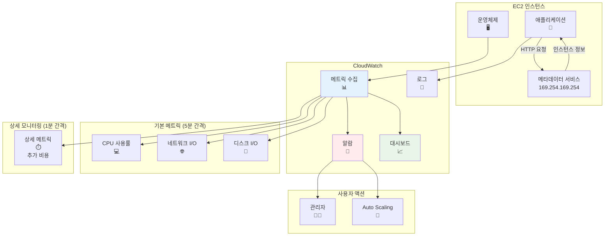
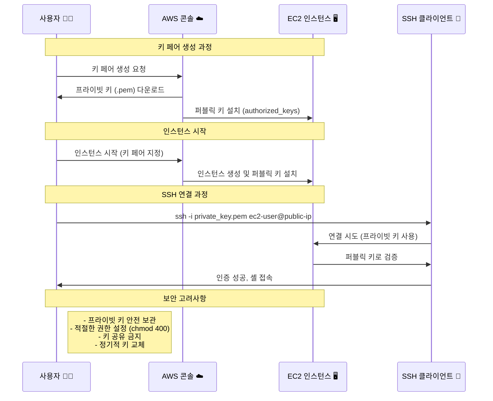
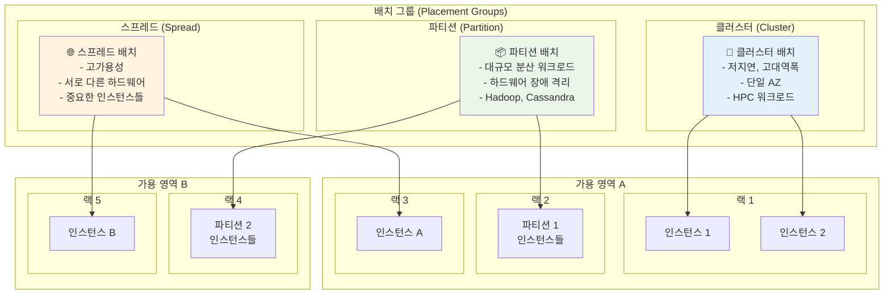

# EC2 아키텍처 시각화 자료

## EC2 서비스 아키텍처 다이어그램

### 1. EC2 전체 아키텍처 개요



### 2. EC2 인스턴스 유형별 특성



### 3. EC2 인스턴스 생명주기



### 4. 보안 그룹 작동 원리



### 5. EC2 요금 모델 비교



### 6. EC2 모니터링 아키텍처



### 7. 키 페어 인증 과정



### 8. EC2 배치 전략



### 9. EC2 네트워킹 개요

```mermaid
graph TB
    subgraph "인터넷"
        IGW[인터넷 게이트웨이<br/>🌐]
    end
    
    subgraph "VPC (Virtual Private Cloud)"
        subgraph "퍼블릭 서브넷"
            subgraph "EC2 인스턴스 (웹 서버)"
                PUB_EC2[퍼블릭 IP: 54.180.1.1<br/>프라이빗 IP: 10.0.1.10<br/>🖥️]
                SG_PUB[보안 그룹<br/>HTTP: 80 (0.0.0.0/0)<br/>SSH: 22 (My IP)]
            end
        end
        
        subgraph "프라이빗 서브넷"
            subgraph "EC2 인스턴스 (앱 서버)"
                PRIV_EC2[프라이빗 IP: 10.0.2.10<br/>🖥️]
                SG_PRIV[보안 그룹<br/>App: 8080 (웹 서버 SG)<br/>SSH: 22 (Bastion)]
            end
        end
        
        subgraph "라우팅 테이블"
            PUB_RT[퍼블릭 라우팅 테이블<br/>0.0.0.0/0 → IGW]
            PRIV_RT[프라이빗 라우팅 테이블<br/>0.0.0.0/0 → NAT Gateway]
        end
        
        NAT[NAT Gateway<br/>🔄]
    end
    
    IGW --> PUB_EC2
    PUB_EC2 --> PRIV_EC2
    PRIV_EC2 --> NAT
    NAT --> IGW
    
    PUB_RT --> PUB_EC2
    PRIV_RT --> PRIV_EC2
    
    style PUB_EC2 fill:#e8f5e8
    style PRIV_EC2 fill:#fff3e0
    style SG_PUB fill:#e3f2fd
    style SG_PRIV fill:#e3f2fd
```

### 10. EC2 스토리지 옵션

```mermaid
graph TB
    subgraph "EC2 스토리지 옵션"
        subgraph "EBS (Elastic Block Store)"
            EBS_GP3[gp3 (범용 SSD)<br/>💾 균형잡힌 성능<br/>💰 비용 효율적]
            EBS_IO2[io2 (프로비저닝된 IOPS)<br/>⚡ 고성능<br/>💸 높은 비용]
            EBS_ST1[st1 (처리량 최적화 HDD)<br/>📊 빅데이터<br/>💰 저비용]
            EBS_SC1[sc1 (콜드 HDD)<br/>❄️ 아카이브<br/>💰 최저비용]
        end
        
        subgraph "인스턴스 스토어"
            INSTANCE[인스턴스 스토어<br/>⚡ 최고 성능<br/>⚠️ 임시 스토리지<br/>💰 추가 비용 없음]
        end
        
        subgraph "EFS (Elastic File System)"
            EFS[EFS<br/>🌐 다중 인스턴스 공유<br/>📈 자동 확장<br/>💸 사용량 기반 과금]
        end
    end
    
    subgraph "EC2 인스턴스들"
        EC2_1[EC2 인스턴스 1<br/>🖥️]
        EC2_2[EC2 인스턴스 2<br/>🖥️]
        EC2_3[EC2 인스턴스 3<br/>🖥️]
    end
    
    EC2_1 --> EBS_GP3
    EC2_1 --> INSTANCE
    EC2_2 --> EBS_IO2
    EC2_3 --> EBS_ST1
    
    EC2_1 --> EFS
    EC2_2 --> EFS
    EC2_3 --> EFS
    
    style EBS_GP3 fill:#e8f5e8
    style EBS_IO2 fill:#ffebee
    style INSTANCE fill:#fff3e0
    style EFS fill:#e3f2fd
```

---

## 시각화 자료 활용 가이드

### 학습 순서
1. **전체 아키텍처** → EC2의 전체적인 위치와 역할 이해
2. **인스턴스 유형** → 워크로드별 최적 선택 기준 학습
3. **생명주기** → 인스턴스 상태 관리 방법 이해
4. **보안 그룹** → 네트워크 보안 설정 방법 학습
5. **요금 모델** → 비용 최적화 전략 수립

### 실습 연계
- 각 다이어그램을 참조하여 실습 과정 이해
- 문제 발생 시 해당 다이어그램으로 문제 지점 파악
- 아키텍처 설계 시 참조 자료로 활용

### 시험 준비
- 각 다이어그램의 구성 요소와 관계 암기
- 시나리오 문제 해결 시 시각적 사고 활용
- 아키텍처 설계 문제에서 다이어그램 그리기 연습