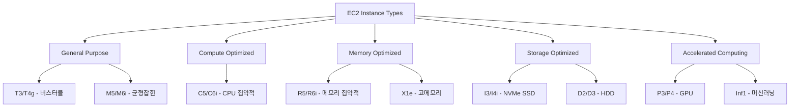
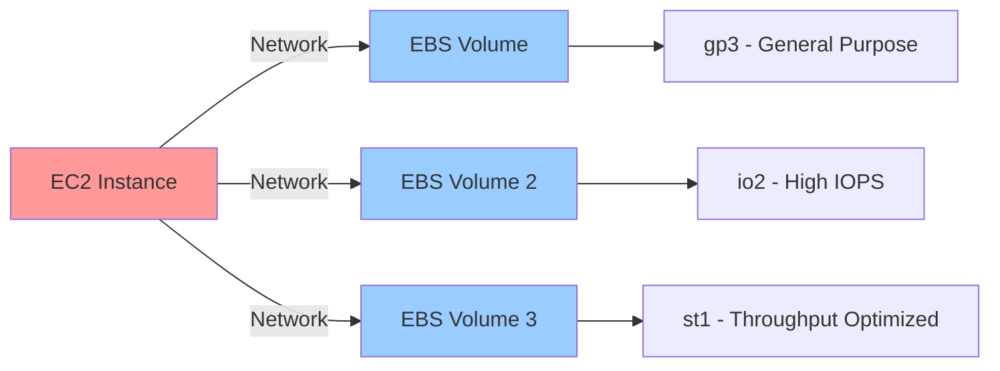
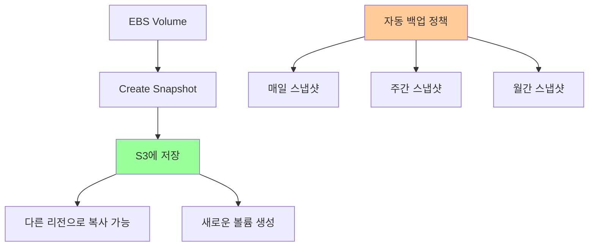
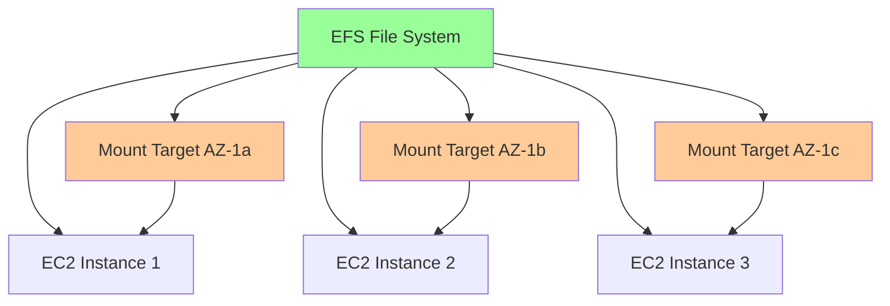
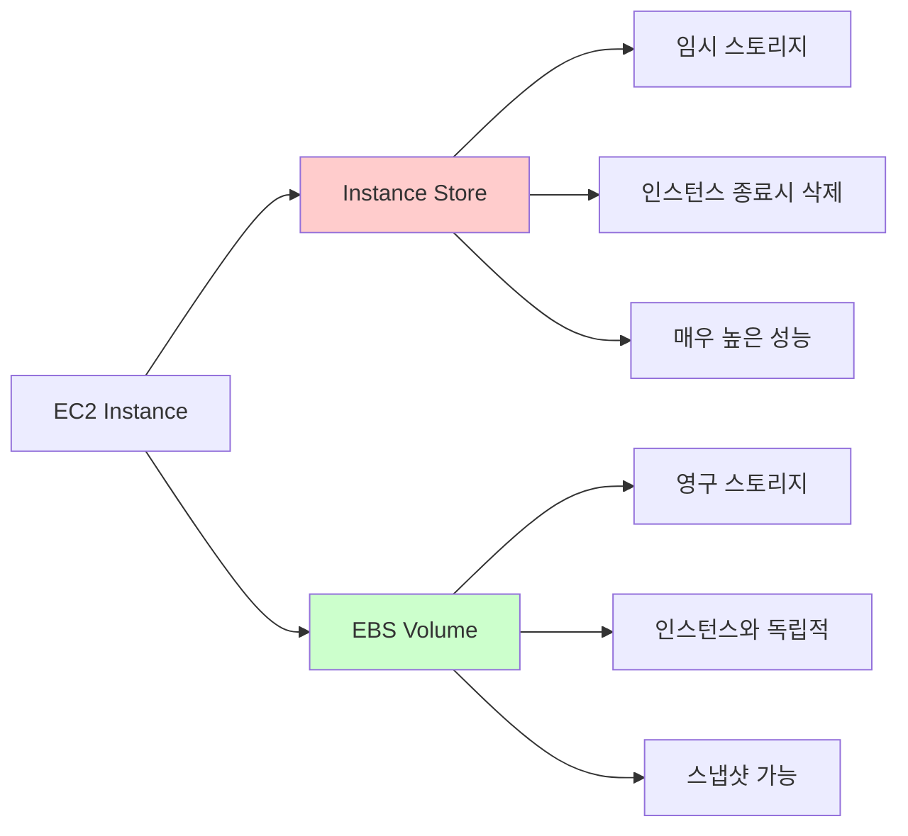
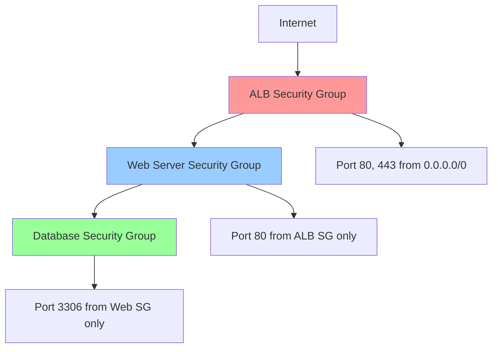
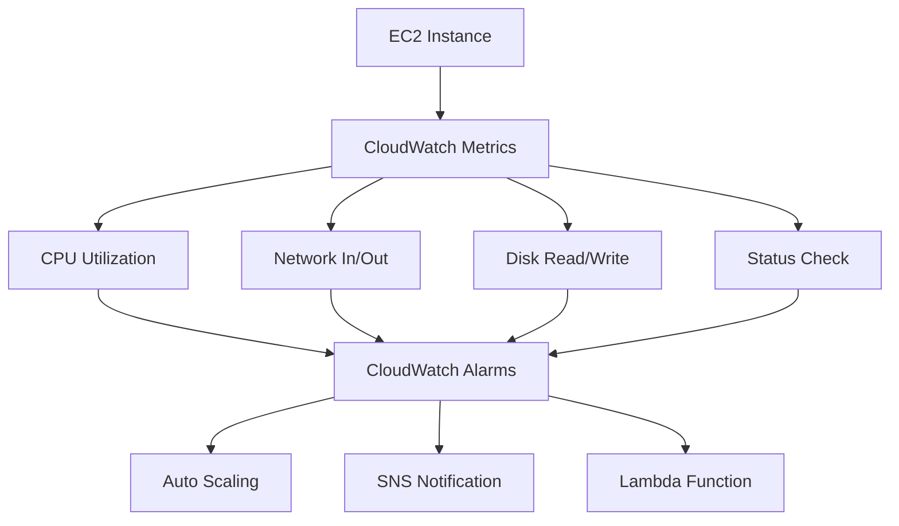
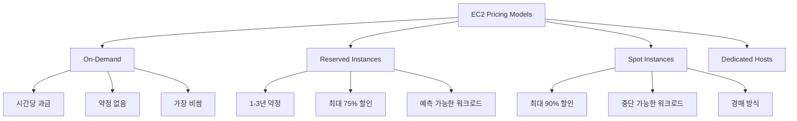

# Day 4: EC2 고급 기능 및 스토리지

## 학습 목표

오늘은 EC2의 고급 기능들과 AWS의 다양한 스토리지 서비스에 대해 알아보겠습니다. 어제 EC2 인스턴스를 생성하고 기본적인 관리 방법을 배웠다면, 오늘은 실제 운영 환경에서 필요한 고급 기능들을 다뤄보겠습니다.

- EC2 인스턴스 타입과 크기 조정
- EBS(Elastic Block Store) 볼륨 관리
- EFS(Elastic File System) 이해
- 인스턴스 스토어와 EBS의 차이점
- 스냅샷과 백업 전략
- 보안 그룹 고급 설정

## 1. EC2 인스턴스 타입 심화

### 인스턴스 패밀리 이해하기

EC2 인스턴스는 용도에 따라 여러 패밀리로 나뉩니다. 마치 자동차를 선택할 때 경차, 세단, SUV 중에서 용도에 맞게 고르는 것과 같아요.

### 주요 인스턴스 타입별 특징

**1. General Purpose (T3, M5)**
- 웹 서버, 소규모 데이터베이스에 적합
- CPU, 메모리, 네트워크가 균형잡힌 구성
- T3는 "버스터블" 성능으로 평소엔 적게 쓰다가 필요할 때 성능 폭발!

**2. Compute Optimized (C5)**
- 고성능 웹 서버, 과학 계산, 게임 서버
- CPU 성능이 뛰어남
- 배치 처리 작업에 최적

**3. Memory Optimized (R5, X1e)**
- 인메모리 데이터베이스, 빅데이터 분석
- 메모리가 많이 필요한 애플리케이션
- Redis, Memcached 같은 캐시 서버

## 2. EBS (Elastic Block Store) 완전 정복

### EBS란 무엇인가?

EBS는 EC2 인스턴스에 연결할 수 있는 블록 스토리지입니다. 컴퓨터의 하드디스크와 같은 역할을 하지만, 네트워크를 통해 연결되는 가상 하드디스크라고 생각하면 됩니다.

### EBS 볼륨 타입별 특징

**1. gp3 (General Purpose SSD)**
- 가장 많이 사용되는 범용 SSD
- 기본 성능: 3,000 IOPS, 125 MB/s
- 성능과 비용의 균형이 좋음
- 대부분의 워크로드에 적합

**2. io2 (Provisioned IOPS SSD)**
- 높은 IOPS가 필요한 데이터베이스용
- 최대 64,000 IOPS까지 가능
- 일관된 성능이 중요한 애플리케이션

**3. st1 (Throughput Optimized HDD)**
- 대용량 순차 읽기/쓰기에 최적화
- 빅데이터, 로그 처리에 적합
- 비용 효율적

**4. sc1 (Cold HDD)**
- 가장 저렴한 옵션
- 자주 접근하지 않는 데이터 저장
- 아카이브 용도

### EBS 스냅샷과 백업 전략

스냅샷은 EBS 볼륨의 특정 시점 백업입니다. 마치 게임의 세이브 포인트와 같아요. 문제가 생기면 언제든 그 시점으로 돌아갈 수 있습니다.

## 3. EFS (Elastic File System) 이해하기

### EFS의 특징

EFS는 여러 EC2 인스턴스가 동시에 접근할 수 있는 파일 시스템입니다. 마치 회사의 공유 폴더처럼 여러 사람이 동시에 사용할 수 있어요.

### EFS vs EBS 비교

| 특징 | EBS | EFS |
|------|-----|-----|
| 연결 방식 | 1:1 (한 번에 하나의 인스턴스) | 1:N (여러 인스턴스 동시 접근) |
| 가용 영역 | 단일 AZ | 다중 AZ |
| 확장성 | 수동 크기 조정 | 자동 확장 |
| 성능 | 높은 IOPS 가능 | 처리량 중심 |
| 비용 | 프로비저닝된 용량 기준 | 사용한 만큼 |

## 4. 인스턴스 스토어 vs EBS

### 인스턴스 스토어의 특징

**인스턴스 스토어 사용 시나리오:**
- 캐시, 임시 파일, 버퍼
- 높은 I/O 성능이 필요한 경우
- 데이터 손실을 감수할 수 있는 경우

**주의사항:** 인스턴스를 중지하거나 종료하면 데이터가 모두 사라집니다!

## 5. 보안 그룹 고급 설정

### 보안 그룹 규칙 설계

### 보안 그룹 모범 사례

1. **최소 권한 원칙**: 필요한 포트만 열기
2. **소스 제한**: 가능한 한 구체적인 소스 지정
3. **계층별 분리**: 웹, 앱, DB 계층별로 분리
4. **명명 규칙**: 용도를 알 수 있는 이름 사용

## 6. EC2 모니터링과 최적화

### CloudWatch 메트릭 활용

### 성능 최적화 팁

1. **인스턴스 타입 최적화**: 워크로드에 맞는 타입 선택
2. **EBS 최적화**: gp3로 업그레이드, IOPS 조정
3. **배치 그룹**: 네트워크 성능이 중요한 경우
4. **모니터링**: CloudWatch로 지속적인 성능 관찰

## 7. 비용 최적화 전략

### EC2 요금 모델 이해

### 비용 절약 팁

1. **Right Sizing**: 적절한 크기의 인스턴스 선택
2. **Reserved Instance**: 장기 사용 시 예약 인스턴스
3. **Spot Instance**: 배치 작업, 개발/테스트 환경
4. **Auto Scaling**: 필요에 따른 자동 확장/축소
5. **스케줄링**: 개발 환경은 업무 시간에만 운영

## 마무리

오늘은 EC2의 고급 기능들과 스토리지 서비스에 대해 자세히 알아봤습니다. 특히 EBS와 EFS의 차이점, 인스턴스 타입 선택 기준, 그리고 비용 최적화 방법들을 이해하는 것이 중요합니다.

내일은 VPC(Virtual Private Cloud)에 대해 배우면서 AWS의 네트워킹 기초를 다져보겠습니다. VPC는 AWS에서 가상의 네트워크를 구성하는 핵심 서비스로, 보안과 네트워크 설계의 기본이 됩니다.

### 핵심 포인트 정리

- **인스턴스 타입**: 워크로드에 맞는 적절한 선택이 중요
- **EBS**: 영구 스토리지, 스냅샷으로 백업 가능
- **EFS**: 여러 인스턴스가 공유할 수 있는 파일 시스템
- **보안 그룹**: 계층별로 분리하여 최소 권한 적용
- **비용 최적화**: Reserved Instance, Spot Instance 활용

다음 시간에는 실습을 통해 EBS 볼륨을 생성하고 EC2 인스턴스에 연결하는 방법을 직접 해보겠습니다!