# Day 5: VPC (Virtual Private Cloud) 기초

## 학습 목표
- VPC의 개념과 필요성 이해
- VPC의 핵심 구성 요소 파악
- 서브넷의 종류와 역할 이해
- 라우팅 테이블과 인터넷 게이트웨이 개념 학습
- VPC 보안 그룹과 NACL의 차이점 이해

## 1. VPC란 무엇인가?

VPC(Virtual Private Cloud)는 AWS 클라우드 내에서 논리적으로 격리된 가상 네트워크 환경입니다. 쉽게 말해, AWS 클라우드 안에 여러분만의 전용 네트워크 공간을 만드는 것이라고 생각하면 됩니다.

### VPC가 필요한 이유

전통적인 온프레미스 환경에서는 물리적인 네트워크 장비로 네트워크를 구성했습니다. 클라우드에서는 이를 소프트웨어로 구현한 것이 VPC입니다.

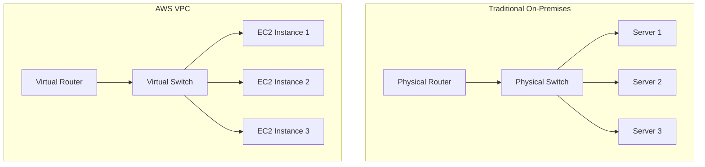

### VPC의 주요 특징

1. **격리성**: 다른 AWS 계정이나 VPC와 완전히 분리된 네트워크 환경
2. **제어성**: IP 주소 범위, 서브넷, 라우팅 테이블, 게이트웨이를 직접 제어
3. **보안성**: 보안 그룹과 네트워크 ACL을 통한 다층 보안
4. **확장성**: 필요에 따라 네트워크 구성을 쉽게 확장 가능

## 2. VPC 핵심 구성 요소

### 2.1 CIDR 블록 (IP 주소 범위)

VPC를 생성할 때 가장 먼저 정해야 하는 것이 IP 주소 범위입니다. 이를 CIDR(Classless Inter-Domain Routing) 표기법으로 표현합니다.

**예시:**
- `10.0.0.0/16`: 10.0.0.0 ~ 10.0.255.255 (65,536개 IP)
- `172.16.0.0/16`: 172.16.0.0 ~ 172.16.255.255 (65,536개 IP)
- `192.168.0.0/16`: 192.168.0.0 ~ 192.168.255.255 (65,536개 IP)

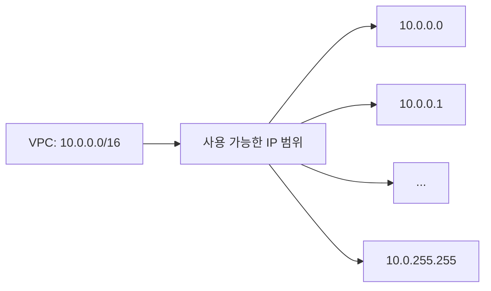

### 2.2 서브넷 (Subnet)

서브넷은 VPC 내에서 IP 주소 범위를 더 작은 단위로 나눈 것입니다. 각 서브넷은 하나의 가용 영역(AZ)에 속해야 합니다.

#### 퍼블릭 서브넷 vs 프라이빗 서브넷

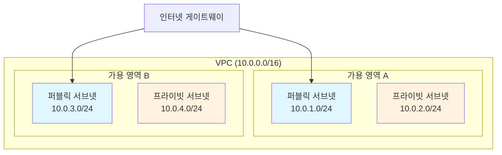

**퍼블릭 서브넷**:
- 인터넷 게이트웨이로 직접 라우팅되는 서브넷
- 인터넷에서 직접 접근 가능
- 웹 서버, 로드 밸런서 등이 위치

**프라이빗 서브넷**:
- 인터넷 게이트웨이로 직접 라우팅되지 않는 서브넷
- 인터넷에서 직접 접근 불가능
- 데이터베이스, 애플리케이션 서버 등이 위치

### 2.3 인터넷 게이트웨이 (Internet Gateway)

인터넷 게이트웨이는 VPC와 인터넷 간의 통신을 가능하게 하는 구성 요소입니다.

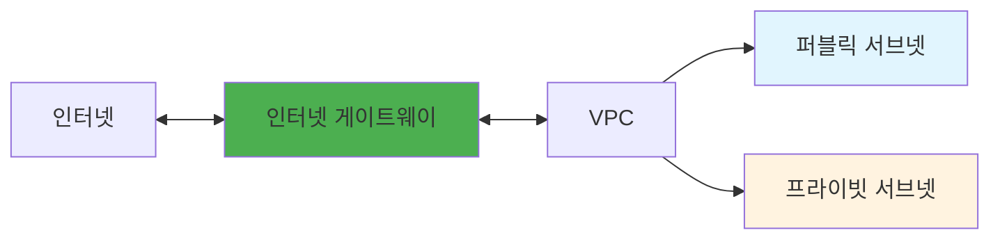

### 2.4 라우팅 테이블 (Route Table)

라우팅 테이블은 네트워크 트래픽이 어디로 향해야 하는지를 결정하는 규칙 집합입니다.

**기본 라우팅 테이블 예시:**

| 목적지 | 대상 | 설명 |
|--------|------|------|
| 10.0.0.0/16 | Local | VPC 내부 통신 |
| 0.0.0.0/0 | igw-12345678 | 인터넷으로의 모든 트래픽 |

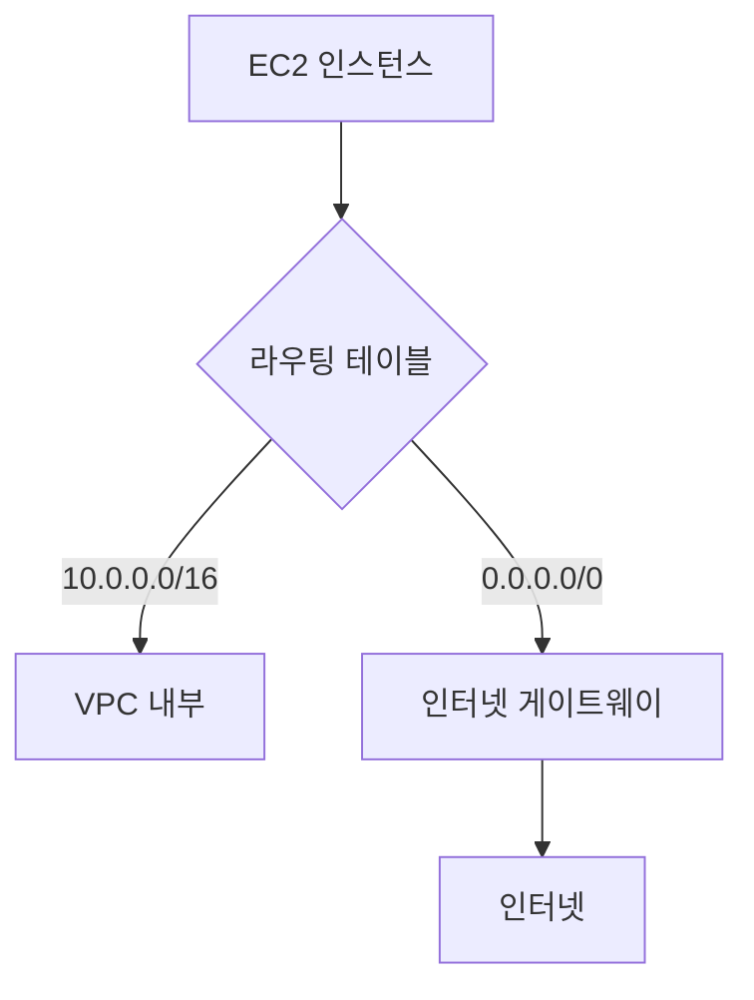

## 3. VPC 보안

### 3.1 보안 그룹 (Security Groups)

보안 그룹은 EC2 인스턴스 레벨에서 작동하는 가상 방화벽입니다.

**특징:**
- **상태 저장(Stateful)**: 아웃바운드 트래픽에 대한 응답은 자동으로 허용
- **허용 규칙만**: 거부 규칙은 없고, 허용 규칙만 설정 가능
- **인스턴스 레벨**: 각 EC2 인스턴스에 적용

### 3.2 네트워크 ACL (Network Access Control List)

네트워크 ACL은 서브넷 레벨에서 작동하는 방화벽입니다.

**특징:**
- **상태 비저장(Stateless)**: 인바운드와 아웃바운드 규칙을 별도로 설정
- **허용/거부 규칙**: 허용과 거부 규칙 모두 설정 가능
- **서브넷 레벨**: 서브넷 전체에 적용

### 보안 그룹 vs 네트워크 ACL 비교

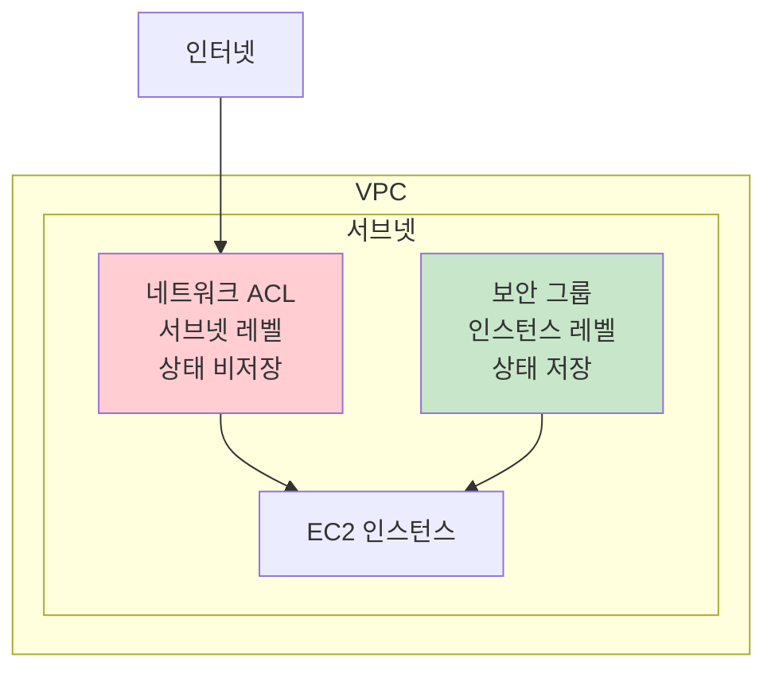

## 4. VPC 설계 모범 사례

### 4.1 다중 가용 영역 설계

고가용성을 위해 최소 2개 이상의 가용 영역에 서브넷을 배치합니다.

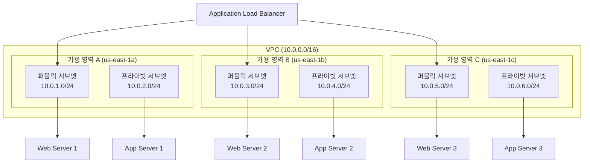

### 4.2 계층별 서브넷 분리

애플리케이션의 각 계층을 별도의 서브넷에 배치하여 보안을 강화합니다.

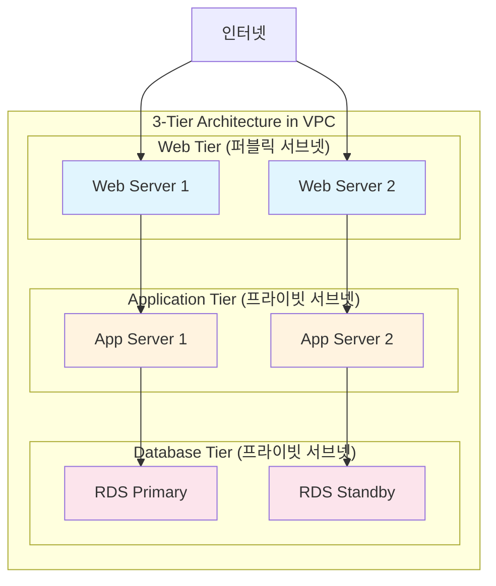

## 5. VPC 생성 시 고려사항

### 5.1 IP 주소 계획

1. **RFC 1918 사설 IP 대역 사용**:
   - 10.0.0.0/8 (10.0.0.0 ~ 10.255.255.255)
   - 172.16.0.0/12 (172.16.0.0 ~ 172.31.255.255)
   - 192.168.0.0/16 (192.168.0.0 ~ 192.168.255.255)

2. **미래 확장성 고려**: 처음에는 작게 시작하되, 확장 가능한 CIDR 블록 선택

3. **온프레미스와의 연결 고려**: VPN이나 Direct Connect 사용 시 IP 대역 중복 방지

### 5.2 서브넷 크기 계획

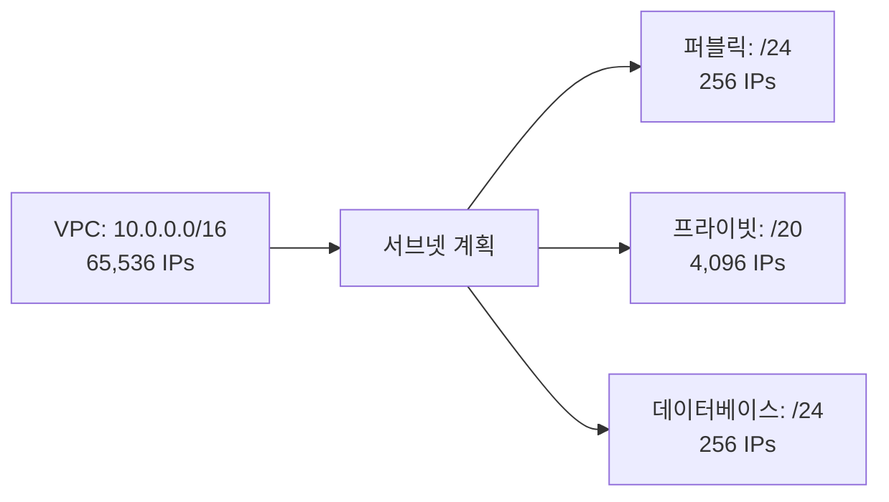

## 6. 실제 사용 시나리오

### 시나리오 1: 간단한 웹 애플리케이션

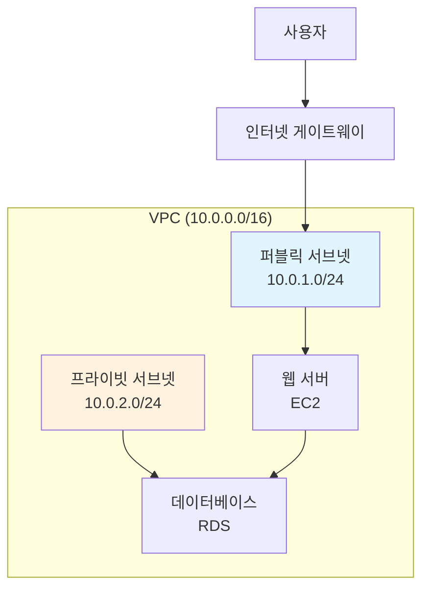

### 시나리오 2: 고가용성 웹 애플리케이션

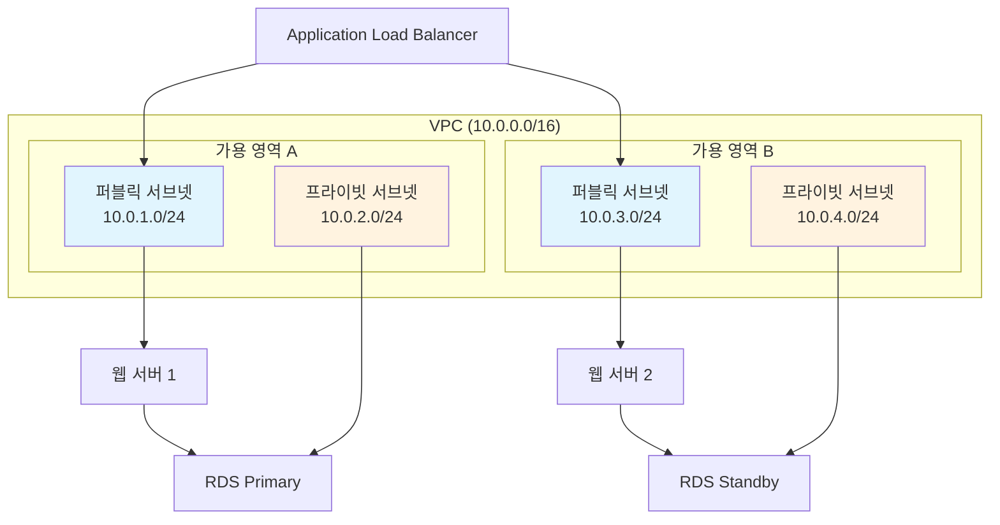

## 7. 다음 단계 미리보기

내일(Day 6)에는 VPC의 고급 네트워킹 기능을 학습합니다:
- NAT Gateway와 NAT Instance
- VPC Endpoint
- VPC Peering
- Transit Gateway
- VPN Gateway

## 핵심 요약

1. **VPC는 AWS 클라우드 내의 논리적으로 격리된 네트워크 환경**
2. **서브넷은 퍼블릭(인터넷 접근 가능)과 프라이빗(인터넷 접근 불가)으로 구분**
3. **인터넷 게이트웨이는 VPC와 인터넷 간의 통신을 담당**
4. **라우팅 테이블은 트래픽의 경로를 결정**
5. **보안 그룹(인스턴스 레벨)과 네트워크 ACL(서브넷 레벨)로 다층 보안 구현**
6. **고가용성을 위해 다중 가용 영역에 서브넷 배치**
7. **계층별 서브넷 분리로 보안 강화**

## 추가 학습 자료

- [AWS VPC 사용자 가이드](https://docs.aws.amazon.com/vpc/latest/userguide/)
- [VPC 설계 모범 사례](https://aws.amazon.com/answers/networking/aws-single-vpc-design/)
- [VPC 보안 모범 사례](https://docs.aws.amazon.com/vpc/latest/userguide/vpc-security-best-practices.html)