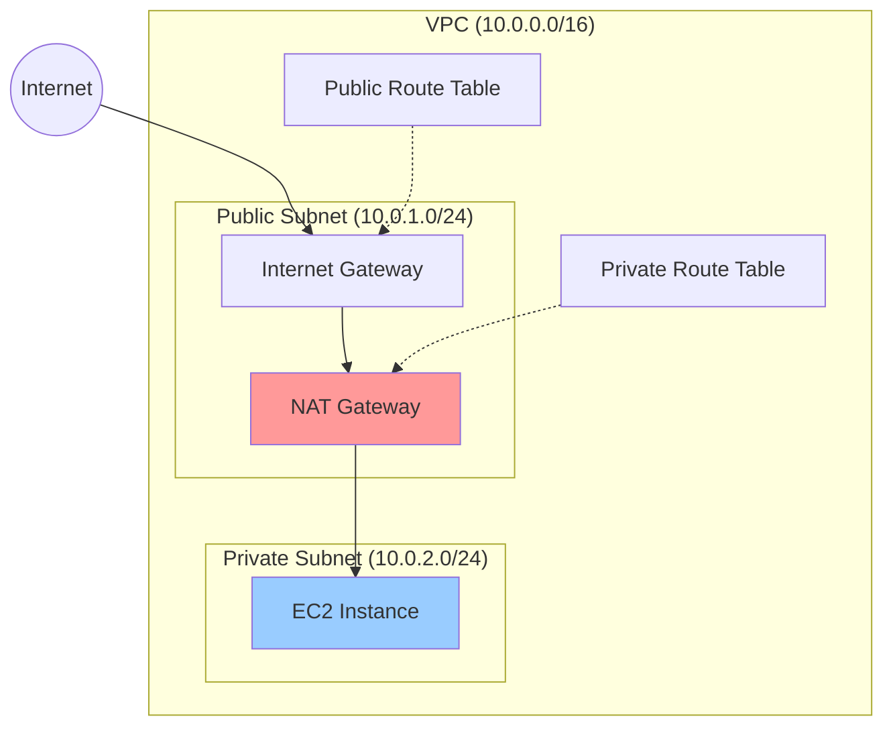
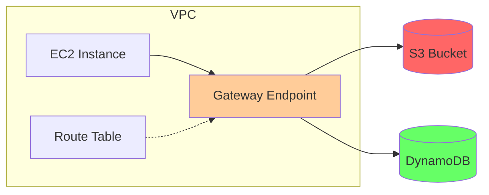
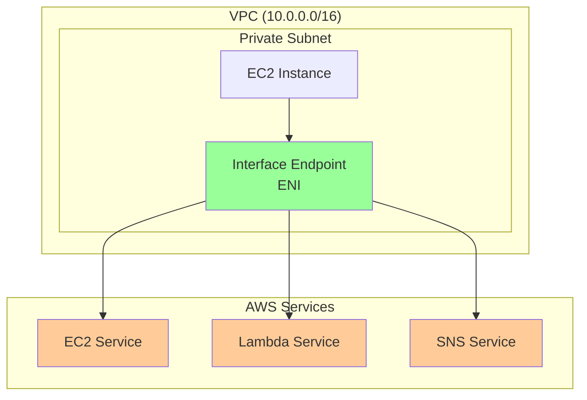
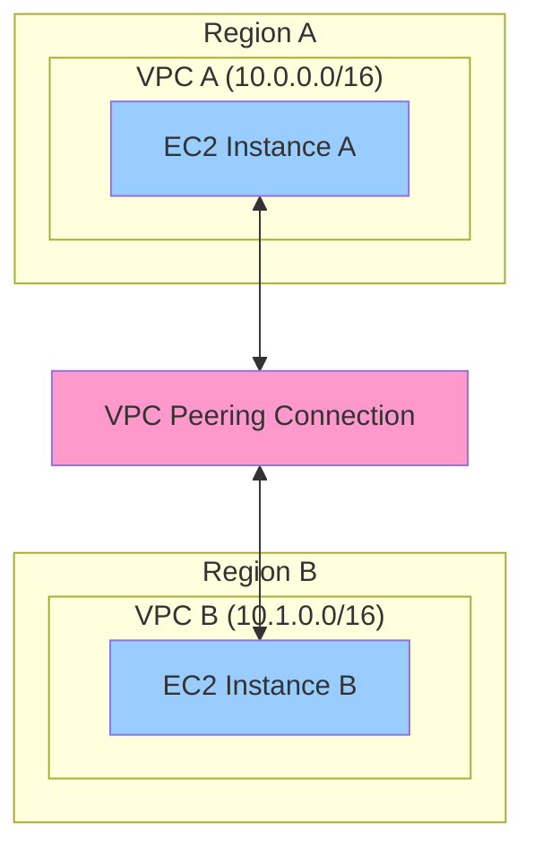
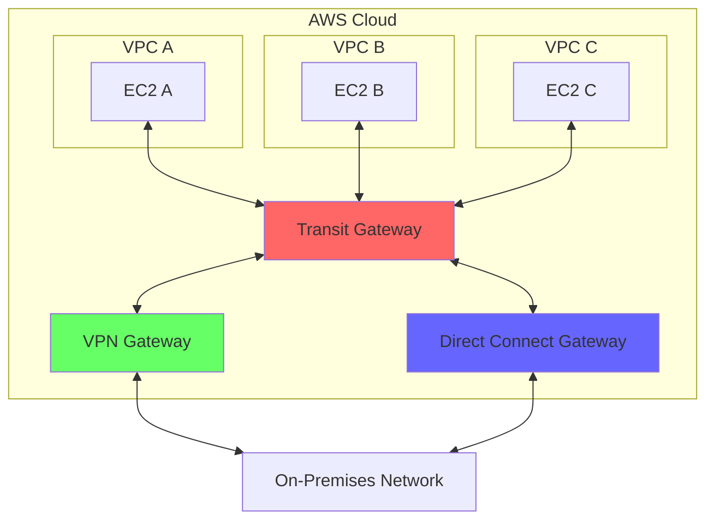
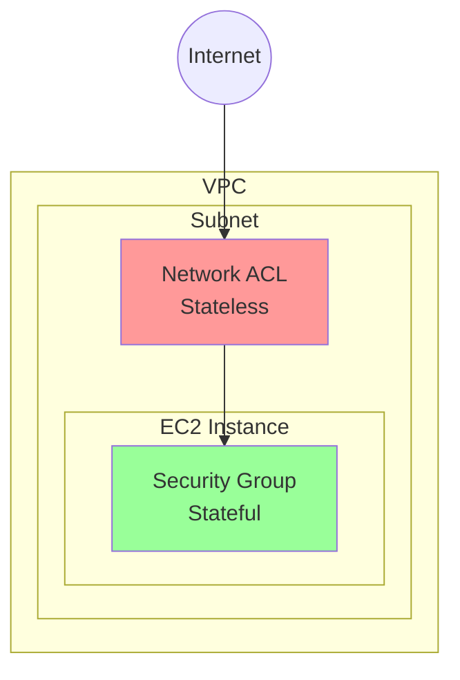
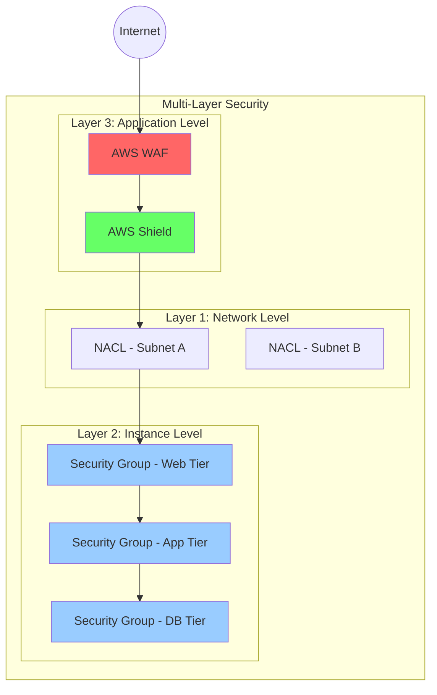
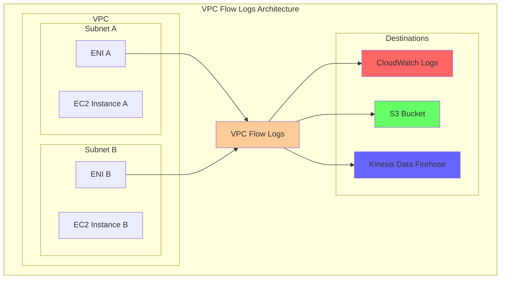
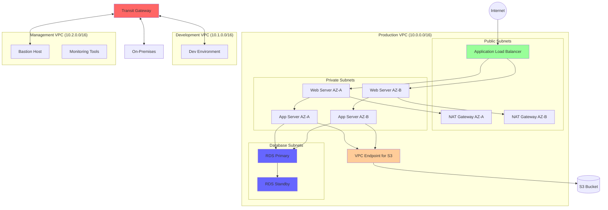

# Day 6: VPC 고급 네트워킹

## 학습 목표
- NAT Gateway와 NAT Instance의 차이점과 사용 사례 이해
- VPC Endpoint의 종류와 활용 방법 학습
- VPC Peering과 Transit Gateway 개념 파악
- 네트워크 보안 그룹과 NACL의 고급 설정 방법 습득
- VPC Flow Logs를 통한 네트워크 트래픽 모니터링 이해

## 1. NAT Gateway vs NAT Instance

### NAT Gateway란?
NAT Gateway는 AWS에서 관리하는 완전 관리형 NAT 서비스입니다. 프라이빗 서브넷의 인스턴스들이 인터넷에 아웃바운드 연결을 할 수 있게 해주면서, 인바운드 연결은 차단합니다.

### NAT Gateway vs NAT Instance 비교

| 특징 | NAT Gateway | NAT Instance |
|------|-------------|--------------|
| 관리 | AWS 완전 관리 | 사용자 직접 관리 |
| 가용성 | 자동 고가용성 | 수동 설정 필요 |
| 대역폭 | 최대 45Gbps | 인스턴스 타입에 따라 제한 |
| 보안 그룹 | 지원 안함 | 지원함 |
| 포트 포워딩 | 지원 안함 | 지원함 |
| 비용 | 시간당 + 데이터 처리 비용 | 인스턴스 비용만 |

## 2. VPC Endpoint

### VPC Endpoint란?
VPC Endpoint는 VPC와 AWS 서비스 간의 프라이빗 연결을 제공합니다. 인터넷 게이트웨이, NAT 게이트웨이, VPN 연결 없이도 AWS 서비스에 접근할 수 있습니다.

### VPC Endpoint 종류

#### 1. Gateway Endpoint
S3와 DynamoDB에만 사용 가능한 무료 엔드포인트입니다.

#### 2. Interface Endpoint (PrivateLink)
대부분의 AWS 서비스에 사용 가능한 ENI 기반 엔드포인트입니다.

### VPC Endpoint 사용 사례
- **보안 강화**: 트래픽이 인터넷을 거치지 않음
- **성능 향상**: AWS 백본 네트워크 사용으로 지연 시간 감소
- **비용 절감**: NAT Gateway 데이터 처리 비용 절약

## 3. VPC Peering

### VPC Peering이란?
두 VPC 간의 프라이빗 네트워크 연결을 제공하는 서비스입니다. 같은 리전 또는 다른 리전, 심지어 다른 AWS 계정의 VPC와도 연결 가능합니다.

### VPC Peering 제한사항
- **전이적 라우팅 불가**: A-B, B-C가 연결되어도 A-C 직접 통신 불가
- **CIDR 중복 불가**: 연결하려는 VPC의 CIDR 블록이 겹치면 안됨
- **DNS 해상도**: 기본적으로 비활성화됨

## 4. Transit Gateway

### Transit Gateway란?
여러 VPC와 온프레미스 네트워크를 중앙 집중식으로 연결하는 네트워크 허브입니다.

### Transit Gateway 장점
- **확장성**: 최대 5,000개의 VPC 연결 가능
- **전이적 라우팅**: 모든 연결된 네트워크 간 통신 가능
- **중앙 관리**: 단일 지점에서 라우팅 정책 관리
- **멀티캐스트 지원**: 멀티캐스트 트래픽 라우팅 가능

## 5. 네트워크 보안 심화

### Security Groups vs NACLs 비교

| 특징 | Security Groups | Network ACLs |
|------|-----------------|--------------|
| 적용 레벨 | 인스턴스 레벨 | 서브넷 레벨 |
| 상태 | Stateful | Stateless |
| 규칙 | Allow만 가능 | Allow/Deny 모두 가능 |
| 규칙 평가 | 모든 규칙 평가 | 번호 순서대로 평가 |
| 기본 정책 | 모든 아웃바운드 허용 | 모든 트래픽 허용 |

### 다층 보안 전략

## 6. VPC Flow Logs

### VPC Flow Logs란?
VPC의 네트워크 인터페이스에서 송수신되는 IP 트래픽에 대한 정보를 캡처하는 기능입니다.

### Flow Logs 레벨
- **VPC 레벨**: 전체 VPC의 모든 트래픽
- **서브넷 레벨**: 특정 서브넷의 트래픽
- **ENI 레벨**: 특정 네트워크 인터페이스의 트래픽

### Flow Logs 활용 사례
- **보안 분석**: 비정상적인 트래픽 패턴 탐지
- **네트워크 문제 해결**: 연결 실패 원인 분석
- **비용 최적화**: 불필요한 데이터 전송 식별
- **규정 준수**: 네트워크 트래픽 감사

## 7. 실제 아키텍처 예시

### 엔터프라이즈 네트워킹 아키텍처

## 8. 네트워킹 모범 사례

### 1. 보안 모범 사례
- **최소 권한 원칙**: 필요한 최소한의 포트와 프로토콜만 허용
- **다층 보안**: NACL과 Security Group을 함께 사용
- **정기적인 검토**: 보안 규칙의 정기적인 감사 및 정리

### 2. 성능 최적화
- **가용 영역 분산**: 고가용성을 위한 다중 AZ 배치
- **VPC Endpoint 활용**: AWS 서비스 접근 시 인터넷 우회
- **적절한 인스턴스 타입**: 네트워크 성능 요구사항에 맞는 선택

### 3. 비용 최적화
- **NAT Gateway 최적화**: 필요한 AZ에만 배치
- **VPC Endpoint 활용**: 데이터 전송 비용 절감
- **Flow Logs 필터링**: 필요한 트래픽만 로깅

## 9. 문제 해결 가이드

### 일반적인 네트워킹 문제들

#### 1. 인터넷 연결 불가
- Route Table 확인
- Internet Gateway 연결 상태 확인
- Security Group 아웃바운드 규칙 확인
- NACL 규칙 확인

#### 2. VPC 간 통신 불가
- VPC Peering 상태 확인
- Route Table에 피어링 경로 추가 확인
- Security Group 규칙 확인
- CIDR 블록 중복 여부 확인

#### 3. VPC Endpoint 연결 실패
- Endpoint 정책 확인
- Route Table 설정 확인
- DNS 설정 확인 (Interface Endpoint의 경우)

## 요약

Day 6에서는 VPC의 고급 네트워킹 기능들을 학습했습니다:

- **NAT Gateway**: 프라이빗 서브넷의 아웃바운드 인터넷 연결
- **VPC Endpoint**: AWS 서비스와의 프라이빗 연결
- **VPC Peering**: VPC 간 프라이빗 네트워크 연결
- **Transit Gateway**: 중앙 집중식 네트워크 허브
- **고급 보안**: Security Groups와 NACLs의 조합
- **VPC Flow Logs**: 네트워크 트래픽 모니터링

이러한 고급 기능들을 적절히 조합하면 확장 가능하고 안전한 클라우드 네트워크 아키텍처를 구축할 수 있습니다.

## 다음 학습 내용
내일(Day 7)은 Week 1의 마지막 날로, 지금까지 학습한 내용을 종합하여 실제 3-tier 아키텍처를 구축하는 실습을 진행할 예정입니다.