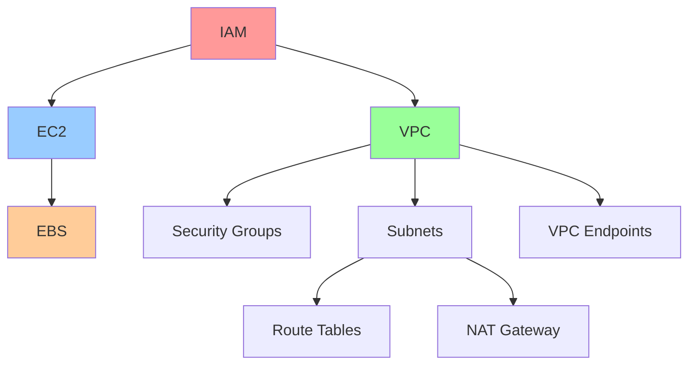

# Week 1 복습: AWS 기초 및 핵심 서비스

## 학습 목표
- Week 1에서 학습한 AWS 핵심 서비스들을 종합적으로 복습
- 각 서비스 간의 연관성과 통합 사용 방법 이해
- 실제 아키텍처에서의 서비스 활용 패턴 파악

## 📚 Week 1 학습 내용 요약

### Day 1: AWS 개요 및 글로벌 인프라
**핵심 개념:**
- AWS 글로벌 인프라: 리전(Region), 가용 영역(AZ), 엣지 로케이션
- AWS 서비스 카테고리: 컴퓨팅, 스토리지, 데이터베이스, 네트워킹
- AWS 공동 책임 모델

**주요 포인트:**
- 리전 선택 기준: 지연 시간, 규정 준수, 서비스 가용성, 비용
- 가용 영역을 통한 고가용성 설계
- 엣지 로케이션을 통한 콘텐츠 전송 최적화

### Day 2: IAM (Identity and Access Management)
**핵심 개념:**
- IAM 사용자, 그룹, 역할, 정책
- 최소 권한 원칙 (Principle of Least Privilege)
- MFA (Multi-Factor Authentication)

**주요 포인트:**
- 루트 사용자는 일상적인 작업에 사용하지 않기
- 정책은 JSON 형태로 권한을 정의
- 역할을 통한 임시 자격 증명 제공

### Day 3: EC2 (Elastic Compute Cloud) 기초
**핵심 개념:**
- EC2 인스턴스 유형 및 크기
- AMI (Amazon Machine Image)
- 보안 그룹과 키 페어

**주요 포인트:**
- 인스턴스 유형 선택 기준: CPU, 메모리, 스토리지, 네트워크 성능
- 보안 그룹은 상태 저장 방화벽 역할
- 키 페어를 통한 안전한 SSH 접근

### Day 4: EC2 고급 기능 및 스토리지
**핵심 개념:**
- EBS (Elastic Block Store) 볼륨 유형
- 인스턴스 스토어 vs EBS
- 스냅샷과 백업

**주요 포인트:**
- gp3, io2 등 다양한 EBS 볼륨 유형의 특성
- 인스턴스 스토어는 임시 스토리지
- 스냅샷을 통한 데이터 보호

### Day 5: VPC (Virtual Private Cloud) 기초
**핵심 개념:**
- VPC, 서브넷, 라우팅 테이블
- 인터넷 게이트웨이
- 퍼블릭 vs 프라이빗 서브넷

**주요 포인트:**
- CIDR 블록을 통한 IP 주소 범위 정의
- 라우팅 테이블로 트래픽 경로 제어
- 퍼블릭 서브넷은 인터넷 게이트웨이와 연결

### Day 6: VPC 고급 네트워킹
**핵심 개념:**
- NAT Gateway/Instance
- VPC Endpoint
- 보안 그룹 vs NACL

**주요 포인트:**
- NAT Gateway를 통한 프라이빗 서브넷의 아웃바운드 인터넷 접근
- VPC Endpoint로 AWS 서비스에 프라이빗 접근
- NACL은 상태 비저장 방화벽

## 🔗 서비스 간 연관성

### 통합 아키텍처 패턴

**1. 기본 웹 애플리케이션 아키텍처:**
- VPC 내에 퍼블릭/프라이빗 서브넷 구성
- 퍼블릭 서브넷에 웹 서버 (EC2)
- 프라이빗 서브넷에 데이터베이스 서버
- IAM 역할로 EC2에 필요한 권한 부여

**2. 고가용성 설계:**
- 다중 AZ에 걸친 서브넷 배치
- ELB를 통한 로드 밸런싱
- Auto Scaling을 통한 자동 확장

## 📋 핵심 개념 체크리스트

### AWS 기초
- [ ] AWS 글로벌 인프라 구성 요소 이해
- [ ] 리전과 AZ의 차이점 파악
- [ ] AWS 공동 책임 모델 숙지

### IAM
- [ ] IAM 구성 요소 (사용자, 그룹, 역할, 정책) 이해
- [ ] 최소 권한 원칙 적용 방법 파악
- [ ] MFA 설정의 중요성 인식

### EC2
- [ ] 인스턴스 유형별 특성 이해
- [ ] AMI의 역할과 활용 방법 파악
- [ ] 보안 그룹 규칙 설정 방법 숙지

### 스토리지
- [ ] EBS 볼륨 유형별 특성 비교
- [ ] 인스턴스 스토어와 EBS의 차이점 이해
- [ ] 스냅샷을 통한 백업 전략 수립

### VPC
- [ ] VPC 구성 요소와 역할 이해
- [ ] CIDR 블록 설계 방법 파악
- [ ] 퍼블릭/프라이빗 서브넷 구분 기준 숙지

### 네트워킹
- [ ] NAT Gateway의 역할과 필요성 이해
- [ ] VPC Endpoint의 장점과 사용 사례 파악
- [ ] 보안 그룹과 NACL의 차이점 비교

## 🎯 실무 적용 시나리오

### 시나리오 1: 스타트업 웹 서비스 구축
**요구사항:** 
- 초기 비용 최소화
- 향후 확장 가능성 고려
- 기본적인 보안 요구사항 충족

**권장 아키텍처:**
1. 단일 AZ에 VPC 구성 (비용 절약)
2. 퍼블릭 서브넷에 웹 서버 배치
3. 프라이빗 서브넷에 데이터베이스 배치
4. IAM 역할을 통한 최소 권한 부여

### 시나리오 2: 엔터프라이즈 애플리케이션
**요구사항:**
- 고가용성 보장
- 강화된 보안
- 규정 준수

**권장 아키텍처:**
1. 다중 AZ에 걸친 VPC 구성
2. 각 AZ에 퍼블릭/프라이빗 서브넷 쌍 생성
3. ELB를 통한 로드 밸런싱
4. 세분화된 IAM 정책 적용

## 💡 베스트 프랙티스 요약

### 보안
1. **IAM 최소 권한 원칙 적용**
   - 필요한 최소한의 권한만 부여
   - 정기적인 권한 검토 및 정리

2. **MFA 활성화**
   - 루트 계정과 관리자 계정에 필수 적용
   - 가능한 모든 사용자에게 권장

3. **보안 그룹 규칙 최적화**
   - 필요한 포트만 개방
   - 소스 IP 범위 최소화

### 비용 최적화
1. **적절한 인스턴스 유형 선택**
   - 워크로드 특성에 맞는 인스턴스 유형 선택
   - 예약 인스턴스 활용 고려

2. **스토리지 최적화**
   - 사용 패턴에 맞는 EBS 볼륨 유형 선택
   - 불필요한 스냅샷 정리

### 고가용성
1. **다중 AZ 활용**
   - 중요한 워크로드는 여러 AZ에 분산
   - 데이터베이스 다중 AZ 배포 고려

2. **백업 전략 수립**
   - 정기적인 스냅샷 생성
   - 백업 데이터의 다른 리전 복제

## 🔄 다음 주 학습 준비

Week 2에서는 스토리지와 데이터베이스 서비스를 중점적으로 학습합니다:
- S3 (Simple Storage Service)
- EBS, EFS, FSx 심화
- RDS (Relational Database Service)
- DynamoDB
- 데이터 마이그레이션 및 백업 전략

Week 1에서 학습한 VPC와 EC2 지식이 Week 2 학습의 기반이 되므, 확실히 이해하고 넘어가시기 바랍니다.

## 📖 추가 학습 자료

### AWS 공식 문서
- [AWS Well-Architected Framework](https://aws.amazon.com/architecture/well-architected/)
- [AWS Security Best Practices](https://aws.amazon.com/architecture/security-identity-compliance/)
- [VPC User Guide](https://docs.aws.amazon.com/vpc/latest/userguide/)

### 실습 환경
- [AWS Free Tier](https://aws.amazon.com/free/)
- [AWS Hands-on Tutorials](https://aws.amazon.com/getting-started/hands-on/)

이번 주 학습을 통해 AWS의 기본적인 인프라 구성 요소들을 이해했습니다. 다음 주부터는 이러한 기초 위에 더 복잡한 서비스들을 학습하게 됩니다.