# Exercise 1: RDS 생성 및 기본 설정

## 🎯 실습 목표
AWS Console을 통해 RDS를 생성하고 기본 설정을 구성합니다.

**예상 소요 시간**: 15-20분

---

## 📋 사전 확인사항

실습을 시작하기 전에 다음을 확인하세요:

- [ ] [Hands-On Console README](./README.md)의 사전 요구사항 완료
- [ ] AWS Console에 로그인 완료
- [ ] 리전이 `ap-northeast-2`으로 설정되어 있음

---

## 🏗️ 실습 아키텍처

이 Exercise에서 구성할 부분:

```mermaid
graph TB
    subgraph "사용자"
        User[실습 참가자]
    end
    
    subgraph "AWS Console - Exercise 1"
        Service[RDS]
        SG[Security Group]
        IAM[IAM Role]
    end
    
    subgraph "모니터링"
        CW[CloudWatch]
    end
    
    User -->|생성 및 설정| Service
    Service --> SG
    Service --> IAM
    Service --> CW
    
    style Service fill:#FF9900
    style User fill:#232F3E
    style CW fill:#FF4F8B
```

**구성 요소**:
- **RDS**: 메인 리소스
- **Security Group**: 네트워크 접근 제어
- **IAM Role**: 권한 관리
- **CloudWatch**: 메트릭 및 로그 수집

---

## 📝 단계별 가이드

### Step 1: RDS 생성

**Console 경로**: `Services > Database > RDS`

1. AWS Console 상단의 **Services** 메뉴 클릭
2. **Database** 카테고리에서 **RDS** 선택
3. 화면 상단의 **"Create rds"** 또는 **"Launch rds"** 버튼 클릭

**참고**: 리전이 `ap-northeast-2` (서울)로 설정되어 있는지 확인하세요.

---

### Step 2: 기본 설정 구성

**리소스 이름 설정**:
- **Name**: `day10-rds`
- 명명 규칙: `day번호-서비스명`
- 예시: `day10-my-rds`

**리전 설정**:
- **Region**: `ap-northeast-2` (서울)
- 선택 이유: 낮은 지연시간, 한국 사용자 대상

**기본 구성**:
- **Engine**: MySQL 또는 PostgreSQL
- **Version**: 최신 버전
- **Template**: Free tier
- **DB Instance Class**: db.t3.micro (Free Tier)
- **Storage**: 20 GB (Free Tier)
- **Multi-AZ**: No (비용 절감)

---

### Step 3: 태그 추가

**Console 경로**: 설정 화면 하단의 **"Tags"** 섹션

다음 태그를 추가하세요:

| Key | Value | 설명 |
|-----|-------|------|
| Name | day10-rds | 리소스 식별 |
| Environment | learning | 환경 구분 |
| Project | aws-saa-study | 프로젝트 구분 |
| Day | 10 | 학습 일차 |

**태그 추가 방법**:
1. "Add tag" 버튼 클릭
2. Key와 Value 입력
3. 필요한 만큼 반복

---

### Step 4: 보안 설정

**Security Group 설정**:
- **VPC Security Group**: Create new
- **Security Group Name**: `day{day_number}-db-sg`
- **Inbound Rules**:
  - Type: MySQL/PostgreSQL, Port: 3306/5432, Source: My IP

---

### Step 5: 생성 확인

1. 모든 설정 검토
2. **"Create"** 또는 **"Launch"** 버튼 클릭
3. 생성 진행 상황 확인
4. 생성 완료까지 대기 (약 2-5분)

**상태 확인 방법**:
- Console 경로: `RDS > Resources` 또는 `RDS > Dashboard`
- 상태 컬럼에서 "Available", "Active", 또는 "Running" 확인

---

## ✅ 검증 체크리스트

실습이 올바르게 완료되었는지 확인하세요:

- [ ] RDS 리소스가 "Available" 또는 "Active" 상태인가?
- [ ] 리소스 이름이 올바르게 설정되었는가?
- [ ] 리전이 `ap-northeast-2`로 설정되었는가?
- [ ] 모든 필수 태그가 추가되었는가?
- [ ] 보안 설정이 올바르게 구성되었는가?
- [ ] 리소스에 접근할 수 있는가?

---

## 🧪 테스트 및 검증

### 기능 테스트
### 테스트 1: 기본 기능 확인

**테스트 방법**:
1. RDS 콘솔에서 생성한 리소스 선택
2. 기본 작업 수행 (예: 데이터 업로드, 연결 테스트)
3. 결과 확인

**예상 결과**:
- 작업 성공
- 에러 없음
- 정상 응답 시간

### 테스트 2: 설정 확인

**테스트 방법**:
1. 리소스 설정 페이지 확인
2. 모든 설정값 검증
3. 태그 확인

**예상 결과**:
- 모든 설정이 의도한 대로 구성됨
- 태그가 올바르게 적용됨

### 성능 확인
**Console 경로**: `CloudWatch > Dashboards`

확인할 메트릭:

1. **응답 시간**
   - 메트릭: Latency 또는 ResponseTime
   - 예상 값: < 100ms
   - 확인 방법: CloudWatch 그래프에서 평균값 확인

2. **처리량**
   - 메트릭: RequestCount 또는 Throughput
   - 예상 값: 테스트 요청 수와 일치
   - 확인 방법: 총 요청 수 카운트

3. **에러율**
   - 메트릭: ErrorCount 또는 FailureRate
   - 예상 값: 0% 또는 < 1%
   - 확인 방법: 에러 카운트 확인

4. **리소스 사용률**
   - 메트릭: CPUUtilization, MemoryUtilization
   - 예상 값: < 80%
   - 확인 방법: 평균 사용률 확인

### 로그 확인
**Console 경로**: `CloudWatch > Log groups`

1. **로그 그룹 찾기**
   - 검색: `/aws/rds`
   - 또는 리소스 이름으로 검색

2. **최근 로그 스트림 선택**
   - 가장 최근 타임스탬프의 로그 스트림 클릭

3. **로그 내용 확인**
   - [ ] 에러 메시지 없음
   - [ ] 성공 로그 확인
   - [ ] 처리 시간 확인
   - [ ] 예상치 못한 경고 없음

4. **로그 필터링** (선택사항)
   - Filter pattern: `ERROR` 또는 `WARN`
   - 에러/경고 로그 분석

---

## 🐛 문제 해결

### 일반적인 문제

#### 문제 1: 리소스 생성 실패

**증상**: "Failed to create" 에러 메시지

**원인**:
- IAM 권한 부족
- 리전 제한
- 리소스 한도 초과
- 잘못된 설정값

**해결 방법**:
1. IAM 권한 확인: `IAM > Users > Permissions`
2. 리전 제한 확인: 다른 리전에서 시도
3. 서비스 한도 확인: `Service Quotas`
4. 설정값 재확인: 필수 필드 누락 확인

#### 문제 2: 리소스 접근 불가

**증상**: "Access Denied" 또는 연결 실패

**원인**:
- Security Group 설정 오류
- IAM 역할 미설정
- 네트워크 설정 문제

**해결 방법**:
1. Security Group 인바운드 규칙 확인
2. IAM 역할 및 정책 확인
3. VPC 및 서브넷 설정 확인

### 디버깅 팁
1. **CloudWatch Logs 활용**
   - 모든 작업은 로그에 기록됨
   - 에러 메시지에서 근본 원인 파악
   - 타임스탬프로 문제 발생 시점 추적

2. **AWS Console 이벤트 확인**
   - Console 경로: `RDS > Events`
   - 최근 이벤트 및 상태 변경 확인
   - 실패한 작업의 상세 정보 확인

3. **IAM Policy Simulator 사용**
   - Console 경로: `IAM > Policy Simulator`
   - 권한 문제 진단
   - 필요한 권한 식별

4. **AWS Support Center 활용**
   - Console 경로: `Support > Support Center`
   - 케이스 생성 및 기술 지원 요청
   - 커뮤니티 포럼 검색

---

## 🧹 리소스 정리

**중요**: 이 Exercise에서 생성한 리소스를 정리하세요.

### 정리 순서

#### 1. RDS 리소스 삭제

**Console 경로**: `RDS > Resources`

1. 생성한 리소스 선택: `day10-rds`
2. **Actions** > **Delete** 클릭
3. 확인 메시지 입력 (필요시): `delete` 또는 리소스 이름
4. **Delete** 버튼 클릭
5. 삭제 완료 대기 (약 2-5분)

**확인**:
- [ ] 리소스 목록에서 사라짐
- [ ] 상태가 "Deleted" 또는 "Terminated"

#### 2. 연결된 리소스 정리

**Security Group 삭제** (필요시):
- Console 경로: `VPC > Security Groups`
- 선택: `day10-sg`
- Actions > Delete security group

**IAM 역할 삭제** (필요시):
- Console 경로: `IAM > Roles`
- 선택: `day10-*-role`
- Delete

#### 3. CloudWatch 로그 삭제 (선택사항)

**Console 경로**: `CloudWatch > Log groups`

1. 검색: `day10` 또는 `rds`
2. 선택: 관련 로그 그룹
3. Actions > Delete log group(s)
4. 확인: "Delete" 클릭

### 정리 확인
- [ ] 모든 RDS 리소스가 삭제되었는가?
- [ ] Security Group이 정리되었는가?
- [ ] IAM 역할이 삭제되었는가?
- [ ] CloudWatch 로그 그룹이 삭제되었는가? (선택사항)
- [ ] Billing Dashboard에서 비용 확인
- [ ] 예상 비용 범위 내인가?

**비용 확인 방법**:
1. Console 경로: `Billing > Bills`
2. 현재 월 비용 확인
3. RDS 관련 항목 확인
4. 예상 비용과 비교

---

## 🎓 학습 포인트

이 Exercise를 통해 배운 핵심 개념:

1. **RDS 기본 개념**
   - RDS의 핵심 기능 및 사용 사례
   - AWS Console을 통한 리소스 생성 방법
   - 기본 설정 및 구성 옵션

2. **보안 베스트 프랙티스**
   - 최소 권한 원칙 적용
   - Security Group 설정
   - 태그를 통한 리소스 관리

3. **비용 관리**
   - Free Tier 활용
   - 리소스 정리의 중요성
   - 비용 모니터링 방법

4. **Console 탐색**
   - AWS Console 효율적 사용법
   - 리전 선택의 중요성
   - 리소스 상태 확인 방법

---

## 🔗 다음 단계

- [ ] **Exercise 2** 진행
- [ ] 이전 Exercise에서 생성한 리소스 활용
- [ ] 통합 기능 테스트

**준비사항**:
- Exercise 1에서 생성한 리소스 유지
- 추가 설정 준비

---

**작성일**: 2026-01-14
**마지막 업데이트**: 2026-01-14
