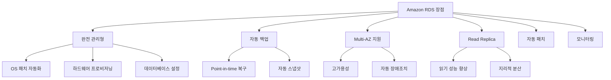
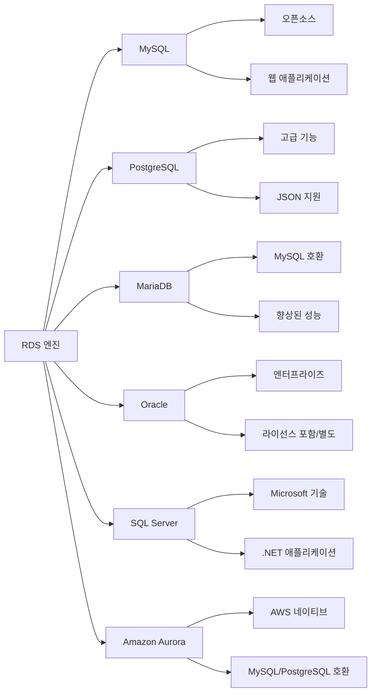
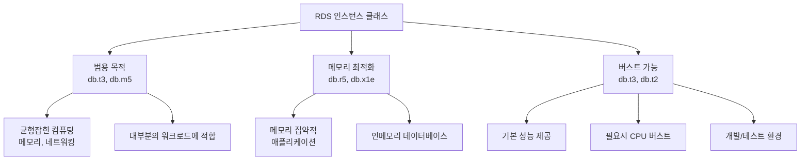
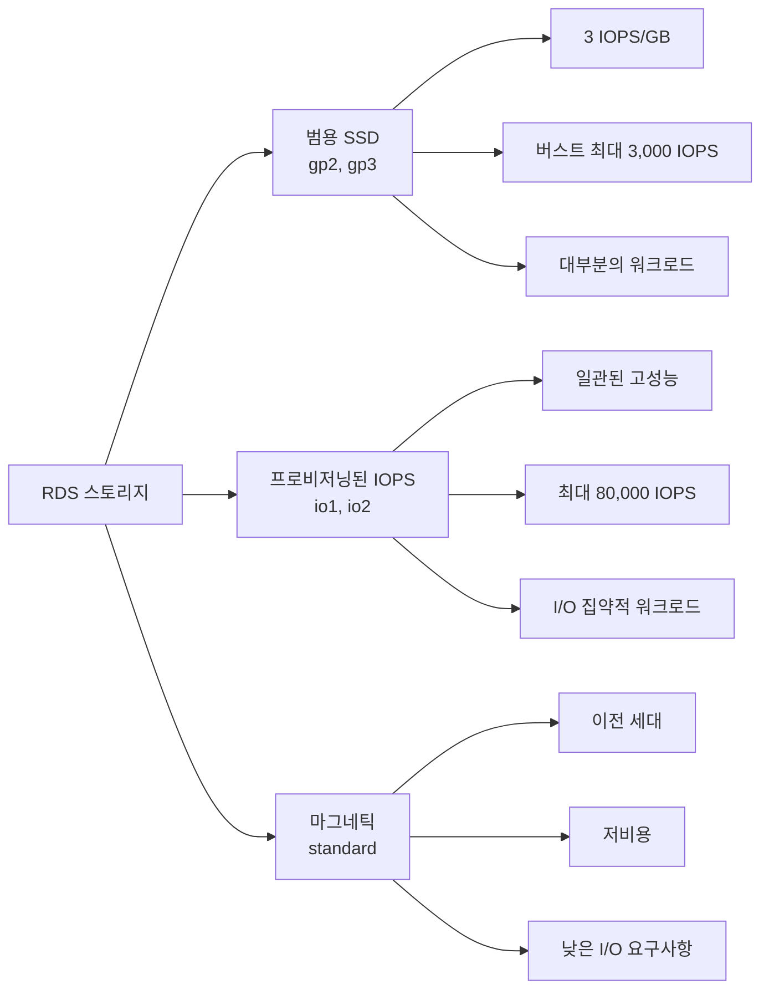
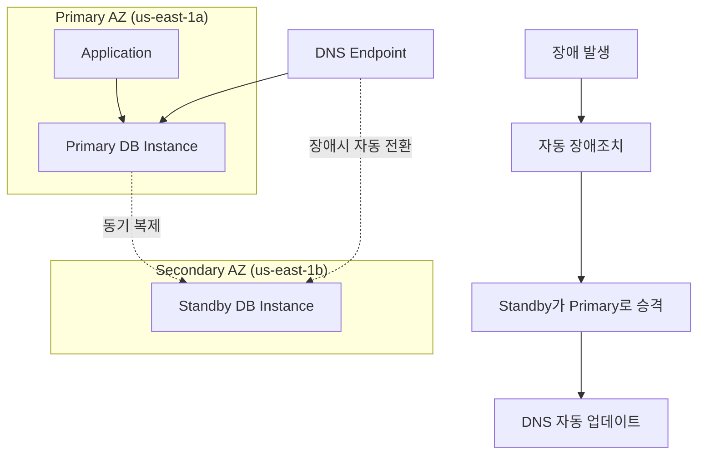
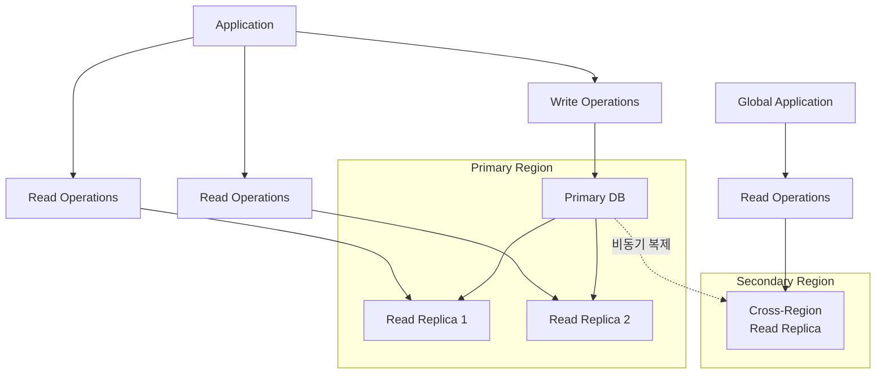
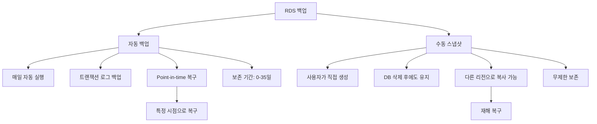
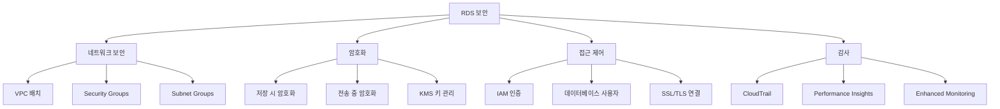
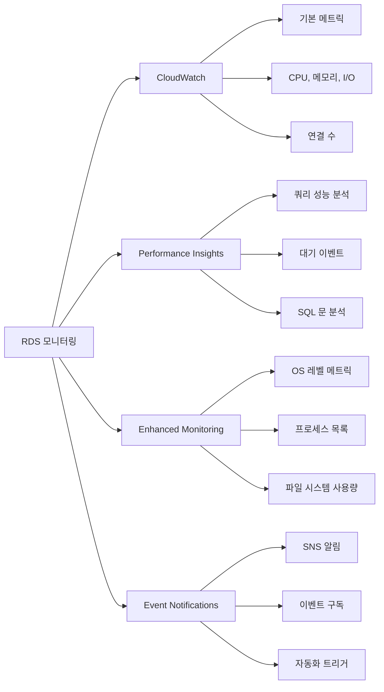
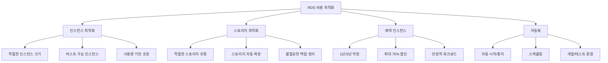

# Day 10: Amazon RDS (Relational Database Service)

## 학습 목표
- Amazon RDS의 핵심 개념과 장점 이해
- RDS 엔진 종류와 특징 파악
- RDS 인스턴스 유형과 스토리지 옵션 학습
- Multi-AZ 배포와 Read Replica 개념 이해
- RDS 백업 및 복원 메커니즘 학습
- RDS 보안 및 모니터링 기능 이해

## 1. Amazon RDS 개요

Amazon RDS(Relational Database Service)는 클라우드에서 관계형 데이터베이스를 쉽게 설정, 운영, 확장할 수 있게 해주는 완전 관리형 서비스입니다. 

### RDS의 주요 장점

### 전통적인 데이터베이스 vs RDS

| 구분 | 전통적인 DB | Amazon RDS |
|------|-------------|------------|
| 설치 및 설정 | 수동 설치 필요 | 몇 분 내 자동 설정 |
| 백업 | 수동 백업 스크립트 | 자동 백업 및 스냅샷 |
| 패치 | 수동 패치 적용 | 자동 패치 관리 |
| 모니터링 | 별도 도구 필요 | CloudWatch 통합 |
| 확장성 | 하드웨어 업그레이드 | 클릭 몇 번으로 확장 |
| 고가용성 | 복잡한 클러스터 구성 | Multi-AZ 간단 설정 |

## 2. RDS 지원 데이터베이스 엔진

Amazon RDS는 6가지 데이터베이스 엔진을 지원합니다:

### 각 엔진의 특징

**MySQL**
- 가장 인기 있는 오픈소스 관계형 데이터베이스
- 웹 애플리케이션에 널리 사용
- 버전: 5.7, 8.0 지원

**PostgreSQL**
- 고급 기능을 제공하는 오픈소스 데이터베이스
- JSON, 배열, 사용자 정의 타입 지원
- 복잡한 쿼리와 분석에 적합

**MariaDB**
- MySQL의 포크 버전
- MySQL과 호환되면서 향상된 성능 제공
- 오픈소스 커뮤니티 주도 개발

**Oracle**
- 엔터프라이즈급 상용 데이터베이스
- BYOL(Bring Your Own License) 또는 라이선스 포함 옵션
- 복잡한 비즈니스 애플리케이션에 적합

**SQL Server**
- Microsoft의 관계형 데이터베이스
- .NET 애플리케이션과 완벽 통합
- Express, Web, Standard, Enterprise 에디션 지원

**Amazon Aurora**
- AWS에서 개발한 클라우드 네이티브 데이터베이스
- MySQL 및 PostgreSQL과 호환
- 기존 데이터베이스 대비 최대 5배(MySQL), 3배(PostgreSQL) 성능

## 3. RDS 인스턴스 클래스

RDS 인스턴스는 용도에 따라 다양한 클래스로 제공됩니다:

### 인스턴스 클래스 선택 가이드

| 워크로드 유형 | 권장 인스턴스 클래스 | 특징 |
|---------------|---------------------|------|
| 개발/테스트 | db.t3.micro, db.t3.small | 저비용, 버스트 가능 |
| 소규모 프로덕션 | db.t3.medium, db.m5.large | 균형잡힌 성능 |
| 대규모 프로덕션 | db.m5.xlarge, db.m5.2xlarge | 높은 컴퓨팅 성능 |
| 메모리 집약적 | db.r5.large, db.r5.xlarge | 대용량 메모리 |
| 고성능 분석 | db.r5.4xlarge, db.x1e.xlarge | 최대 메모리 |

## 4. RDS 스토리지 유형

RDS는 세 가지 스토리지 유형을 제공합니다:

### 스토리지 유형별 특징

**범용 SSD (gp2/gp3)**
- 가격과 성능의 균형
- 기본 3 IOPS/GB, 최대 16,000 IOPS
- 버스트 성능: 최대 3,000 IOPS
- 대부분의 워크로드에 적합

**프로비저닝된 IOPS SSD (io1/io2)**
- 일관된 고성능 I/O
- 최대 80,000 IOPS (io2)
- I/O 집약적 애플리케이션에 적합
- 높은 비용

**마그네틱 (standard)**
- 이전 세대 스토리지
- 낮은 I/O 요구사항
- 비용 효율적이지만 성능 제한

## 5. Multi-AZ 배포

Multi-AZ 배포는 고가용성과 데이터 내구성을 제공합니다:

### Multi-AZ의 특징

**장점:**
- 자동 장애조치 (1-2분 내)
- 데이터 손실 없음 (동기 복제)
- 계획된 유지보수 시 다운타임 최소화
- 백업이 Standby에서 수행되어 Primary 성능 영향 없음

**주의사항:**
- Standby 인스턴스는 읽기 전용으로 사용 불가
- 추가 비용 발생 (인스턴스 2배)
- 같은 리전 내에서만 가능

## 6. Read Replica

Read Replica는 읽기 성능을 향상시키고 읽기 워크로드를 분산합니다:

### Read Replica 특징

**사용 사례:**
- 읽기 집약적 워크로드 분산
- 보고서 및 분석 쿼리 분리
- 지리적으로 분산된 사용자 지원
- 재해 복구 준비

**제한사항:**
- 비동기 복제 (약간의 지연 발생)
- 최대 15개의 Read Replica (Aurora는 15개)
- 원본 DB와 같은 엔진 버전 필요

## 7. RDS 백업 및 복원

RDS는 자동 백업과 수동 스냅샷을 지원합니다:

### 백업 전략

**자동 백업:**
- 백업 윈도우 설정 (예: 03:00-04:00 UTC)
- 성능 영향 최소화를 위해 낮은 활동 시간 선택
- Multi-AZ 환경에서는 Standby에서 백업 수행

**수동 스냅샷:**
- 중요한 변경 전 생성
- 프로덕션 환경의 정기적 백업
- 다른 리전으로 복사하여 재해 복구 준비

## 8. RDS 보안

RDS는 다층 보안을 제공합니다:

### 보안 모범 사례

**네트워크 보안:**
- Private Subnet에 RDS 배치
- Security Group으로 포트 및 소스 제한
- 필요한 경우에만 Public 접근 허용

**암호화:**
- 저장 시 암호화 활성화 (KMS)
- SSL/TLS 연결 강제
- 백업 및 스냅샷 자동 암호화

**접근 제어:**
- 강력한 마스터 패스워드 설정
- IAM 데이터베이스 인증 사용
- 최소 권한 원칙 적용

## 9. RDS 모니터링

RDS는 다양한 모니터링 도구를 제공합니다:

### 주요 모니터링 메트릭

**성능 메트릭:**
- CPU 사용률
- 데이터베이스 연결 수
- 읽기/쓰기 IOPS
- 네트워크 처리량

**가용성 메트릭:**
- 데이터베이스 연결 가능성
- 복제 지연 시간
- 장애조치 이벤트

## 10. RDS 비용 최적화

RDS 비용을 최적화하는 방법들:

### 비용 최적화 전략

**인스턴스 최적화:**
- CloudWatch 메트릭으로 사용률 모니터링
- 과도한 리소스 할당 방지
- 개발/테스트 환경은 작은 인스턴스 사용

**스토리지 최적화:**
- 워크로드에 맞는 스토리지 유형 선택
- 자동 스토리지 확장 활성화
- 오래된 스냅샷 정기적 삭제

**예약 인스턴스:**
- 안정적인 워크로드에 대해 1-3년 약정
- 최대 75% 비용 절감 가능
- 인스턴스 유형 변경 유연성

## 실습 준비

다음 실습에서는 다음 내용을 다룰 예정입니다:

1. **RDS MySQL 인스턴스 생성**
   - 인스턴스 클래스 및 스토리지 설정
   - VPC 및 보안 그룹 구성
   - 백업 및 유지보수 설정

2. **데이터베이스 연결 및 테스트**
   - MySQL Workbench 또는 CLI 연결
   - 샘플 데이터베이스 생성
   - 기본 CRUD 작업 수행

3. **Multi-AZ 및 Read Replica 설정**
   - Multi-AZ 배포 활성화
   - Read Replica 생성 및 테스트
   - 장애조치 시뮬레이션

4. **백업 및 복원 실습**
   - 수동 스냅샷 생성
   - Point-in-time 복구 수행
   - 다른 리전으로 스냅샷 복사

5. **모니터링 및 성능 튜닝**
   - CloudWatch 메트릭 확인
   - Performance Insights 활용
   - 알람 설정

## 요약

Amazon RDS는 관계형 데이터베이스를 클라우드에서 쉽게 관리할 수 있게 해주는 완전 관리형 서비스입니다. 주요 특징은 다음과 같습니다:

- **다양한 엔진 지원**: MySQL, PostgreSQL, MariaDB, Oracle, SQL Server, Aurora
- **고가용성**: Multi-AZ 배포를 통한 자동 장애조치
- **확장성**: Read Replica를 통한 읽기 성능 향상
- **보안**: 암호화, VPC, IAM 통합 보안
- **자동화**: 백업, 패치, 모니터링 자동화
- **비용 효율성**: 예약 인스턴스 및 다양한 최적화 옵션

다음 실습에서는 실제로 RDS 인스턴스를 생성하고 관리하는 방법을 학습하겠습니다.