# Day 11: DynamoDB - AWS의 NoSQL 데이터베이스

## 학습 목표
- DynamoDB의 핵심 개념과 특징 이해
- 관계형 데이터베이스와 NoSQL의 차이점 파악
- DynamoDB의 데이터 모델링 방법 학습
- 성능 최적화 및 비용 관리 전략 습득

## 1. DynamoDB 개요

DynamoDB는 AWS에서 제공하는 완전 관리형 NoSQL 데이터베이스 서비스입니다. 전통적인 관계형 데이터베이스와는 다른 접근 방식을 사용하여, 대규모 애플리케이션에서 빠르고 예측 가능한 성능을 제공합니다.

### 1.1 DynamoDB의 핵심 특징

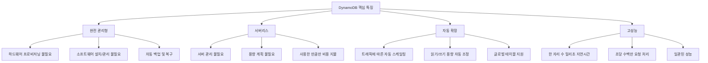

### 1.2 언제 DynamoDB를 사용해야 할까?

**DynamoDB가 적합한 경우:**
- 빠른 응답 시간이 중요한 애플리케이션
- 트래픽이 예측하기 어려운 애플리케이션
- 서버리스 아키텍처 (Lambda와 함께 사용)
- 모바일 앱, 게임, IoT 애플리케이션
- 실시간 분석이 필요한 경우

**관계형 데이터베이스가 더 적합한 경우:**
- 복잡한 쿼리와 조인이 필요한 경우
- ACID 트랜잭션이 중요한 경우
- 기존 SQL 기반 애플리케이션
- 복잡한 보고서 생성이 필요한 경우

## 2. DynamoDB 데이터 모델

### 2.1 기본 구조

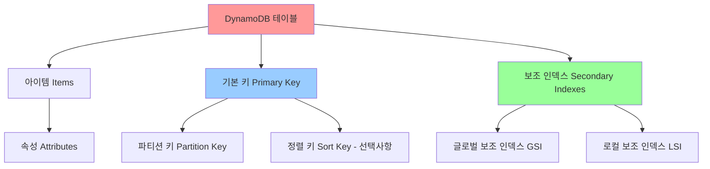

### 2.2 데이터 타입

DynamoDB는 다양한 데이터 타입을 지원합니다:

**스칼라 타입:**
- **String (S)**: 텍스트 데이터
- **Number (N)**: 숫자 데이터
- **Binary (B)**: 바이너리 데이터
- **Boolean (BOOL)**: true/false
- **Null (NULL)**: null 값

**컬렉션 타입:**
- **String Set (SS)**: 문자열 집합
- **Number Set (NS)**: 숫자 집합
- **Binary Set (BS)**: 바이너리 집합
- **List (L)**: 순서가 있는 값들의 목록
- **Map (M)**: 키-값 쌍의 집합

### 2.3 기본 키 설계

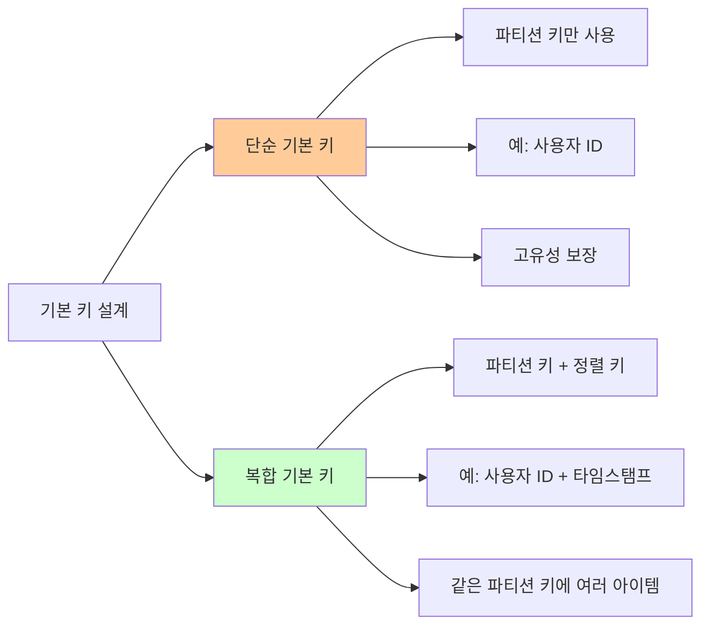

## 3. DynamoDB 읽기 및 쓰기 작업

### 3.1 읽기 작업

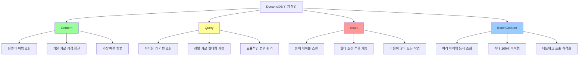

### 3.2 쓰기 작업

**주요 쓰기 작업:**
- **PutItem**: 새 아이템 생성 또는 기존 아이템 교체
- **UpdateItem**: 기존 아이템의 속성 수정
- **DeleteItem**: 아이템 삭제
- **BatchWriteItem**: 여러 아이템 동시 쓰기/삭제

### 3.3 일관성 모델

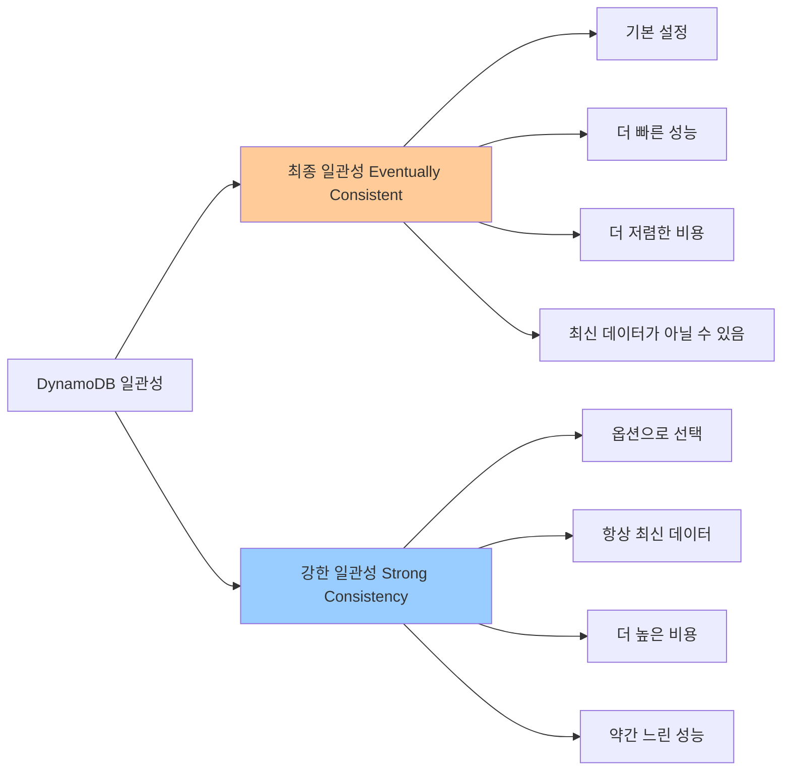

## 4. 보조 인덱스

### 4.1 글로벌 보조 인덱스 (GSI)

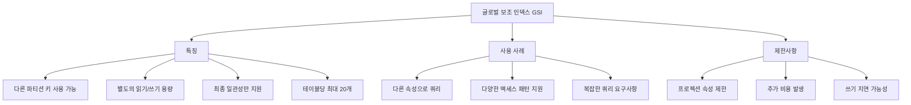

### 4.2 로컬 보조 인덱스 (LSI)

**LSI 특징:**
- 같은 파티션 키, 다른 정렬 키 사용
- 강한 일관성 지원
- 테이블 생성 시에만 정의 가능
- 테이블당 최대 10개
- 추가 비용 없음 (테이블 용량 공유)

## 5. 성능 최적화

### 5.1 핫 파티션 문제 해결

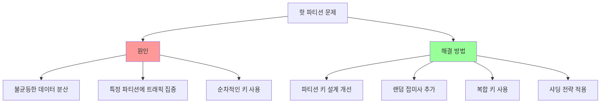

### 5.2 읽기/쓰기 용량 모드

**온디맨드 모드:**
- 트래픽에 따라 자동 확장
- 예측하기 어려운 워크로드에 적합
- 더 높은 비용, 관리 부담 적음

**프로비저닝 모드:**
- 읽기/쓰기 용량 단위 미리 설정
- 예측 가능한 워크로드에 적합
- 더 저렴한 비용, 용량 계획 필요

## 6. DynamoDB 고급 기능

### 6.1 DynamoDB Streams

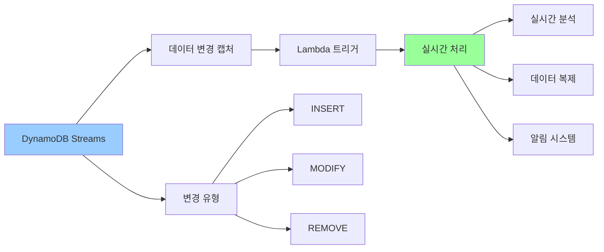

### 6.2 글로벌 테이블

**글로벌 테이블 특징:**
- 여러 AWS 리전에 데이터 복제
- 자동 다중 마스터 복제
- 지역별 낮은 지연시간 제공
- 재해 복구 및 비즈니스 연속성

### 6.3 Point-in-Time Recovery (PITR)

- 지난 35일 내 임의 시점으로 복구 가능
- 연속적인 백업 제공
- 추가 비용 발생 (테이블 크기의 약 20%)

## 7. 보안 및 액세스 제어

### 7.1 IAM 통합

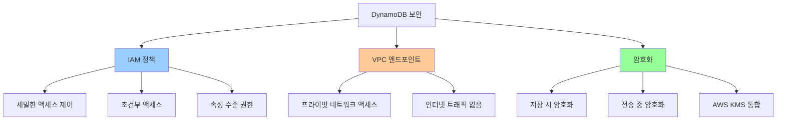

### 7.2 세밀한 액세스 제어

**속성 수준 권한:**
- 특정 속성에 대한 읽기/쓰기 제한
- 민감한 데이터 보호
- 조건부 액세스 정책

## 8. 비용 최적화

### 8.1 비용 구성 요소

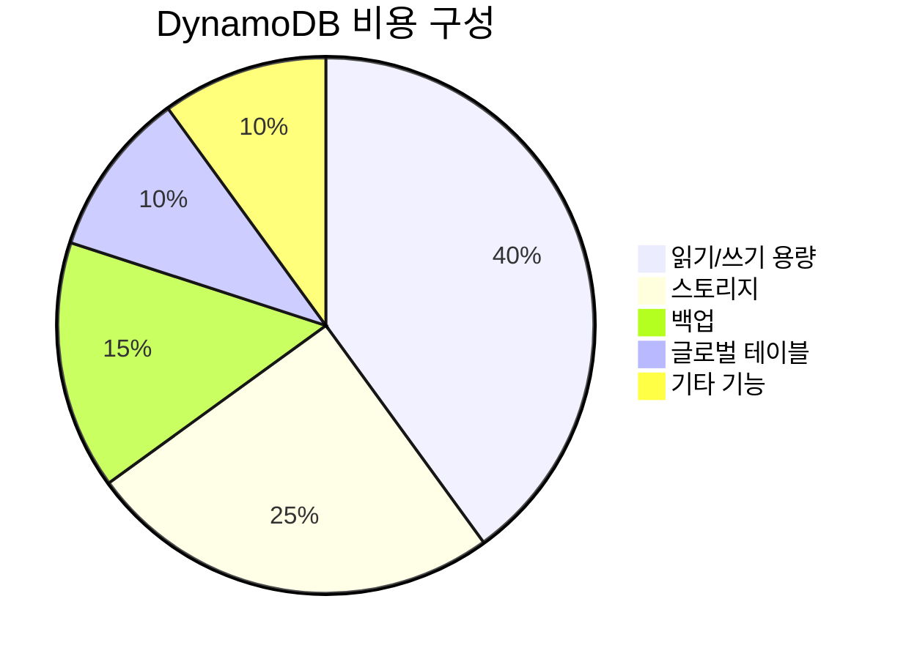

### 8.2 비용 절약 전략

**효율적인 데이터 모델링:**
- 적절한 파티션 키 선택
- 불필요한 속성 제거
- 압축 가능한 데이터 형식 사용

**용량 모드 최적화:**
- 예측 가능한 워크로드: 프로비저닝 모드
- 불규칙한 워크로드: 온디맨드 모드
- Auto Scaling 활용

**스토리지 최적화:**
- TTL(Time To Live) 활용
- 오래된 데이터 아카이브
- 불필요한 인덱스 제거

## 9. 모니터링 및 문제 해결

### 9.1 CloudWatch 메트릭

**주요 모니터링 메트릭:**
- **ConsumedReadCapacityUnits**: 소비된 읽기 용량
- **ConsumedWriteCapacityUnits**: 소비된 쓰기 용량
- **ThrottledRequests**: 제한된 요청 수
- **SuccessfulRequestLatency**: 성공한 요청의 지연시간

### 9.2 일반적인 문제와 해결책

**제한(Throttling) 문제:**
- 용량 단위 증가
- 핫 파티션 해결
- 지수 백오프 재시도 구현

**높은 지연시간:**
- 쿼리 최적화
- 인덱스 활용
- 캐싱 전략 적용

## 10. 실제 사용 사례

### 10.1 전자상거래 애플리케이션

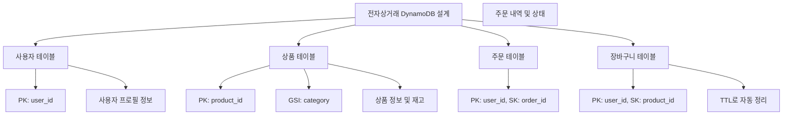

### 10.2 게임 애플리케이션

**리더보드 시스템:**
- PK: game_id, SK: score (역순 정렬)
- GSI: user_id로 개인 기록 조회
- DynamoDB Streams로 실시간 순위 업데이트

## 11. 마이그레이션 고려사항

### 11.1 관계형 DB에서 DynamoDB로

**마이그레이션 단계:**
1. **데이터 모델 재설계**: 액세스 패턴 분석
2. **테스트 환경 구축**: 성능 및 기능 검증
3. **점진적 마이그레이션**: 단계별 데이터 이전
4. **모니터링 및 최적화**: 성능 튜닝

### 11.2 주의사항

- **조인 연산 불가**: 애플리케이션 레벨에서 처리
- **복잡한 쿼리 제한**: 단순한 쿼리 패턴으로 설계
- **트랜잭션 제한**: 제한적인 ACID 트랜잭션 지원

## 12. 정리 및 핵심 포인트

### 12.1 DynamoDB 선택 기준

**DynamoDB를 선택해야 하는 경우:**
- 빠른 응답 시간이 중요한 애플리케이션
- 서버리스 아키텍처
- 예측하기 어려운 트래픽 패턴
- 글로벌 확장이 필요한 서비스

### 12.2 성공적인 DynamoDB 사용을 위한 핵심

1. **액세스 패턴 우선 설계**: 쿼리 패턴을 먼저 정의
2. **적절한 파티션 키 선택**: 데이터 분산과 성능 고려
3. **인덱스 전략**: GSI/LSI 적절한 활용
4. **비용 최적화**: 용량 모드와 TTL 활용
5. **모니터링**: CloudWatch 메트릭 지속적 관찰

DynamoDB는 올바르게 설계하고 사용하면 뛰어난 성능과 확장성을 제공하는 강력한 NoSQL 데이터베이스입니다. 하지만 관계형 데이터베이스와는 다른 사고방식이 필요하므로, 충분한 학습과 실습을 통해 익숙해지는 것이 중요합니다.

## 다음 학습 예고

내일(Day 12)에는 **데이터 마이그레이션 서비스**에 대해 학습합니다:
- AWS Database Migration Service (DMS)
- 온프레미스에서 AWS로의 데이터베이스 마이그레이션
- 동종/이종 데이터베이스 마이그레이션 전략
- 실시간 복제 및 최소 다운타임 마이그레이션