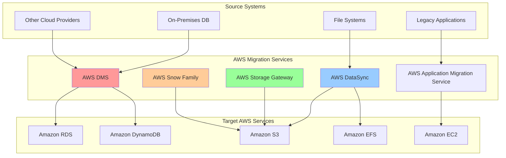
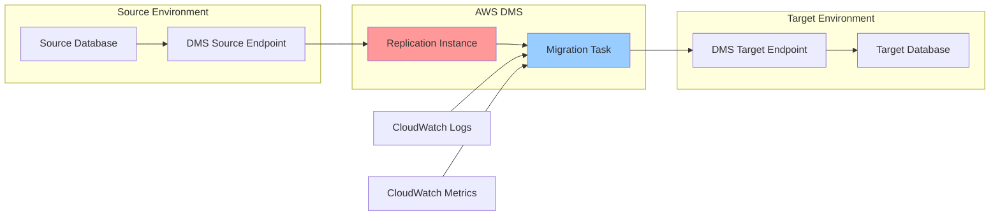
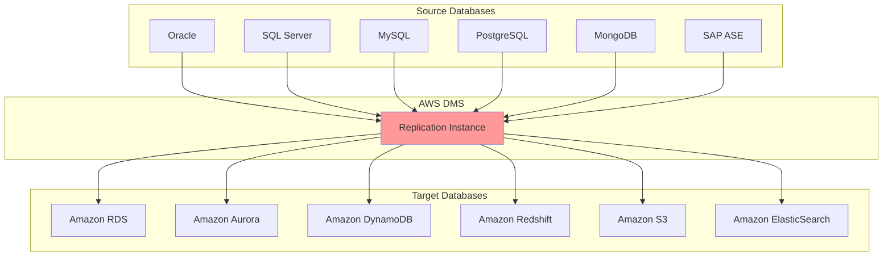
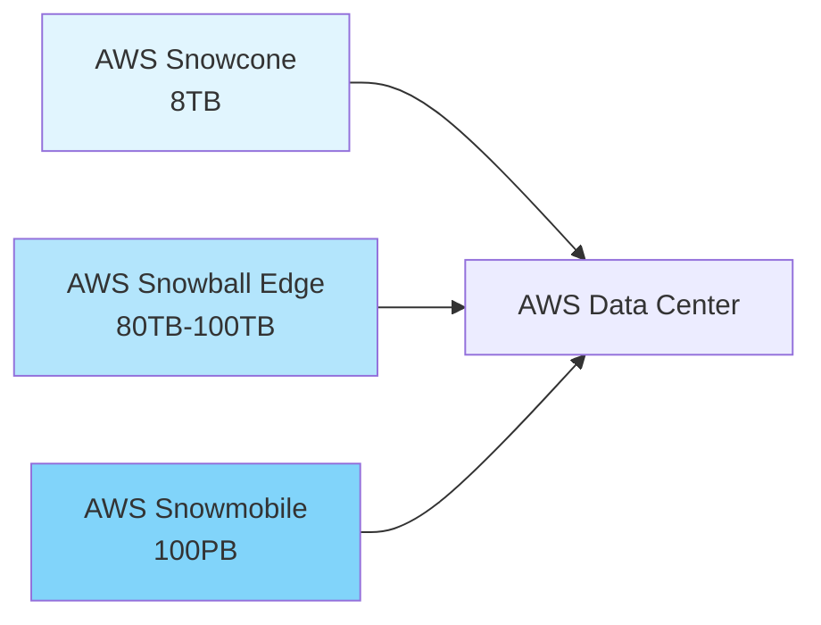
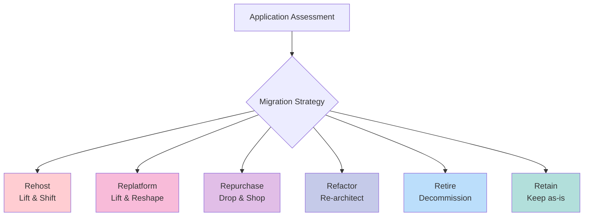
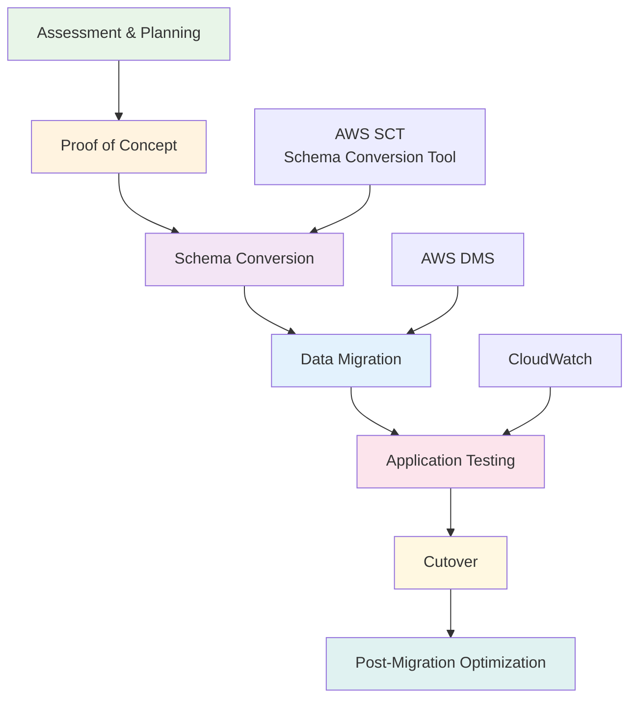

# Day 12: 데이터 마이그레이션 서비스

## 학습 목표
- AWS 데이터 마이그레이션 서비스들의 특징과 사용 사례 이해
- Database Migration Service (DMS)의 핵심 개념과 아키텍처 파악
- 다양한 마이그레이션 시나리오에 적합한 서비스 선택 능력 습득
- 마이그레이션 전략과 모범 사례 학습

## 1. 데이터 마이그레이션 개요

### 마이그레이션이 필요한 이유
데이터 마이그레이션은 현대 기업의 디지털 전환에서 핵심적인 과정입니다. 온프레미스 시스템에서 클라우드로, 또는 레거시 시스템에서 최신 시스템으로 데이터를 이전하는 것은 비즈니스 연속성을 유지하면서도 혁신을 추진하는 중요한 단계죠.

### AWS 마이그레이션 서비스 전체 구조

## 2. AWS Database Migration Service (DMS)

### DMS 핵심 개념
AWS DMS는 데이터베이스 마이그레이션을 위한 관리형 서비스입니다. 가장 큰 장점은 소스 데이터베이스가 마이그레이션 중에도 완전히 작동한다는 점이에요. 즉, 비즈니스 중단 없이 데이터를 이전할 수 있습니다.

### DMS 아키텍처

### 마이그레이션 유형

**1. Full Load (전체 로드)**
- 소스에서 타겟으로 모든 기존 데이터를 일괄 복사
- 초기 마이그레이션에 적합
- 다운타임이 발생할 수 있음

**2. Change Data Capture (CDC)**
- 실시간으로 변경사항을 복제
- 지속적인 데이터 동기화
- 거의 제로 다운타임

**3. Full Load + CDC**
- 초기 전체 로드 후 지속적인 변경사항 복제
- 가장 일반적인 마이그레이션 패턴
- 비즈니스 연속성 보장

### 지원되는 데이터베이스 엔진

## 3. 기타 마이그레이션 서비스

### AWS DataSync
파일 시스템과 객체 스토리지 간의 데이터 전송을 위한 서비스입니다.

**주요 특징:**
- 온프레미스와 AWS 간 데이터 동기화
- NFS, SMB, HDFS, S3 지원
- 네트워크 최적화 및 데이터 검증
- 일회성 또는 예약된 전송

### AWS Storage Gateway
하이브리드 클라우드 스토리지 서비스로, 온프레미스 환경을 AWS 스토리지 서비스와 연결합니다.

**게이트웨이 유형:**
- **File Gateway**: NFS/SMB 프로토콜로 S3 액세스
- **Volume Gateway**: iSCSI 프로토콜로 블록 스토리지
- **Tape Gateway**: 가상 테이프 라이브러리

### AWS Snow Family
대용량 데이터를 물리적으로 전송하는 서비스입니다.

## 4. 마이그레이션 전략과 모범 사례

### 6R 마이그레이션 전략

### DMS 모범 사례

**1. 사전 준비**
- 소스와 타겟 데이터베이스의 호환성 확인
- 네트워크 연결성 및 보안 그룹 설정
- 충분한 스토리지 공간 확보

**2. 성능 최적화**
- 적절한 인스턴스 클래스 선택
- 병렬 처리를 위한 테이블 분할
- 인덱스 및 제약 조건 관리

**3. 모니터링 및 문제 해결**
- CloudWatch 메트릭 활용
- 로그 분석을 통한 오류 추적
- 테스트 마이그레이션 수행

### 마이그레이션 프로세스

## 5. 실제 마이그레이션 시나리오

### 시나리오 1: Oracle에서 Amazon Aurora로 마이그레이션
**도전 과제:**
- 서로 다른 SQL 방언
- 저장 프로시저 및 함수 변환
- 애플리케이션 연결 문자열 변경

**해결 방법:**
- AWS SCT로 스키마 변환
- DMS로 데이터 마이그레이션
- 단계적 애플리케이션 전환

### 시나리오 2: 온프레미스 파일 서버에서 S3로 마이그레이션
**도전 과제:**
- 대용량 데이터 전송
- 네트워크 대역폭 제한
- 파일 권한 및 메타데이터 보존

**해결 방법:**
- DataSync를 통한 점진적 동기화
- Direct Connect로 전용 네트워크 연결
- S3 Intelligent Tiering으로 비용 최적화

## 6. 비용 최적화 전략

### DMS 비용 구성 요소
- **Replication Instance**: 시간당 요금
- **Storage**: 로그 및 캐시용 스토리지
- **Data Transfer**: 아웃바운드 데이터 전송

### 비용 절감 방법
- 적절한 인스턴스 크기 선택
- 마이그레이션 완료 후 리소스 정리
- 압축 및 병렬 처리 활용
- 예약 인스턴스 고려 (장기 프로젝트)

## 7. 보안 고려사항

### 데이터 보호
- 전송 중 암호화 (SSL/TLS)
- 저장 시 암호화 (KMS)
- VPC 엔드포인트 활용
- IAM 역할 기반 액세스 제어

### 네트워크 보안
- 보안 그룹 및 NACL 설정
- VPN 또는 Direct Connect 사용
- 프라이빗 서브넷 배치
- 최소 권한 원칙 적용

## 정리

데이터 마이그레이션은 단순한 데이터 복사가 아닙니다. 비즈니스 연속성을 보장하면서 시스템을 현대화하는 전략적 과정이에요. AWS의 다양한 마이그레이션 서비스를 적절히 조합하면, 위험을 최소화하고 성공적인 클라우드 전환을 달성할 수 있습니다.

핵심은 철저한 계획과 단계적 접근입니다. 작은 규모의 파일럿 프로젝트부터 시작해서 점진적으로 확장하는 것이 안전하고 효과적인 마이그레이션의 비결이죠.

## 다음 학습 예고
내일은 백업 및 재해 복구에 대해 학습합니다. 데이터를 안전하게 보호하고, 예상치 못한 상황에서도 비즈니스 연속성을 유지하는 방법을 알아보겠습니다.