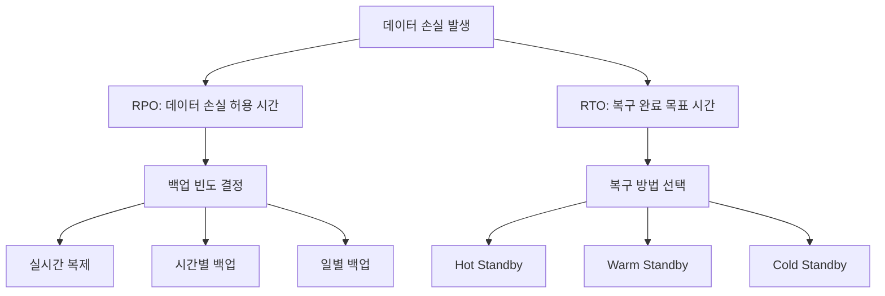
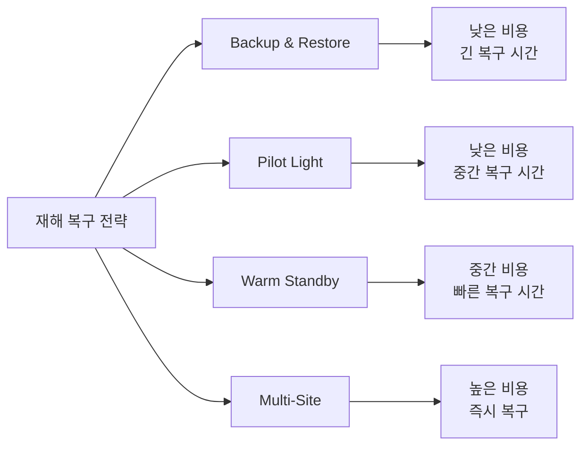
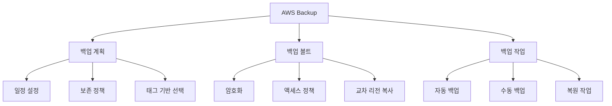
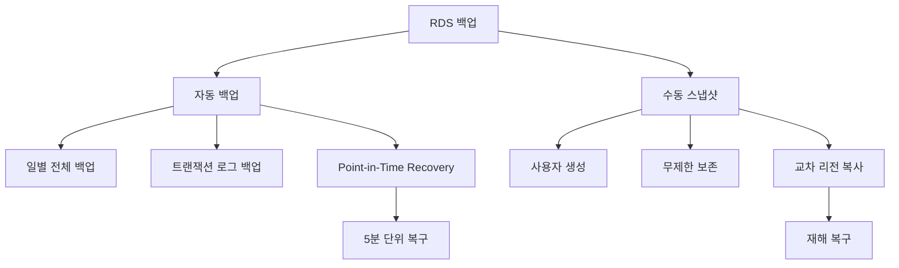
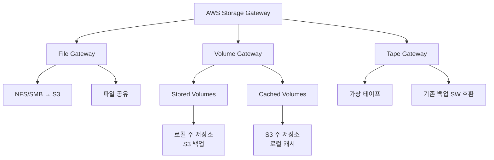
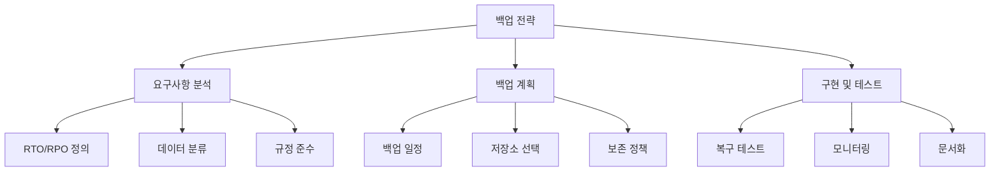

# Day 13: 백업 및 재해 복구 (Backup and Disaster Recovery)

## 학습 목표
- AWS 백업 서비스의 종류와 특징 이해
- 재해 복구 전략 및 RTO/RPO 개념 학습
- AWS Backup, AWS Storage Gateway 활용법 습득
- 다양한 백업 시나리오에 따른 최적 솔루션 선택

## 1. 백업과 재해 복구 개념

### 1.1 핵심 용어 정리

**RTO (Recovery Time Objective)**
- 시스템 장애 발생 후 복구까지 허용되는 최대 시간
- 비즈니스 요구사항에 따라 결정 (예: 1시간, 4시간, 24시간)

**RPO (Recovery Point Objective)**
- 데이터 손실을 허용할 수 있는 최대 시간
- 마지막 백업 시점부터 장애 발생까지의 시간 (예: 15분, 1시간)

**백업 vs 아카이브**
- 백업: 빠른 복구를 위한 데이터 복사본
- 아카이브: 장기 보관을 위한 데이터 저장

### 1.2 재해 복구 전략

**Pilot Light**
- 핵심 시스템의 최소 버전을 다른 리전에서 실행
- 낮은 비용, 중간 정도의 복구 시간

**Warm Standby**
- 축소된 버전의 완전한 환경을 다른 리전에서 실행
- 중간 비용, 빠른 복구 시간

**Multi-Site Active/Active**
- 두 개 이상의 리전에서 동시에 서비스 운영
- 높은 비용, 즉시 복구 가능

## 2. AWS 백업 서비스

### 2.1 AWS Backup

**통합 백업 서비스**
- 여러 AWS 서비스의 백업을 중앙에서 관리
- 백업 정책, 모니터링, 규정 준수를 통합 관리

**지원 서비스**
- EC2, EBS, RDS, DynamoDB, EFS, FSx
- Storage Gateway, DocumentDB, Neptune

**주요 기능**
- 백업 계획 (Backup Plans): 백업 일정과 보존 정책 정의
- 백업 볼트 (Backup Vaults): 백업 데이터 저장소
- 교차 리전 백업: 다른 리전으로 백업 복사
- 백업 모니터링 및 알림

### 2.2 EBS 스냅샷

**EBS 볼륨 백업**
- 특정 시점의 EBS 볼륨 상태를 S3에 저장
- 증분 백업: 변경된 블록만 저장하여 비용 절약

**스냅샷 관리**
- 자동 스냅샷: Amazon Data Lifecycle Manager (DLM) 사용
- 교차 리전 복사: 다른 리전으로 스냅샷 복사
- 스냅샷 공유: 다른 AWS 계정과 공유 가능

**스냅샷 활용**
- 새로운 EBS 볼륨 생성
- AMI (Amazon Machine Image) 생성
- 데이터 마이그레이션

### 2.3 RDS 백업

**자동 백업**
- 백업 보존 기간: 0-35일 (기본 7일)
- 백업 윈도우: 백업이 수행되는 시간대 지정
- Point-in-Time Recovery: 특정 시점으로 복구

**수동 스냅샷**
- 사용자가 직접 생성하는 백업
- 보존 기간 제한 없음
- DB 인스턴스 삭제 후에도 유지

**교차 리전 백업**
- 자동 백업의 교차 리전 복사
- 재해 복구를 위한 필수 설정

## 3. AWS Storage Gateway

### 3.1 개요

**하이브리드 클라우드 스토리지**
- 온프레미스 환경과 AWS 클라우드를 연결
- 기존 애플리케이션을 수정하지 않고 클라우드 스토리지 활용

**배포 방식**
- VM 어플라이언스: VMware, Hyper-V에서 실행
- 하드웨어 어플라이언스: 전용 하드웨어 제공
- EC2 인스턴스: AWS에서 직접 실행

### 3.2 Storage Gateway 유형

**File Gateway**
- NFS/SMB 프로토콜로 S3에 파일 저장
- 파일 공유 및 콘텐츠 배포에 적합

**Volume Gateway**
- Stored Volumes: 주 데이터는 로컬, 비동기적으로 S3에 백업
- Cached Volumes: 주 데이터는 S3, 자주 액세스하는 데이터만 로컬 캐시

**Tape Gateway (VTL)**
- 가상 테이프 라이브러리 제공
- 기존 백업 소프트웨어와 호환

## 4. 기타 백업 및 복구 서비스

### 4.1 AWS DataSync

**데이터 전송 서비스**
- 온프레미스와 AWS 간 대용량 데이터 전송
- NFS, SMB, HDFS, S3 API 지원
- 네트워크 최적화 및 데이터 검증

**주요 특징**
- 증분 전송: 변경된 데이터만 전송
- 데이터 무결성 검증
- CloudWatch 모니터링

### 4.2 AWS Database Migration Service (DMS)

**데이터베이스 마이그레이션**
- 소스 데이터베이스를 계속 운영하면서 마이그레이션
- 동종 및 이종 데이터베이스 마이그레이션 지원
- 지속적인 데이터 복제 (CDC: Change Data Capture)

### 4.3 AWS Application Migration Service (MGN)

**애플리케이션 마이그레이션**
- 물리적 서버, 가상 머신, 클라우드 인스턴스를 AWS로 마이그레이션
- 최소한의 다운타임으로 마이그레이션
- 자동화된 복제 및 테스트

## 5. 백업 모범 사례

### 5.1 3-2-1 백업 규칙

**3개의 복사본**
- 원본 데이터 1개 + 백업 복사본 2개

**2개의 다른 미디어**
- 서로 다른 저장 매체에 보관 (예: 로컬 디스크 + 클라우드)

**1개의 오프사이트 백업**
- 물리적으로 다른 위치에 보관 (다른 리전)

### 5.2 백업 전략 수립

**비즈니스 요구사항 분석**
- RTO/RPO 요구사항 정의
- 데이터 중요도 분류
- 규정 준수 요구사항 확인

**백업 일정 계획**
- 전체 백업 vs 증분 백업
- 백업 윈도우 최적화
- 네트워크 대역폭 고려

**테스트 및 검증**
- 정기적인 복구 테스트
- 백업 무결성 검증
- 복구 절차 문서화

## 6. 비용 최적화

### 6.1 스토리지 클래스 활용

**S3 스토리지 클래스**
- Standard: 자주 액세스하는 백업
- IA (Infrequent Access): 월 1회 미만 액세스
- Glacier: 장기 아카이브 (분-시간 단위 복구)
- Glacier Deep Archive: 초장기 아카이브 (12시간 복구)

**Lifecycle 정책**
- 자동으로 스토리지 클래스 전환
- 비용 효율적인 데이터 관리

### 6.2 백업 최적화

**중복 제거**
- 동일한 데이터의 중복 저장 방지
- AWS Backup의 중복 제거 기능 활용

**압축**
- 백업 데이터 압축으로 저장 공간 절약
- 네트워크 전송 시간 단축

## 정리

오늘은 AWS의 백업 및 재해 복구 서비스에 대해 학습했습니다. 주요 내용을 정리하면:

1. **RTO/RPO 개념**: 복구 시간과 데이터 손실 허용 범위
2. **AWS Backup**: 통합 백업 관리 서비스
3. **EBS 스냅샷**: 블록 스토리지 백업
4. **RDS 백업**: 데이터베이스 자동/수동 백업
5. **Storage Gateway**: 하이브리드 클라우드 스토리지
6. **백업 모범 사례**: 3-2-1 규칙과 전략 수립

내일은 Week 2의 마지막 날로, 이번 주에 학습한 스토리지와 데이터베이스 서비스들을 종합적으로 복습하고 실습 프로젝트를 진행하겠습니다.

## 추가 학습 자료

- [AWS Backup 사용 설명서](https://docs.aws.amazon.com/aws-backup/)
- [AWS Storage Gateway 사용 설명서](https://docs.aws.amazon.com/storagegateway/)
- [AWS 재해 복구 백서](https://docs.aws.amazon.com/whitepapers/latest/disaster-recovery-workloads-on-aws/)
- [AWS Well-Architected Framework - 안정성 기둥](https://docs.aws.amazon.com/wellarchitected/latest/reliability-pillar/)