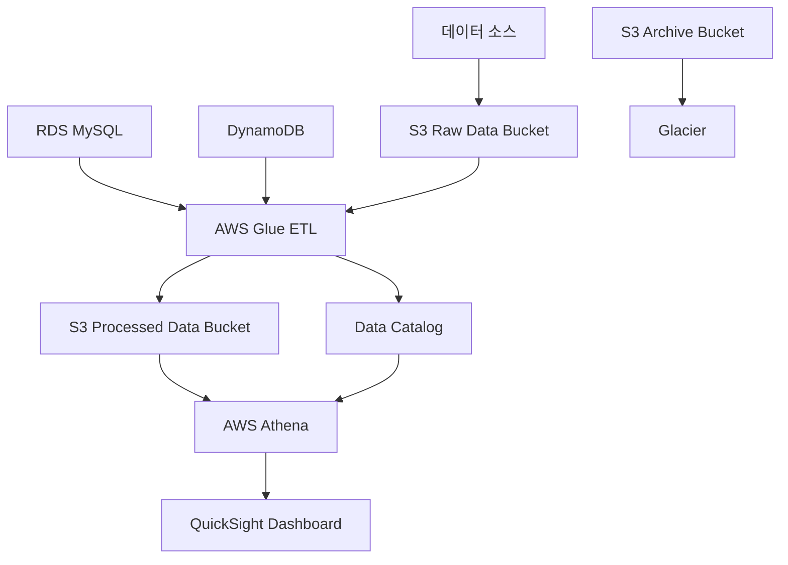

# 실습 프로젝트: AWS 데이터 레이크 구축

## 🎯 실습 목표
이번 실습에서는 Week 2에서 학습한 스토리지 및 데이터베이스 서비스들을 활용하여 완전한 데이터 레이크를 구축합니다. 실제 기업에서 사용하는 데이터 아키텍처를 경험해보겠습니다.

## 📋 실습 개요
- **소요 시간**: 90분
- **난이도**: 중급
- **비용**: AWS Free Tier 범위 내 (약 $1-2)
- **사용 서비스**: S3, RDS, DynamoDB, Glue, Athena

## 🏗️ 구축할 아키텍처



## 📚 전제 조건
- AWS Console 접근 권한
- Week 2 Day 8-13 실습 완료
- 기본적인 SQL 지식
- JSON 데이터 형식 이해

## 🚀 실습 단계

### Phase 1: 데이터 레이크 기반 구조 생성 (20분)

#### Step 1: S3 버킷 생성
1. **AWS Console → S3 서비스 접속**

2. **Raw Data 버킷 생성**
   ```
   버킷 이름: your-name-datalake-raw-data
   리전: us-east-1 (또는 선호 리전)
   버전 관리: 활성화
   암호화: AES-256
   ```

3. **Processed Data 버킷 생성**
   ```
   버킷 이름: your-name-datalake-processed
   리전: 동일 리전
   버전 관리: 활성화
   암호화: AES-256
   ```

4. **Archive 버킷 생성**
   ```
   버킷 이름: your-name-datalake-archive
   리전: 동일 리전
   수명 주기 정책: 30일 후 Glacier로 이동
   ```

#### Step 2: 폴더 구조 생성
각 버킷에 다음 폴더 구조를 생성하세요:

**Raw Data 버킷:**
```
/sales-data/
  /year=2024/
    /month=01/
    /month=02/
/customer-data/
/product-data/
/logs/
  /application/
  /access/
```

**Processed Data 버킷:**
```
/analytics/
  /daily-reports/
  /monthly-reports/
/ml-features/
/dashboards/
```

### Phase 2: 데이터 소스 설정 (25분)

#### Step 3: RDS 인스턴스 생성 (관계형 데이터용)
1. **RDS 콘솔 접속**

2. **데이터베이스 생성**
   ```
   엔진: MySQL 8.0
   템플릿: 프리 티어
   DB 인스턴스 식별자: datalake-mysql
   마스터 사용자 이름: admin
   마스터 암호: YourPassword123!
   DB 인스턴스 클래스: db.t3.micro
   스토리지: 20GB gp2
   퍼블릭 액세스: 예 (실습용)
   ```

3. **보안 그룹 설정**
   - MySQL/Aurora 포트 3306 허용
   - 소스: 0.0.0.0/0 (실습용, 실제 환경에서는 제한 필요)

4. **샘플 데이터 생성**
   MySQL Workbench 또는 Console에서 연결 후 실행:
   ```sql
   CREATE DATABASE ecommerce;
   USE ecommerce;
   
   CREATE TABLE customers (
       customer_id INT PRIMARY KEY,
       name VARCHAR(100),
       email VARCHAR(100),
       registration_date DATE,
       country VARCHAR(50)
   );
   
   CREATE TABLE orders (
       order_id INT PRIMARY KEY,
       customer_id INT,
       order_date DATE,
       total_amount DECIMAL(10,2),
       status VARCHAR(20),
       FOREIGN KEY (customer_id) REFERENCES customers(customer_id)
   );
   
   -- 샘플 데이터 삽입
   INSERT INTO customers VALUES 
   (1, 'John Doe', 'john@email.com', '2024-01-15', 'USA'),
   (2, 'Jane Smith', 'jane@email.com', '2024-01-20', 'Canada'),
   (3, 'Mike Johnson', 'mike@email.com', '2024-02-01', 'UK');
   
   INSERT INTO orders VALUES 
   (101, 1, '2024-01-16', 299.99, 'completed'),
   (102, 2, '2024-01-21', 149.50, 'completed'),
   (103, 1, '2024-02-02', 89.99, 'pending'),
   (104, 3, '2024-02-05', 199.99, 'completed');
   ```

#### Step 4: DynamoDB 테이블 생성 (NoSQL 데이터용)
1. **DynamoDB 콘솔 접속**

2. **테이블 생성**
   ```
   테이블 이름: user-sessions
   파티션 키: session_id (String)
   정렬 키: timestamp (Number)
   설정: 기본 설정 사용
   ```

3. **샘플 데이터 추가**
   Items 탭에서 다음 데이터 추가:
   ```json
   {
     "session_id": "sess_001",
     "timestamp": 1704067200,
     "user_id": "user_123",
     "page_views": 5,
     "duration": 300,
     "device": "mobile",
     "location": "Seoul"
   }
   ```

#### Step 5: 로그 파일 업로드
1. **샘플 로그 파일 생성**
   로컬에서 `access.log` 파일 생성:
   ```
   2024-01-15 10:30:15 GET /api/products 200 0.045
   2024-01-15 10:31:22 POST /api/orders 201 0.123
   2024-01-15 10:32:18 GET /api/users/123 200 0.032
   2024-01-15 10:33:45 PUT /api/products/456 200 0.089
   ```

2. **S3에 업로드**
   - Raw Data 버킷의 `/logs/access/` 폴더에 업로드

### Phase 3: AWS Glue를 통한 ETL 파이프라인 구축 (30분)

#### Step 6: Glue 데이터 카탈로그 설정
1. **AWS Glue 콘솔 접속**

2. **데이터베이스 생성**
   ```
   이름: datalake_catalog
   설명: Data Lake Catalog for Analytics
   ```

3. **크롤러 생성 - S3 데이터용**
   ```
   크롤러 이름: s3-logs-crawler
   데이터 소스: S3 경로 (logs 폴더)
   IAM 역할: AWSGlueServiceRole (자동 생성)
   대상 데이터베이스: datalake_catalog
   스케줄: 온디맨드
   ```

4. **크롤러 생성 - RDS 데이터용**
   ```
   크롤러 이름: rds-ecommerce-crawler
   데이터 소스: JDBC 연결 (RDS MySQL)
   연결 정보: RDS 엔드포인트, 포트, 데이터베이스명
   IAM 역할: AWSGlueServiceRole
   대상 데이터베이스: datalake_catalog
   ```

#### Step 7: ETL Job 생성
1. **Glue Studio에서 ETL Job 생성**
   ```
   Job 이름: ecommerce-etl-job
   IAM 역할: AWSGlueServiceRole
   타입: Spark
   Glue 버전: 4.0
   ```

2. **ETL 스크립트 작성** (Visual Editor 사용)
   - **Source**: RDS MySQL customers, orders 테이블
   - **Transform**: Join customers와 orders
   - **Target**: S3 Processed Data 버킷

3. **스크립트 예시** (Advanced 모드):
   ```python
   import sys
   from awsglue.transforms import *
   from awsglue.utils import getResolvedOptions
   from pyspark.context import SparkContext
   from awsglue.context import GlueContext
   from awsglue.job import Job
   
   args = getResolvedOptions(sys.argv, ['JOB_NAME'])
   sc = SparkContext()
   glueContext = GlueContext(sc)
   spark = glueContext.spark_session
   job = Job(glueContext)
   job.init(args['JOB_NAME'], args)
   
   # 데이터 소스 읽기
   customers = glueContext.create_dynamic_frame.from_catalog(
       database = "datalake_catalog",
       table_name = "ecommerce_customers"
   )
   
   orders = glueContext.create_dynamic_frame.from_catalog(
       database = "datalake_catalog", 
       table_name = "ecommerce_orders"
   )
   
   # 조인 수행
   joined_data = Join.apply(customers, orders, 'customer_id', 'customer_id')
   
   # S3에 저장
   glueContext.write_dynamic_frame.from_options(
       frame = joined_data,
       connection_type = "s3",
       connection_options = {
           "path": "s3://your-name-datalake-processed/analytics/customer-orders/"
       },
       format = "parquet"
   )
   
   job.commit()
   ```

### Phase 4: 데이터 분석 및 시각화 (15분)

#### Step 8: Amazon Athena 설정
1. **Athena 콘솔 접속**

2. **쿼리 결과 위치 설정**
   ```
   S3 경로: s3://your-name-datalake-processed/athena-results/
   ```

3. **데이터 카탈로그 연결**
   - 데이터 소스: AwsDataCatalog
   - 데이터베이스: datalake_catalog

4. **샘플 쿼리 실행**
   ```sql
   -- 고객별 주문 통계
   SELECT 
       c.name,
       c.country,
       COUNT(o.order_id) as total_orders,
       SUM(o.total_amount) as total_spent,
       AVG(o.total_amount) as avg_order_value
   FROM ecommerce_customers c
   LEFT JOIN ecommerce_orders o ON c.customer_id = o.customer_id
   GROUP BY c.name, c.country
   ORDER BY total_spent DESC;
   
   -- 월별 매출 트렌드
   SELECT 
       DATE_FORMAT(order_date, '%Y-%m') as month,
       COUNT(*) as order_count,
       SUM(total_amount) as monthly_revenue
   FROM ecommerce_orders
   WHERE status = 'completed'
   GROUP BY DATE_FORMAT(order_date, '%Y-%m')
   ORDER BY month;
   ```

#### Step 9: 데이터 수명 주기 관리
1. **S3 수명 주기 정책 설정**
   Raw Data 버킷에 정책 추가:
   ```json
   {
       "Rules": [
           {
               "ID": "DataLakeLifecycle",
               "Status": "Enabled",
               "Filter": {
                   "Prefix": "logs/"
               },
               "Transitions": [
                   {
                       "Days": 30,
                       "StorageClass": "STANDARD_IA"
                   },
                   {
                       "Days": 90,
                       "StorageClass": "GLACIER"
                   },
                   {
                       "Days": 365,
                       "StorageClass": "DEEP_ARCHIVE"
                   }
               ]
           }
       ]
   }
   ```

## 🔍 실습 검증

### 검증 체크리스트
- [ ] S3 버킷 3개가 올바르게 생성되었는가?
- [ ] RDS MySQL 인스턴스가 정상 작동하는가?
- [ ] DynamoDB 테이블에 데이터가 저장되었는가?
- [ ] Glue 크롤러가 스키마를 정상 발견했는가?
- [ ] ETL Job이 성공적으로 실행되었는가?
- [ ] Athena에서 쿼리가 정상 실행되는가?
- [ ] 수명 주기 정책이 적용되었는가?

### 성능 확인
1. **Athena 쿼리 성능**
   - 쿼리 실행 시간 확인
   - 스캔된 데이터 양 확인

2. **비용 모니터링**
   - AWS Cost Explorer에서 서비스별 비용 확인
   - 예상 월 비용 계산

## 🛠️ 문제 해결

### 일반적인 문제들

**1. Glue Job 실행 실패**
```
해결책:
- IAM 역할 권한 확인
- 네트워크 연결 상태 확인
- 데이터 형식 호환성 확인
```

**2. Athena 쿼리 오류**
```
해결책:
- 테이블 스키마 확인
- 파티션 설정 확인
- 데이터 타입 일치 확인
```

**3. RDS 연결 실패**
```
해결책:
- 보안 그룹 설정 확인
- VPC 설정 확인
- 엔드포인트 주소 확인
```

## 🎯 실습 확장 아이디어

### 추가 구현 가능한 기능들
1. **실시간 데이터 스트리밍**
   - Kinesis Data Streams 추가
   - Lambda를 통한 실시간 처리

2. **머신러닝 파이프라인**
   - SageMaker 연동
   - 예측 모델 구축

3. **데이터 품질 관리**
   - Glue DataBrew 활용
   - 데이터 프로파일링

4. **보안 강화**
   - Lake Formation 적용
   - 세밀한 권한 제어

## 📊 실습 결과 정리

이 실습을 통해 다음을 달성했습니다:

1. **완전한 데이터 레이크 아키텍처 구축**
   - 다양한 데이터 소스 통합
   - ETL 파이프라인 구현
   - 분석 환경 구성

2. **AWS 서비스 통합 경험**
   - S3, RDS, DynamoDB 연동
   - Glue를 통한 데이터 카탈로그
   - Athena를 통한 서버리스 분석

3. **실제 기업 환경 시뮬레이션**
   - 데이터 거버넌스 적용
   - 비용 최적화 전략
   - 보안 모범 사례

## 🧹 리소스 정리

실습 완료 후 다음 리소스들을 정리하세요:

1. **RDS 인스턴스 삭제**
2. **DynamoDB 테이블 삭제**
3. **S3 버킷 내용 삭제 후 버킷 삭제**
4. **Glue Job 및 크롤러 삭제**
5. **IAM 역할 정리** (필요시)

**예상 정리 시간**: 10분

이 실습을 통해 AWS의 핵심 데이터 서비스들이 어떻게 통합되어 실제 데이터 레이크를 구성하는지 경험했습니다. 다음 주 애플리케이션 서비스 학습에서 이 데이터 레이크를 활용한 애플리케이션 구축을 다뤄보겠습니다.