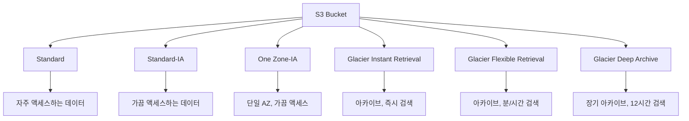
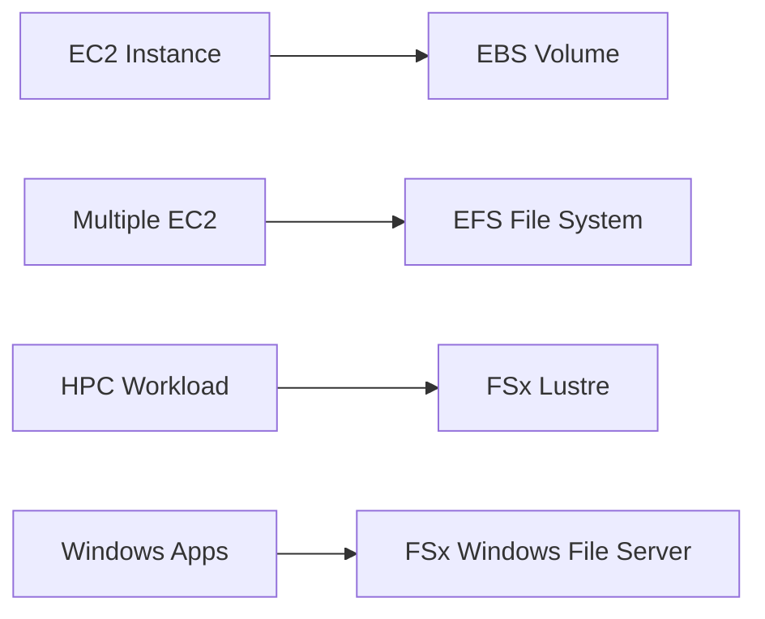
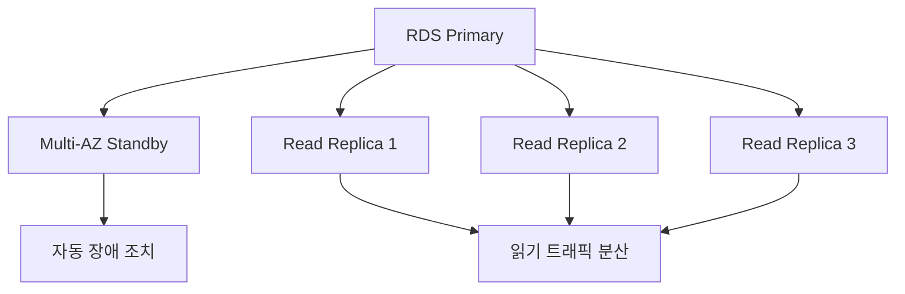
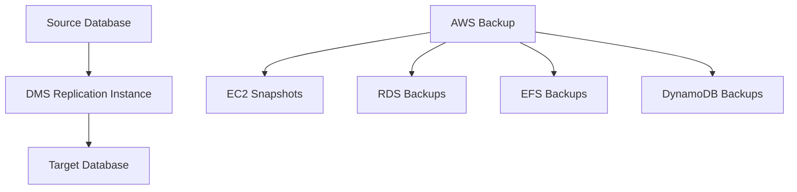
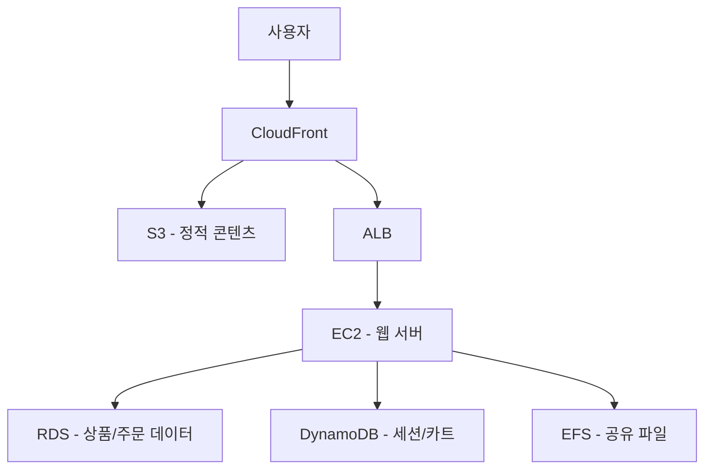
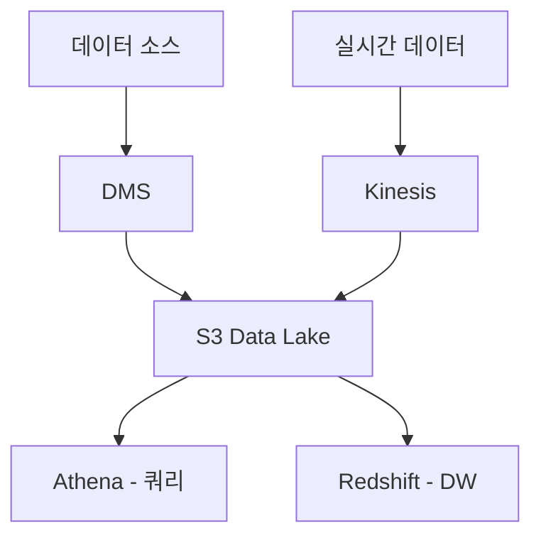

# Week 2 주간 복습: 스토리지 및 데이터베이스 서비스

## 📚 Week 2 학습 내용 요약

이번 주에는 AWS의 핵심 스토리지 및 데이터베이스 서비스들을 학습했습니다. 각 서비스의 특징과 사용 사례를 정리해보겠습니다.

## 🗂️ 스토리지 서비스 복습

### S3 (Simple Storage Service) - Day 8
**핵심 개념:**
- 객체 스토리지 서비스로 무제한 용량 제공
- 11 9's (99.999999999%) 내구성 보장
- 다양한 스토리지 클래스로 비용 최적화

**주요 기능:**
- 버전 관리 (Versioning)
- 수명 주기 정책 (Lifecycle Policies)
- 교차 리전 복제 (Cross-Region Replication)
- 정적 웹사이트 호스팅

### EBS, EFS, FSx - Day 9
**EBS (Elastic Block Store):**
- EC2 인스턴스용 블록 스토리지
- 고성능, 고가용성 보장
- 다양한 볼륨 타입 (gp3, io2, st1, sc1)

**EFS (Elastic File System):**
- 완전 관리형 NFS 파일 시스템
- 여러 EC2 인스턴스에서 동시 접근 가능
- 자동 확장/축소

**FSx:**
- 고성능 파일 시스템 (Windows File Server, Lustre)
- HPC 워크로드에 최적화

## 🗄️ 데이터베이스 서비스 복습

### RDS (Relational Database Service) - Day 10
**지원 엔진:**
- MySQL, PostgreSQL, MariaDB
- Oracle, SQL Server
- Amazon Aurora

**핵심 기능:**
- 자동 백업 및 스냅샷
- Multi-AZ 배포로 고가용성
- Read Replica로 읽기 성능 향상
- 자동 패치 및 유지보수

### DynamoDB - Day 11
**NoSQL 데이터베이스 특징:**
- 완전 관리형 서비스
- 밀리초 단위 지연 시간
- 자동 확장/축소
- 글로벌 테이블 지원

**핵심 개념:**
- 파티션 키와 정렬 키
- 프로비저닝 모드 vs 온디맨드 모드
- DynamoDB Streams
- Global Secondary Index (GSI)

## 🔄 데이터 마이그레이션 및 백업 - Day 12-13

### AWS DMS (Database Migration Service)
- 동종/이종 데이터베이스 마이그레이션
- 최소 다운타임으로 마이그레이션
- 지속적인 데이터 복제 지원

### AWS Backup
- 중앙 집중식 백업 관리
- 교차 서비스 백업 정책
- 규정 준수 및 감사 지원

## 🎯 서비스 선택 가이드

### 스토리지 서비스 선택 기준

| 요구사항 | 추천 서비스 | 이유 |
|---------|------------|------|
| 웹 애플리케이션 정적 콘텐츠 | S3 | 높은 내구성, CDN 연동 |
| EC2 인스턴스 루트 볼륨 | EBS gp3 | 범용 SSD, 비용 효율적 |
| 고성능 데이터베이스 | EBS io2 | 높은 IOPS, 낮은 지연시간 |
| 여러 인스턴스 공유 파일 | EFS | NFS 프로토콜, 자동 확장 |
| 아카이브 데이터 | S3 Glacier | 장기 보관, 저비용 |

### 데이터베이스 서비스 선택 기준

| 워크로드 특성 | 추천 서비스 | 이유 |
|-------------|------------|------|
| 관계형 데이터, ACID 필요 | RDS/Aurora | SQL 지원, 트랜잭션 |
| 높은 확장성, 빠른 응답 | DynamoDB | NoSQL, 자동 확장 |
| 복잡한 쿼리, 분석 | Aurora | MySQL/PostgreSQL 호환 |
| 키-값 저장소 | DynamoDB | 단순한 데이터 모델 |

## 🔍 실제 사용 사례

### 전자상거래 플랫폼

### 데이터 분석 플랫폼

## 💡 핵심 포인트 정리

### 1. 내구성과 가용성
- **S3**: 11 9's 내구성, 99.99% 가용성
- **EBS**: 99.999% 가용성 (io2)
- **RDS Multi-AZ**: 99.95% 가용성

### 2. 성능 특성
- **EBS gp3**: 3,000 IOPS 기본, 16,000 IOPS까지 확장
- **DynamoDB**: 한 자리 밀리초 지연시간
- **Aurora**: MySQL 대비 5배, PostgreSQL 대비 3배 성능

### 3. 비용 최적화
- **S3 Intelligent Tiering**: 자동 비용 최적화
- **RDS Reserved Instances**: 최대 72% 비용 절감
- **DynamoDB On-Demand**: 사용한 만큼만 지불

### 4. 보안 기능
- **암호화**: 저장 시/전송 시 암호화 지원
- **IAM 통합**: 세밀한 권한 제어
- **VPC 엔드포인트**: 프라이빗 연결

## 🚀 다음 주 준비사항

Week 3에서는 애플리케이션 서비스와 배포에 대해 학습합니다:
- Load Balancing과 Auto Scaling
- CloudFront와 CDN
- Route 53과 DNS
- 서버리스 서비스 (Lambda, API Gateway)
- 컨테이너 서비스 (ECS, EKS)

이번 주에 학습한 스토리지와 데이터베이스 지식이 다음 주 애플리케이션 아키텍처 설계에 기반이 됩니다.

## 📝 복습 체크리스트

- [ ] S3 스토리지 클래스별 특징과 사용 사례 이해
- [ ] EBS 볼륨 타입별 성능 특성 파악
- [ ] RDS와 DynamoDB의 차이점과 선택 기준 이해
- [ ] 데이터 마이그레이션 전략과 도구 활용법 숙지
- [ ] 백업 및 재해 복구 모범 사례 이해
- [ ] 각 서비스의 비용 최적화 방법 파악