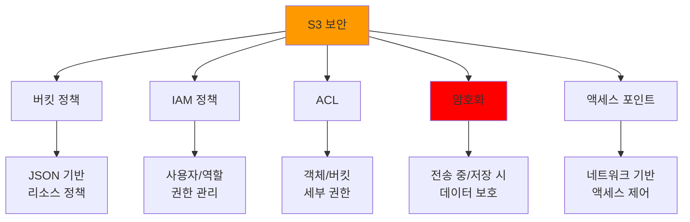
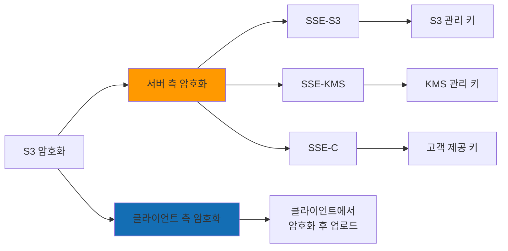
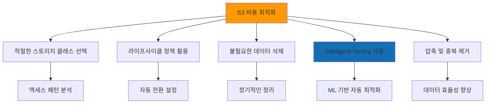
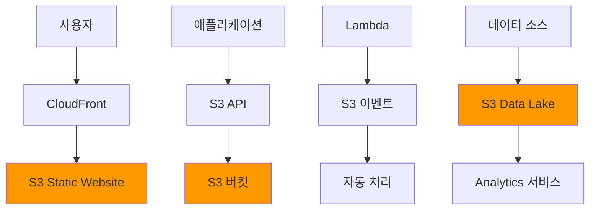
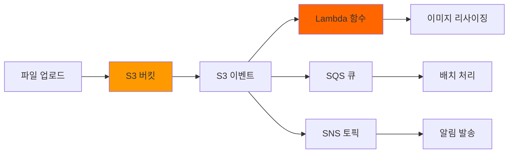

# Day 8: Amazon S3 (Simple Storage Service)

## 학습 목표
- Amazon S3의 핵심 개념과 특징 이해
- S3 스토리지 클래스별 특성과 사용 사례 파악
- S3 보안 및 액세스 제어 방법 학습
- S3 버전 관리 및 라이프사이클 정책 이해
- S3 성능 최적화 및 비용 관리 방법 습득

## 1. Amazon S3 개요

Amazon S3(Simple Storage Service)는 AWS의 대표적인 객체 스토리지 서비스입니다. 웹 어디서나 원하는 양의 데이터를 저장하고 검색할 수 있는 확장 가능한 스토리지 인프라를 제공합니다.

### S3의 핵심 특징
- **무제한 확장성**: 사실상 무제한의 스토리지 용량
- **높은 내구성**: 99.999999999%(11 9's)의 데이터 내구성
- **고가용성**: 99.99%의 가용성 SLA 제공
- **다양한 스토리지 클래스**: 비용과 성능에 따른 선택 옵션
- **강력한 보안**: 암호화, 액세스 제어, 감사 기능

### S3 아키텍처 개념

```mermaid
graph TB
    A[사용자/애플리케이션] --> B[Amazon S3]
    B --> C[버킷 Bucket]
    C --> D[객체 Object]
    C --> E[객체 Object]
    C --> F[객체 Object]
    
    G[리전 Region] --> H[가용 영역 AZ-1]
    G --> I[가용 영역 AZ-2]
    G --> J[가용 영역 AZ-3]
    
    H --> K[S3 스토리지]
    I --> L[S3 스토리지]
    J --> M[S3 스토리지]
    
    style B fill:#ff9900
    style C fill:#232f3e
    style D fill:#146eb4
    style E fill:#146eb4
    style F fill:#146eb4
```



## 2. S3 핵심 구성 요소

### 2.1 버킷 (Bucket)
버킷은 S3에서 객체를 저장하는 컨테이너입니다.

**버킷 특징:**
- 전역적으로 고유한 이름 필요
- 리전별로 생성되지만 이름은 전역 네임스페이스
- 버킷당 객체 수 제한 없음
- 중첩 불가 (버킷 안에 버킷 생성 불가)

### 2.2 객체 (Object)
S3에 저장되는 기본 엔티티로, 파일과 메타데이터로 구성됩니다.

**객체 특징:**
- 최대 5TB 크기
- 키(Key)로 식별 (파일 경로와 유사)
- 메타데이터 포함 가능
- 버전 관리 지원

### S3 데이터 구조 시각화

```mermaid
graph LR
    A[my-company-bucket] --> B[documents/]
    A --> C[images/]
    A --> D[logs/]
    
    B --> E[report.pdf]
    B --> F[presentation.pptx]
    
    C --> G[logo.png]
    C --> H[banner.jpg]
    
    D --> I[2024/01/app.log]
    D --> J[2024/02/app.log]
    
    style A fill:#ff9900
    style B fill:#232f3e
    style C fill:#232f3e
    style D fill:#232f3e
```



## 3. S3 스토리지 클래스

S3는 다양한 액세스 패턴과 비용 요구사항에 맞는 여러 스토리지 클래스를 제공합니다.

### 스토리지 클래스 비교

```mermaid
graph TB
    A[S3 스토리지 클래스] --> B[Standard]
    A --> C[Standard-IA]
    A --> D[One Zone-IA]
    A --> E[Glacier Instant Retrieval]
    A --> F[Glacier Flexible Retrieval]
    A --> G[Glacier Deep Archive]
    A --> H[Intelligent-Tiering]
    
    B --> B1[즉시 액세스<br/>높은 비용]
    C --> C1[즉시 액세스<br/>중간 비용<br/>최소 30일]
    D --> D1[즉시 액세스<br/>낮은 비용<br/>단일 AZ]
    E --> E1[즉시 액세스<br/>아카이브 비용]
    F --> F1[1-5분 검색<br/>매우 낮은 비용]
    G --> G1[12시간 검색<br/>최저 비용]
    H --> H1[자동 최적화<br/>ML 기반]
    
    style B fill:#ff9900
    style C fill:#ff6600
    style D fill:#cc5500
    style E fill:#0073bb
    style F fill:#004d7a
    style G fill:#003366
    style H fill:#146eb4
```



### 3.1 Standard 클래스
- **사용 사례**: 자주 액세스하는 데이터
- **특징**: 즉시 액세스, 높은 처리량
- **내구성**: 99.999999999%
- **가용성**: 99.99%

### 3.2 Standard-IA (Infrequent Access)
- **사용 사례**: 자주 액세스하지 않지만 즉시 필요한 데이터
- **특징**: Standard보다 저렴, 검색 요금 발생
- **최소 보관 기간**: 30일

### 3.3 One Zone-IA
- **사용 사례**: 재생성 가능한 데이터
- **특징**: 단일 가용 영역, 더 저렴한 비용
- **위험**: AZ 장애 시 데이터 손실 가능

### 3.4 Glacier 클래스들
- **Instant Retrieval**: 즉시 액세스 가능한 아카이브
- **Flexible Retrieval**: 1-5분 검색 시간
- **Deep Archive**: 12시간 검색, 최저 비용

## 4. S3 보안 및 액세스 제어

### 4.1 보안 계층 구조



### 4.2 버킷 정책 예시
```json
{
  "Version": "2012-10-17",
  "Statement": [
    {
      "Sid": "PublicReadGetObject",
      "Effect": "Allow",
      "Principal": "*",
      "Action": "s3:GetObject",
      "Resource": "arn:aws:s3:::my-bucket/*"
    }
  ]
}
```

### 4.3 암호화 옵션



## 5. S3 고급 기능

### 5.1 버전 관리 (Versioning)
- 동일한 키에 대해 여러 버전 유지
- 실수로 삭제/수정된 객체 복구 가능
- 추가 스토리지 비용 발생

### 5.2 라이프사이클 정책
객체의 생명주기에 따라 자동으로 스토리지 클래스 전환 또는 삭제

```mermaid
graph LR
    A[Standard] --> B[Standard-IA]
    B --> C[Glacier]
    C --> D[Deep Archive]
    D --> E[삭제]
    
    A1[0일] --> A
    B1[30일] --> B
    C1[90일] --> C
    D1[365일] --> D
    E1[2555일] --> E
    
    style A fill:#ff9900
    style B fill:#ff6600
    style C fill:#0073bb
    style D fill:#003366
    style E fill:#ff0000
```



### 5.3 Cross-Region Replication (CRR)
- 다른 리전으로 객체 자동 복제
- 재해 복구 및 지연 시간 최적화
- 버전 관리 필수

### 5.4 S3 Transfer Acceleration
- CloudFront 엣지 로케이션 활용
- 전 세계에서 S3로의 업로드 속도 향상
- 추가 비용 발생

## 6. S3 성능 최적화

### 6.1 요청 패턴 최적화
- **핫스팟 방지**: 순차적 키 이름 피하기
- **프리픽스 분산**: 랜덤 문자로 시작하는 키 사용
- **멀티파트 업로드**: 100MB 이상 파일에 권장

### 6.2 성능 지표
- **요청 속도**: 프리픽스당 초당 3,500 PUT/COPY/POST/DELETE, 5,500 GET/HEAD
- **대역폭**: 리전당 무제한
- **지연 시간**: 첫 바이트까지 100-200ms

## 7. S3 비용 최적화

### 7.1 비용 구성 요소
- **스토리지 비용**: 저장된 데이터 양
- **요청 비용**: API 호출 횟수
- **데이터 전송 비용**: 인터넷으로의 아웃바운드 전송
- **관리 기능 비용**: 인벤토리, 분석 등

### 7.2 비용 최적화 전략



## 8. S3 모니터링 및 로깅

### 8.1 CloudWatch 메트릭
- **BucketSizeBytes**: 버킷 크기
- **NumberOfObjects**: 객체 수
- **AllRequests**: 총 요청 수
- **4xxErrors/5xxErrors**: 오류 요청 수

### 8.2 S3 액세스 로깅
- 버킷에 대한 모든 요청 기록
- 보안 감사 및 액세스 패턴 분석
- 대상 버킷에 로그 파일 저장

### 8.3 CloudTrail 통합
- S3 API 호출 추적
- 관리 이벤트 및 데이터 이벤트 로깅
- 보안 및 규정 준수 요구사항 충족

## 9. S3 사용 사례 및 패턴

### 9.1 일반적인 사용 사례
- **정적 웹사이트 호스팅**: HTML, CSS, JS 파일 제공
- **백업 및 아카이브**: 데이터 장기 보관
- **데이터 레이크**: 빅데이터 분석을 위한 원시 데이터 저장
- **콘텐츠 배포**: CloudFront와 연동한 글로벌 배포
- **애플리케이션 데이터**: 사용자 업로드 파일, 로그 등

### 9.2 아키텍처 패턴



## 10. S3와 다른 AWS 서비스 통합

### 10.1 주요 통합 서비스
- **Lambda**: S3 이벤트 트리거로 서버리스 처리
- **CloudFront**: 글로벌 콘텐츠 배포
- **Athena**: S3 데이터 직접 쿼리
- **Glue**: 데이터 카탈로그 및 ETL
- **EMR**: 빅데이터 처리
- **Redshift**: 데이터 웨어하우스 로딩

### 10.2 이벤트 기반 아키텍처



## 학습 정리

### 핵심 포인트
1. **S3는 객체 스토리지**: 파일 시스템이 아닌 키-값 저장소
2. **스토리지 클래스 선택**: 액세스 패턴에 따른 비용 최적화
3. **보안 계층화**: 버킷 정책, IAM, 암호화 조합 사용
4. **성능 최적화**: 키 네이밍과 멀티파트 업로드 중요
5. **비용 관리**: 라이프사이클 정책과 모니터링 필수

### 다음 학습 예고
내일(Day 9)에는 EBS, EFS, FSx 등 다른 스토리지 서비스들을 학습하여 S3와의 차이점과 각각의 사용 사례를 비교해보겠습니다.

## 추가 학습 자료
- [AWS S3 사용자 가이드](https://docs.aws.amazon.com/s3/latest/userguide/)
- [S3 스토리지 클래스 비교](https://aws.amazon.com/s3/storage-classes/)
- [S3 보안 모범 사례](https://docs.aws.amazon.com/s3/latest/userguide/security-best-practices.html)
- [S3 성능 최적화](https://docs.aws.amazon.com/s3/latest/userguide/optimizing-performance.html)