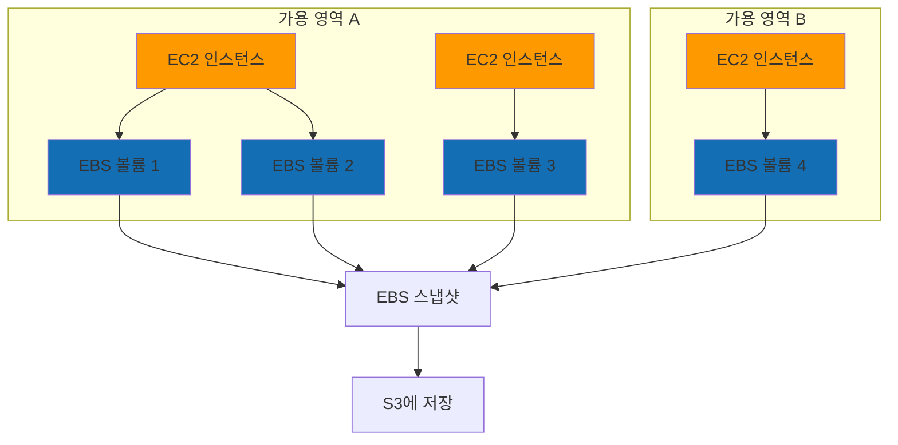
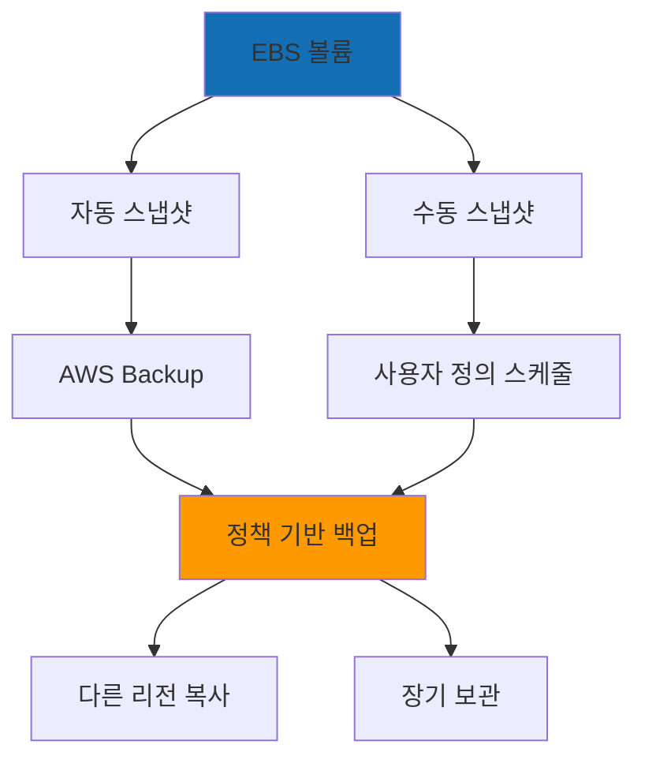

# Day 9: EBS, EFS, FSx - AWS 스토리지 서비스

## 학습 목표
- EBS 볼륨 유형별 성능 특성과 사용 사례 이해
- EFS를 활용한 공유 파일 시스템 구성 방법 습득
- FSx 서비스의 특징과 활용 방안 학습
- 스토리지 성능 최적화 및 비용 관리 전략 개발
- 각 스토리지 서비스의 적절한 선택 기준 파악

## 1. AWS 스토리지 서비스 개요

어제 S3를 학습했는데, 오늘은 다른 유형의 스토리지 서비스들을 알아보겠습니다. AWS는 다양한 스토리지 요구사항을 충족하기 위해 여러 서비스를 제공합니다.

### AWS 스토리지 서비스 분류

```mermaid
graph TB
    A[AWS 스토리지 서비스] --> B[객체 스토리지]
    A --> C[블록 스토리지]
    A --> D[파일 스토리지]
    
    B --> B1[S3<br/>Simple Storage Service]
    B --> B2[Glacier<br/>아카이브 스토리지]
    
    C --> C1[EBS<br/>Elastic Block Store]
    C --> C2[Instance Store<br/>임시 스토리지]
    
    D --> D1[EFS<br/>Elastic File System]
    D --> D2[FSx<br/>완전 관리형 파일 시스템]
    
    style B1 fill:#ff9900
    style C1 fill:#146eb4
    style D1 fill:#232f3e
    style D2 fill:#ff6600
```

### 스토리지 유형별 특징 비교

| 특징 | 객체 스토리지 (S3) | 블록 스토리지 (EBS) | 파일 스토리지 (EFS/FSx) |
|------|-------------------|-------------------|----------------------|
| **액세스 방식** | REST API, HTTP | 운영체제 파일시스템 | NFS, SMB 프로토콜 |
| **확장성** | 무제한 | 볼륨당 제한 | 자동 확장 |
| **동시 액세스** | 무제한 | 단일 인스턴스 | 다중 인스턴스 |
| **사용 사례** | 웹 콘텐츠, 백업 | OS, 데이터베이스 | 공유 파일, 콘텐츠 저장소 |

## 2. Amazon EBS (Elastic Block Store)

EBS는 EC2 인스턴스에 연결하여 사용하는 블록 레벨 스토리지 서비스입니다. 운영체제에서 일반적인 하드 드라이브처럼 인식됩니다.

### 2.1 EBS 핵심 개념

**EBS 볼륨의 특징:**
- EC2 인스턴스와 독립적으로 존재
- 가용 영역(AZ) 내에서만 연결 가능
- 스냅샷을 통한 백업 및 복제
- 암호화 지원
- 크기 및 성능 동적 조정 가능

### EBS 아키텍처

### 2.2 EBS 볼륨 유형

EBS는 성능과 비용에 따라 여러 볼륨 유형을 제공합니다.

#### SSD 기반 볼륨

**gp3 (General Purpose SSD v3)**
- **기본 성능**: 3,000 IOPS, 125 MB/s
- **최대 성능**: 16,000 IOPS, 1,000 MB/s
- **용량**: 1 GiB - 16 TiB
- **사용 사례**: 일반적인 워크로드, 가상 데스크톱
- **특징**: 성능과 비용 독립적으로 조정 가능

**gp2 (General Purpose SSD v2)**
- **성능**: 볼륨 크기에 비례 (3 IOPS/GiB)
- **기본 성능**: 100-16,000 IOPS
- **버스트**: 최대 3,000 IOPS (볼륨이 작을 때)
- **사용 사례**: 기존 워크로드, 호환성 필요시

**io2 Block Express**
- **최대 성능**: 256,000 IOPS, 4,000 MB/s
- **용량**: 4 GiB - 64 TiB
- **내구성**: 99.999% (일반 EBS 대비 100배 향상)
- **사용 사례**: 미션 크리티컬 애플리케이션

**io2**
- **최대 성능**: 64,000 IOPS, 1,000 MB/s
- **용량**: 4 GiB - 16 TiB
- **사용 사례**: 고성능 데이터베이스

**io1**
- **최대 성능**: 64,000 IOPS, 1,000 MB/s
- **사용 사례**: 레거시 워크로드

#### HDD 기반 볼륨

**st1 (Throughput Optimized HDD)**
- **최대 처리량**: 500 MB/s
- **용량**: 125 GiB - 16 TiB
- **사용 사례**: 빅데이터, 로그 처리, 데이터 웨어하우스

**sc1 (Cold HDD)**
- **최대 처리량**: 250 MB/s
- **용량**: 125 GiB - 16 TiB
- **사용 사례**: 자주 액세스하지 않는 데이터

### EBS 볼륨 유형 성능 비교

```mermaid
graph LR
    A[EBS 볼륨 유형] --> B[SSD 기반]
    A --> C[HDD 기반]
    
    B --> D[gp3<br/>범용 최신]
    B --> E[gp2<br/>범용 기존]
    B --> F[io2 Block Express<br/>최고 성능]
    B --> G[io2/io1<br/>프로비저닝 IOPS]
    
    C --> H[st1<br/>처리량 최적화]
    C --> I[sc1<br/>콜드 스토리지]
    
    D --> D1[3K-16K IOPS<br/>125-1000 MB/s]
    E --> E1[100-16K IOPS<br/>크기 비례]
    F --> F1[최대 256K IOPS<br/>4000 MB/s]
    G --> G1[최대 64K IOPS<br/>1000 MB/s]
    H --> H1[최대 500 MB/s<br/>빅데이터용]
    I --> I1[최대 250 MB/s<br/>아카이브용]
    
    style D fill:#ff9900
    style F fill:#ff0000
    style H fill:#146eb4
    style I fill:#232f3e
```

### 2.3 EBS 고급 기능

#### Multi-Attach
- 하나의 EBS 볼륨을 여러 EC2 인스턴스에 동시 연결
- io1, io2, io2 Block Express만 지원
- 클러스터 파일 시스템 필요
- 최대 16개 인스턴스까지 연결 가능

#### EBS 스냅샷
- 볼륨의 특정 시점 백업
- S3에 증분식으로 저장
- 다른 AZ나 리전으로 복사 가능
- 스냅샷에서 새 볼륨 생성 가능

#### EBS 암호화
- 볼륨, 스냅샷, 볼륨에서 생성된 스냅샷 모두 암호화
- AWS KMS 키 사용
- 성능 영향 최소화
- 기본 암호화 설정 가능

## 3. Amazon EFS (Elastic File System)

EFS는 여러 EC2 인스턴스가 동시에 액세스할 수 있는 완전 관리형 NFS 파일 시스템입니다.

### 3.1 EFS 핵심 특징

**주요 특징:**
- **완전 관리형**: 서버 관리 불필요
- **자동 확장**: 페타바이트까지 자동 확장
- **다중 AZ 액세스**: 리전 내 모든 AZ에서 접근 가능
- **POSIX 호환**: 표준 파일 시스템 의미론 지원
- **동시 액세스**: 수천 개의 EC2 인스턴스 동시 연결

### EFS 아키텍처

```mermaid
graph TB
    subgraph "VPC"
        subgraph "가용 영역 A"
            A[EC2 인스턴스] --> D[EFS 마운트 타겟]
            B[EC2 인스턴스] --> D
        end
        
        subgraph "가용 영역 B"
            C[EC2 인스턴스] --> E[EFS 마운트 타겟]
        end
        
        subgraph "가용 영역 C"
            F[EC2 인스턴스] --> G[EFS 마운트 타겟]
        end
    end
    
    D --> H[EFS 파일 시스템]
    E --> H
    G --> H
    
    H --> I[자동 백업]
    H --> J[암호화]
    
    style A fill:#ff9900
    style B fill:#ff9900
    style C fill:#ff9900
    style F fill:#ff9900
    style H fill:#232f3e
```

### 3.2 EFS 성능 모드

#### 성능 모드
**General Purpose (기본)**
- 지연 시간: 가장 낮음
- 최대 7,000 파일 작업/초
- 대부분의 사용 사례에 적합

**Max I/O**
- 더 높은 처리량과 IOPS
- 약간 높은 지연 시간
- 10,000+ 파일 작업/초

#### 처리량 모드
**Provisioned Throughput**
- 필요한 처리량을 미리 지정
- 스토리지 크기와 독립적
- 예측 가능한 성능

**Bursting Throughput (기본)**
- 파일 시스템 크기에 비례
- 크레딧 시스템 사용
- 일시적으로 높은 처리량 가능

### 3.3 EFS 스토리지 클래스

```mermaid
graph LR
    A[EFS 스토리지 클래스] --> B[Standard]
    A --> C[Standard-IA]
    
    B --> B1[자주 액세스<br/>높은 성능<br/>높은 비용]
    C --> C1[가끔 액세스<br/>낮은 비용<br/>검색 요금]
    
    D[Intelligent Tiering] --> E[자동 이동<br/>30일 기준]
    
    B --> E
    C --> E
    
    style B fill:#ff9900
    style C fill:#146eb4
    style D fill:#232f3e
```

### 3.4 EFS 액세스 포인트
- 파일 시스템에 대한 애플리케이션별 진입점
- POSIX 사용자 및 그룹 정보 적용
- 루트 디렉터리 지정 가능
- 세밀한 액세스 제어

## 4. Amazon FSx

FSx는 완전 관리형 파일 시스템으로, 특정 워크로드에 최적화된 고성능 파일 시스템을 제공합니다.

### 4.1 FSx 서비스 유형

```mermaid
graph TB
    A[Amazon FSx] --> B[FSx for Windows File Server]
    A --> C[FSx for Lustre]
    A --> D[FSx for NetApp ONTAP]
    A --> E[FSx for OpenZFS]
    
    B --> B1[Windows 환경<br/>SMB 프로토콜<br/>Active Directory 통합]
    C --> C1[고성능 컴퓨팅<br/>ML/AI 워크로드<br/>S3 통합]
    D --> D1[엔터프라이즈 워크로드<br/>멀티 프로토콜<br/>데이터 관리 기능]
    E --> E1[Linux 워크로드<br/>높은 성능<br/>스냅샷 기능]
    
    style B fill:#0073bb
    style C fill:#ff9900
    style D fill:#146eb4
    style E fill:#232f3e
```

### 4.2 FSx for Windows File Server

**주요 특징:**
- 완전 관리형 Windows 파일 시스템
- SMB 프로토콜 지원
- Active Directory 통합
- Windows 기반 애플리케이션과 완벽 호환

**사용 사례:**
- Windows 기반 애플리케이션
- 홈 디렉터리
- 콘텐츠 저장소
- 비즈니스 애플리케이션

### 4.3 FSx for Lustre

**주요 특징:**
- 고성능 병렬 파일 시스템
- S3와 긴밀한 통합
- 수백 GB/s 처리량
- 수백만 IOPS

**사용 사례:**
- 고성능 컴퓨팅 (HPC)
- 머신러닝 훈련
- 미디어 처리
- 전자 설계 자동화 (EDA)

### FSx for Lustre와 S3 통합

### 4.4 FSx for NetApp ONTAP

**주요 특징:**
- NetApp ONTAP 파일 시스템
- NFS, SMB, iSCSI 프로토콜 지원
- 고급 데이터 관리 기능
- 스냅샷, 클론, 복제

**사용 사례:**
- 엔터프라이즈 애플리케이션
- 데이터베이스
- 가상화 환경
- 콘텐츠 배포

### 4.5 FSx for OpenZFS

**주요 특징:**
- OpenZFS 파일 시스템
- 높은 성능과 데이터 무결성
- 압축 및 중복 제거
- 스냅샷 및 클론

**사용 사례:**
- Linux 기반 워크로드
- 데이터베이스
- 분석 워크로드
- 미디어 및 엔터테인먼트

## 5. 스토리지 서비스 선택 가이드

### 5.1 사용 사례별 권장 서비스

```mermaid
graph TB
    A[스토리지 요구사항] --> B{액세스 패턴}
    
    B -->|단일 인스턴스<br/>블록 레벨| C[EBS]
    B -->|다중 인스턴스<br/>파일 공유| D[EFS]
    B -->|웹 액세스<br/>객체 저장| E[S3]
    B -->|특수 워크로드<br/>고성능| F[FSx]
    
    C --> C1[OS 디스크<br/>데이터베이스<br/>파일 시스템]
    D --> D1[공유 스토리지<br/>콘텐츠 저장소<br/>홈 디렉터리]
    E --> E1[웹 콘텐츠<br/>백업<br/>데이터 레이크]
    F --> F1[HPC<br/>Windows 환경<br/>엔터프라이즈]
    
    style C fill:#146eb4
    style D fill:#232f3e
    style E fill:#ff9900
    style F fill:#ff6600
```

### 5.2 성능 요구사항별 선택

| 요구사항 | 권장 서비스 | 볼륨/클래스 |
|----------|-------------|-------------|
| **높은 IOPS** | EBS | io2 Block Express |
| **높은 처리량** | EBS | st1, gp3 |
| **공유 액세스** | EFS | General Purpose |
| **HPC 워크로드** | FSx | Lustre |
| **Windows 환경** | FSx | Windows File Server |
| **비용 최적화** | EBS | gp3, sc1 |

### 5.3 비용 고려사항

**EBS 비용 요소:**
- 프로비저닝된 스토리지 용량
- IOPS (io1, io2의 경우)
- 처리량 (gp3의 경우)
- 스냅샷 스토리지

**EFS 비용 요소:**
- 사용된 스토리지 용량
- 스토리지 클래스 (Standard vs IA)
- 프로비저닝된 처리량 (선택 시)

**FSx 비용 요소:**
- 파일 시스템 크기
- 처리량 용량
- 백업 스토리지

## 6. 스토리지 성능 최적화

### 6.1 EBS 성능 최적화

**볼륨 최적화:**
- 적절한 볼륨 유형 선택
- 인스턴스 유형과 볼륨 성능 매칭
- EBS 최적화 인스턴스 사용

**애플리케이션 최적화:**
- I/O 큐 깊이 조정
- 멀티 스레딩 활용
- 적절한 블록 크기 설정

### 6.2 EFS 성능 최적화

**마운트 최적화:**
- 적절한 마운트 옵션 사용
- EFS 유틸리티 활용
- 병렬 연결 구성

**애플리케이션 최적화:**
- 파일 크기와 I/O 패턴 고려
- 캐싱 전략 구현
- 적절한 성능 모드 선택

### 6.3 성능 모니터링

**CloudWatch 메트릭:**
- EBS: VolumeReadOps, VolumeWriteOps, VolumeThroughputPercentage
- EFS: TotalIOBytes, MetadataIOBytes, PercentIOLimit
- FSx: DataReadBytes, DataWriteBytes, MetadataOperations

## 7. 백업 및 재해 복구

### 7.1 EBS 백업 전략

### 7.2 EFS 백업

**자동 백업:**
- AWS Backup 서비스 통합
- 정책 기반 백업 스케줄
- 포인트인타임 복구

**수동 백업:**
- EFS-to-EFS 백업 솔루션
- 사용자 정의 스크립트
- 타사 백업 도구

### 7.3 FSx 백업

**자동 백업:**
- 일일 자동 백업
- 사용자 정의 백업 윈도우
- 최대 90일 보관

**사용자 시작 백업:**
- 온디맨드 백업
- 장기 보관 가능
- 다른 리전으로 복사

## 8. 보안 및 액세스 제어

### 8.1 암호화

**EBS 암호화:**
- 저장 시 암호화
- 전송 중 암호화
- AWS KMS 키 관리

**EFS 암호화:**
- 저장 시 암호화
- 전송 중 암호화 (TLS)
- 액세스 포인트 기반 제어

**FSx 암호화:**
- 저장 시 암호화
- 전송 중 암호화
- 서비스별 암호화 옵션

### 8.2 액세스 제어

```mermaid
graph TB
    A[스토리지 액세스 제어] --> B[IAM 정책]
    A --> C[VPC 보안 그룹]
    A --> D[NACL]
    A --> E[리소스 기반 정책]
    
    B --> B1[사용자/역할 권한]
    C --> C1[네트워크 레벨 제어]
    D --> D1[서브넷 레벨 제어]
    E --> E1[리소스별 정책]
    
    F[EFS 액세스 포인트] --> G[애플리케이션별 제어]
    H[FSx 보안 그룹] --> I[프로토콜별 제어]
    
    style A fill:#ff9900
    style F fill:#232f3e
    style H fill:#ff6600
```

## 9. 마이그레이션 및 데이터 전송

### 9.1 온프레미스에서 AWS로

**EBS 마이그레이션:**
- AWS Server Migration Service
- CloudEndure Migration
- VM Import/Export

**EFS 마이그레이션:**
- AWS DataSync
- EFS 유틸리티
- 병렬 전송 도구

**FSx 마이그레이션:**
- AWS DataSync
- 서비스별 마이그레이션 도구
- 하이브리드 구성

### 9.2 데이터 전송 서비스

```mermaid
graph LR
    A[온프레미스] --> B[AWS DataSync]
    A --> C[AWS Storage Gateway]
    A --> D[AWS Direct Connect]
    
    B --> E[EFS/FSx]
    C --> F[하이브리드 스토리지]
    D --> G[전용 네트워크 연결]
    
    H[대용량 데이터] --> I[AWS Snow Family]
    I --> J[물리적 전송]
    
    style A fill:#232f3e
    style E fill:#ff9900
    style I fill:#146eb4
```

## 10. 비용 최적화 전략

### 10.1 EBS 비용 최적화

**볼륨 최적화:**
- 사용하지 않는 볼륨 삭제
- 적절한 볼륨 유형 선택
- gp2에서 gp3로 마이그레이션

**스냅샷 관리:**
- 불필요한 스냅샷 삭제
- 스냅샷 라이프사이클 정책
- 증분 백업 활용

### 10.2 EFS 비용 최적화

**스토리지 클래스:**
- Intelligent Tiering 활용
- IA 클래스 수동 관리
- 액세스 패턴 분석

**성능 모드:**
- 적절한 처리량 모드 선택
- 프로비저닝된 처리량 최적화
- 사용량 모니터링

### 10.3 FSx 비용 최적화

**용량 계획:**
- 적절한 파일 시스템 크기
- 처리량 용량 최적화
- 백업 정책 최적화

## 학습 정리

### 핵심 포인트
1. **EBS는 블록 스토리지**: EC2 인스턴스의 하드 드라이브 역할
2. **EFS는 공유 파일 시스템**: 여러 인스턴스가 동시 액세스
3. **FSx는 특수 목적**: 고성능 또는 특정 프로토콜 요구사항
4. **성능과 비용 트레이드오프**: 요구사항에 맞는 적절한 선택
5. **백업과 보안**: 데이터 보호를 위한 필수 구성

### 스토리지 선택 체크리스트
- [ ] 단일 vs 다중 인스턴스 액세스 필요성
- [ ] 성능 요구사항 (IOPS, 처리량)
- [ ] 프로토콜 요구사항 (NFS, SMB, 블록)
- [ ] 비용 예산 및 최적화 필요성
- [ ] 백업 및 재해 복구 요구사항
- [ ] 보안 및 규정 준수 요구사항

### 다음 학습 예고
내일(Day 10)에는 RDS(Relational Database Service)를 학습하여 관계형 데이터베이스 서비스의 특징과 관리 방법을 알아보겠습니다.

## 추가 학습 자료
- [Amazon EBS 사용자 가이드](https://docs.aws.amazon.com/ebs/latest/userguide/)
- [Amazon EFS 사용자 가이드](https://docs.aws.amazon.com/efs/latest/ug/)
- [Amazon FSx 사용자 가이드](https://docs.aws.amazon.com/fsx/)
- [AWS 스토리지 서비스 개요](https://aws.amazon.com/products/storage/)