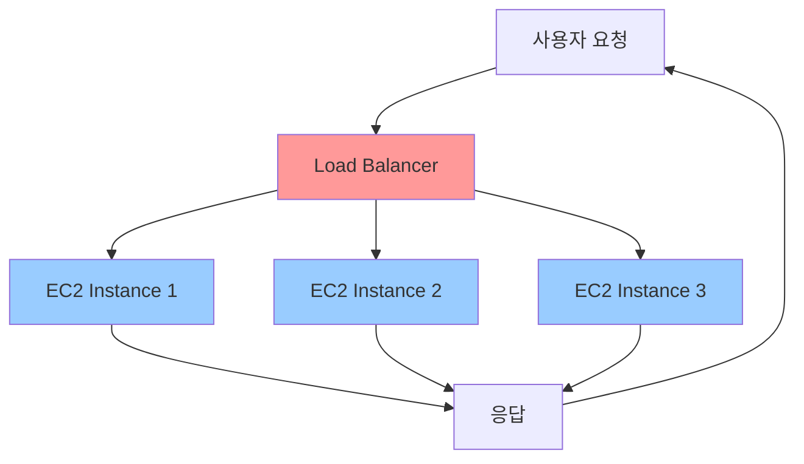
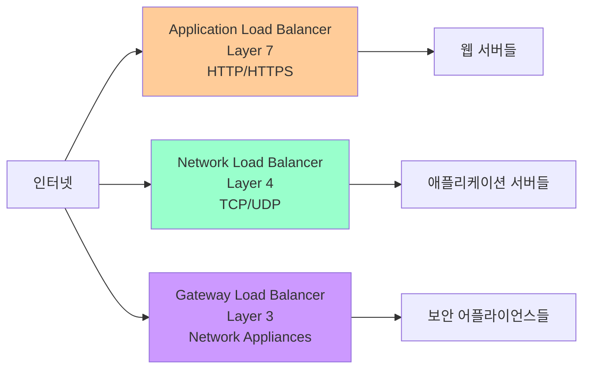
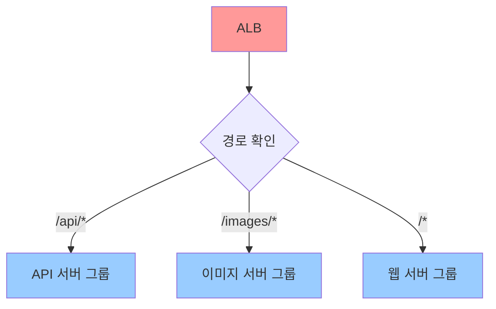
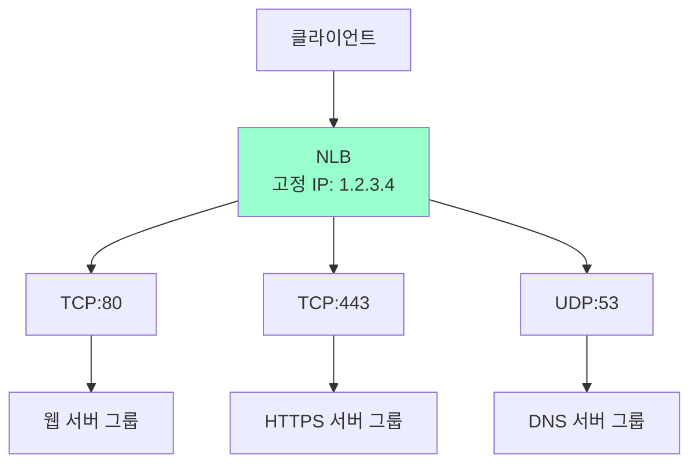
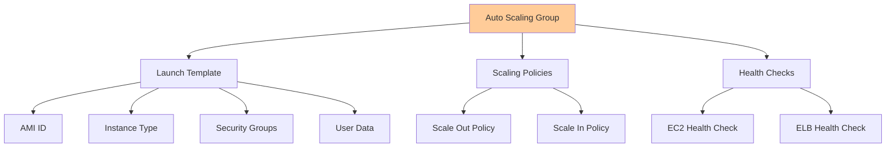
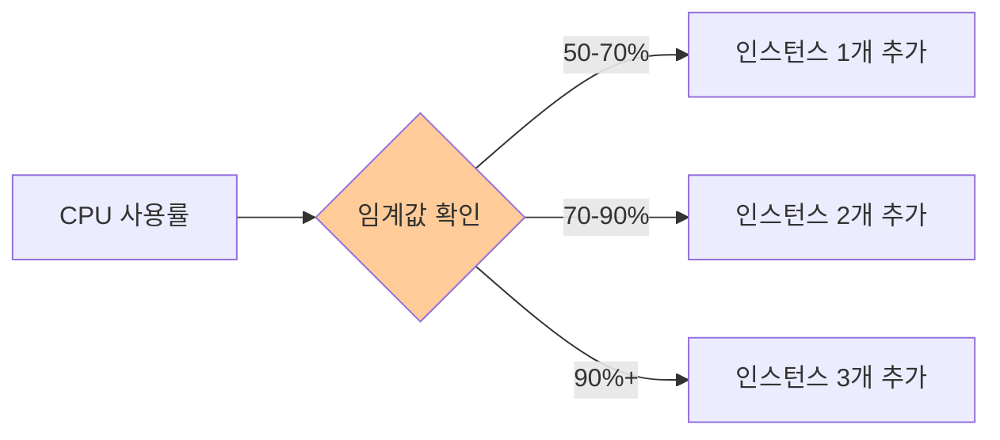
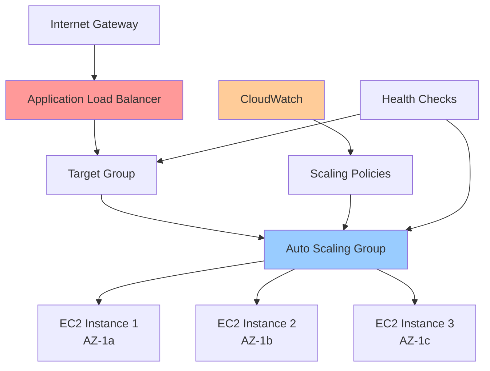
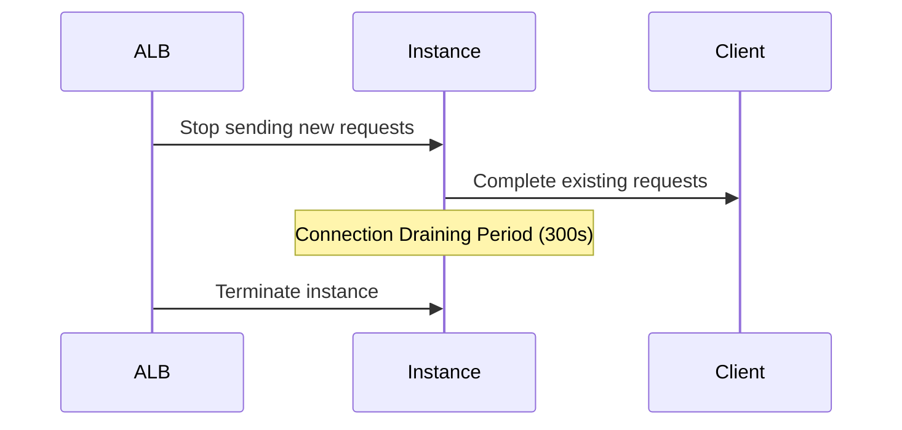
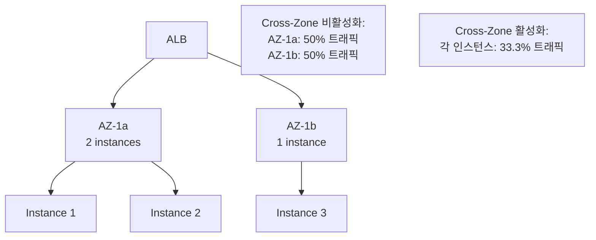
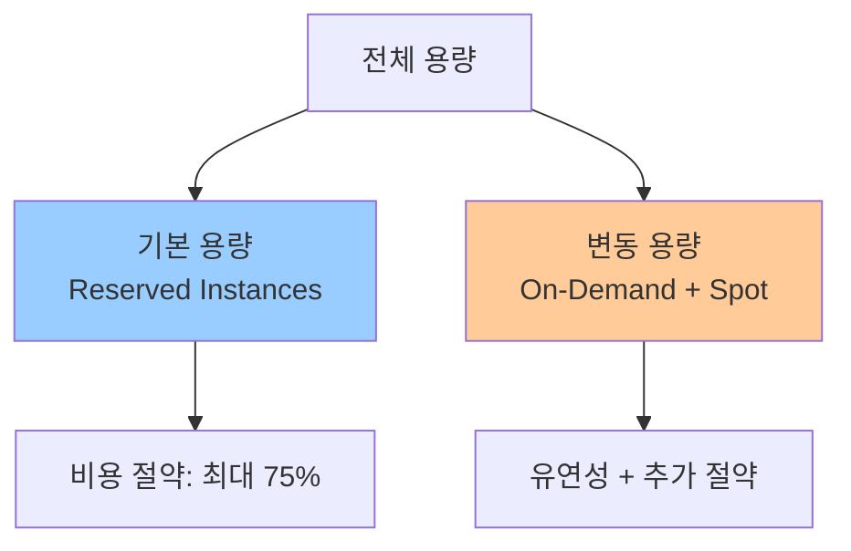

# Day 15: Load Balancing & Auto Scaling

## 학습 목표
- Elastic Load Balancer (ELB)의 종류와 특징 이해
- Application Load Balancer (ALB)와 Network Load Balancer (NLB) 차이점 파악
- Auto Scaling Group의 동작 원리와 정책 설정 방법 학습
- Load Balancer와 Auto Scaling의 연동 방식 이해
- 고가용성과 확장성을 위한 아키텍처 설계 능력 습득

## 개요

안녕하세요! 오늘은 AWS의 핵심 서비스 중 하나인 Load Balancing과 Auto Scaling에 대해 알아보겠습니다. 

웹 애플리케이션을 운영하다 보면 "갑자기 사용자가 몰려서 서버가 다운됐어요!" 같은 상황을 겪게 됩니다. 이런 문제를 해결하기 위해 AWS에서는 트래픽을 여러 서버에 분산시키는 Load Balancer와 필요에 따라 서버를 자동으로 늘리거나 줄이는 Auto Scaling 기능을 제공합니다.

마치 음식점에서 손님이 많아지면 직원을 더 투입하고, 한가해지면 직원 수를 줄이는 것과 같은 개념이죠!

## Load Balancing 기초

### Load Balancer란?

Load Balancer는 들어오는 트래픽을 여러 대의 서버(인스턴스)에 균등하게 분배하는 서비스입니다. 이를 통해 다음과 같은 이점을 얻을 수 있습니다:

- **고가용성**: 한 서버가 장애가 나도 다른 서버가 서비스를 계속 제공
- **확장성**: 트래픽 증가에 따라 서버를 추가하여 처리 능력 향상
- **성능 최적화**: 트래픽을 분산하여 응답 시간 단축



### AWS Load Balancer 종류

AWS에서는 세 가지 타입의 Load Balancer를 제공합니다:

#### 1. Application Load Balancer (ALB)
- **OSI 7계층**(Application Layer)에서 동작
- HTTP/HTTPS 트래픽 처리에 최적화
- 경로 기반, 호스트 기반 라우팅 지원
- WebSocket, HTTP/2 지원

#### 2. Network Load Balancer (NLB)
- **OSI 4계층**(Transport Layer)에서 동작
- TCP/UDP 트래픽 처리
- 초고성능, 초저지연 요구사항에 적합
- 고정 IP 주소 제공

#### 3. Gateway Load Balancer (GWLB)
- **OSI 3계층**(Network Layer)에서 동작
- 방화벽, IDS/IPS 등 네트워크 가상 어플라이언스 배포용
- GENEVE 프로토콜 사용



## Application Load Balancer (ALB) 심화

### ALB의 주요 기능

#### 1. 경로 기반 라우팅
URL 경로에 따라 다른 대상 그룹으로 트래픽을 라우팅할 수 있습니다.



#### 2. 호스트 기반 라우팅
도메인 이름에 따라 다른 서비스로 라우팅할 수 있습니다.

```
api.example.com → API 서버 그룹
admin.example.com → 관리자 서버 그룹
www.example.com → 웹 서버 그룹
```

#### 3. 헬스 체크
ALB는 주기적으로 대상 인스턴스의 상태를 확인합니다:
- **Healthy**: 정상 응답하는 인스턴스
- **Unhealthy**: 응답하지 않거나 오류를 반환하는 인스턴스

### Target Groups (대상 그룹)

Target Group은 ALB가 트래픽을 전달할 대상들의 집합입니다:

- **EC2 인스턴스**: 가장 일반적인 대상
- **IP 주소**: 온프레미스 서버나 다른 VPC의 리소스
- **Lambda 함수**: 서버리스 아키텍처
- **Application Load Balancer**: 다단계 로드 밸런싱

## Network Load Balancer (NLB) 심화

### NLB의 특징

#### 1. 초고성능
- 초당 수백만 개의 요청 처리 가능
- 마이크로초 단위의 지연 시간
- Connection-based 로드 밸런싱

#### 2. 고정 IP 주소
- 각 가용 영역마다 고정 IP 주소 제공
- 방화벽 규칙 설정이 용이
- DNS 캐싱 문제 해결

#### 3. 프로토콜 지원
- TCP, UDP, TLS 트래픽 처리
- 포트 기반 라우팅
- 프록시 프로토콜 지원



## Auto Scaling 기초

### Auto Scaling이란?

Auto Scaling은 애플리케이션의 부하에 따라 EC2 인스턴스의 수를 자동으로 조정하는 서비스입니다. 

마치 엘리베이터가 사람이 많으면 더 많은 엘리베이터를 운행하고, 적으면 일부를 대기 상태로 두는 것과 같습니다.

### Auto Scaling Group (ASG)

ASG는 Auto Scaling의 핵심 구성 요소입니다:



### Launch Template vs Launch Configuration

#### Launch Template (권장)
- 최신 기능 지원
- 버전 관리 가능
- 여러 인스턴스 타입 지원
- Spot 인스턴스 지원

#### Launch Configuration (레거시)
- 단일 인스턴스 타입만 지원
- 버전 관리 불가
- 새로운 기능 지원 제한

## Scaling Policies (확장 정책)

### 1. Target Tracking Scaling
가장 간단하고 권장되는 방식입니다. 특정 메트릭의 목표값을 설정하면 자동으로 조정됩니다.

```
예시: CPU 사용률을 70%로 유지
- CPU > 70% → 인스턴스 추가
- CPU < 70% → 인스턴스 제거
```

### 2. Step Scaling
메트릭 값의 변화 정도에 따라 단계적으로 확장/축소합니다.



### 3. Simple Scaling
단일 임계값을 기준으로 고정된 수만큼 확장/축소합니다.

### 4. Scheduled Scaling
예측 가능한 트래픽 패턴에 따라 미리 스케줄을 설정합니다.

```
예시: 매일 오전 9시에 인스턴스 5개로 확장
     매일 오후 6시에 인스턴스 2개로 축소
```

## Load Balancer와 Auto Scaling 연동

### 통합 아키텍처



### 연동의 이점

1. **자동 등록/해제**: ASG가 인스턴스를 생성하면 자동으로 Target Group에 등록
2. **헬스 체크 통합**: ELB와 EC2 헬스 체크를 모두 활용
3. **무중단 배포**: 새 인스턴스가 준비되면 기존 인스턴스를 안전하게 종료

## 고급 기능들

### 1. Connection Draining
인스턴스를 종료하기 전에 기존 연결을 안전하게 완료시키는 기능입니다.



### 2. Sticky Sessions
특정 사용자의 요청을 항상 같은 인스턴스로 보내는 기능입니다.

### 3. Cross-Zone Load Balancing
가용 영역 간 트래픽을 균등하게 분배하는 기능입니다.



## 모니터링과 로깅

### CloudWatch 메트릭

#### Load Balancer 메트릭
- **RequestCount**: 요청 수
- **TargetResponseTime**: 대상 응답 시간
- **HTTPCode_Target_2XX_Count**: 성공 응답 수
- **UnHealthyHostCount**: 비정상 호스트 수

#### Auto Scaling 메트릭
- **GroupDesiredCapacity**: 원하는 용량
- **GroupInServiceInstances**: 서비스 중인 인스턴스 수
- **GroupTotalInstances**: 전체 인스턴스 수

### Access Logs
ALB는 모든 요청에 대한 상세한 로그를 S3에 저장할 수 있습니다:

```
2023-01-15T10:30:45.123456Z app/my-loadbalancer/50dc6c495c0c9188 
192.168.1.1:47873 10.0.0.1:80 0.000 0.001 0.000 200 200 34 366 
"GET http://www.example.com:80/ HTTP/1.1" "curl/7.46.0" - - 
arn:aws:elasticloadbalancing:us-east-1:123456789012:targetgroup/my-targets/73e2d6bc24d8a067
```

## 비용 최적화 전략

### 1. 적절한 인스턴스 타입 선택
- **CPU 집약적**: C5, C6i 인스턴스
- **메모리 집약적**: R5, R6i 인스턴스
- **범용**: M5, M6i 인스턴스

### 2. Spot 인스턴스 활용
Auto Scaling Group에서 Spot 인스턴스를 혼합하여 비용을 최대 90% 절약할 수 있습니다.

### 3. 예약 인스턴스
예측 가능한 기본 용량에 대해서는 예약 인스턴스를 사용합니다.



## 보안 고려사항

### 1. Security Groups
- Load Balancer: 인터넷에서 80, 443 포트만 허용
- EC2 인스턴스: Load Balancer에서만 트래픽 허용

### 2. SSL/TLS 종료
ALB에서 SSL 인증서를 관리하여 백엔드 인스턴스의 부하를 줄입니다.

### 3. WAF 통합
AWS WAF를 ALB와 연동하여 웹 애플리케이션 공격을 방어합니다.

## 실제 사용 사례

### 사례 1: 전자상거래 웹사이트
```
평상시: 2개 인스턴스
세일 기간: 자동으로 10개까지 확장
새벽 시간: 1개 인스턴스로 축소
```

### 사례 2: 게임 서버
```
NLB 사용 (낮은 지연시간 필요)
UDP 트래픽 처리
고정 IP로 방화벽 설정 간소화
```

### 사례 3: 마이크로서비스 아키텍처
```
ALB의 경로 기반 라우팅 활용:
/user-service/* → 사용자 관리 서비스
/order-service/* → 주문 관리 서비스
/payment-service/* → 결제 서비스
```

## 문제 해결 가이드

### 일반적인 문제들

#### 1. 인스턴스가 Target Group에 등록되지 않음
- Security Group 설정 확인
- Health Check 경로 및 설정 확인
- 인스턴스의 애플리케이션 상태 확인

#### 2. Auto Scaling이 동작하지 않음
- CloudWatch 메트릭 데이터 확인
- Scaling Policy 설정 검토
- Cooldown 기간 확인

#### 3. 응답 시간이 느림
- Target Group의 인스턴스 수 확인
- 인스턴스 리소스 사용률 모니터링
- 데이터베이스 성능 확인

## 정리

오늘 학습한 Load Balancing과 Auto Scaling은 AWS에서 고가용성과 확장성을 구현하는 핵심 서비스입니다.

### 핵심 포인트
1. **ALB**: HTTP/HTTPS 트래픽, 경로/호스트 기반 라우팅
2. **NLB**: TCP/UDP 트래픽, 초고성능, 고정 IP
3. **Auto Scaling**: 부하에 따른 자동 확장/축소
4. **Target Tracking**: 가장 권장되는 Scaling Policy
5. **통합 모니터링**: CloudWatch를 통한 메트릭 관리

### 다음 학습 예고
내일은 CloudFront와 CDN에 대해 학습하겠습니다. 전 세계 사용자에게 빠른 콘텐츠 전송을 제공하는 방법을 알아보겠습니다!

---

**학습 시간**: 약 90분  
**난이도**: ⭐⭐⭐⭐☆  
**실습 연계**: Day 15 Hands-on Lab에서 실제 ALB와 Auto Scaling Group을 구성해보겠습니다.