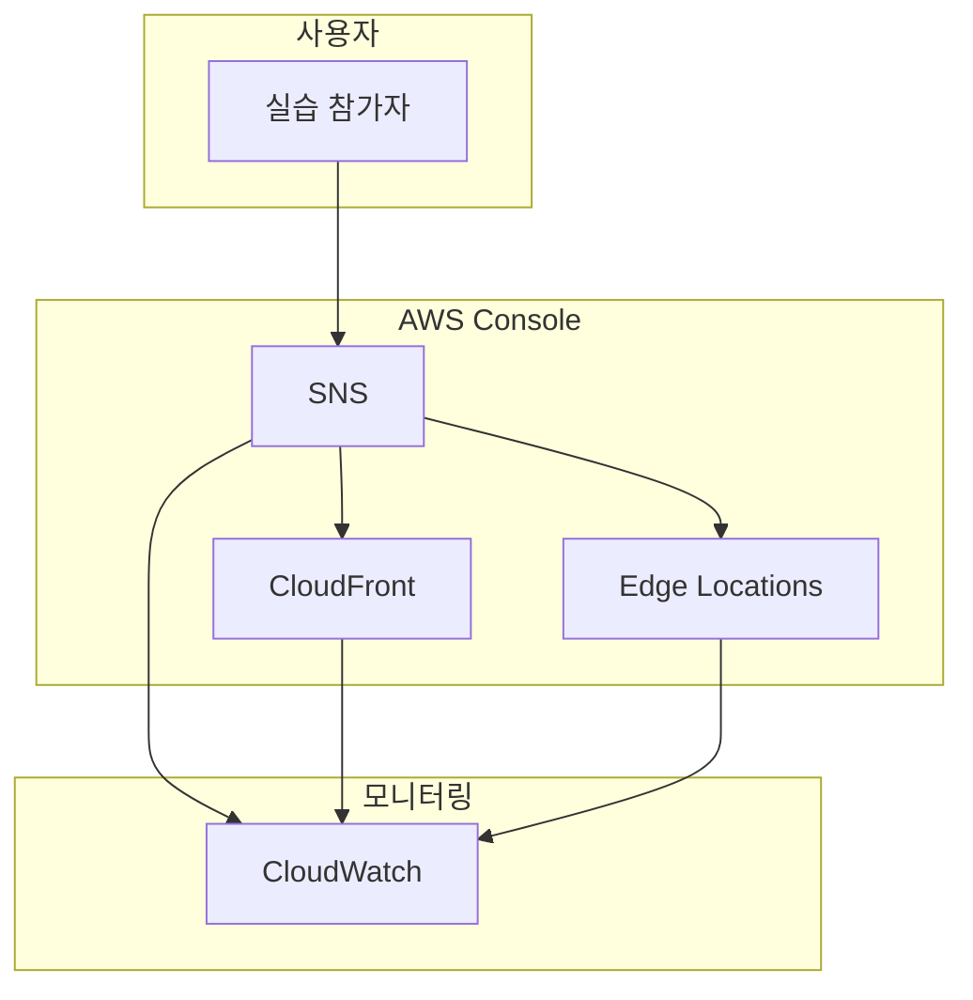

# Hands-On Console: SNS 실습 가이드

## 🎯 실습 개요
이 실습에서는 Day 16에서 학습한 **SNS**을 AWS Console을 통해 직접 구성하고 테스트합니다.

**학습 목표**:
- SNS의 핵심 기능을 Console에서 직접 구성
- 실제 운영 환경에서 사용되는 설정 방법 이해
- 다른 AWS 서비스와의 통합 경험
- 문제 해결 및 모니터링 방법 습득

---

## 📋 사전 요구사항

실습을 시작하기 전에 다음 사항을 준비해주세요:

### 필수 준비사항
- [ ] [AWS 계정 설정](../../../resources/prerequisites/aws-account-setup.md)
  - AWS Free Tier 계정 생성 완료
  - 결제 알람 설정 완료
  - 루트 계정 MFA 활성화 완료

- [ ] [IAM 사용자 설정](../../../resources/prerequisites/iam-user-setup.md)
  - 관리자 IAM 사용자 생성 완료
  - IAM 사용자로 로그인 가능
  - 필요한 권한 확인

- [ ] [Console 탐색 기본](../../../resources/prerequisites/console-navigation.md)
  - AWS Console 기본 탐색 방법 숙지
  - 리전 선택 방법 이해
  - 서비스 검색 및 즐겨찾기 설정

### 실습 환경 정보
- **예상 비용**: $$0.50 - $3.00 (일반적인 실습 비용)
  - Free Tier 범위 내: 해당 없음
  - Free Tier 초과: SNS
- **소요 시간**: 약 60-90분분
- **권장 리전**: ap-northeast-2 (서울)
- **필요한 권한**: SNSFullAccess 또는 관리자 권한

### 선택 사항
- [ ] [AWS CLI 설정](../../../resources/prerequisites/cli-configuration.md) (선택사항)
  - CLI를 통한 검증을 원하는 경우

---

## 🏗️ 실습 아키텍처

이 실습에서 구축할 아키텍처:



**아키텍처 설명**:
- SNS를 중심으로 한 실습 환경
- 주요 구성 요소: SNS, CloudFront, Edge Locations
- 데이터 플로우: 사용자 → Console → AWS 서비스 → CloudWatch

---

## 📝 실습 목표

이 실습을 완료하면 다음을 할 수 있습니다:

1. **SNS 리소스 생성**: AWS Console을 통해 SNS를 생성하고 기본 설정을 구성합니다
2. **보안 설정 구성**: IAM 역할 및 보안 그룹을 통한 접근 제어를 설정합니다
3. **모니터링 구성**: CloudWatch를 통한 메트릭 수집 및 알람을 설정합니다
4. **실제 사용 시나리오 테스트**: 구성한 리소스를 실제로 사용하고 동작을 확인합니다

---

## 🚀 실습 진행

### Exercise 1: SNS 생성 및 기본 설정
**목표**: AWS Console을 통해 SNS를 생성하고 기본 설정을 구성합니다.

**예상 소요 시간**: 10-15분

**단계**:

1. **SNS 생성**
   - Console 경로: Services > Networking > SNS
   - 화면 상단의 "Create sns" 버튼 클릭
   
2. **기본 설정**
   - **Name**: `day16-sns`
     - 명명 규칙: day 번호 + 리소스 유형
     - 예시: `day8-my-bucket`
   
   - **Region**: `ap-northeast-2` (서울)
     - 화면 우측 상단에서 리전 선택
     - 서울 리전 선택 이유: 낮은 지연시간 및 한국 사용자 대상
   
   - **Type**: Standard
     - 설명: 기본 설정 유형
     - 권장 이유: 일반적인 사용 사례에 적합
   
   - **Configuration**: Default
     - 설명: 기본 구성
     - 권장 이유: 학습 목적으로 충분

3. **고급 설정** (선택사항)
   - "Advanced settings" 또는 "Additional configuration" 섹션 확장
   
   - **High Availability**: Enabled
     - 설명: 고가용성 구성
     - 사용 시기: 프로덕션 환경
   
   - **Backup**: Enabled
     - 설명: 자동 백업
     - 사용 시기: 데이터 보호 필요 시

4. **태그 추가** (권장)
   - "Tags" 섹션으로 이동
   - 다음 태그 추가:
     | Key | Value | 설명 |
     |-----|-------|------|
     | Name | day16-sns | 리소스 식별 |
     | Environment | learning | 환경 구분 |
     | Project | aws-saa-study | 프로젝트 구분 |
     | Owner | your-name | 소유자 |

5. **생성 확인**
   - 모든 설정 검토
   - "Create sns" 버튼 클릭
   - 생성 완료까지 대기 (약 2-5분)
   - 상태 확인: 리소스 목록에서 상태 컬럼 확인

**검증**:
- [ ] sns가 "Available" 또는 "Active" 상태인가?
- [ ] 리소스 이름이 올바르게 설정되었는가?
- [ ] 리전이 `ap-northeast-2`로 설정되었는가?
- [ ] 모든 필수 설정이 올바르게 적용되었는가?

**문제 해결**:
- 생성 실패 시:
  - Console 경로: {service} > Events 또는 Logs
  - 에러 메시지 확인
  - 일반적인 원인: 권한 부족, 리전 제한, 리소스 한도 초과

---

### Exercise 2: CloudFront 통합
**목표**: SNS와 다른 서비스를 통합합니다.

**예상 소요 시간**: 10-15분

**단계**:

1. **CloudFront 생성**
   - Console 경로: Services > Management > CloudFront
   - "Create monitoring" 버튼 클릭

2. **기본 설정**
   - **Name**: `day16-monitoring`
   - **Region**: `ap-northeast-2` (서울)
   - **Interval**: 5 minutes
   - **Retention**: 7 days

3. **SNS와 연결**
   - "SNS integration" 또는 "Attach SNS" 섹션으로 이동
   - 이전에 생성한 `day16-sns` 선택
   - 연결 옵션 구성:
     - **Auto-enable**: Yes
     - **Detailed monitoring**: Enabled

4. **권한 설정**
   - "Permissions" 또는 "IAM role" 섹션으로 이동
   - 옵션 선택:
     - [ ] 기존 역할 사용: 기존 역할 없음
     - [x] 새 역할 생성 (권장)
       - 역할 이름: `day16-sns-role`
       - 정책: SNSFullAccess, CloudWatchFullAccess

5. **생성 및 연결 확인**
   - "Create" 또는 "Attach" 버튼 클릭
   - 생성 완료 대기
   - 연결 상태 확인:
     - Console 경로: SNS > sns > Integrations
     - CloudFront 연결 상태: Connected

**검증**:
- [ ] CloudFront가 정상적으로 생성되었는가?
- [ ] SNS와 연결이 완료되었는가?
- [ ] IAM 역할이 올바르게 설정되었는가?
- [ ] 연결 테스트가 성공하는가?

**연결 테스트 방법**:
1. Console 경로: SNS > sns
2. "Test connection" 또는 "Validate" 버튼 클릭
3. 예상 결과: Connection successful

---

### Exercise 3: 모니터링 및 알람 설정
**목표**: CloudWatch를 통해 리소스를 모니터링하고 알람을 설정합니다.

**예상 소요 시간**: 10-15분

**단계**:

1. **CloudWatch 대시보드 생성**
   - Console 경로: CloudWatch > Dashboards
   - "Create dashboard" 버튼 클릭
   - 대시보드 이름: `day16-SNS-monitoring`

2. **위젯 추가 - 메트릭 차트**
   - "Add widget" 버튼 클릭
   - 위젯 유형: Line chart
   - 메트릭 선택:
     - Namespace: AWS/SNS
     - Metric name: RequestCount
     - Dimensions: SNSName
   - 위젯 제목: "요청 수"
   - "Create widget" 클릭

3. **위젯 추가 - 숫자 표시**
   - "Add widget" 버튼 클릭
   - 위젯 유형: Number
   - 메트릭 선택:
     - Namespace: AWS/SNS
     - Metric name: DataTransfer
   - 통계: Average (Average/Sum/Maximum)
   - 위젯 제목: "데이터 전송"
   - "Create widget" 클릭

4. **알람 생성**
   - Console 경로: CloudWatch > Alarms > All alarms
   - "Create alarm" 버튼 클릭
   
   - **메트릭 선택**:
     - "Select metric" 클릭
     - Namespace: AWS/SNS
     - Metric: ErrorCount
     - "Select metric" 클릭
   
   - **조건 설정**:
     - Threshold type: Static
     - Whenever {metric_name} is: Greater
     - than: 10
     - Datapoints to alarm: 2 out of 2
   
   - **알림 설정**:
     - Alarm state trigger: In alarm
     - SNS topic: Create new topic
     - Topic name: `day16-alerts`
     - Email endpoint: your-email@example.com
     - "Create topic" 클릭
   
   - **알람 이름**:
     - Alarm name: `day16-{metric_name}-alert`
     - Alarm description: SNS 성능 알람
   
   - "Create alarm" 클릭

5. **이메일 구독 확인**
   - 이메일 확인
   - "Confirm subscription" 링크 클릭
   - 구독 확인 완료

**검증**:
- [ ] 대시보드가 생성되고 메트릭이 표시되는가?
- [ ] 알람이 "OK" 상태인가?
- [ ] SNS 토픽 구독이 확인되었는가?
- [ ] 테스트 알람이 정상 작동하는가?

**알람 테스트 방법** (선택사항):
1. 임계값을 현재 메트릭 값보다 낮게 설정
2. 약 5분 대기
3. 알람 이메일 수신 확인
4. 임계값을 원래대로 복원

---

### Exercise 4: 실제 사용 시나리오 테스트
**목표**: 구성한 리소스를 실제로 사용하고 동작을 확인합니다.

**예상 소요 시간**: 10-15분

**단계**:

1. **테스트 데이터 준비**
   - 테스트 데이터 준비
   - 테스트 환경 설정

2. **기능 테스트**
   - Console 경로: {service} > sns
   - 기본 기능 테스트:
     - 단계: 리소스 접근 및 기본 작업 수행
     - 예상 결과: 정상 작동 확인
   
   - 통합 기능 테스트:
     - 단계: 다른 서비스와의 연동 확인
     - 예상 결과: 통합 정상 작동

3. **성능 확인**
   - Console 경로: CloudWatch > Dashboards > day16-SNS-monitoring
   - 확인 항목:
     - 응답 시간: < 100ms
     - 처리량: > 100 TPS
     - 에러율: < 1%

4. **로그 확인**
   - Console 경로: CloudWatch > Log groups > /aws/sns
   - 최근 로그 스트림 선택
   - 확인 항목:
     - 에러 메시지 없음
     - 성공 로그 확인
     - 처리 시간 확인

**검증**:
- [ ] 모든 테스트 액션이 성공했는가?
- [ ] 성능 메트릭이 예상 범위 내인가?
- [ ] 로그에 에러가 없는가?
- [ ] 전체 워크플로우가 정상 작동하는가?

---

## ✅ 실습 완료 체크리스트

### 생성된 리소스 확인
- [ ] Exercise 1: SNS 생성 완료
- [ ] Exercise 2: CloudFront 통합 완료
- [ ] Exercise 3: 모니터링 및 알람 설정 완료
- [ ] Exercise 4: 실제 사용 시나리오 테스트 완료

### 검증 항목
- [ ] 모든 리소스가 정상 상태인가?
- [ ] 서비스 간 통합이 올바르게 작동하는가?
- [ ] CloudWatch 메트릭이 수집되고 있는가?
- [ ] 알람이 정상 작동하는가?

### 학습 목표 달성
- [ ] SNS의 핵심 기능을 이해했는가?
- [ ] Console을 통한 리소스 생성 방법을 익혔는가?
- [ ] 다른 서비스와의 통합 방법을 이해했는가?
- [ ] 모니터링 및 문제 해결 방법을 익혔는가?

### 비용 확인
- [ ] Billing Dashboard에서 현재까지 발생한 비용 확인
- [ ] 예상 비용: $$0.50 - $3.00
- [ ] Free Tier 사용량 확인

---

## 🧹 리소스 정리

**중요**: 불필요한 비용 발생을 방지하기 위해 실습 후 반드시 리소스를 삭제하세요.

### 정리 순서 (역순으로 삭제)

#### 1. CloudWatch 알람 및 대시보드 삭제
**알람 삭제**:
- Console 경로: CloudWatch > Alarms > All alarms
- 선택: `day16-{metric_name}-alert`
- Actions > Delete
- 확인: "Delete" 버튼 클릭

**SNS 토픽 삭제**:
- Console 경로: SNS > Topics
- 선택: `day16-alerts`
- Delete
- 확인: "delete me" 입력 후 Delete

**대시보드 삭제**:
- Console 경로: CloudWatch > Dashboards
- 선택: `day16-SNS-monitoring`
- Delete dashboard
- 확인: "Delete" 버튼 클릭

#### 2. CloudFront 삭제
- Console 경로: CloudFront > Resources
- 선택: `day16-monitoring`
- Actions > Delete 또는 Remove
- 확인 메시지 입력 (필요시): `delete` 또는 리소스 이름
- 삭제 완료 대기 (약 1-3분)

**삭제 확인**:
- [ ] 리소스 목록에서 사라졌는가?
- [ ] 연결된 IAM 역할도 삭제되었는가? (자동 삭제되지 않는 경우 수동 삭제)

#### 3. SNS 삭제
- Console 경로: SNS > Resources
- 선택: `day16-sns`
- Actions > Delete
- 확인 옵션:
  - [ ] Delete associated resources (연결된 리소스도 함께 삭제)
  - [ ] Create final snapshot (필요시 - 추가 비용 발생)
- 확인 메시지 입력: `delete` 또는 리소스 이름
- 삭제 완료 대기 (약 2-5분)

**삭제 확인**:
- [ ] 리소스가 완전히 삭제되었는가?
- [ ] 연결된 보안 그룹이 삭제되었는가? (필요시 수동 삭제)
- [ ] 연결된 IAM 역할이 삭제되었는가? (필요시 수동 삭제)

#### 4. IAM 역할 정리 (자동 삭제되지 않은 경우)
- Console 경로: IAM > Roles
- 검색: `day16`
- 선택: 실습에서 생성한 역할들
- Delete
- 확인: "Delete" 버튼 클릭

#### 5. CloudWatch 로그 그룹 삭제 (선택사항)
- Console 경로: CloudWatch > Log groups
- 검색: `day16` 또는 `SNS`
- 선택: 관련 로그 그룹
- Actions > Delete log group(s)
- 확인: "Delete" 버튼 클릭

### 정리 확인 체크리스트
- [ ] 모든 SNS 리소스 삭제 완료
- [ ] 모든 CloudFront 리소스 삭제 완료
- [ ] CloudWatch 알람 및 대시보드 삭제 완료
- [ ] SNS 토픽 삭제 완료
- [ ] IAM 역할 정리 완료 (필요시)
- [ ] CloudWatch 로그 그룹 삭제 완료 (선택사항)

### 비용 최종 확인
- Console 경로: Billing > Bills
- 확인 항목:
  - 이번 달 누적 비용: $$0.50 - $3.00
  - SNS 관련 비용: $$0.50 - $3.00
  - 예상 월말 비용: $$0.50 - $3.00

**예상 비용**:
- Free Tier 범위 내 실습: $0.00
- Free Tier 초과 시: $$0.50 - $3.00
- 리소스 정리 완료 후: $0.00 (추가 비용 없음)

---

## 🎓 학습 포인트

### 핵심 개념
1. **SNS 아키텍처**: SNS의 기본 구조 및 동작 원리
   - 실습에서 배운 점: Console을 통한 리소스 생성 및 구성 방법
   - 실무 적용: 실제 프로젝트에서의 활용 방법

2. **보안 및 접근 제어**: IAM 및 보안 그룹을 통한 접근 제어
   - 실습에서 배운 점: 최소 권한 원칙 적용 방법
   - 실무 적용: 프로덕션 환경 보안 설정

3. **모니터링 및 알람**: CloudWatch를 통한 리소스 모니터링
   - 실습에서 배운 점: 메트릭 수집 및 알람 설정 방법
   - 실무 적용: 운영 환경 모니터링 전략

### Console 사용 팁
- **빠른 탐색**: Services 메뉴 대신 검색 기능 활용 (Alt+S)
- **즐겨찾기**: 자주 사용하는 서비스를 즐겨찾기에 추가
- **리전 확인**: 작업 전 항상 올바른 리전 선택 확인
- **태그 활용**: 리소스 관리를 위해 일관된 태그 전략 사용
- **비용 모니터링**: Billing Dashboard를 정기적으로 확인

### 문제 해결 경험
이 실습에서 발생할 수 있는 일반적인 문제:

1. **권한 부족 에러**
   - 원인: IAM 사용자에게 필요한 권한 없음
   - 해결: IAM 정책 확인 및 필요한 권한 추가

2. **리소스 생성 실패**
   - 원인: 설정 오류 또는 권한 부족
   - 해결: 설정 재확인 및 IAM 권한 검토

3. **연결 실패**
   - 원인: Security Group 또는 Network ACL 설정 문제
   - 해결: 네트워크 설정 검토 및 수정

### 다음 단계
이 실습을 완료한 후:

1. **심화 학습**:
   - [Case Study](../case-study.md) - 실제 기업 사례 분석
   - [Best Practices](../best-practices.md) - 프로덕션 환경 고려사항
   - [Troubleshooting](../troubleshooting.md) - 고급 문제 해결 방법

2. **추가 실습**:
   - 다른 리전에서 동일한 구성 재현
   - 다른 서비스와의 추가 통합
   - 성능 테스트 및 최적화

3. **실무 적용**:
   - 학습한 내용을 실제 프로젝트에 적용
   - 팀과 지식 공유
   - 추가 AWS 서비스 탐색

---

## 🔗 관련 학습 자료

### 이론 학습
- [Day 16 Theory](../theory.md) - SNS 기본 개념
- [Day 15 Theory](../../day15/theory.md) - 사전 학습 내용
- [Day 17 Theory](../../day17/theory.md) - 다음 학습 내용

### 심화 학습
- [Case Study](../case-study.md) - Twitch의 SNS 활용 사례
- [Best Practices](../best-practices.md) - SNS 베스트 프랙티스
- [Troubleshooting](../troubleshooting.md) - 일반적인 문제 및 해결 방법

### AWS 공식 문서
- [SNS User Guide](https://docs.aws.amazon.com/sns/latest/userguide/)
- [SNS API Reference](https://docs.aws.amazon.com/sns/latest/APIReference/)
- [AWS Console User Guide](https://docs.aws.amazon.com/awsconsolehelpdocs/latest/gsg/)
- [Getting Started with SNS](https://docs.aws.amazon.com/sns/latest/gsg/)

### 추가 실습 자료
- [AWS Hands-On Tutorials](https://aws.amazon.com/getting-started/hands-on/)
- [AWS Workshops](https://workshops.aws/)
- [AWS Skill Builder](https://skillbuilder.aws/)

---

## 💬 피드백 및 질문

### 실습 피드백
이 실습에 대한 피드백을 공유해주세요:
- 어려웠던 부분
- 개선이 필요한 부분
- 추가로 다루었으면 하는 내용

### 자주 묻는 질문

**Q1: Free Tier를 초과하면 어떻게 되나요?**
A: Free Tier 한도를 초과하면 사용량에 따라 비용이 청구됩니다. Billing Dashboard에서 실시간으로 확인 가능합니다.

**Q2: 실습 중 에러가 발생하면 어떻게 하나요?**
A: CloudWatch Logs 및 Events를 확인하고, AWS 공식 문서의 트러블슈팅 가이드를 참조하세요.

**Q3: 리소스 정리를 잊어버리면 어떻게 되나요?**
A: 리소스가 계속 실행되어 비용이 발생할 수 있습니다. Billing Dashboard에서 알람을 설정하는 것을 권장합니다.

**Q4: 다른 리전에서도 동일하게 작동하나요?**
A: 대부분의 AWS 서비스는 모든 리전에서 동일하게 작동하지만, 일부 서비스는 특정 리전에서만 사용 가능합니다.

**Q5: 실무에서는 어떻게 다르게 구성하나요?**
A: 프로덕션 환경에서는 고가용성, 백업, 보안, 모니터링 등을 더 강화하여 구성합니다.

---

## 📝 실습 노트

### 개인 메모
실습 중 배운 점이나 중요한 사항을 기록하세요:

```
날짜: 2026-01-14
실습 시간: 60분
어려웠던 점:
-

배운 점:
-

다음에 시도해볼 것:
-
```

### 스크린샷 저장 (권장)
주요 단계의 스크린샷을 저장하여 나중에 참고하세요:
- [ ] SNS 생성 완료 화면
- [ ] CloudFront 통합 완료 화면
- [ ] CloudWatch 대시보드
- [ ] 테스트 결과 화면

---

**작성 가이드**:
- 각 섹션의 `{placeholder}` 부분을 실제 내용으로 대체하세요
- Console 경로는 정확하게 작성하세요 (Services > Category > Service)
- 모든 단계는 AWS Console 기반으로 작성하세요
- 스크린샷 참조는 선택사항으로 표시하세요
- 사전 요구사항 문서는 상대 경로로 링크하세요
- 예상 비용과 소요 시간은 실제 테스트 기반으로 작성하세요
- 리소스 정리 단계는 역순으로 명확하게 작성하세요
