# Day 16: CloudFront & CDN (Content Delivery Network)

## 학습 목표
- CloudFront의 개념과 CDN의 작동 원리 이해
- CloudFront의 주요 기능과 구성 요소 파악
- 캐싱 전략과 성능 최적화 방법 학습
- CloudFront 보안 기능 및 모니터링 이해

## 1. CDN (Content Delivery Network) 개념

### CDN이란?
CDN은 전 세계에 분산된 서버 네트워크를 통해 사용자에게 콘텐츠를 더 빠르게 전달하는 시스템입니다. 사용자와 가장 가까운 위치의 서버(Edge Location)에서 콘텐츠를 제공하여 지연 시간을 줄이고 성능을 향상시킵니다.

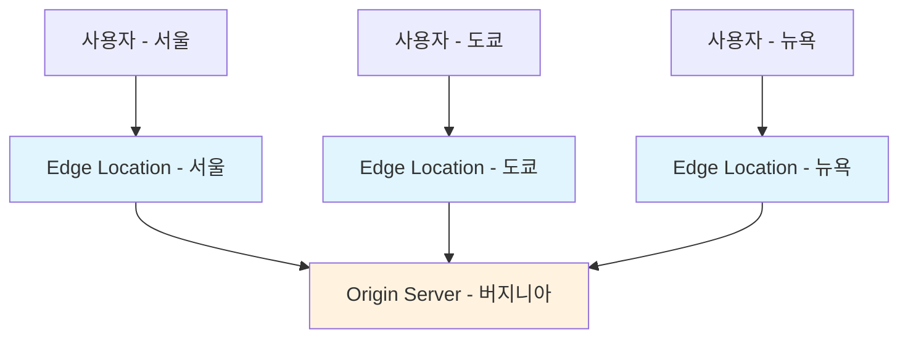

### CDN의 장점
1. **성능 향상**: 사용자와 가까운 위치에서 콘텐츠 제공
2. **가용성 증대**: 여러 서버에 콘텐츠 분산으로 장애 대응
3. **대역폭 절약**: Origin 서버의 부하 감소
4. **보안 강화**: DDoS 공격 방어 및 SSL/TLS 암호화

## 2. Amazon CloudFront 소개

### CloudFront란?
Amazon CloudFront는 AWS의 글로벌 CDN 서비스로, 전 세계 400개 이상의 Edge Location을 통해 콘텐츠를 배포합니다.

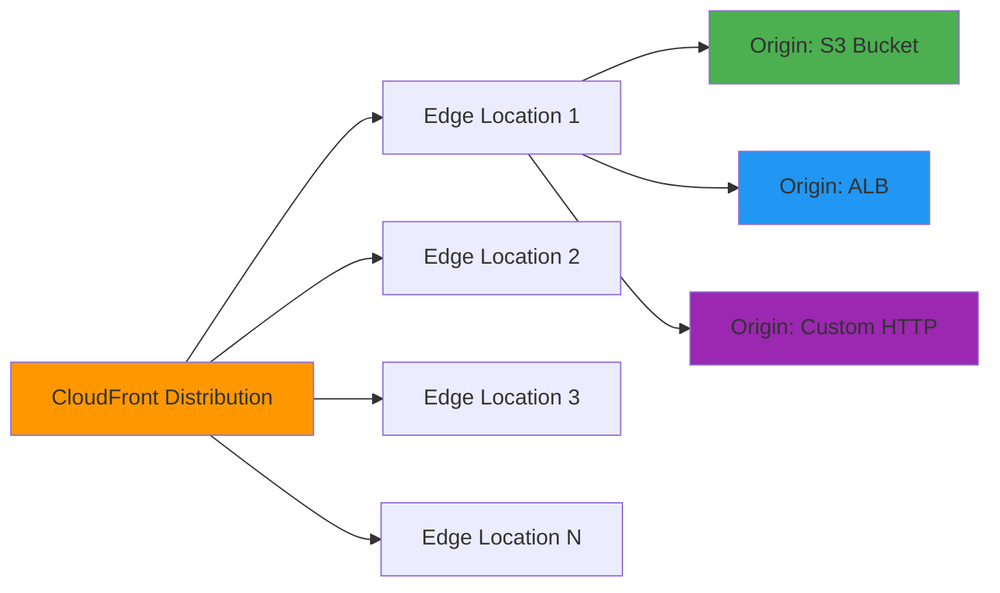

### 주요 특징
- **글로벌 네트워크**: 전 세계 400+ Edge Location
- **다양한 Origin 지원**: S3, EC2, ELB, 외부 HTTP 서버
- **실시간 메트릭**: CloudWatch 통합 모니터링
- **보안 기능**: AWS WAF, Shield 통합

## 3. CloudFront 핵심 구성 요소

### Distribution (배포)
CloudFront에서 콘텐츠를 배포하는 기본 단위입니다.

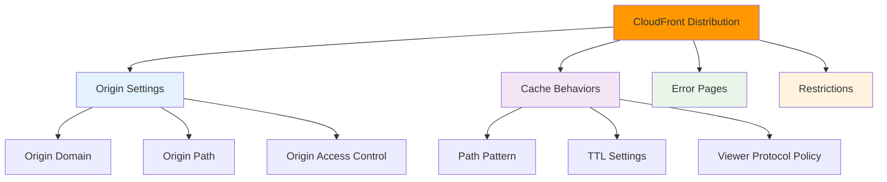

### Origin (원본)
콘텐츠의 원본 소스를 의미합니다.

**지원되는 Origin 유형:**
1. **S3 Bucket**: 정적 웹사이트, 이미지, 동영상
2. **Application Load Balancer**: 동적 콘텐츠
3. **EC2 Instance**: 웹 서버
4. **Custom HTTP Origin**: 외부 웹 서버

### Edge Location
사용자와 가장 가까운 위치에서 콘텐츠를 캐시하고 제공하는 서버입니다.

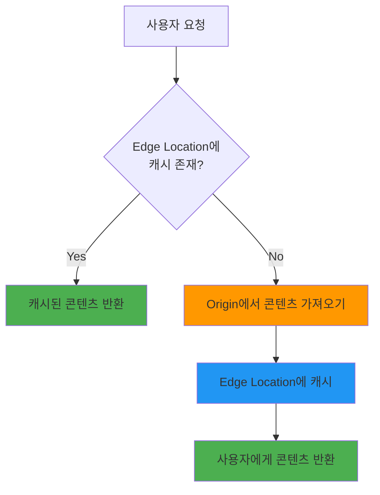

## 4. 캐싱 전략 및 TTL

### TTL (Time To Live)
캐시된 콘텐츠가 유효한 시간을 설정합니다.

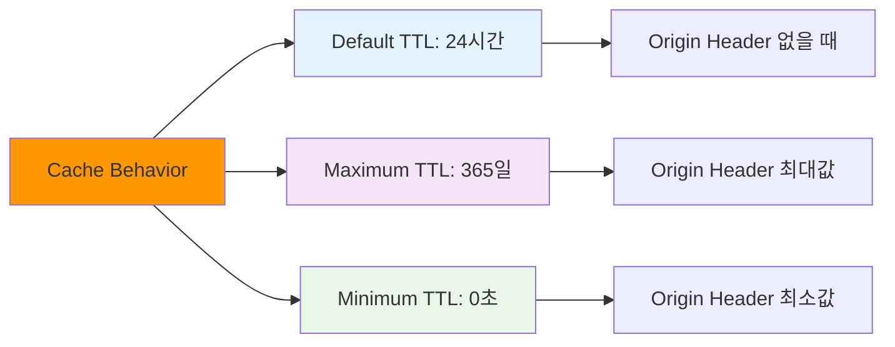

### 캐시 무효화 (Invalidation)
캐시된 콘텐츠를 강제로 삭제하여 새로운 콘텐츠를 가져오도록 합니다.

**무효화 방법:**
1. **파일별 무효화**: `/images/logo.png`
2. **와일드카드 무효화**: `/images/*`
3. **전체 무효화**: `/*`

## 5. CloudFront 보안 기능

### Origin Access Control (OAC)
S3 버킷에 대한 직접 접근을 차단하고 CloudFront를 통해서만 접근하도록 제한합니다.

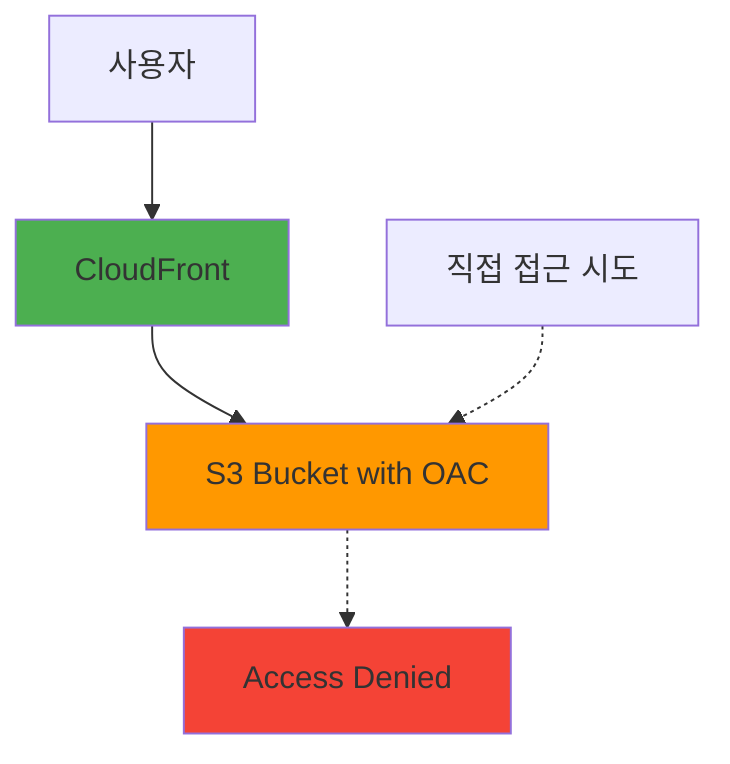

### Signed URLs & Signed Cookies
프리미엄 콘텐츠에 대한 접근을 제어합니다.

**Signed URL 사용 사례:**
- 개별 파일 접근 제어
- 다운로드 링크 보안
- 시간 제한 콘텐츠

**Signed Cookie 사용 사례:**
- 여러 파일 접근 제어
- 웹사이트 전체 보안
- 사용자 세션 관리

### AWS WAF 통합
웹 애플리케이션 방화벽을 통해 악성 트래픽을 차단합니다.

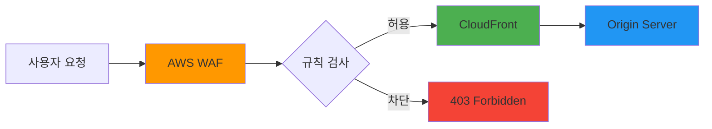

## 6. CloudFront 성능 최적화

### 압축 (Compression)
텍스트 기반 파일을 자동으로 압축하여 전송 속도를 향상시킵니다.

**압축 지원 파일 형식:**
- HTML, CSS, JavaScript
- JSON, XML
- 텍스트 파일

### HTTP/2 지원
HTTP/2 프로토콜을 통해 다중 요청을 효율적으로 처리합니다.

### 지리적 제한 (Geo Restriction)
특정 국가나 지역에서의 접근을 허용하거나 차단합니다.

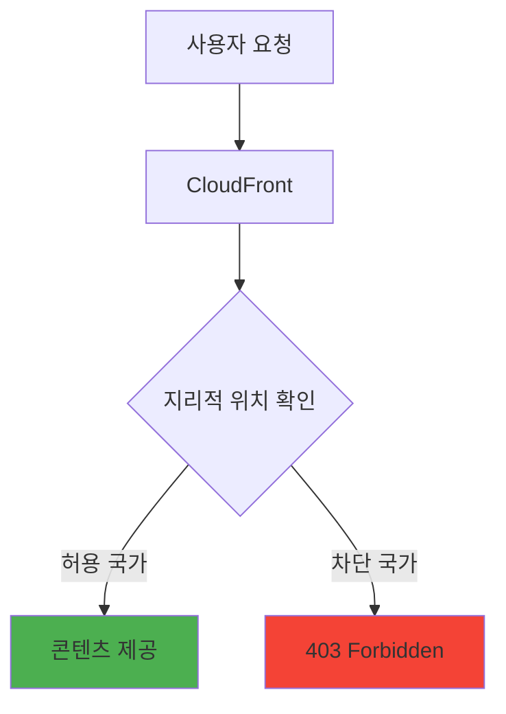

## 7. CloudFront 모니터링

### CloudWatch 메트릭
- **Requests**: 요청 수
- **BytesDownloaded**: 다운로드된 바이트 수
- **4xxErrorRate**: 4xx 오류율
- **5xxErrorRate**: 5xx 오류율

### Real-time Logs
실시간으로 CloudFront 로그를 Kinesis Data Streams로 전송합니다.

### Standard Logs
S3 버킷에 상세한 액세스 로그를 저장합니다.

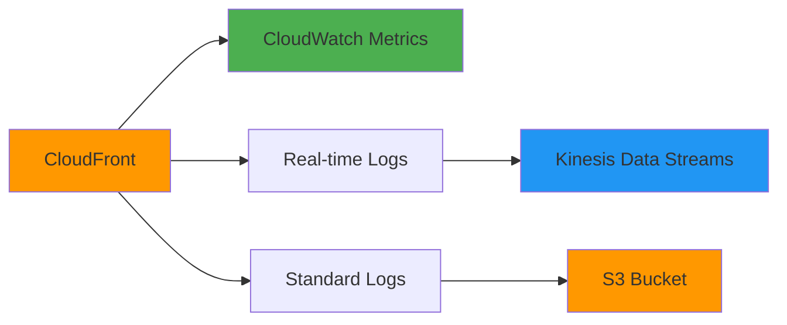

## 8. CloudFront 가격 정책

### 가격 클래스 (Price Class)
전 세계 Edge Location 사용 범위에 따라 비용을 조절할 수 있습니다.

1. **Price Class All**: 모든 Edge Location 사용 (최고 성능)
2. **Price Class 200**: 북미, 유럽, 아시아, 중동, 아프리카
3. **Price Class 100**: 북미, 유럽만 사용 (최저 비용)

### 비용 구성 요소
- **데이터 전송**: 사용자에게 전송된 데이터량
- **HTTP/HTTPS 요청**: 요청 수에 따른 비용
- **무효화**: 무효화 요청 비용 (월 1,000건까지 무료)

## 9. CloudFront vs 다른 CDN 서비스

### CloudFront vs CloudFlare

| 특징 | CloudFront | CloudFlare |
|------|------------|------------|
| Edge Location | 400+ | 275+ |
| AWS 통합 | 완벽 통합 | 제한적 |
| 무료 티어 | 제한적 | 관대함 |
| 보안 기능 | WAF 별도 | 기본 포함 |

### CloudFront 선택 기준
- AWS 생태계 내에서 사용
- 높은 성능과 안정성 요구
- 세밀한 캐시 제어 필요
- 엔터프라이즈급 보안 요구

## 10. 실제 사용 사례

### 정적 웹사이트 가속화
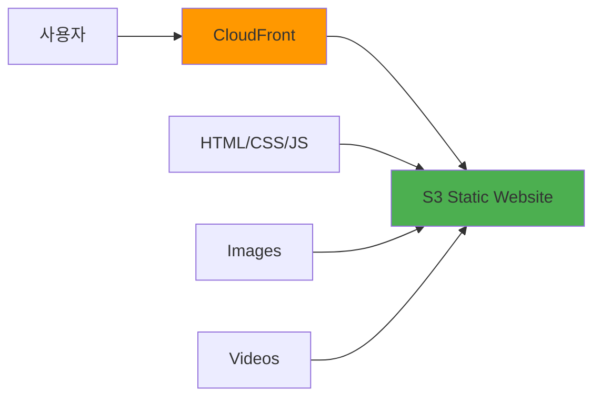

### API 가속화
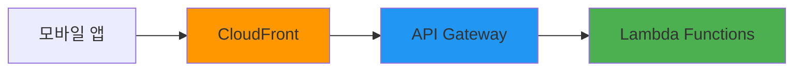

### 동영상 스트리밍
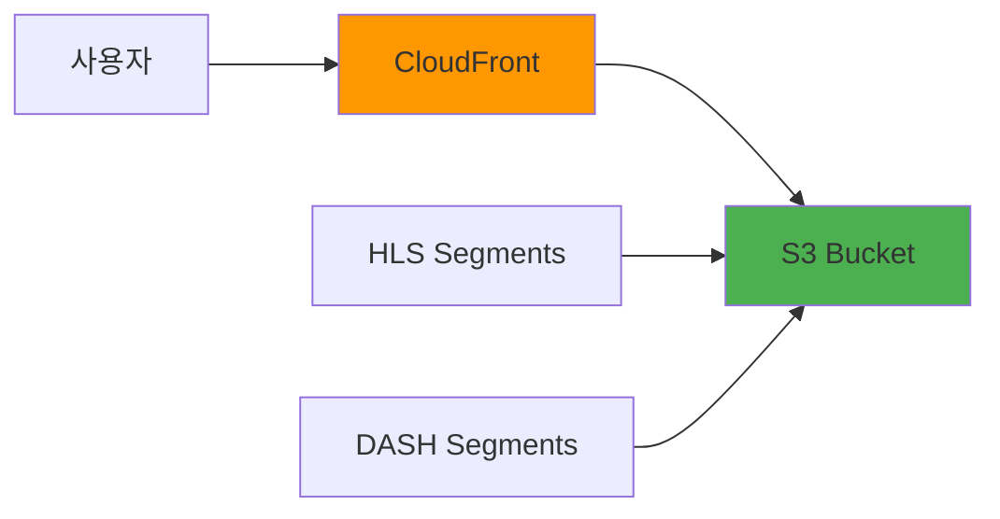

## 학습 정리

### 핵심 개념
1. **CDN**: 전 세계 분산 서버를 통한 콘텐츠 가속화
2. **Edge Location**: 사용자와 가까운 캐시 서버
3. **Origin**: 원본 콘텐츠 소스
4. **Distribution**: CloudFront 배포 단위

### 주요 기능
1. **캐싱**: TTL 기반 콘텐츠 캐싱
2. **보안**: OAC, Signed URL/Cookie, WAF 통합
3. **성능**: 압축, HTTP/2, 지리적 최적화
4. **모니터링**: CloudWatch, 실시간 로그

### 모범 사례
1. 적절한 TTL 설정으로 캐시 효율성 극대화
2. OAC를 통한 S3 보안 강화
3. 압축 활성화로 전송 속도 향상
4. 지리적 제한으로 콘텐츠 보호
5. CloudWatch 모니터링으로 성능 추적

CloudFront는 AWS의 핵심 서비스 중 하나로, 웹 애플리케이션의 성능과 사용자 경험을 크게 향상시킬 수 있는 강력한 CDN 서비스입니다. 다음 실습에서는 실제로 CloudFront Distribution을 생성하고 구성해보겠습니다.