# Day 17: Route 53 & DNS - 도메인 이름 시스템의 마법사

## 학습 목표
- DNS의 기본 개념과 작동 원리 이해
- Route 53의 핵심 기능과 라우팅 정책 학습
- 도메인 등록과 호스팅 영역 관리 방법 습득
- 헬스 체크와 장애 조치 메커니즘 이해
- Route 53과 다른 AWS 서비스의 통합 방법 학습

## 1. DNS 기초 개념

### DNS란 무엇인가?
DNS(Domain Name System)는 인터넷의 전화번호부 같은 역할을 합니다. 우리가 기억하기 쉬운 도메인 이름(예: www.example.com)을 컴퓨터가 이해할 수 있는 IP 주소(예: 192.0.2.1)로 변환해주는 시스템입니다.

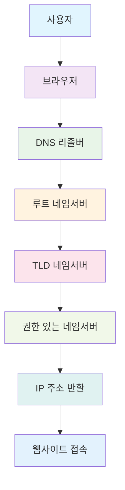

### DNS 레코드 타입
DNS는 다양한 타입의 레코드를 사용하여 정보를 저장합니다:

- **A 레코드**: 도메인을 IPv4 주소로 매핑
- **AAAA 레코드**: 도메인을 IPv6 주소로 매핑
- **CNAME 레코드**: 도메인을 다른 도메인으로 매핑 (별칭)
- **MX 레코드**: 메일 서버 정보
- **TXT 레코드**: 텍스트 정보 (SPF, DKIM 등)
- **NS 레코드**: 네임서버 정보
- **SOA 레코드**: 권한 시작 레코드

## 2. Amazon Route 53 소개

### Route 53이란?
Amazon Route 53은 AWS의 확장 가능한 DNS 웹 서비스입니다. 이름의 "53"은 DNS가 사용하는 포트 번호에서 따온 것입니다.

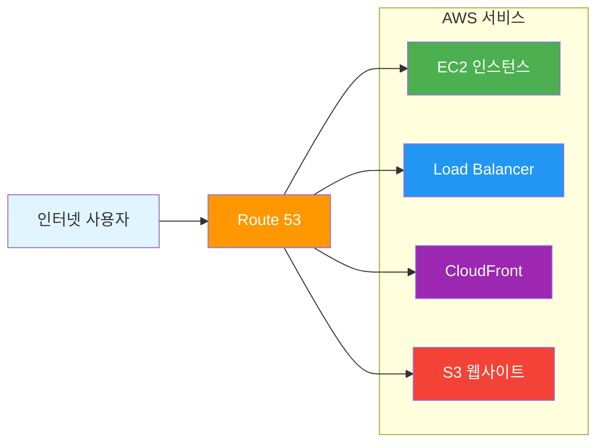

### Route 53의 주요 기능

1. **도메인 등록**: 새로운 도메인 이름 구매 및 관리
2. **DNS 라우팅**: 도메인 이름을 IP 주소로 변환
3. **헬스 체크**: 리소스의 상태 모니터링
4. **트래픽 플로우**: 복잡한 라우팅 정책 시각화

## 3. 호스팅 영역 (Hosted Zone)

### 호스팅 영역이란?
호스팅 영역은 특정 도메인(예: example.com)에 대한 DNS 레코드들의 컨테이너입니다.

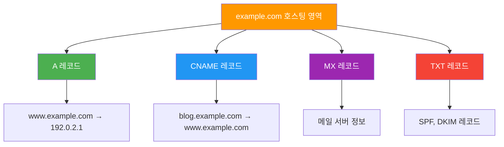

### 퍼블릭 vs 프라이빗 호스팅 영역

**퍼블릭 호스팅 영역**:
- 인터넷에서 접근 가능한 도메인용
- 전 세계 DNS 리졸버가 쿼리 가능

**프라이빗 호스팅 영역**:
- VPC 내부에서만 접근 가능
- 내부 리소스의 DNS 해석용

## 4. Route 53 라우팅 정책

### 1. Simple Routing (단순 라우팅)
가장 기본적인 라우팅 정책으로, 하나의 리소스에 대해 하나의 레코드를 반환합니다.

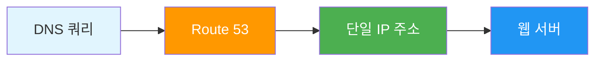

### 2. Weighted Routing (가중치 라우팅)
트래픽을 여러 리소스에 가중치에 따라 분산합니다.

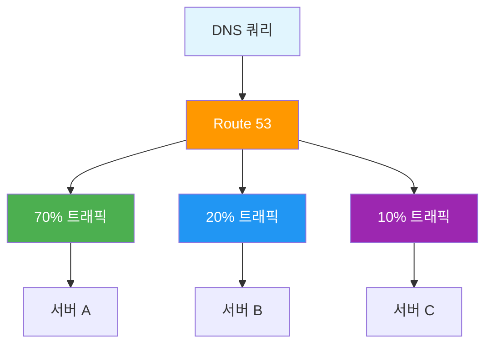

### 3. Latency-based Routing (지연 시간 기반 라우팅)
사용자와 가장 가까운 리전의 리소스로 라우팅합니다.

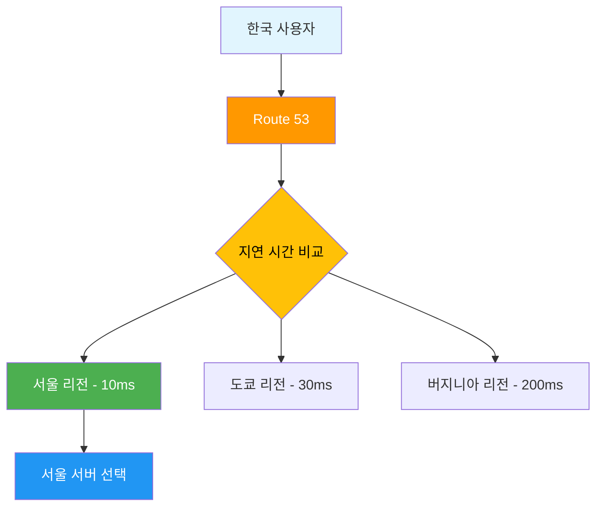

### 4. Failover Routing (장애 조치 라우팅)
기본 리소스가 실패할 경우 보조 리소스로 자동 전환합니다.

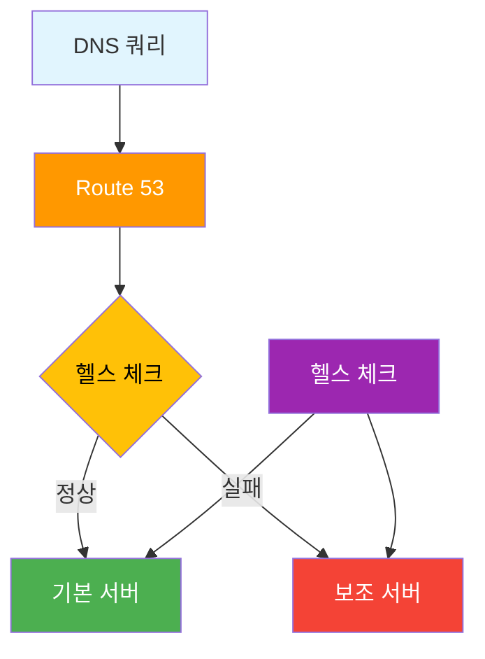

### 5. Geolocation Routing (지리적 위치 라우팅)
사용자의 지리적 위치에 따라 라우팅합니다.

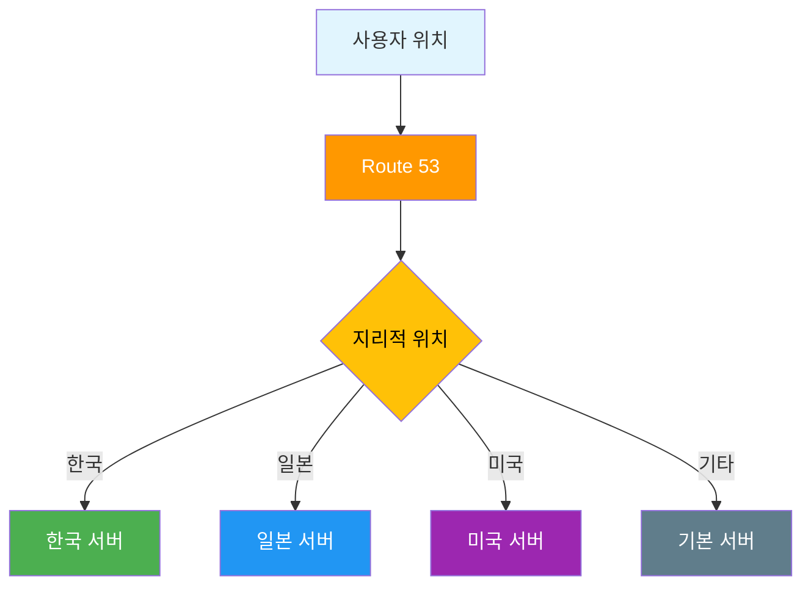

### 6. Geoproximity Routing (지리적 근접성 라우팅)
지리적 위치와 바이어스 값을 고려하여 라우팅합니다.

### 7. Multivalue Answer Routing (다중값 응답 라우팅)
여러 개의 정상적인 IP 주소를 반환하여 클라이언트가 선택하도록 합니다.

## 5. 헬스 체크 (Health Check)

### 헬스 체크의 중요성
Route 53의 헬스 체크는 리소스의 상태를 지속적으로 모니터링하여 장애 조치 라우팅과 같은 기능을 가능하게 합니다.

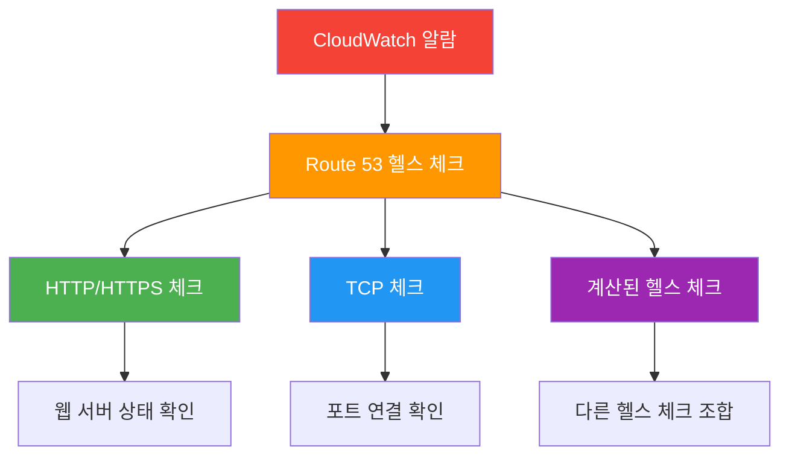

### 헬스 체크 타입

1. **HTTP/HTTPS 헬스 체크**
   - 특정 URL에 HTTP 요청을 보내 응답 확인
   - 응답 코드와 응답 시간 기반 판단

2. **TCP 헬스 체크**
   - 특정 포트에 TCP 연결 시도
   - 연결 성공 여부로 상태 판단

3. **계산된 헬스 체크**
   - 여러 헬스 체크의 결과를 조합
   - AND, OR 논리 연산 지원

## 6. Route 53과 AWS 서비스 통합

### CloudFront와의 통합
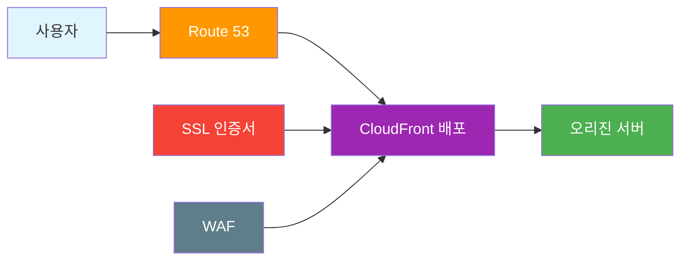

### Application Load Balancer와의 통합
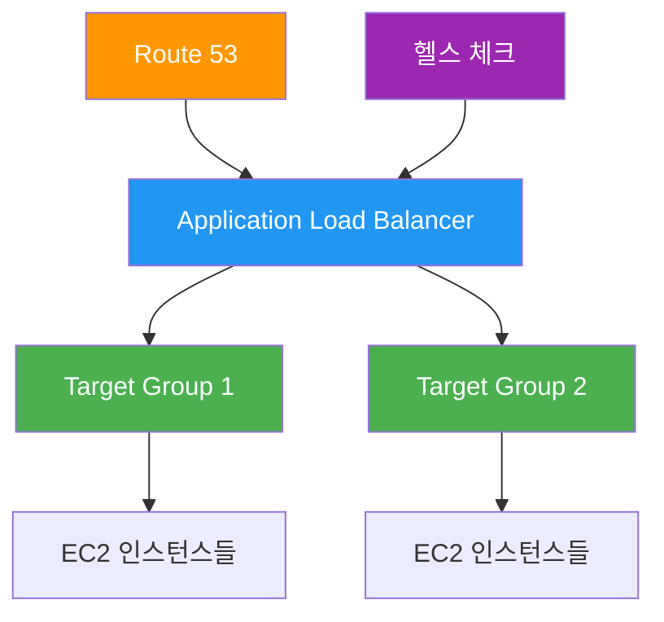

## 7. 도메인 등록과 관리

### 도메인 등록 프로세스
1. **도메인 검색**: 원하는 도메인 이름의 사용 가능 여부 확인
2. **도메인 등록**: 등록 정보 입력 및 결제
3. **DNS 설정**: 네임서버 설정 및 DNS 레코드 구성
4. **도메인 관리**: 갱신, 이전, 잠금 설정 등

### 도메인 이전
기존 도메인을 Route 53으로 이전하는 과정:

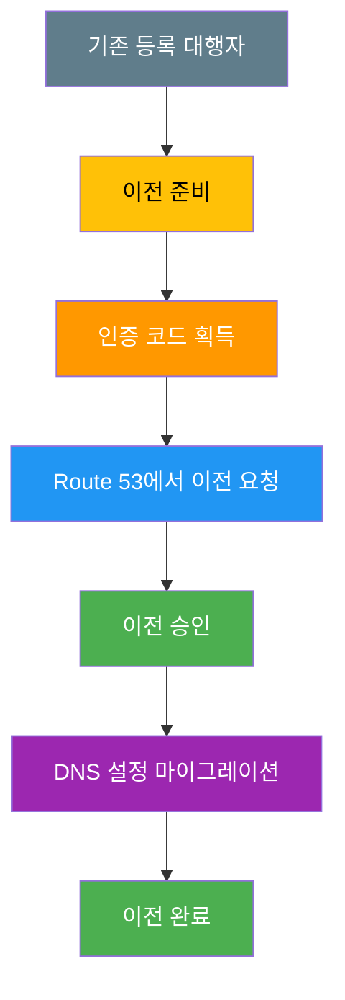

## 8. 비용 최적화

### Route 53 요금 구조
- **호스팅 영역**: 월 $0.50 (처음 25개 호스팅 영역까지)
- **DNS 쿼리**: 백만 쿼리당 $0.40
- **헬스 체크**: 월 $0.50 (기본 헬스 체크)
- **도메인 등록**: 도메인 타입에 따라 다름

### 비용 절약 팁
1. **불필요한 헬스 체크 제거**
2. **DNS 쿼리 최적화**
3. **TTL 값 적절히 설정**
4. **지리적 라우팅 효율적 활용**

## 9. 보안 고려사항

### DNS 보안
- **DNSSEC**: DNS 응답의 무결성 보장
- **DNS over HTTPS (DoH)**: 암호화된 DNS 쿼리
- **프라이빗 호스팅 영역**: VPC 내부 DNS 보안

### 모니터링과 로깅
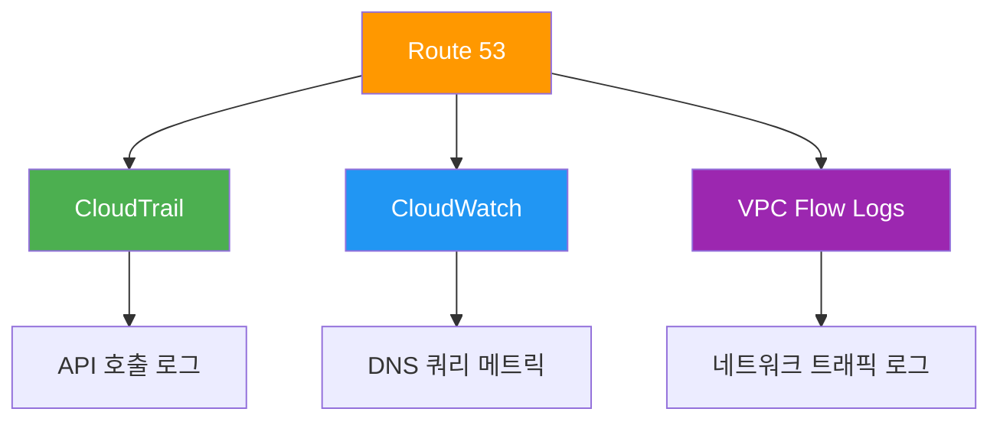

## 10. 실제 사용 사례

### 사례 1: 글로벌 웹 애플리케이션
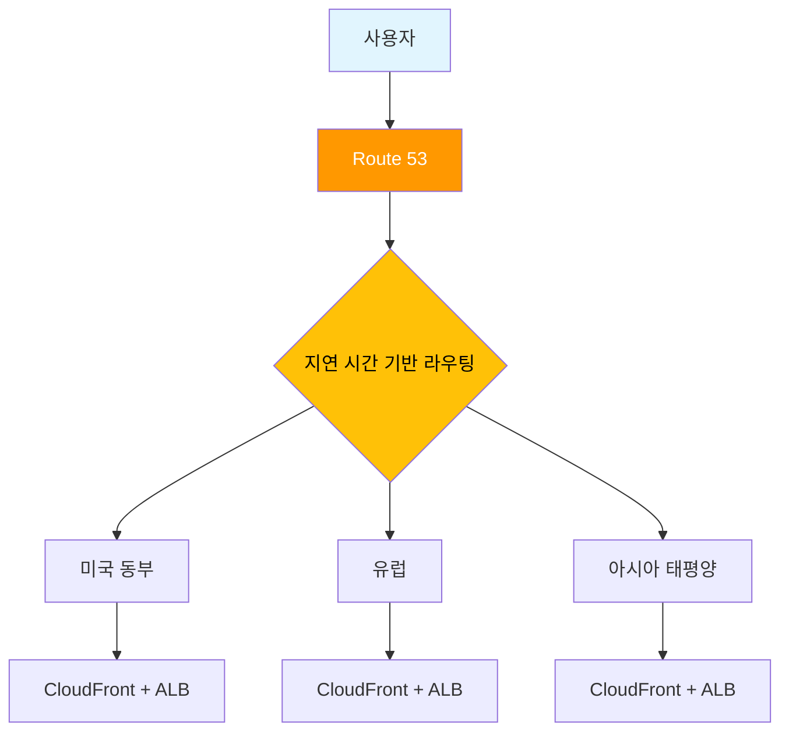

### 사례 2: 재해 복구 시나리오
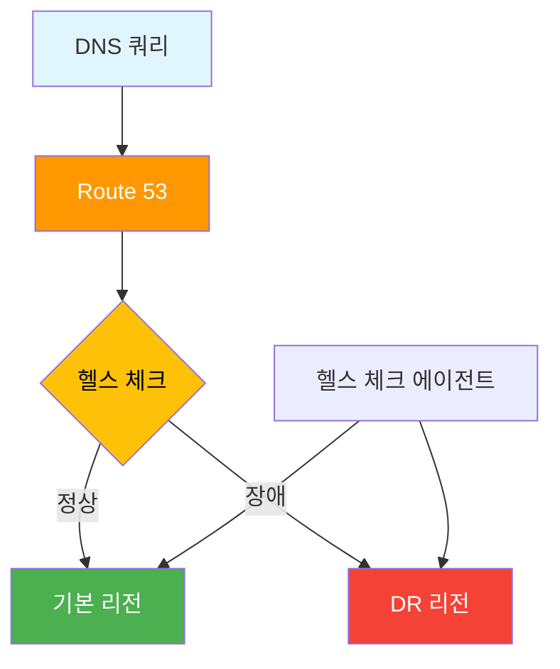

## 11. 모범 사례

### DNS 설계 원칙
1. **적절한 TTL 설정**: 변경 빈도와 성능 고려
2. **헬스 체크 활용**: 고가용성 보장
3. **지리적 분산**: 사용자 경험 최적화
4. **모니터링 설정**: 문제 조기 발견

### 성능 최적화
- **DNS 쿼리 최소화**: CNAME 체인 줄이기
- **적절한 라우팅 정책 선택**: 요구사항에 맞는 정책 사용
- **캐싱 전략**: TTL 값 최적화

## 요약

Route 53은 AWS의 강력한 DNS 서비스로, 단순한 도메인 해석부터 복잡한 트래픽 라우팅까지 다양한 기능을 제공합니다. 

**핵심 포인트**:
- 7가지 라우팅 정책으로 다양한 시나리오 지원
- 헬스 체크를 통한 자동 장애 조치
- AWS 서비스와의 완벽한 통합
- 글로벌 인프라를 활용한 고성능 DNS 서비스

다음 시간에는 API Gateway와 Lambda를 통한 서버리스 아키텍처에 대해 학습하겠습니다!