# Day 18: API Gateway & Lambda - 서버리스 컴퓨팅의 핵심

## 🎯 학습 목표

오늘은 AWS의 서버리스 컴퓨팅 서비스인 Lambda와 API Gateway에 대해 깊이 있게 학습합니다. 이 두 서비스는 현대적인 클라우드 애플리케이션의 핵심 구성 요소로, 확장성과 비용 효율성을 동시에 제공합니다.

## 📚 AWS Lambda 완전 정복

### Lambda란 무엇인가?

AWS Lambda는 서버를 관리할 필요 없이 코드를 실행할 수 있게 해주는 컴퓨팅 서비스입니다. 마치 전기를 사용할 때 발전소를 직접 운영하지 않는 것처럼, Lambda를 사용하면 서버 관리 없이 코드 실행에만 집중할 수 있습니다.

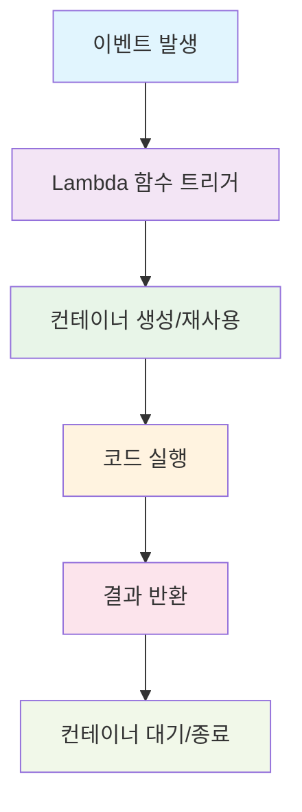

### Lambda의 핵심 특징

**1. 이벤트 기반 실행**
Lambda는 다양한 AWS 서비스의 이벤트에 반응하여 실행됩니다:

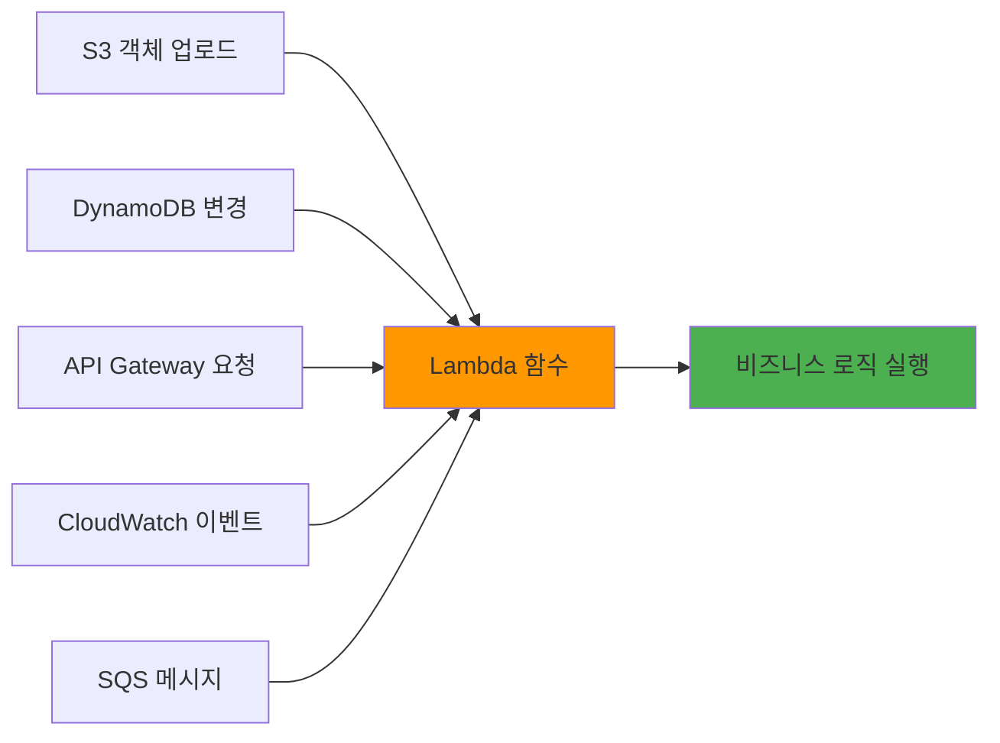

**2. 자동 스케일링**
Lambda는 동시 실행 요청 수에 따라 자동으로 확장됩니다. 1개의 요청이든 1000개의 요청이든 자동으로 처리합니다.

**3. 사용한 만큼만 지불**
서버가 항상 실행되는 EC2와 달리, Lambda는 코드가 실행되는 시간만큼만 비용을 지불합니다.

### Lambda 실행 환경

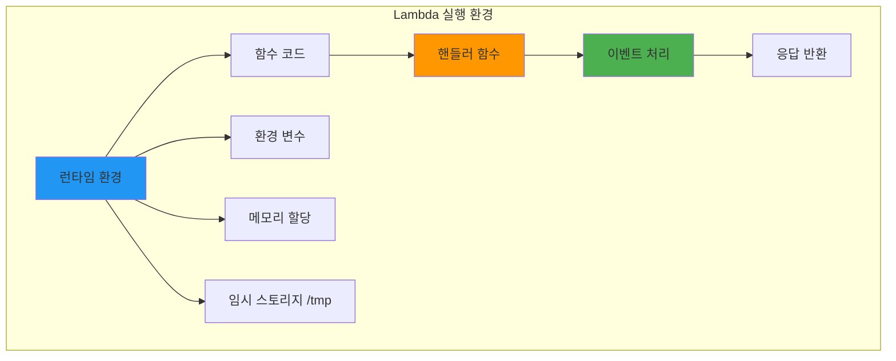

**지원 런타임:**
- Python 3.8, 3.9, 3.10, 3.11
- Node.js 16.x, 18.x
- Java 8, 11, 17
- .NET Core 3.1, 6
- Go 1.x
- Ruby 2.7, 3.2
- 커스텀 런타임 (Lambda Layers 사용)

### Lambda 함수 구조

```python
import json

def lambda_handler(event, context):
    """
    Lambda 함수의 진입점
    
    Args:
        event: 트리거 이벤트 데이터
        context: 런타임 정보 객체
    
    Returns:
        dict: 응답 데이터
    """
    
    # 이벤트 데이터 처리
    print(f"Received event: {json.dumps(event)}")
    
    # 비즈니스 로직 실행
    result = process_business_logic(event)
    
    # 응답 반환
    return {
        'statusCode': 200,
        'headers': {
            'Content-Type': 'application/json',
            'Access-Control-Allow-Origin': '*'
        },
        'body': json.dumps(result)
    }

def process_business_logic(event):
    """실제 비즈니스 로직을 처리하는 함수"""
    # 여기에 실제 로직 구현
    return {"message": "Hello from Lambda!"}
```

## 🚪 API Gateway - 서버리스 API의 관문

### API Gateway란?

API Gateway는 개발자가 어떤 규모에서든 API를 생성, 게시, 유지 관리, 모니터링 및 보안할 수 있게 해주는 완전관리형 서비스입니다. 마치 건물의 리셉션 데스크처럼, 모든 API 요청을 받아서 적절한 백엔드 서비스로 라우팅합니다.

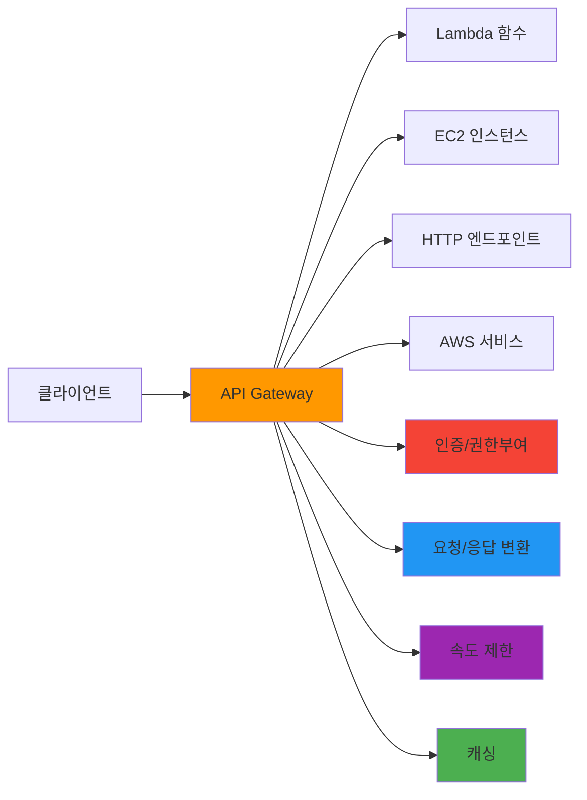

### API Gateway 유형 비교

**1. REST API**
- 완전한 기능을 제공하는 API Gateway
- 복잡한 인증, 변환, 캐싱 등 고급 기능 지원
- 비용이 상대적으로 높음

**2. HTTP API**
- 간단하고 빠른 API 구축에 최적화
- REST API 대비 70% 저렴
- 기본적인 기능에 집중

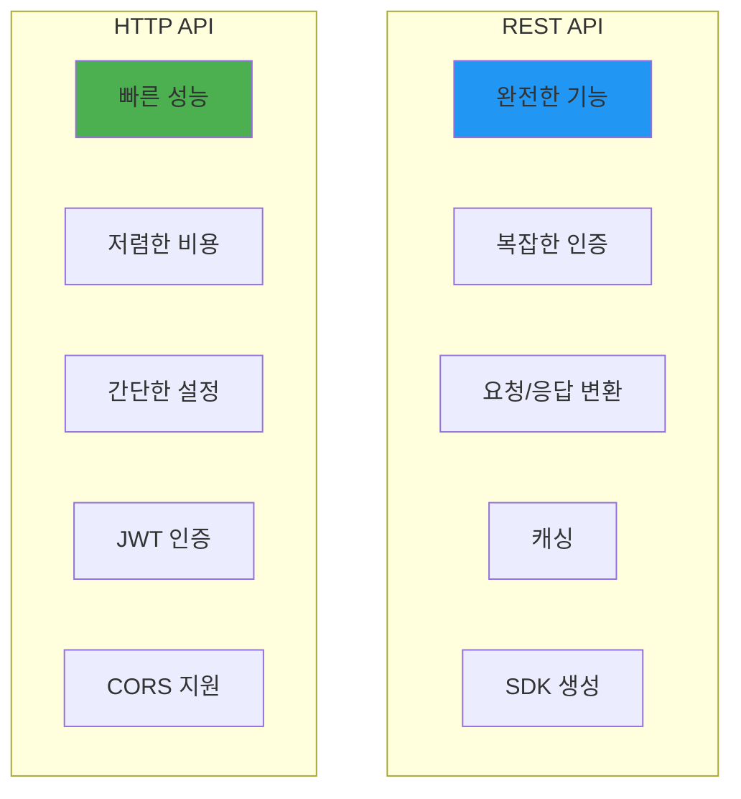

### API Gateway 요청 처리 플로우

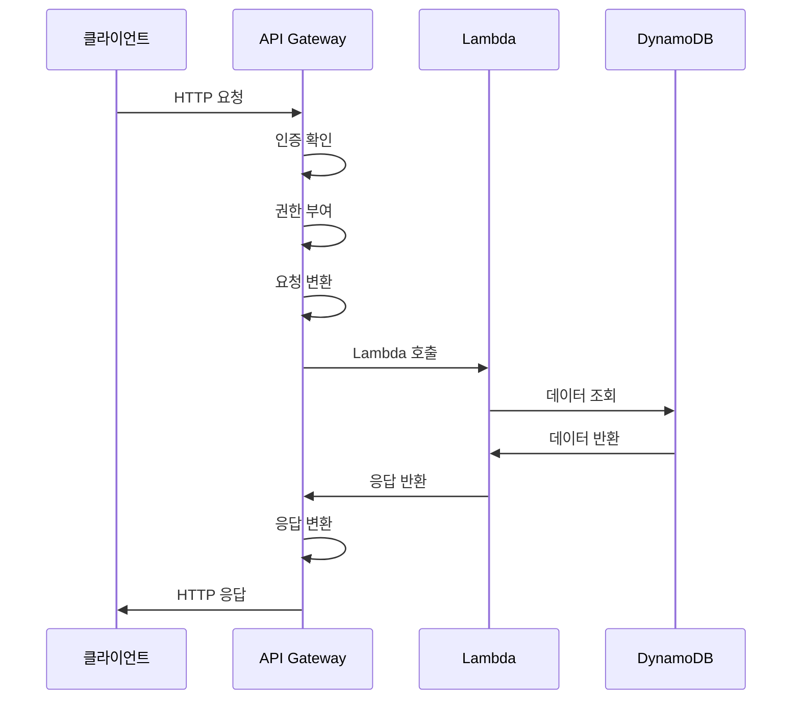

## 🔐 인증 및 권한 부여

### 인증 방법 비교

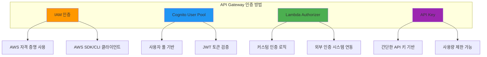

### Lambda Authorizer 구현 예제

```python
import json
import jwt
from jwt.exceptions import InvalidTokenError

def lambda_handler(event, context):
    """
    Lambda Authorizer 함수
    JWT 토큰을 검증하고 IAM 정책을 반환
    """
    
    # 토큰 추출
    token = event['authorizationToken'].replace('Bearer ', '')
    
    try:
        # JWT 토큰 검증
        payload = jwt.decode(
            token, 
            'your-secret-key', 
            algorithms=['HS256']
        )
        
        # 사용자 정보 추출
        user_id = payload['sub']
        
        # IAM 정책 생성
        policy = generate_policy(user_id, 'Allow', event['methodArn'])
        
        return policy
        
    except InvalidTokenError:
        # 토큰이 유효하지 않은 경우
        raise Exception('Unauthorized')

def generate_policy(principal_id, effect, resource):
    """IAM 정책 문서 생성"""
    return {
        'principalId': principal_id,
        'policyDocument': {
            'Version': '2012-10-17',
            'Statement': [
                {
                    'Action': 'execute-api:Invoke',
                    'Effect': effect,
                    'Resource': resource
                }
            ]
        },
        'context': {
            'userId': principal_id
        }
    }
```

## 🏗️ 서버리스 아키텍처 패턴

### 1. 기본 웹 API 패턴

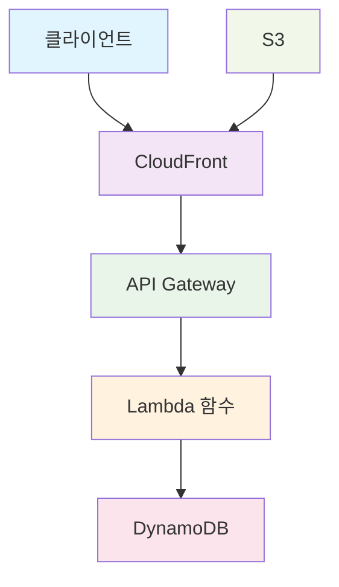

### 2. 마이크로서비스 패턴

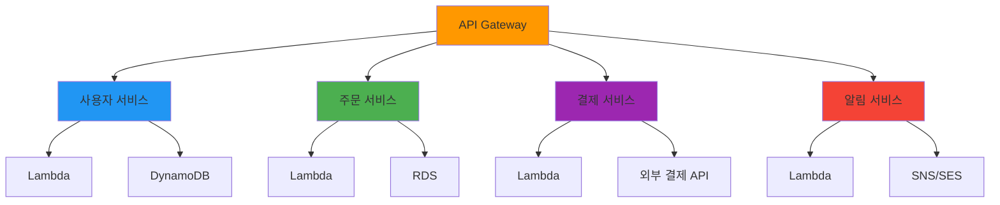

### 3. 이벤트 기반 처리 패턴

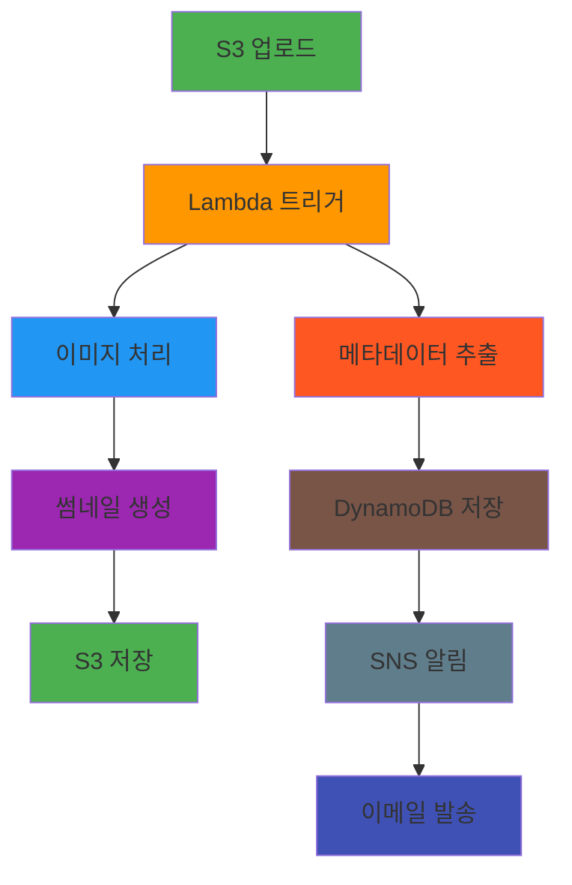

## ⚡ Lambda 성능 최적화

### Cold Start 최소화

```python
import json
import boto3

# 전역 변수로 클라이언트 초기화 (재사용됨)
dynamodb = boto3.resource('dynamodb')
table = dynamodb.Table('users')

def lambda_handler(event, context):
    """
    Cold Start를 최소화하는 Lambda 함수 구조
    """
    
    # 함수 내부에서 클라이언트를 초기화하지 않음
    # 전역 변수 사용으로 재사용 가능
    
    user_id = event['pathParameters']['userId']
    
    try:
        response = table.get_item(Key={'userId': user_id})
        
        if 'Item' in response:
            return {
                'statusCode': 200,
                'body': json.dumps(response['Item'])
            }
        else:
            return {
                'statusCode': 404,
                'body': json.dumps({'error': 'User not found'})
            }
            
    except Exception as e:
        return {
            'statusCode': 500,
            'body': json.dumps({'error': str(e)})
        }
```

### 메모리 및 타임아웃 최적화

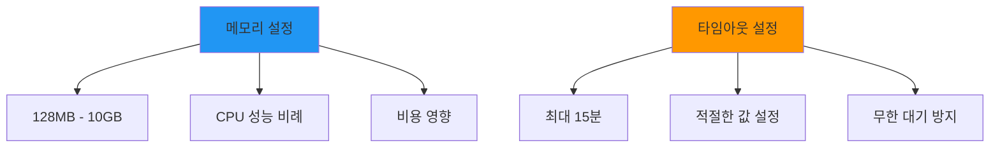

## 🔍 모니터링 및 디버깅

### CloudWatch 통합

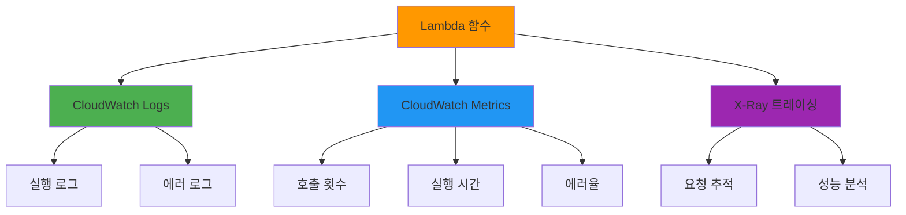

### 로깅 모범 사례

```python
import json
import logging

# 로거 설정
logger = logging.getLogger()
logger.setLevel(logging.INFO)

def lambda_handler(event, context):
    """
    적절한 로깅을 포함한 Lambda 함수
    """
    
    # 요청 정보 로깅
    logger.info(f"Request ID: {context.aws_request_id}")
    logger.info(f"Event: {json.dumps(event)}")
    
    try:
        # 비즈니스 로직 실행
        result = process_request(event)
        
        # 성공 로깅
        logger.info(f"Successfully processed request")
        
        return {
            'statusCode': 200,
            'body': json.dumps(result)
        }
        
    except Exception as e:
        # 에러 로깅
        logger.error(f"Error processing request: {str(e)}")
        
        return {
            'statusCode': 500,
            'body': json.dumps({'error': 'Internal server error'})
        }

def process_request(event):
    """비즈니스 로직 처리"""
    # 처리 단계별 로깅
    logger.info("Starting business logic processing")
    
    # 실제 로직 구현
    result = {"message": "Success"}
    
    logger.info("Business logic processing completed")
    return result
```

## 💰 비용 최적화 전략

### Lambda 비용 구조

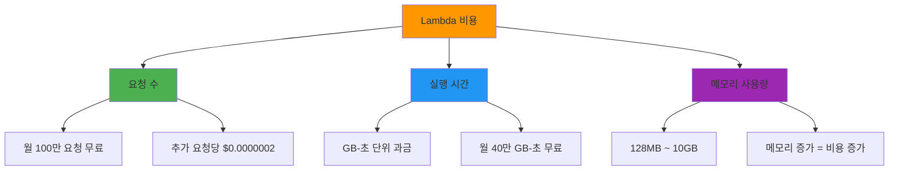

### API Gateway 비용 구조

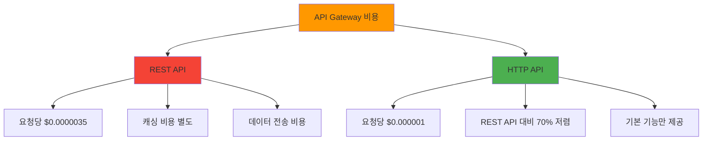

## 🔒 보안 모범 사례

### 1. 최소 권한 원칙

```json
{
    "Version": "2012-10-17",
    "Statement": [
        {
            "Effect": "Allow",
            "Action": [
                "dynamodb:GetItem",
                "dynamodb:PutItem"
            ],
            "Resource": "arn:aws:dynamodb:region:account:table/specific-table"
        },
        {
            "Effect": "Allow",
            "Action": [
                "logs:CreateLogGroup",
                "logs:CreateLogStream",
                "logs:PutLogEvents"
            ],
            "Resource": "arn:aws:logs:*:*:*"
        }
    ]
}
```

### 2. 환경 변수 암호화

```python
import os
import boto3
from botocore.exceptions import ClientError

def get_secret_value(secret_name):
    """AWS Secrets Manager에서 비밀 값 조회"""
    
    session = boto3.session.Session()
    client = session.client('secretsmanager')
    
    try:
        response = client.get_secret_value(SecretId=secret_name)
        return response['SecretString']
    except ClientError as e:
        raise e

def lambda_handler(event, context):
    """보안이 강화된 Lambda 함수"""
    
    # 환경 변수에서 시크릿 이름 조회
    secret_name = os.environ['DB_SECRET_NAME']
    
    # Secrets Manager에서 실제 값 조회
    db_credentials = get_secret_value(secret_name)
    
    # 비즈니스 로직 실행
    return process_with_credentials(db_credentials)
```

## 🎯 핵심 정리

### Lambda 핵심 포인트
1. **서버리스 컴퓨팅**: 서버 관리 없이 코드 실행
2. **이벤트 기반**: 다양한 AWS 서비스 이벤트에 반응
3. **자동 스케일링**: 요청량에 따른 자동 확장
4. **사용량 기반 과금**: 실행 시간만큼만 비용 지불

### API Gateway 핵심 포인트
1. **완전관리형 API 서비스**: API 생성, 배포, 관리 자동화
2. **다양한 백엔드 연동**: Lambda, EC2, HTTP 엔드포인트 등
3. **보안 및 인증**: 다양한 인증 방법 지원
4. **모니터링 및 분석**: CloudWatch 통합 모니터링

### 서버리스 아키텍처 장점
1. **운영 부담 감소**: 서버 관리, 패치, 확장 자동화
2. **비용 효율성**: 사용한 만큼만 지불
3. **빠른 개발**: 인프라 설정 시간 단축
4. **자동 확장**: 트래픽 증가에 자동 대응

오늘 학습한 Lambda와 API Gateway는 현대적인 클라우드 애플리케이션의 핵심입니다. 다음 실습에서는 실제로 서버리스 API를 구축해보며 이론을 실전에 적용해보겠습니다! 🚀