# Exercise 2: API Gateway와 REST API 통합

## 🎯 실습 목표
API Gateway를 REST API와 통합하여 고급 기능을 구성합니다.

**예상 소요 시간**: 15-20분

---

## 📋 사전 확인사항

실습을 시작하기 전에 다음을 확인하세요:

- [ ] [Hands-On Console README](./README.md)의 사전 요구사항 완료
- [ ] AWS Console에 로그인 완료
- [ ] 리전이 `ap-northeast-2`으로 설정되어 있음
- [ ] Exercise 1 완료 (day19-api-gateway 생성됨)

---

## 🏗️ 실습 아키텍처

이 Exercise에서 구성할 부분:

```mermaid
graph TB
    subgraph "사용자"
        User[실습 참가자]
    end
    
    subgraph "AWS Console - Exercise 2"
        Service1[API Gateway]
        Service2[REST API]
        IAM[IAM Integration Role]
    end
    
    subgraph "모니터링"
        CW[CloudWatch Dashboard]
        Logs[CloudWatch Logs]
    end
    
    User -->|통합 설정| Service1
    Service1 <-->|연결| Service2
    Service1 --> IAM
    Service2 --> IAM
    Service1 --> CW
    Service2 --> CW
    Service1 --> Logs
    Service2 --> Logs
    
    style Service1 fill:#FF9900
    style Service2 fill:#FF9900
    style User fill:#232F3E
    style CW fill:#FF4F8B
```

**구성 요소**:
- **API Gateway**: 메인 리소스
- **REST API**: 통합 서비스
- **IAM Integration Role**: 서비스 간 권한 관리
- **CloudWatch Dashboard**: 통합 모니터링
- **CloudWatch Logs**: 통합 로그 수집

---

## 📝 단계별 가이드

### Step 1: REST API 설정

**Console 경로**: `Services > AWS Services > REST API`

1. REST API 콘솔로 이동
2. 새 리소스 생성 또는 기존 리소스 선택
3. API Gateway와의 통합 옵션 찾기

---

### Step 2: API Gateway와 연결

**통합 설정**:
1. API Gateway 콘솔로 이동
2. 생성한 리소스 선택 (`day19-api-gateway`)
3. "Integrations" 또는 "Connections" 탭 선택
4. "Add integration" 또는 "Connect" 버튼 클릭
5. REST API 선택 및 설정

**연결 옵션**:
- **Auto-enable**: Yes (자동 활성화)
- **Permissions**: Create new IAM role (권장)
- **Configuration**: Default settings

---

### Step 3: IAM 역할 구성

**Console 경로**: `IAM > Roles`

1. "Create role" 버튼 클릭
2. **Trusted entity**: AWS service
3. **Use case**: API Gateway
4. **Permissions**: 
   - API GatewayFullAccess
   - REST APIFullAccess
5. **Role name**: `day19-integration-role`
6. "Create role" 클릭

---

### Step 4: 통합 테스트

**테스트 방법**:
1. API Gateway 콘솔에서 테스트 기능 실행
2. REST API에서 데이터 확인
3. 로그 및 메트릭 확인

**예상 결과**:
- 연결 상태: Connected
- 데이터 전송: Success
- 에러: None

---

### Step 5: 모니터링 설정

**CloudWatch 설정**:
1. CloudWatch 콘솔로 이동
2. "Dashboards" > "Create dashboard"
3. 대시보드 이름: `day19-integration-monitoring`
4. 위젯 추가:
   - API Gateway 메트릭
   - REST API 메트릭
   - 통합 상태 메트릭

---

## ✅ 검증 체크리스트

실습이 올바르게 완료되었는지 확인하세요:

- [ ] API Gateway 통합이 완료되었는가?
- [ ] 연결 상태가 "Connected"인가?
- [ ] IAM 역할이 올바르게 설정되었는가?
- [ ] 테스트가 성공적으로 완료되었는가?
- [ ] CloudWatch 메트릭이 수집되고 있는가?
- [ ] 에러 로그가 없는가?

---

## 🧪 테스트 및 검증

### 기능 테스트
### 테스트 1: 통합 기능 확인

**테스트 방법**:
1. API Gateway에서 작업 수행
2. 연결된 서비스에서 결과 확인
3. 데이터 플로우 검증

**예상 결과**:
- 통합이 정상 작동
- 데이터가 올바르게 전달됨
- 지연 시간이 허용 범위 내

### 테스트 2: 장애 복구 테스트

**테스트 방법**:
1. 일시적으로 연결 중단
2. 자동 복구 확인
3. 재연결 후 정상 작동 확인

**예상 결과**:
- 자동 재연결 성공
- 데이터 손실 없음

### 성능 확인
**Console 경로**: `CloudWatch > Dashboards`

확인할 메트릭:

1. **응답 시간**
   - 메트릭: Latency 또는 ResponseTime
   - 예상 값: < 100ms
   - 확인 방법: CloudWatch 그래프에서 평균값 확인

2. **처리량**
   - 메트릭: RequestCount 또는 Throughput
   - 예상 값: 테스트 요청 수와 일치
   - 확인 방법: 총 요청 수 카운트

3. **에러율**
   - 메트릭: ErrorCount 또는 FailureRate
   - 예상 값: 0% 또는 < 1%
   - 확인 방법: 에러 카운트 확인

4. **리소스 사용률**
   - 메트릭: CPUUtilization, MemoryUtilization
   - 예상 값: < 80%
   - 확인 방법: 평균 사용률 확인

### 로그 확인
**Console 경로**: `CloudWatch > Log groups`

1. **로그 그룹 찾기**
   - 검색: `/aws/api/gateway`
   - 또는 리소스 이름으로 검색

2. **최근 로그 스트림 선택**
   - 가장 최근 타임스탬프의 로그 스트림 클릭

3. **로그 내용 확인**
   - [ ] 에러 메시지 없음
   - [ ] 성공 로그 확인
   - [ ] 처리 시간 확인
   - [ ] 예상치 못한 경고 없음

4. **로그 필터링** (선택사항)
   - Filter pattern: `ERROR` 또는 `WARN`
   - 에러/경고 로그 분석

---

## 🐛 문제 해결

### 일반적인 문제

#### 문제 1: 통합 연결 실패

**증상**: "Connection failed" 에러

**원인**:
- IAM 역할 권한 부족
- 네트워크 연결 문제
- 서비스 엔드포인트 오류

**해결 방법**:
1. IAM 역할에 필요한 정책 추가
2. VPC 엔드포인트 설정 확인
3. Security Group 규칙 검토

#### 문제 2: 데이터 전송 실패

**증상**: 데이터가 전달되지 않음

**원인**:
- 잘못된 설정
- 권한 문제
- 네트워크 지연

**해결 방법**:
1. 통합 설정 재확인
2. CloudWatch Logs에서 에러 확인
3. 네트워크 연결 테스트

### 디버깅 팁
1. **CloudWatch Logs 활용**
   - 모든 작업은 로그에 기록됨
   - 에러 메시지에서 근본 원인 파악
   - 타임스탬프로 문제 발생 시점 추적

2. **AWS Console 이벤트 확인**
   - Console 경로: `API Gateway > Events`
   - 최근 이벤트 및 상태 변경 확인
   - 실패한 작업의 상세 정보 확인

3. **IAM Policy Simulator 사용**
   - Console 경로: `IAM > Policy Simulator`
   - 권한 문제 진단
   - 필요한 권한 식별

4. **AWS Support Center 활용**
   - Console 경로: `Support > Support Center`
   - 케이스 생성 및 기술 지원 요청
   - 커뮤니티 포럼 검색

---

## 🧹 리소스 정리

**중요**: 이 Exercise에서 생성한 리소스를 정리하세요.

### 정리 순서

#### 1. 통합 연결 해제

**Console 경로**: `API Gateway > Integrations`

1. 생성한 통합 선택
2. **Disconnect** 또는 **Remove** 클릭
3. 확인: "Yes, disconnect" 클릭

#### 2. CloudWatch 대시보드 삭제

**Console 경로**: `CloudWatch > Dashboards`

1. 선택: `day19-integration-monitoring`
2. Delete dashboard
3. 확인: "Delete" 클릭

#### 3. IAM 역할 삭제

**Console 경로**: `IAM > Roles`

1. 선택: `day19-integration-role`
2. Delete
3. 확인: 역할 이름 입력 후 Delete

#### 4. 관련 리소스 정리

- Exercise 1에서 생성한 리소스도 함께 정리
- 모든 연결된 리소스 확인 및 삭제

### 정리 확인
- [ ] 모든 API Gateway 리소스가 삭제되었는가?
- [ ] Security Group이 정리되었는가?
- [ ] IAM 역할이 삭제되었는가?
- [ ] CloudWatch 로그 그룹이 삭제되었는가? (선택사항)
- [ ] Billing Dashboard에서 비용 확인
- [ ] 예상 비용 범위 내인가?

**비용 확인 방법**:
1. Console 경로: `Billing > Bills`
2. 현재 월 비용 확인
3. API Gateway 관련 항목 확인
4. 예상 비용과 비교

---

## 🎓 학습 포인트

이 Exercise를 통해 배운 핵심 개념:

1. **서비스 통합**
   - API Gateway와 다른 서비스의 통합 방법
   - IAM 역할을 통한 권한 관리
   - 서비스 간 데이터 플로우

2. **모니터링 및 로깅**
   - CloudWatch를 통한 메트릭 수집
   - 로그 분석 및 문제 진단
   - 대시보드 구성

3. **고급 설정**
   - 통합 옵션 및 최적화
   - 성능 튜닝
   - 장애 복구 전략

4. **실무 적용**
   - 프로덕션 환경 고려사항
   - 확장성 및 가용성
   - 비용 최적화 전략

---

## 🔗 다음 단계

- [ ] [Case Study](../case-study.md) 읽기
  - 실제 기업의 API Gateway 활용 사례
  
- [ ] [Best Practices](../best-practices.md) 학습
  - 프로덕션 환경 구성 방법
  - 보안 및 비용 최적화
  
- [ ] [Troubleshooting](../troubleshooting.md) 검토
  - 일반적인 문제 및 해결 방법
  - 고급 디버깅 기법

- [ ] 리소스 정리
  - 모든 Exercise에서 생성한 리소스 삭제
  - 비용 확인

---

**작성일**: 2026-01-14
**마지막 업데이트**: 2026-01-14
