# Day 19: ECS, EKS, Fargate - 컨테이너 서비스

## 🎯 학습 목표

오늘은 AWS의 컨테이너 서비스들을 깊이 있게 살펴보겠습니다. 컨테이너 기술이 왜 중요한지, 그리고 AWS에서 제공하는 다양한 컨테이너 서비스들의 특징과 사용 사례를 이해해보겠습니다.

## 📚 컨테이너 기본 개념

### 컨테이너란?

컨테이너는 애플리케이션과 그 실행에 필요한 모든 것(라이브러리, 시스템 도구, 코드, 런타임)을 하나의 패키지로 묶은 것입니다. 가상머신과 달리 OS 커널을 공유하여 더 가볍고 빠릅니다.

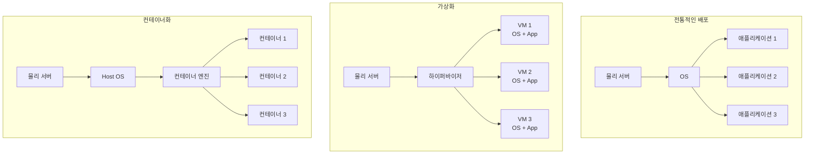

### 컨테이너의 장점

1. **일관성**: "내 컴퓨터에서는 잘 되는데..." 문제 해결
2. **이식성**: 어디서든 동일하게 실행
3. **효율성**: 리소스 사용량 최적화
4. **확장성**: 빠른 시작과 종료
5. **격리**: 애플리케이션 간 독립성 보장

## 🐳 Docker 기본 개념

Docker는 가장 널리 사용되는 컨테이너 플랫폼입니다.

### 핵심 구성 요소

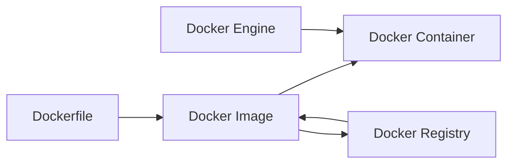

- **Dockerfile**: 컨테이너 이미지를 만들기 위한 설명서
- **Docker Image**: 실행 가능한 패키지 (읽기 전용)
- **Docker Container**: 이미지의 실행 인스턴스
- **Docker Registry**: 이미지를 저장하고 공유하는 저장소

### 간단한 Dockerfile 예제

```dockerfile
FROM node:16-alpine
WORKDIR /app
COPY package*.json ./
RUN npm install
COPY . .
EXPOSE 3000
CMD ["npm", "start"]
```

## 🚢 AWS ECS (Elastic Container Service)

ECS는 AWS에서 제공하는 완전 관리형 컨테이너 오케스트레이션 서비스입니다.

### ECS 아키텍처

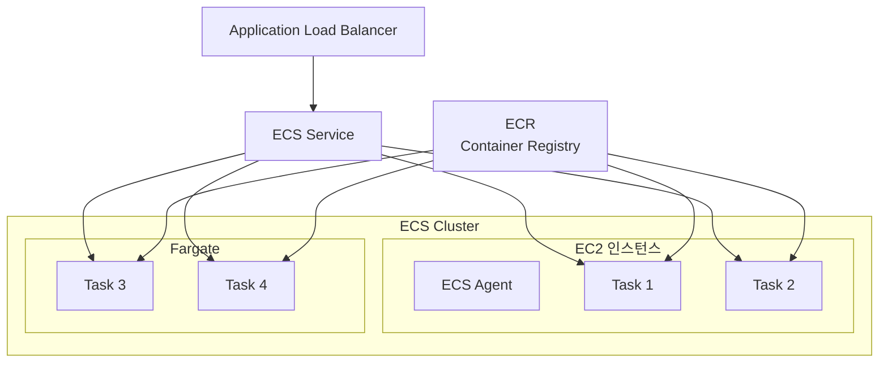

### 핵심 구성 요소

1. **클러스터 (Cluster)**
   - 컨테이너가 실행되는 논리적 그룹
   - EC2 또는 Fargate 인스턴스들의 집합

2. **태스크 정의 (Task Definition)**
   - 컨테이너 실행을 위한 청사진
   - 이미지, CPU, 메모리, 네트워킹 설정 포함

3. **태스크 (Task)**
   - 태스크 정의의 실행 인스턴스
   - 하나 이상의 컨테이너로 구성

4. **서비스 (Service)**
   - 원하는 수의 태스크를 유지
   - 로드 밸런서와 통합
   - 자동 복구 및 배포 관리

### ECS 실행 모드

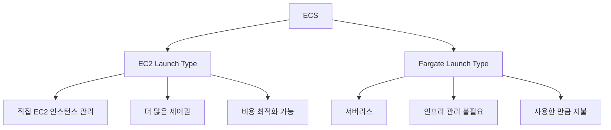

## ☸️ AWS EKS (Elastic Kubernetes Service)

EKS는 AWS에서 제공하는 완전 관리형 Kubernetes 서비스입니다.

### Kubernetes 기본 개념

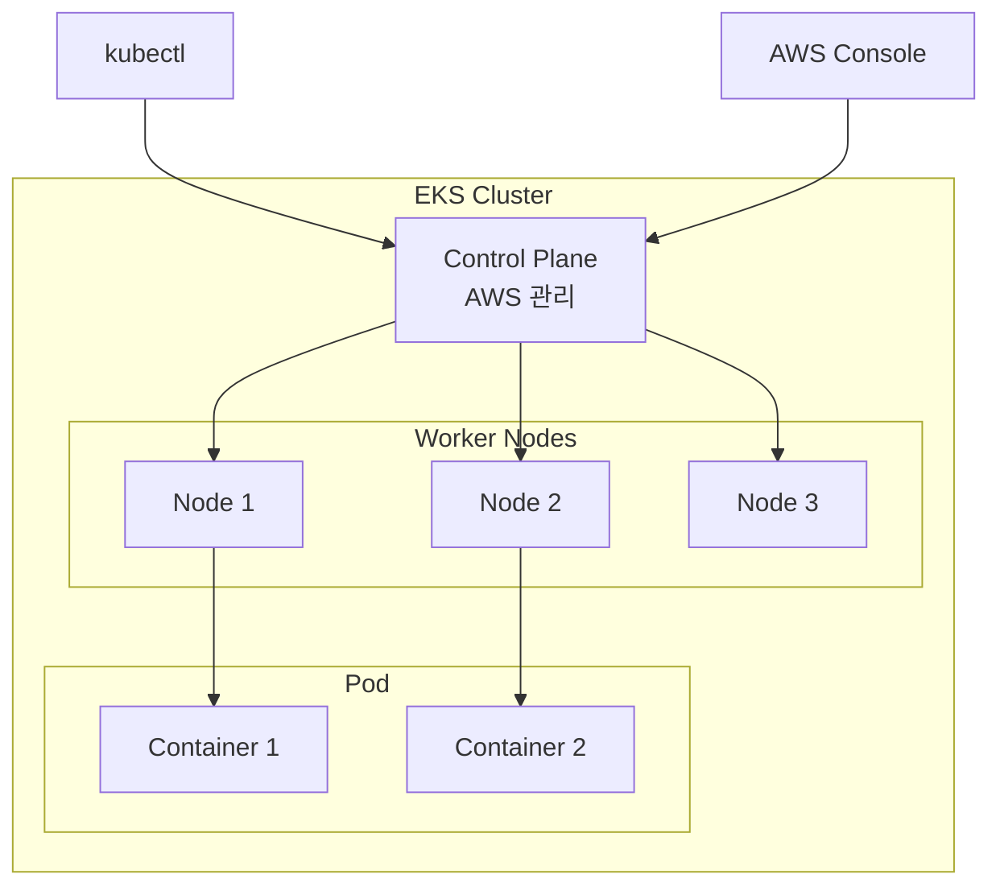

### 핵심 구성 요소

1. **클러스터 (Cluster)**
   - Kubernetes 마스터와 워커 노드들의 집합
   - Control Plane은 AWS가 완전 관리

2. **노드 (Node)**
   - 컨테이너가 실행되는 워커 머신
   - EC2 인스턴스 또는 Fargate

3. **파드 (Pod)**
   - Kubernetes의 최소 배포 단위
   - 하나 이상의 컨테이너로 구성

4. **서비스 (Service)**
   - 파드들에 대한 네트워크 접근 제공
   - 로드 밸런싱 및 서비스 디스커버리

### EKS vs ECS 비교

| 특징 | ECS | EKS |
|------|-----|-----|
| 학습 곡선 | 쉬움 | 어려움 |
| AWS 통합 | 완벽 | 좋음 |
| 이식성 | AWS 전용 | 높음 (표준 K8s) |
| 관리 복잡도 | 낮음 | 높음 |
| 생태계 | AWS 중심 | 풍부한 오픈소스 |

## 🚀 AWS Fargate

Fargate는 서버리스 컨테이너 플랫폼으로, 인프라 관리 없이 컨테이너를 실행할 수 있습니다.

### Fargate 아키텍처

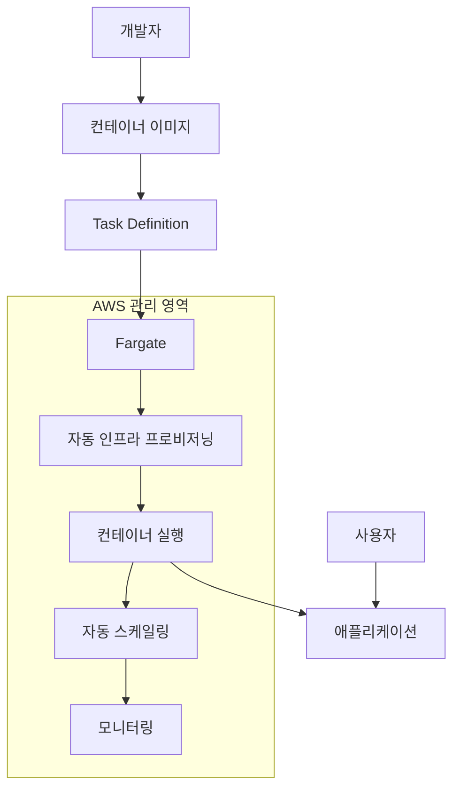

### Fargate의 장점

1. **서버리스**: 서버 관리 불필요
2. **자동 스케일링**: 수요에 따른 자동 확장/축소
3. **보안**: 격리된 실행 환경
4. **비용 효율성**: 사용한 리소스만 지불
5. **빠른 시작**: 몇 초 내 컨테이너 시작

### 사용 사례별 서비스 선택

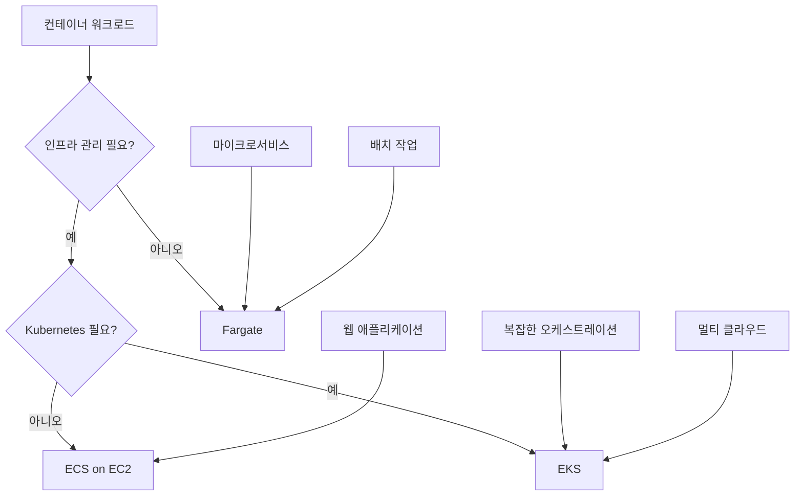

## 🔧 컨테이너 모니터링 및 로깅

### CloudWatch Container Insights

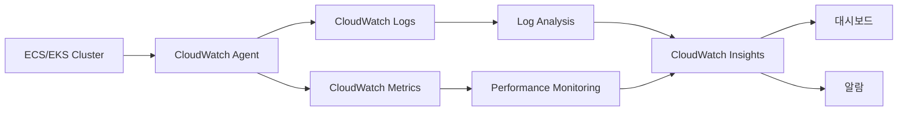

### 주요 모니터링 메트릭

1. **리소스 사용률**
   - CPU 사용률
   - 메모리 사용률
   - 네트워크 I/O
   - 디스크 I/O

2. **애플리케이션 메트릭**
   - 응답 시간
   - 처리량
   - 오류율
   - 가용성

3. **인프라 메트릭**
   - 노드 상태
   - 파드/태스크 상태
   - 클러스터 리소스

## 🏗️ 컨테이너 보안 모범 사례

### 이미지 보안

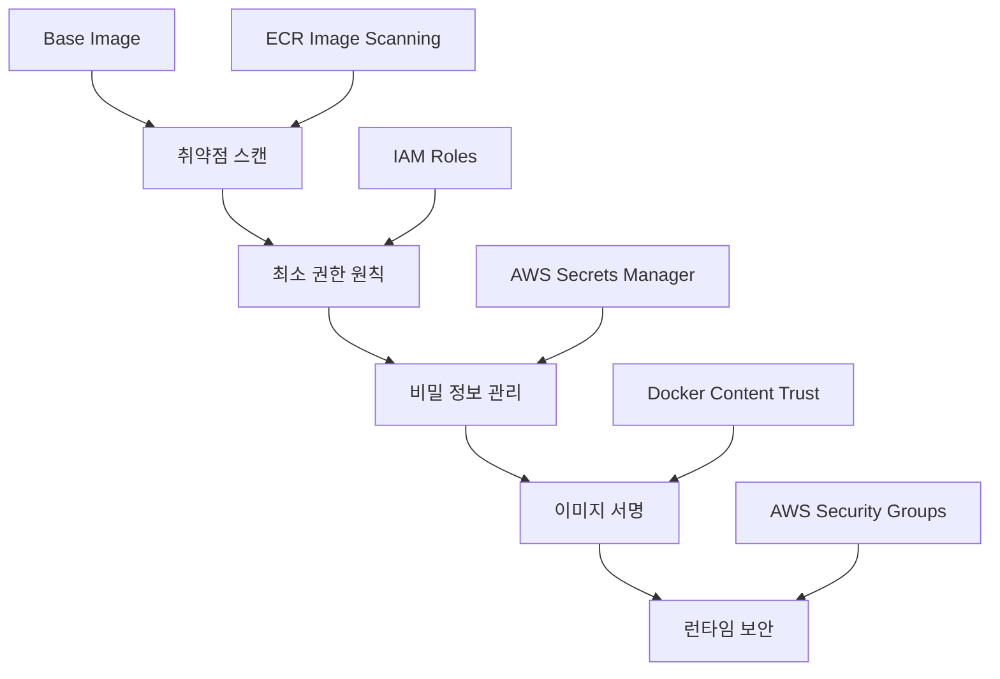

### 보안 체크리스트

1. **이미지 보안**
   - 최신 베이스 이미지 사용
   - 불필요한 패키지 제거
   - 정기적인 취약점 스캔

2. **런타임 보안**
   - 최소 권한 원칙 적용
   - 네트워크 정책 설정
   - 리소스 제한 설정

3. **데이터 보안**
   - 전송 중 암호화
   - 저장 시 암호화
   - 비밀 정보 분리 관리

## 💰 비용 최적화 전략

### 리소스 최적화

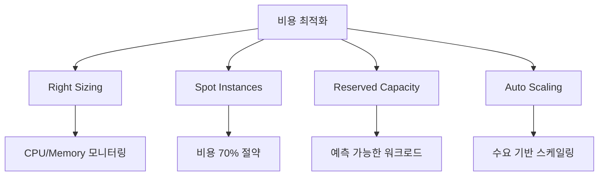

### 비용 절약 팁

1. **Fargate vs EC2**
   - 단기 워크로드: Fargate
   - 장기 워크로드: EC2 (Reserved Instance)

2. **리소스 최적화**
   - 적절한 CPU/메모리 할당
   - 불필요한 컨테이너 제거
   - 효율적인 이미지 크기

3. **스케일링 전략**
   - 수요 예측 기반 스케일링
   - 적절한 스케일링 정책 설정

## 🔄 CI/CD와 컨테이너

### 컨테이너 기반 CI/CD 파이프라인

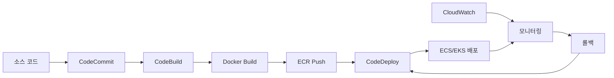

### 배포 전략

1. **Blue/Green 배포**
   - 무중단 배포
   - 빠른 롤백 가능
   - 리소스 2배 필요

2. **Rolling 배포**
   - 점진적 업데이트
   - 리소스 효율적
   - 배포 시간 길어짐

3. **Canary 배포**
   - 위험 최소화
   - A/B 테스트 가능
   - 복잡한 설정

## 📊 성능 최적화

### 컨테이너 성능 튜닝

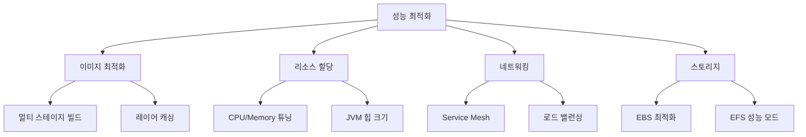

### 최적화 체크리스트

1. **이미지 최적화**
   - 작은 베이스 이미지 사용 (Alpine Linux)
   - 멀티 스테이지 빌드 활용
   - 불필요한 파일 제거

2. **리소스 튜닝**
   - 적절한 CPU/메모리 할당
   - JVM 힙 크기 조정
   - 가비지 컬렉션 튜닝

3. **네트워크 최적화**
   - 서비스 메시 활용
   - 연결 풀링
   - 캐싱 전략

## 🎯 실제 사용 사례

### 1. 마이크로서비스 아키텍처

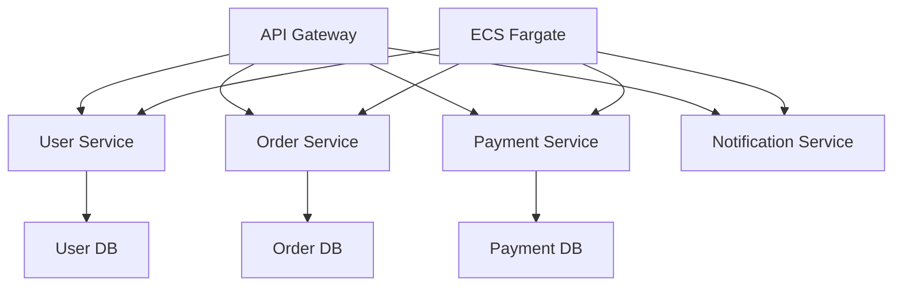

### 2. 배치 처리 시스템

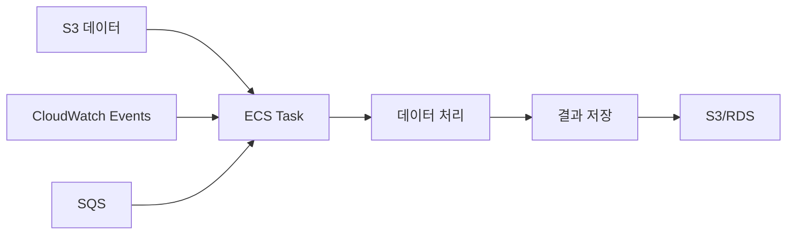

### 3. 웹 애플리케이션

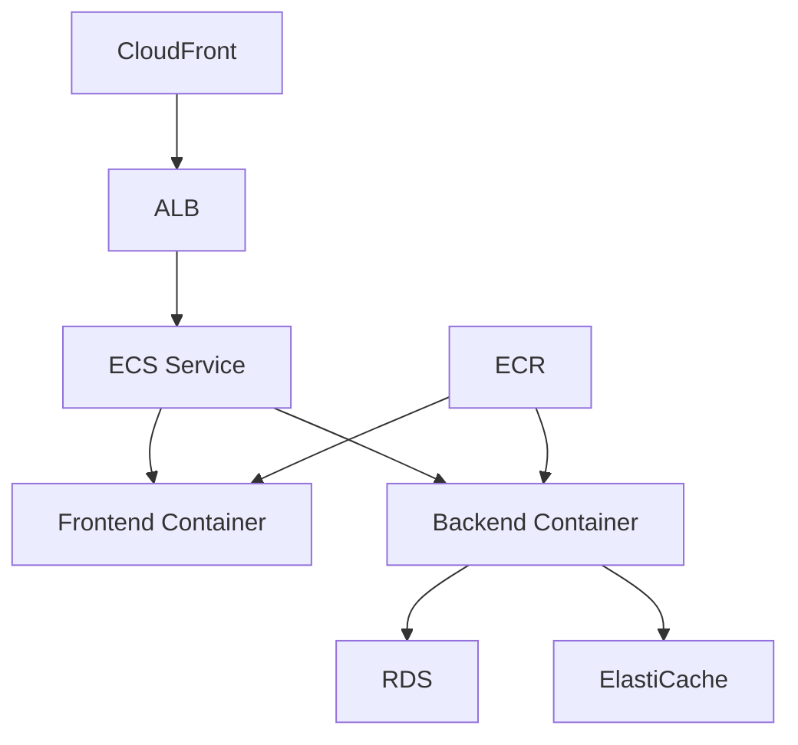

## 📝 요약

오늘 학습한 AWS 컨테이너 서비스들을 정리하면:

### 핵심 포인트

1. **컨테이너의 이해**
   - 애플리케이션 패키징 및 배포의 혁신
   - 일관성, 이식성, 효율성 제공

2. **ECS (Elastic Container Service)**
   - AWS 네이티브 컨테이너 오케스트레이션
   - 간단한 설정과 AWS 서비스 통합

3. **EKS (Elastic Kubernetes Service)**
   - 표준 Kubernetes 환경
   - 복잡한 오케스트레이션과 높은 이식성

4. **Fargate**
   - 서버리스 컨테이너 플랫폼
   - 인프라 관리 부담 제거

### 선택 가이드

- **간단한 컨테이너 워크로드**: ECS + Fargate
- **Kubernetes 경험/요구사항**: EKS
- **인프라 제어 필요**: ECS on EC2
- **서버리스 선호**: Fargate

내일은 배포 및 관리 도구(CodePipeline, CodeDeploy 등)에 대해 학습하겠습니다!