# Day 20: AWS 배포 및 관리 도구

## 학습 목표
- AWS CodePipeline을 이용한 CI/CD 파이프라인 구축 방법 이해
- AWS CodeDeploy를 통한 자동화된 애플리케이션 배포 학습
- AWS CodeCommit과 CodeBuild의 역할과 활용법 파악
- Infrastructure as Code(IaC) 도구들의 특징과 사용 사례 이해
- AWS Systems Manager를 통한 인프라 관리 방법 학습

## 1. AWS Developer Tools 개요

AWS는 개발자들이 애플리케이션을 효율적으로 개발, 빌드, 테스트, 배포할 수 있도록 다양한 도구들을 제공합니다. 이러한 도구들은 DevOps 문화를 구현하고 지속적 통합/지속적 배포(CI/CD)를 가능하게 합니다.

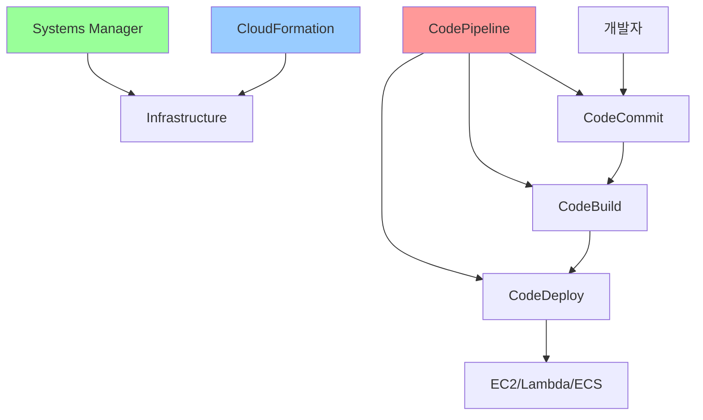

## 2. AWS CodeCommit

### 2.1 CodeCommit 개요
AWS CodeCommit은 완전 관리형 Git 기반 소스 코드 저장소 서비스입니다. GitHub나 GitLab과 유사하지만 AWS 환경에 완전히 통합되어 있습니다.

**주요 특징:**
- **보안**: IAM을 통한 세밀한 액세스 제어
- **확장성**: 무제한 저장소 크기와 파일 수
- **가용성**: 99.99% 가용성 SLA 제공
- **통합**: 다른 AWS 서비스와의 원활한 연동

### 2.2 CodeCommit 아키텍처

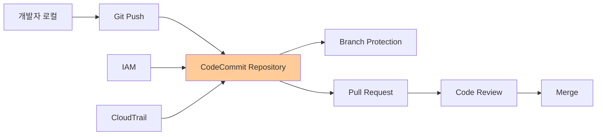

## 3. AWS CodeBuild

### 3.1 CodeBuild 개요
AWS CodeBuild는 소스 코드를 컴파일하고, 테스트를 실행하며, 배포 가능한 소프트웨어 패키지를 생성하는 완전 관리형 빌드 서비스입니다.

**주요 특징:**
- **서버리스**: 빌드 서버 관리 불필요
- **확장성**: 동시 빌드 수에 제한 없음
- **유연성**: 다양한 프로그래밍 언어와 빌드 도구 지원
- **비용 효율성**: 빌드 시간에 대해서만 과금

### 3.2 CodeBuild 빌드 프로세스

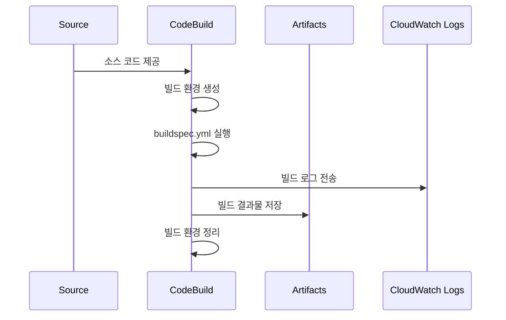

### 3.3 buildspec.yml 구조
```yaml
version: 0.2
phases:
  pre_build:
    commands:
      - echo Logging in to Amazon ECR...
      - aws ecr get-login-password --region $AWS_DEFAULT_REGION
  build:
    commands:
      - echo Build started on `date`
      - echo Building the Docker image...
      - docker build -t $IMAGE_REPO_NAME:$IMAGE_TAG .
  post_build:
    commands:
      - echo Build completed on `date`
      - echo Pushing the Docker image...
      - docker push $AWS_ACCOUNT_ID.dkr.ecr.$AWS_DEFAULT_REGION.amazonaws.com/$IMAGE_REPO_NAME:$IMAGE_TAG
artifacts:
  files:
    - '**/*'
```

## 4. AWS CodeDeploy

### 4.1 CodeDeploy 개요
AWS CodeDeploy는 EC2 인스턴스, 온프레미스 서버, Lambda 함수, ECS 서비스에 애플리케이션을 자동으로 배포하는 서비스입니다.

**배포 대상:**
- **EC2/온프레미스**: 인스턴스 기반 배포
- **Lambda**: 서버리스 함수 배포
- **ECS**: 컨테이너 서비스 배포

### 4.2 배포 전략

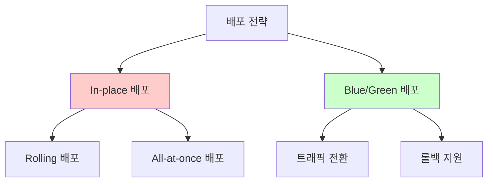

**In-place 배포:**
- 기존 인스턴스에서 애플리케이션 업데이트
- 다운타임 발생 가능
- 비용 효율적

**Blue/Green 배포:**
- 새로운 환경에 배포 후 트래픽 전환
- 무중단 배포 가능
- 빠른 롤백 지원

### 4.3 CodeDeploy 구성 요소

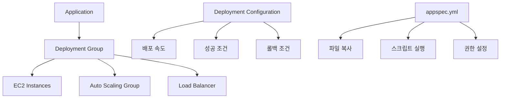

## 5. AWS CodePipeline

### 5.1 CodePipeline 개요
AWS CodePipeline은 코드 변경 사항이 있을 때마다 빌드, 테스트, 배포 단계를 자동으로 실행하는 지속적 통합 및 지속적 배포(CI/CD) 서비스입니다.

### 5.2 파이프라인 구조

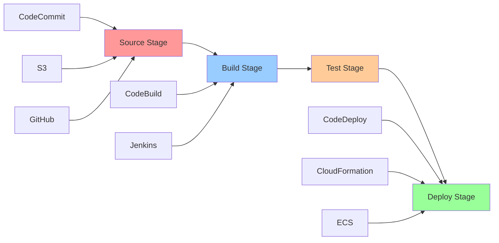

### 5.3 파이프라인 실행 흐름

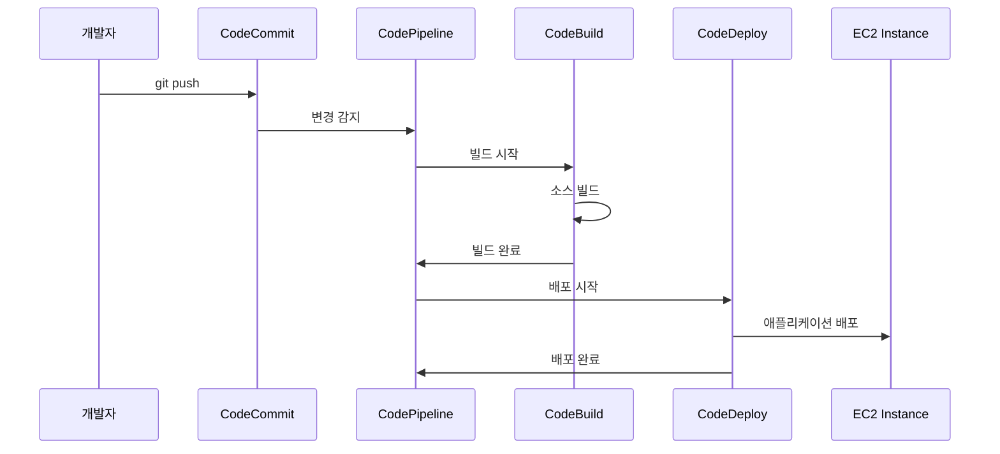

## 6. Infrastructure as Code (IaC)

### 6.1 AWS CloudFormation

AWS CloudFormation은 AWS 리소스를 코드로 정의하고 관리할 수 있게 해주는 서비스입니다.

**주요 개념:**
- **Template**: JSON 또는 YAML 형식의 리소스 정의
- **Stack**: 템플릿으로 생성된 리소스 그룹
- **Change Set**: 스택 변경 사항 미리보기

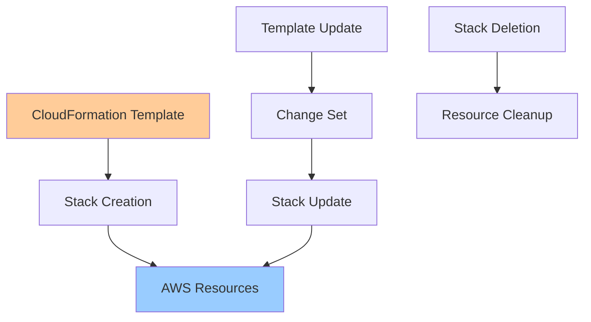

### 6.2 AWS CDK (Cloud Development Kit)

AWS CDK는 익숙한 프로그래밍 언어를 사용하여 클라우드 애플리케이션 리소스를 정의할 수 있게 해주는 오픈소스 소프트웨어 개발 프레임워크입니다.

**지원 언어:**
- TypeScript/JavaScript
- Python
- Java
- C#/.NET
- Go

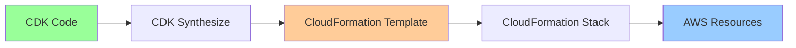

## 7. AWS Systems Manager

### 7.1 Systems Manager 개요
AWS Systems Manager는 AWS에서 인프라를 가시화하고 제어할 수 있는 통합 사용자 인터페이스를 제공합니다.

### 7.2 주요 기능

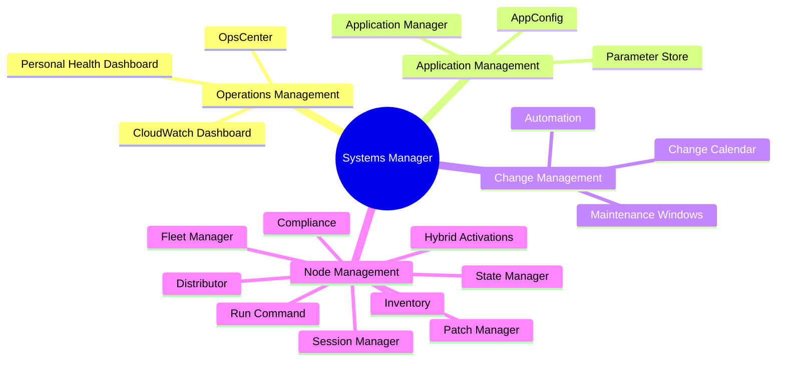

### 7.3 Parameter Store
중앙 집중식 구성 및 비밀 관리 서비스입니다.

**특징:**
- **계층적 저장**: 경로 기반 파라미터 구성
- **암호화**: KMS를 통한 보안 문자열 암호화
- **버전 관리**: 파라미터 변경 이력 추적
- **액세스 제어**: IAM을 통한 세밀한 권한 관리

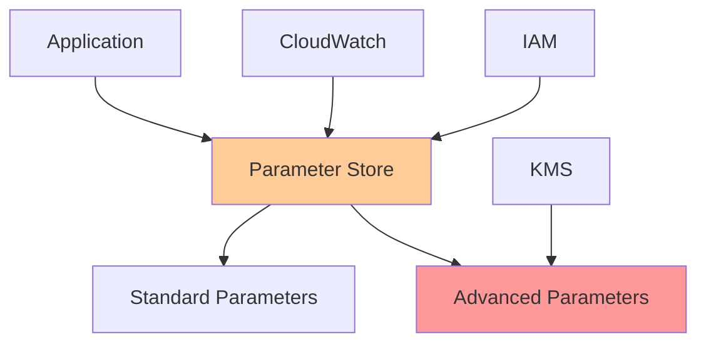

## 8. 모니터링 및 로깅

### 8.1 CloudWatch와의 통합
모든 AWS Developer Tools는 CloudWatch와 통합되어 상세한 모니터링과 로깅을 제공합니다.

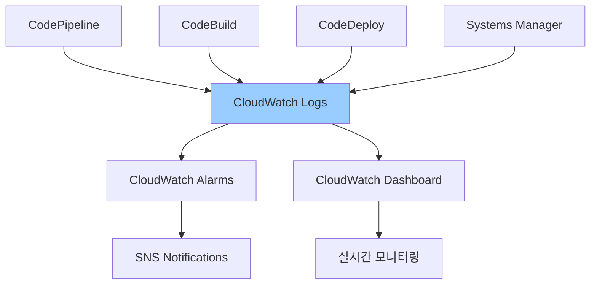

### 8.2 AWS X-Ray
분산 애플리케이션의 성능을 분석하고 디버깅할 수 있는 서비스입니다.

**주요 기능:**
- **서비스 맵**: 애플리케이션 구성 요소 시각화
- **트레이스**: 요청 경로 추적
- **성능 분석**: 병목 지점 식별

## 9. 보안 모범 사례

### 9.1 IAM 역할과 정책
- **최소 권한 원칙**: 필요한 최소한의 권한만 부여
- **역할 기반 액세스**: 사용자 대신 역할 사용
- **정기적 검토**: 권한 정기적 감사

### 9.2 암호화
- **전송 중 암호화**: HTTPS/TLS 사용
- **저장 시 암호화**: KMS를 통한 데이터 암호화
- **코드 서명**: 배포 패키지 무결성 보장

### 9.3 네트워크 보안
- **VPC 엔드포인트**: 프라이빗 연결 사용
- **보안 그룹**: 최소한의 포트만 개방
- **네트워크 ACL**: 추가 네트워크 보안 계층

## 10. 비용 최적화

### 10.1 리소스 관리
- **자동 스케일링**: 필요에 따른 리소스 조정
- **예약 인스턴스**: 장기 사용 시 비용 절감
- **스팟 인스턴스**: 빌드 작업에 활용

### 10.2 모니터링
- **Cost Explorer**: 비용 분석 및 예측
- **예산 알림**: 비용 임계값 모니터링
- **태그 기반 비용 추적**: 프로젝트별 비용 관리

## 요약

AWS 배포 및 관리 도구들은 현대적인 DevOps 워크플로우를 구현하는 데 필수적인 서비스들입니다:

1. **CodeCommit**: 안전한 Git 기반 소스 코드 저장소
2. **CodeBuild**: 확장 가능한 빌드 서비스
3. **CodeDeploy**: 자동화된 애플리케이션 배포
4. **CodePipeline**: 완전한 CI/CD 파이프라인
5. **CloudFormation/CDK**: Infrastructure as Code
6. **Systems Manager**: 통합 인프라 관리

이러한 도구들을 효과적으로 활용하면 애플리케이션의 품질을 높이고, 배포 속도를 향상시키며, 운영 효율성을 크게 개선할 수 있습니다.

## 다음 학습
내일은 주간 복습과 마이크로서비스 아키텍처 구축 실습 프로젝트를 진행합니다. 오늘 학습한 배포 도구들을 실제로 활용해보는 시간을 가질 예정입니다.