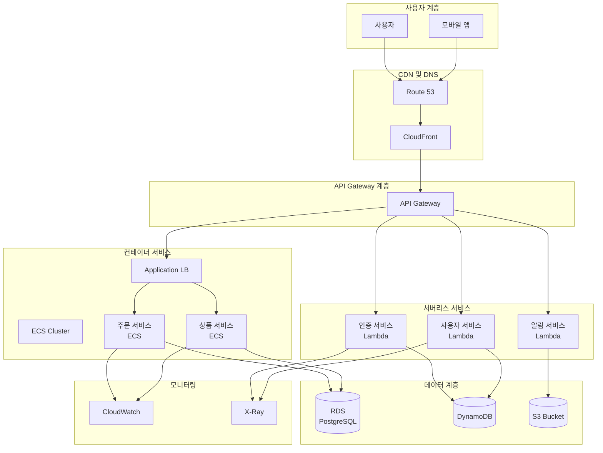

# Day 21 실습: 마이크로서비스 아키텍처 구축

## 실습 개요

이번 실습에서는 Week 3에서 학습한 모든 서비스를 통합하여 완전한 마이크로서비스 아키텍처를 구축합니다. API Gateway, Lambda, ECS, CloudFront, Route 53, Auto Scaling 등을 조합하여 실제 프로덕션 환경과 유사한 현대적인 웹 애플리케이션을 만들어보겠습니다.

## 실습 목표

- 마이크로서비스 아키텍처의 핵심 구성 요소 구현
- API Gateway를 통한 서비스 라우팅 및 인증 설정
- Lambda 기반 서버리스 백엔드 서비스 구축
- ECS를 사용한 컨테이너 기반 서비스 배포
- CloudFront를 통한 글로벌 콘텐츠 배포
- Route 53을 사용한 DNS 기반 서비스 디스커버리
- 통합 모니터링 및 로깅 시스템 구성

## 아키텍처 개요



## 사전 준비사항

### 필요한 리소스
- AWS 계정 (Free Tier 사용 가능)
- Docker Desktop (로컬 테스트용)
- AWS CLI 설치 및 구성
- 도메인 이름 (선택사항, Route 53 테스트용)

### 예상 비용
- API Gateway: 100만 요청까지 무료
- Lambda: 100만 요청 + 400,000 GB-초까지 무료
- ECS Fargate: 시간당 약 $0.04048 (vCPU) + $0.004445 (GB 메모리)
- CloudFront: 50GB 데이터 전송까지 무료
- Route 53: 호스팅 영역당 월 $0.50

## 실습 1: 기본 인프라 구성

### 1.1 VPC 및 네트워킹 설정

1. **VPC 생성**:
   ```
   VPC Name: microservices-vpc
   IPv4 CIDR: 10.0.0.0/16
   IPv6 CIDR: 없음
   Tenancy: Default
   ```

2. **서브넷 생성**:
   ```
   Public Subnet 1: 10.0.1.0/24 (us-east-1a)
   Public Subnet 2: 10.0.2.0/24 (us-east-1b)
   Private Subnet 1: 10.0.11.0/24 (us-east-1a)
   Private Subnet 2: 10.0.12.0/24 (us-east-1b)
   ```

3. **Internet Gateway 및 NAT Gateway 설정**:
   - Internet Gateway 생성 및 VPC 연결
   - Public Subnet에 NAT Gateway 생성
   - 라우팅 테이블 구성

### 1.2 보안 그룹 생성

1. **ALB Security Group**:
   ```
   Name: microservices-alb-sg
   Inbound Rules:
   - HTTP (80) from 0.0.0.0/0
   - HTTPS (443) from 0.0.0.0/0
   ```

2. **ECS Security Group**:
   ```
   Name: microservices-ecs-sg
   Inbound Rules:
   - HTTP (80) from ALB Security Group
   - Custom TCP (8080) from ALB Security Group
   ```

3. **RDS Security Group**:
   ```
   Name: microservices-rds-sg
   Inbound Rules:
   - PostgreSQL (5432) from ECS Security Group
   ```

## 실습 2: 데이터 계층 구성

### 2.1 DynamoDB 테이블 생성

1. **사용자 테이블**:
   ```
   Table name: microservices-users
   Partition key: userId (String)
   Billing mode: On-demand
   ```

2. **세션 테이블**:
   ```
   Table name: microservices-sessions
   Partition key: sessionId (String)
   TTL attribute: expiresAt
   ```

### 2.2 RDS PostgreSQL 인스턴스 생성

1. **DB 서브넷 그룹 생성**:
   ```
   Name: microservices-db-subnet-group
   VPC: microservices-vpc
   Subnets: Private Subnet 1, Private Subnet 2
   ```

2. **RDS 인스턴스 생성**:
   ```
   Engine: PostgreSQL 15.4
   Template: Free tier
   DB instance identifier: microservices-db
   Master username: postgres
   Master password: [안전한 비밀번호]
   DB instance class: db.t3.micro
   Storage: 20 GB gp2
   VPC: microservices-vpc
   DB subnet group: microservices-db-subnet-group
   Security group: microservices-rds-sg
   ```

### 2.3 S3 버킷 생성

1. **정적 콘텐츠 버킷**:
   ```
   Bucket name: microservices-static-[random-suffix]
   Region: us-east-1
   Block all public access: 체크 해제
   ```

2. **버킷 정책 설정**:
   ```json
   {
     "Version": "2012-10-17",
     "Statement": [
       {
         "Sid": "PublicReadGetObject",
         "Effect": "Allow",
         "Principal": "*",
         "Action": "s3:GetObject",
         "Resource": "arn:aws:s3:::microservices-static-[suffix]/*"
       }
     ]
   }
   ```

## 실습 3: 서버리스 서비스 구축

### 3.1 Lambda 실행 역할 생성

1. **IAM 역할 생성**:
   ```
   Role name: microservices-lambda-role
   Trusted entity: Lambda
   Policies:
   - AWSLambdaBasicExecutionRole
   - AmazonDynamoDBFullAccess (실습용, 실제로는 최소 권한 적용)
   ```

### 3.2 인증 서비스 Lambda 함수

1. **함수 생성**:
   ```
   Function name: microservices-auth
   Runtime: Python 3.11
   Execution role: microservices-lambda-role
   ```

2. **함수 코드**:
   ```python
   import json
   import boto3
   import hashlib
   import uuid
   from datetime import datetime, timedelta
   
   dynamodb = boto3.resource('dynamodb')
   users_table = dynamodb.Table('microservices-users')
   sessions_table = dynamodb.Table('microservices-sessions')
   
   def lambda_handler(event, context):
       try:
           http_method = event['httpMethod']
           path = event['path']
           
           if http_method == 'POST' and path == '/auth/login':
               return handle_login(event)
           elif http_method == 'POST' and path == '/auth/register':
               return handle_register(event)
           elif http_method == 'GET' and path == '/auth/verify':
               return handle_verify(event)
           else:
               return {
                   'statusCode': 404,
                   'headers': {
                       'Content-Type': 'application/json',
                       'Access-Control-Allow-Origin': '*'
                   },
                   'body': json.dumps({'error': 'Not found'})
               }
       except Exception as e:
           return {
               'statusCode': 500,
               'headers': {
                   'Content-Type': 'application/json',
                   'Access-Control-Allow-Origin': '*'
               },
               'body': json.dumps({'error': str(e)})
           }
   
   def handle_login(event):
       body = json.loads(event['body'])
       email = body.get('email')
       password = body.get('password')
       
       if not email or not password:
           return {
               'statusCode': 400,
               'headers': {'Content-Type': 'application/json', 'Access-Control-Allow-Origin': '*'},
               'body': json.dumps({'error': 'Email and password required'})
           }
       
       # 사용자 조회
       response = users_table.get_item(Key={'userId': email})
       if 'Item' not in response:
           return {
               'statusCode': 401,
               'headers': {'Content-Type': 'application/json', 'Access-Control-Allow-Origin': '*'},
               'body': json.dumps({'error': 'Invalid credentials'})
           }
       
       user = response['Item']
       password_hash = hashlib.sha256(password.encode()).hexdigest()
       
       if user['passwordHash'] != password_hash:
           return {
               'statusCode': 401,
               'headers': {'Content-Type': 'application/json', 'Access-Control-Allow-Origin': '*'},
               'body': json.dumps({'error': 'Invalid credentials'})
           }
       
       # 세션 생성
       session_id = str(uuid.uuid4())
       expires_at = int((datetime.now() + timedelta(hours=24)).timestamp())
       
       sessions_table.put_item(Item={
           'sessionId': session_id,
           'userId': email,
           'expiresAt': expires_at
       })
       
       return {
           'statusCode': 200,
           'headers': {'Content-Type': 'application/json', 'Access-Control-Allow-Origin': '*'},
           'body': json.dumps({
               'sessionId': session_id,
               'user': {
                   'userId': user['userId'],
                   'name': user['name']
               }
           })
       }
   
   def handle_register(event):
       body = json.loads(event['body'])
       email = body.get('email')
       password = body.get('password')
       name = body.get('name')
       
       if not email or not password or not name:
           return {
               'statusCode': 400,
               'headers': {'Content-Type': 'application/json', 'Access-Control-Allow-Origin': '*'},
               'body': json.dumps({'error': 'Email, password, and name required'})
           }
       
       # 중복 사용자 확인
       response = users_table.get_item(Key={'userId': email})
       if 'Item' in response:
           return {
               'statusCode': 409,
               'headers': {'Content-Type': 'application/json', 'Access-Control-Allow-Origin': '*'},
               'body': json.dumps({'error': 'User already exists'})
           }
       
       # 사용자 생성
       password_hash = hashlib.sha256(password.encode()).hexdigest()
       users_table.put_item(Item={
           'userId': email,
           'name': name,
           'passwordHash': password_hash,
           'createdAt': datetime.now().isoformat()
       })
       
       return {
           'statusCode': 201,
           'headers': {'Content-Type': 'application/json', 'Access-Control-Allow-Origin': '*'},
           'body': json.dumps({'message': 'User created successfully'})
       }
   
   def handle_verify(event):
       headers = event.get('headers', {})
       auth_header = headers.get('Authorization') or headers.get('authorization')
       
       if not auth_header or not auth_header.startswith('Bearer '):
           return {
               'statusCode': 401,
               'headers': {'Content-Type': 'application/json', 'Access-Control-Allow-Origin': '*'},
               'body': json.dumps({'error': 'Authorization header required'})
           }
       
       session_id = auth_header.replace('Bearer ', '')
       
       # 세션 확인
       response = sessions_table.get_item(Key={'sessionId': session_id})
       if 'Item' not in response:
           return {
               'statusCode': 401,
               'headers': {'Content-Type': 'application/json', 'Access-Control-Allow-Origin': '*'},
               'body': json.dumps({'error': 'Invalid session'})
           }
       
       session = response['Item']
       if session['expiresAt'] < int(datetime.now().timestamp()):
           return {
               'statusCode': 401,
               'headers': {'Content-Type': 'application/json', 'Access-Control-Allow-Origin': '*'},
               'body': json.dumps({'error': 'Session expired'})
           }
       
       return {
           'statusCode': 200,
           'headers': {'Content-Type': 'application/json', 'Access-Control-Allow-Origin': '*'},
           'body': json.dumps({
               'valid': True,
               'userId': session['userId']
           })
       }
   ```

### 3.3 사용자 서비스 Lambda 함수

1. **함수 생성**:
   ```
   Function name: microservices-users
   Runtime: Python 3.11
   Execution role: microservices-lambda-role
   ```

2. **함수 코드**:
   ```python
   import json
   import boto3
   from datetime import datetime
   
   dynamodb = boto3.resource('dynamodb')
   users_table = dynamodb.Table('microservices-users')
   
   def lambda_handler(event, context):
       try:
           http_method = event['httpMethod']
           path = event['path']
           
           if http_method == 'GET' and path.startswith('/users/'):
               return handle_get_user(event)
           elif http_method == 'PUT' and path.startswith('/users/'):
               return handle_update_user(event)
           elif http_method == 'GET' and path == '/users':
               return handle_list_users(event)
           else:
               return {
                   'statusCode': 404,
                   'headers': {
                       'Content-Type': 'application/json',
                       'Access-Control-Allow-Origin': '*'
                   },
                   'body': json.dumps({'error': 'Not found'})
               }
       except Exception as e:
           return {
               'statusCode': 500,
               'headers': {
                   'Content-Type': 'application/json',
                   'Access-Control-Allow-Origin': '*'
               },
               'body': json.dumps({'error': str(e)})
           }
   
   def handle_get_user(event):
       user_id = event['pathParameters']['proxy']
       
       response = users_table.get_item(Key={'userId': user_id})
       if 'Item' not in response:
           return {
               'statusCode': 404,
               'headers': {'Content-Type': 'application/json', 'Access-Control-Allow-Origin': '*'},
               'body': json.dumps({'error': 'User not found'})
           }
       
       user = response['Item']
       # 비밀번호 해시 제거
       user.pop('passwordHash', None)
       
       return {
           'statusCode': 200,
           'headers': {'Content-Type': 'application/json', 'Access-Control-Allow-Origin': '*'},
           'body': json.dumps(user, default=str)
       }
   
   def handle_update_user(event):
       user_id = event['pathParameters']['proxy']
       body = json.loads(event['body'])
       
       # 사용자 존재 확인
       response = users_table.get_item(Key={'userId': user_id})
       if 'Item' not in response:
           return {
               'statusCode': 404,
               'headers': {'Content-Type': 'application/json', 'Access-Control-Allow-Origin': '*'},
               'body': json.dumps({'error': 'User not found'})
           }
       
       # 업데이트 가능한 필드만 처리
       update_expression = "SET updatedAt = :updatedAt"
       expression_values = {':updatedAt': datetime.now().isoformat()}
       
       if 'name' in body:
           update_expression += ", #name = :name"
           expression_values[':name'] = body['name']
       
       users_table.update_item(
           Key={'userId': user_id},
           UpdateExpression=update_expression,
           ExpressionAttributeNames={'#name': 'name'} if 'name' in body else None,
           ExpressionAttributeValues=expression_values
       )
       
       return {
           'statusCode': 200,
           'headers': {'Content-Type': 'application/json', 'Access-Control-Allow-Origin': '*'},
           'body': json.dumps({'message': 'User updated successfully'})
       }
   
   def handle_list_users(event):
       # 실제 환경에서는 페이지네이션 구현 필요
       response = users_table.scan(
           ProjectionExpression='userId, #name, createdAt',
           ExpressionAttributeNames={'#name': 'name'}
       )
       
       return {
           'statusCode': 200,
           'headers': {'Content-Type': 'application/json', 'Access-Control-Allow-Origin': '*'},
           'body': json.dumps(response['Items'], default=str)
       }
   ```

## 실습 4: 컨테이너 서비스 구축

### 4.1 ECS 클러스터 생성

1. **클러스터 생성**:
   ```
   Cluster name: microservices-cluster
   Infrastructure: AWS Fargate (serverless)
   ```

### 4.2 상품 서비스 컨테이너 구성

1. **Dockerfile 작성** (로컬에서 작성):
   ```dockerfile
   FROM python:3.11-slim
   
   WORKDIR /app
   
   COPY requirements.txt .
   RUN pip install -r requirements.txt
   
   COPY . .
   
   EXPOSE 8080
   
   CMD ["python", "app.py"]
   ```

2. **requirements.txt**:
   ```
   flask==2.3.3
   psycopg2-binary==2.9.7
   boto3==1.28.57
   ```

3. **app.py** (상품 서비스):
   ```python
   from flask import Flask, request, jsonify
   import psycopg2
   import os
   import json
   
   app = Flask(__name__)
   
   # 데이터베이스 연결 설정
   DB_HOST = os.environ.get('DB_HOST')
   DB_NAME = os.environ.get('DB_NAME', 'postgres')
   DB_USER = os.environ.get('DB_USER', 'postgres')
   DB_PASSWORD = os.environ.get('DB_PASSWORD')
   
   def get_db_connection():
       return psycopg2.connect(
           host=DB_HOST,
           database=DB_NAME,
           user=DB_USER,
           password=DB_PASSWORD
       )
   
   @app.route('/health', methods=['GET'])
   def health_check():
       return jsonify({'status': 'healthy', 'service': 'products'})
   
   @app.route('/products', methods=['GET'])
   def get_products():
       try:
           conn = get_db_connection()
           cur = conn.cursor()
           
           cur.execute("""
               SELECT id, name, description, price, stock, created_at 
               FROM products 
               ORDER BY created_at DESC
           """)
           
           products = []
           for row in cur.fetchall():
               products.append({
                   'id': row[0],
                   'name': row[1],
                   'description': row[2],
                   'price': float(row[3]),
                   'stock': row[4],
                   'created_at': row[5].isoformat()
               })
           
           cur.close()
           conn.close()
           
           return jsonify(products)
       except Exception as e:
           return jsonify({'error': str(e)}), 500
   
   @app.route('/products/<int:product_id>', methods=['GET'])
   def get_product(product_id):
       try:
           conn = get_db_connection()
           cur = conn.cursor()
           
           cur.execute("""
               SELECT id, name, description, price, stock, created_at 
               FROM products 
               WHERE id = %s
           """, (product_id,))
           
           row = cur.fetchone()
           if not row:
               return jsonify({'error': 'Product not found'}), 404
           
           product = {
               'id': row[0],
               'name': row[1],
               'description': row[2],
               'price': float(row[3]),
               'stock': row[4],
               'created_at': row[5].isoformat()
           }
           
           cur.close()
           conn.close()
           
           return jsonify(product)
       except Exception as e:
           return jsonify({'error': str(e)}), 500
   
   @app.route('/products', methods=['POST'])
   def create_product():
       try:
           data = request.get_json()
           
           conn = get_db_connection()
           cur = conn.cursor()
           
           cur.execute("""
               INSERT INTO products (name, description, price, stock)
               VALUES (%s, %s, %s, %s)
               RETURNING id, created_at
           """, (data['name'], data['description'], data['price'], data['stock']))
           
           result = cur.fetchone()
           conn.commit()
           cur.close()
           conn.close()
           
           return jsonify({
               'id': result[0],
               'name': data['name'],
               'description': data['description'],
               'price': data['price'],
               'stock': data['stock'],
               'created_at': result[1].isoformat()
           }), 201
       except Exception as e:
           return jsonify({'error': str(e)}), 500
   
   if __name__ == '__main__':
       # 데이터베이스 테이블 초기화
       try:
           conn = get_db_connection()
           cur = conn.cursor()
           
           cur.execute("""
               CREATE TABLE IF NOT EXISTS products (
                   id SERIAL PRIMARY KEY,
                   name VARCHAR(255) NOT NULL,
                   description TEXT,
                   price DECIMAL(10,2) NOT NULL,
                   stock INTEGER NOT NULL DEFAULT 0,
                   created_at TIMESTAMP DEFAULT CURRENT_TIMESTAMP
               )
           """)
           
           # 샘플 데이터 삽입
           cur.execute("""
               INSERT INTO products (name, description, price, stock)
               SELECT 'Sample Product 1', 'This is a sample product', 29.99, 100
               WHERE NOT EXISTS (SELECT 1 FROM products WHERE name = 'Sample Product 1')
           """)
           
           conn.commit()
           cur.close()
           conn.close()
       except Exception as e:
           print(f"Database initialization error: {e}")
       
       app.run(host='0.0.0.0', port=8080, debug=False)
   ```

### 4.3 ECR 리포지토리 생성 및 이미지 푸시

1. **ECR 리포지토리 생성**:
   ```bash
   aws ecr create-repository --repository-name microservices/products
   ```

2. **Docker 이미지 빌드 및 푸시**:
   ```bash
   # ECR 로그인
   aws ecr get-login-password --region us-east-1 | docker login --username AWS --password-stdin [ACCOUNT-ID].dkr.ecr.us-east-1.amazonaws.com
   
   # 이미지 빌드
   docker build -t microservices/products .
   
   # 태그 지정
   docker tag microservices/products:latest [ACCOUNT-ID].dkr.ecr.us-east-1.amazonaws.com/microservices/products:latest
   
   # 푸시
   docker push [ACCOUNT-ID].dkr.ecr.us-east-1.amazonaws.com/microservices/products:latest
   ```

### 4.4 ECS 태스크 정의 생성

1. **태스크 정의 생성**:
   ```json
   {
     "family": "microservices-products",
     "networkMode": "awsvpc",
     "requiresCompatibilities": ["FARGATE"],
     "cpu": "256",
     "memory": "512",
     "executionRoleArn": "arn:aws:iam::[ACCOUNT-ID]:role/ecsTaskExecutionRole",
     "containerDefinitions": [
       {
         "name": "products-service",
         "image": "[ACCOUNT-ID].dkr.ecr.us-east-1.amazonaws.com/microservices/products:latest",
         "portMappings": [
           {
             "containerPort": 8080,
             "protocol": "tcp"
           }
         ],
         "environment": [
           {
             "name": "DB_HOST",
             "value": "[RDS-ENDPOINT]"
           },
           {
             "name": "DB_NAME",
             "value": "postgres"
           },
           {
             "name": "DB_USER",
             "value": "postgres"
           },
           {
             "name": "DB_PASSWORD",
             "value": "[DB-PASSWORD]"
           }
         ],
         "logConfiguration": {
           "logDriver": "awslogs",
           "options": {
             "awslogs-group": "/ecs/microservices-products",
             "awslogs-region": "us-east-1",
             "awslogs-stream-prefix": "ecs"
           }
         }
       }
     ]
   }
   ```

### 4.5 Application Load Balancer 생성

1. **ALB 생성**:
   ```
   Name: microservices-alb
   Scheme: Internet-facing
   IP address type: IPv4
   VPC: microservices-vpc
   Subnets: Public Subnet 1, Public Subnet 2
   Security group: microservices-alb-sg
   ```

2. **Target Group 생성**:
   ```
   Name: microservices-products-tg
   Target type: IP
   Protocol: HTTP
   Port: 8080
   VPC: microservices-vpc
   Health check path: /health
   ```

### 4.6 ECS 서비스 생성

1. **서비스 생성**:
   ```
   Service name: microservices-products-service
   Cluster: microservices-cluster
   Task definition: microservices-products
   Desired tasks: 2
   Subnets: Private Subnet 1, Private Subnet 2
   Security group: microservices-ecs-sg
   Load balancer: microservices-alb
   Target group: microservices-products-tg
   ```

## 실습 5: API Gateway 구성

### 5.1 API Gateway 생성

1. **REST API 생성**:
   ```
   API name: microservices-api
   Description: Microservices API Gateway
   Endpoint Type: Regional
   ```

### 5.2 리소스 및 메서드 구성

1. **인증 서비스 통합**:
   ```
   Resource: /auth
   Methods: POST (login, register), GET (verify)
   Integration type: Lambda Function
   Lambda Function: microservices-auth
   Use Lambda Proxy integration: 체크
   ```

2. **사용자 서비스 통합**:
   ```
   Resource: /users
   Methods: GET, POST, PUT
   Integration type: Lambda Function
   Lambda Function: microservices-users
   Use Lambda Proxy integration: 체크
   ```

3. **상품 서비스 통합**:
   ```
   Resource: /products
   Methods: GET, POST
   Integration type: HTTP
   Endpoint URL: http://[ALB-DNS]/products
   HTTP method: ANY
   ```

### 5.3 CORS 설정

각 리소스에 대해 CORS 활성화:
```
Access-Control-Allow-Origin: *
Access-Control-Allow-Headers: Content-Type,X-Amz-Date,Authorization,X-Api-Key,X-Amz-Security-Token
Access-Control-Allow-Methods: GET,POST,PUT,DELETE,OPTIONS
```

### 5.4 API 배포

1. **배포 스테이지 생성**:
   ```
   Stage name: prod
   Description: Production stage
   ```

## 실습 6: CloudFront 및 Route 53 구성

### 6.1 CloudFront 배포 생성

1. **배포 설정**:
   ```
   Origin Domain: [API-GATEWAY-ID].execute-api.us-east-1.amazonaws.com
   Origin Path: /prod
   Viewer Protocol Policy: Redirect HTTP to HTTPS
   Allowed HTTP Methods: GET, HEAD, OPTIONS, PUT, POST, PATCH, DELETE
   Cache Policy: CachingDisabled (API용)
   ```

2. **추가 Origin 설정** (정적 콘텐츠용):
   ```
   Origin Domain: microservices-static-[suffix].s3.amazonaws.com
   Origin Path: 없음
   Origin Access Control: 생성 및 연결
   ```

3. **Behavior 설정**:
   ```
   Path Pattern: /api/*
   Origin: API Gateway Origin
   
   Path Pattern: /*
   Origin: S3 Origin
   ```

### 6.2 Route 53 설정 (선택사항)

1. **호스팅 영역 생성**:
   ```
   Domain name: [your-domain.com]
   Type: Public hosted zone
   ```

2. **레코드 생성**:
   ```
   Record name: api
   Record type: A
   Alias: Yes
   Route traffic to: CloudFront distribution
   ```

## 실습 7: 모니터링 및 로깅 설정

### 7.1 CloudWatch 로그 그룹 생성

1. **Lambda 함수용 로그 그룹**:
   - `/aws/lambda/microservices-auth`
   - `/aws/lambda/microservices-users`

2. **ECS 서비스용 로그 그룹**:
   - `/ecs/microservices-products`

### 7.2 X-Ray 추적 활성화

1. **Lambda 함수에서 X-Ray 활성화**
2. **API Gateway에서 X-Ray 추적 활성화**
3. **ECS 태스크에 X-Ray 사이드카 컨테이너 추가**

### 7.3 CloudWatch 대시보드 생성

1. **대시보드 생성**:
   ```
   Dashboard name: microservices-dashboard
   ```

2. **위젯 추가**:
   - API Gateway 요청 수 및 지연시간
   - Lambda 함수 호출 수 및 오류율
   - ECS 서비스 CPU/메모리 사용률
   - RDS 연결 수 및 CPU 사용률

## 실습 8: 테스트 및 검증

### 8.1 API 테스트

1. **사용자 등록 테스트**:
   ```bash
   curl -X POST https://[cloudfront-domain]/api/auth/register \
     -H "Content-Type: application/json" \
     -d '{"email":"test@example.com","password":"password123","name":"Test User"}'
   ```

2. **로그인 테스트**:
   ```bash
   curl -X POST https://[cloudfront-domain]/api/auth/login \
     -H "Content-Type: application/json" \
     -d '{"email":"test@example.com","password":"password123"}'
   ```

3. **상품 조회 테스트**:
   ```bash
   curl https://[cloudfront-domain]/api/products
   ```

### 8.2 부하 테스트

1. **Apache Bench를 사용한 부하 테스트**:
   ```bash
   ab -n 1000 -c 10 https://[cloudfront-domain]/api/products
   ```

2. **결과 분석**:
   - CloudWatch에서 메트릭 확인
   - X-Ray에서 추적 정보 분석
   - ECS 서비스 Auto Scaling 동작 확인

## 문제 해결 가이드

### 일반적인 문제들

#### 1. Lambda 함수에서 DynamoDB 접근 오류

**증상**: Lambda 함수에서 DynamoDB 테이블에 접근할 수 없음

**해결 방법**:
1. Lambda 실행 역할에 DynamoDB 권한 확인
2. 테이블 이름이 정확한지 확인
3. 리전이 일치하는지 확인

#### 2. ECS 서비스에서 RDS 연결 실패

**증상**: ECS 컨테이너에서 RDS에 연결할 수 없음

**해결 방법**:
1. Security Group 규칙 확인
2. RDS 엔드포인트가 올바른지 확인
3. 데이터베이스 자격 증명 확인
4. VPC 및 서브넷 구성 확인

#### 3. API Gateway에서 CORS 오류

**증상**: 브라우저에서 API 호출 시 CORS 오류 발생

**해결 방법**:
1. 모든 리소스에 CORS 활성화
2. OPTIONS 메서드 추가
3. 적절한 헤더 설정 확인

## 비용 관리

### 실습 후 리소스 정리

**중요**: 실습 완료 후 다음 순서로 리소스를 삭제하여 불필요한 비용을 방지하세요.

1. **ECS 서비스 및 클러스터 삭제**
2. **RDS 인스턴스 삭제** (스냅샷 생성 여부 선택)
3. **Load Balancer 및 Target Group 삭제**
4. **CloudFront 배포 비활성화 및 삭제**
5. **API Gateway 삭제**
6. **Lambda 함수 삭제**
7. **DynamoDB 테이블 삭제**
8. **S3 버킷 비우기 및 삭제**
9. **ECR 리포지토리 삭제**
10. **VPC 및 관련 리소스 삭제**

## 추가 학습 리소스

### AWS 공식 문서
- [AWS Microservices Architecture](https://aws.amazon.com/microservices/)
- [API Gateway Developer Guide](https://docs.aws.amazon.com/apigateway/)
- [ECS Developer Guide](https://docs.aws.amazon.com/ecs/)

### 실습 확장 아이디어
1. **CI/CD 파이프라인**: CodePipeline을 사용한 자동 배포
2. **보안 강화**: Cognito를 사용한 사용자 인증
3. **데이터베이스 최적화**: ElastiCache를 사용한 캐싱
4. **서비스 메시**: AWS App Mesh를 사용한 서비스 간 통신 관리

## 실습 완료 체크리스트

- [ ] VPC 및 네트워킹 구성 완료
- [ ] DynamoDB 테이블 생성 완료
- [ ] RDS PostgreSQL 인스턴스 생성 완료
- [ ] S3 버킷 생성 및 설정 완료
- [ ] Lambda 함수 (인증, 사용자) 생성 완료
- [ ] ECS 클러스터 및 서비스 배포 완료
- [ ] Application Load Balancer 구성 완료
- [ ] API Gateway 설정 및 배포 완료
- [ ] CloudFront 배포 생성 완료
- [ ] Route 53 DNS 설정 완료 (선택사항)
- [ ] CloudWatch 모니터링 설정 완료
- [ ] X-Ray 추적 활성화 완료
- [ ] API 테스트 및 검증 완료
- [ ] 부하 테스트 수행 완료
- [ ] 리소스 정리 완료

---

**실습 소요 시간**: 약 3-4시간  
**난이도**: ⭐⭐⭐⭐⭐  
**Free Tier 적용**: 부분적으로 가능 (일부 서비스는 비용 발생)

이번 실습을 통해 AWS의 다양한 서비스를 조합하여 완전한 마이크로서비스 아키텍처를 구축해보았습니다. 이는 실제 프로덕션 환경에서 사용되는 현대적인 클라우드 네이티브 애플리케이션의 기본 패턴입니다! 🚀