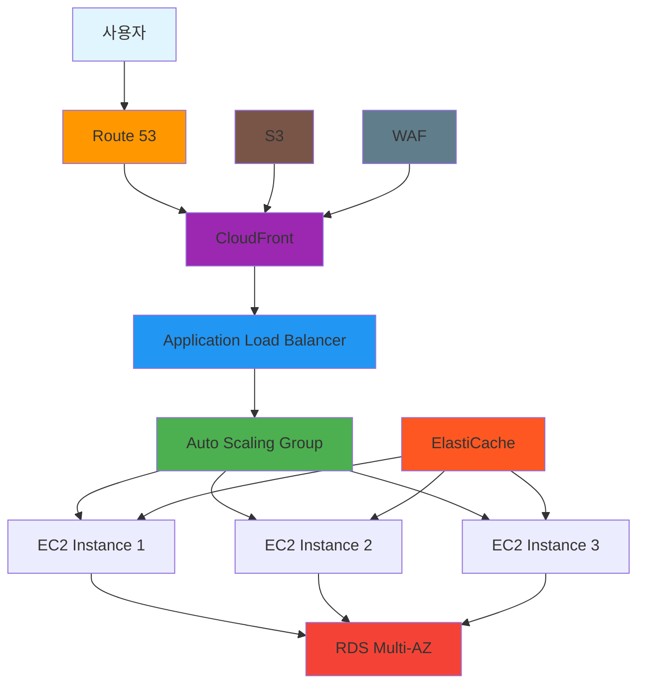
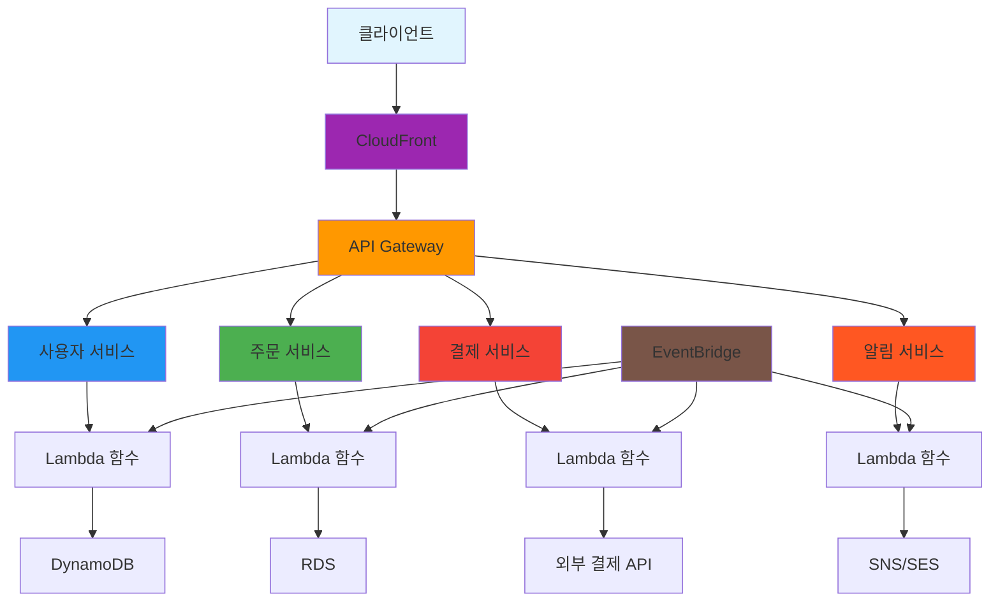
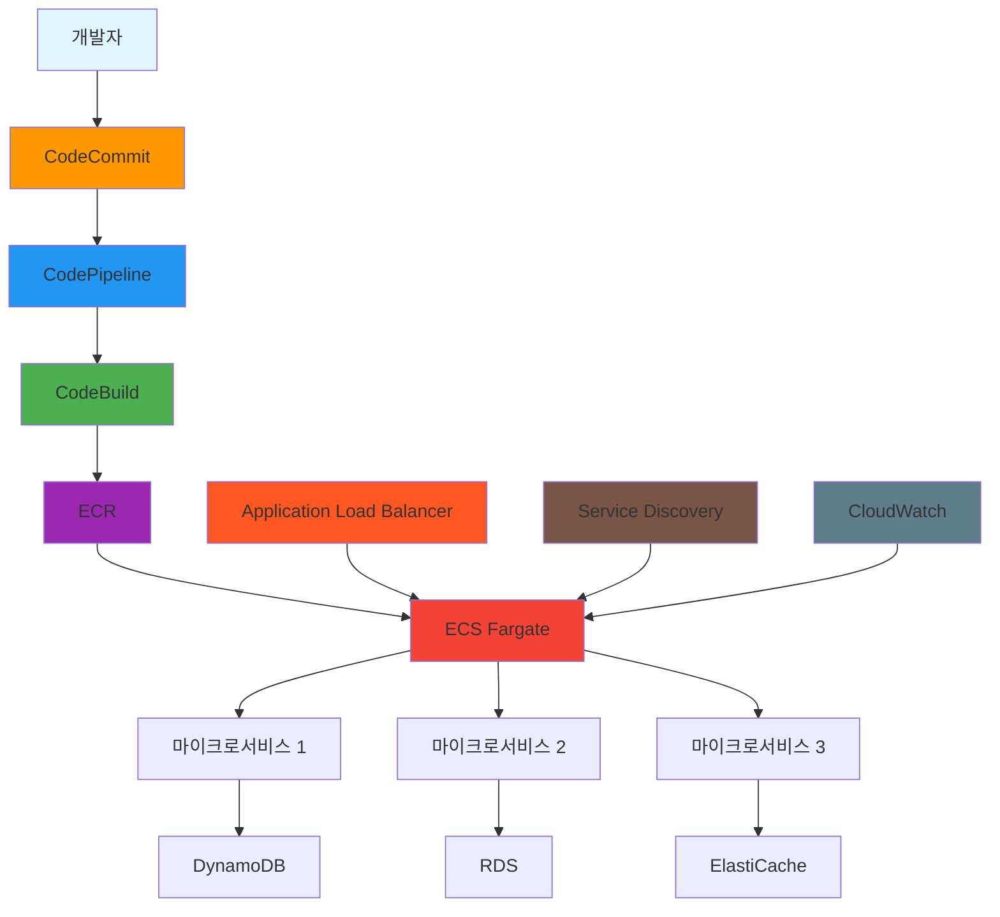
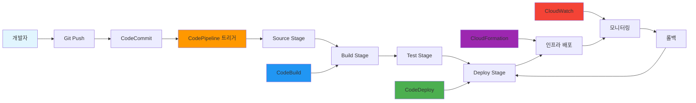
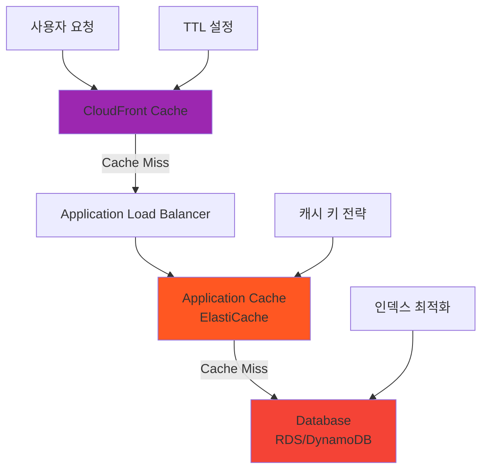
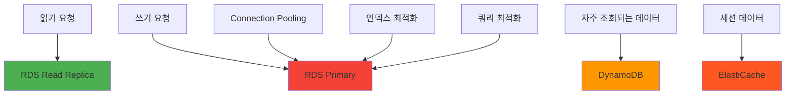
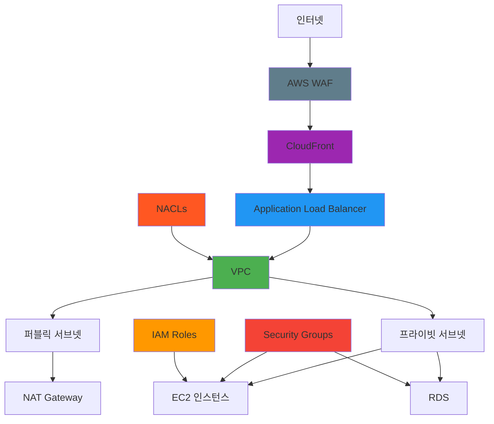
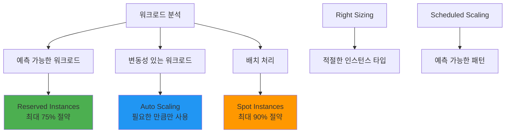
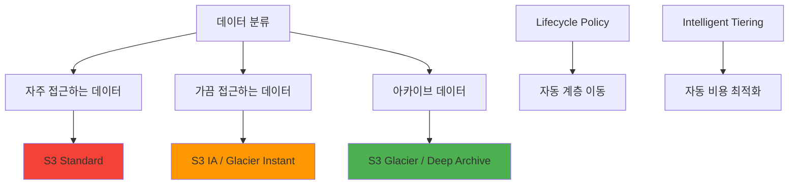
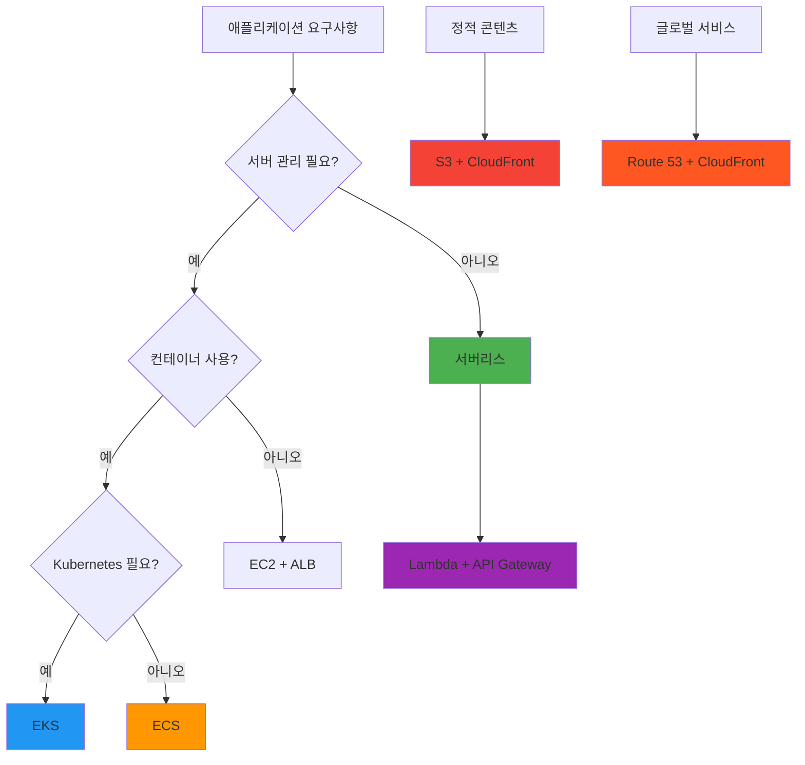

# Day 21: Week 3 주간 복습 - 애플리케이션 서비스 및 배포

## 🎯 학습 목표

Week 3에서 학습한 애플리케이션 서비스와 배포 관련 AWS 서비스들을 종합적으로 복습하고, 실제 아키텍처에서 어떻게 통합되어 사용되는지 이해합니다.

## 📚 Week 3 학습 내용 요약

### Day 15: Load Balancing & Auto Scaling
- **Application Load Balancer (ALB)**: Layer 7 로드 밸런싱, 경로/호스트 기반 라우팅
- **Network Load Balancer (NLB)**: Layer 4 로드 밸런싱, 초고성능, 고정 IP
- **Auto Scaling Group**: 수요에 따른 자동 확장/축소
- **Target Tracking Scaling**: 가장 권장되는 스케일링 정책

### Day 16: CloudFront & CDN
- **CDN 개념**: 전 세계 분산 서버를 통한 콘텐츠 가속화
- **Edge Location**: 사용자와 가까운 캐시 서버 (400+ 위치)
- **Origin Access Control (OAC)**: S3 보안 강화
- **캐싱 전략**: TTL 기반 콘텐츠 캐싱 및 무효화

### Day 17: Route 53 & DNS
- **DNS 기본 개념**: 도메인 이름을 IP 주소로 변환
- **7가지 라우팅 정책**: Simple, Weighted, Latency, Failover, Geolocation, Geoproximity, Multivalue
- **헬스 체크**: 자동 장애 조치를 위한 리소스 상태 모니터링
- **호스팅 영역**: 퍼블릭/프라이빗 DNS 관리

### Day 18: API Gateway & Lambda
- **서버리스 컴퓨팅**: 서버 관리 없이 코드 실행
- **Lambda 특징**: 이벤트 기반, 자동 스케일링, 사용량 기반 과금
- **API Gateway**: REST API vs HTTP API, 인증/권한부여
- **서버리스 아키텍처 패턴**: 마이크로서비스, 이벤트 기반 처리

### Day 19: ECS, EKS, Fargate
- **컨테이너 기본 개념**: 애플리케이션 패키징 및 배포 혁신
- **ECS**: AWS 네이티브 컨테이너 오케스트레이션
- **EKS**: 표준 Kubernetes 환경
- **Fargate**: 서버리스 컨테이너 플랫폼

### Day 20: 배포 및 관리 도구
- **CI/CD 파이프라인**: CodeCommit, CodeBuild, CodeDeploy, CodePipeline
- **Infrastructure as Code**: CloudFormation, CDK
- **Systems Manager**: 통합 인프라 관리
- **배포 전략**: Blue/Green, Rolling, In-place

## 🏗️ 통합 아키텍처 패턴

### 1. 현대적인 웹 애플리케이션 아키텍처

**구성 요소별 역할:**
- **Route 53**: DNS 라우팅, 헬스 체크 기반 장애 조치
- **CloudFront**: 글로벌 콘텐츠 배포, 캐싱, 보안
- **ALB**: 트래픽 분산, SSL 종료, 경로 기반 라우팅
- **Auto Scaling**: 수요에 따른 자동 확장/축소
- **RDS Multi-AZ**: 고가용성 데이터베이스
- **ElastiCache**: 세션 저장소, 데이터베이스 캐시

### 2. 서버리스 마이크로서비스 아키텍처

**서버리스 아키텍처 장점:**
- **운영 부담 감소**: 서버 관리 불필요
- **자동 스케일링**: 트래픽에 따른 자동 확장
- **비용 효율성**: 사용한 만큼만 지불
- **빠른 개발**: 인프라 설정 시간 단축

### 3. 컨테이너 기반 마이크로서비스

**컨테이너 아키텍처 장점:**
- **일관성**: 개발/테스트/운영 환경 동일
- **이식성**: 어디서든 동일하게 실행
- **효율성**: 리소스 사용량 최적화
- **확장성**: 빠른 시작과 종료

## 🔄 CI/CD 파이프라인 통합

### 완전한 DevOps 워크플로우

**CI/CD 파이프라인 구성 요소:**
1. **Source**: CodeCommit, GitHub, S3
2. **Build**: CodeBuild, Jenkins
3. **Test**: 자동화된 테스트 실행
4. **Deploy**: CodeDeploy, CloudFormation, ECS

## 📊 성능 최적화 전략

### 1. 캐싱 계층 구조

**캐싱 전략:**
- **CloudFront**: 정적 콘텐츠, 이미지, CSS, JS
- **ElastiCache**: 세션 데이터, 자주 조회되는 데이터
- **Application Level**: 비즈니스 로직 결과 캐싱

### 2. 데이터베이스 최적화

## 🔒 보안 모범 사례

### 다층 보안 아키텍처

**보안 계층:**
1. **네트워크 보안**: WAF, Security Groups, NACLs
2. **애플리케이션 보안**: SSL/TLS, 인증/권한부여
3. **데이터 보안**: 암호화, 백업, 접근 제어
4. **모니터링**: CloudTrail, GuardDuty, Config

## 💰 비용 최적화 전략

### 1. 컴퓨팅 비용 최적화

### 2. 스토리지 비용 최적화

## 🎯 핵심 개념 정리

### Week 3 핵심 서비스 매트릭스

| 서비스 | 주요 기능 | 사용 사례 | 비용 모델 |
|--------|-----------|-----------|-----------|
| **ALB** | Layer 7 로드 밸런싱 | 웹 애플리케이션 | 시간당 + LCU |
| **CloudFront** | 글로벌 CDN | 콘텐츠 가속화 | 데이터 전송량 |
| **Route 53** | DNS 서비스 | 도메인 관리 | 쿼리 수 + 호스팅 영역 |
| **Lambda** | 서버리스 컴퓨팅 | 이벤트 처리 | 실행 시간 + 요청 수 |
| **API Gateway** | API 관리 | API 엔드포인트 | 요청 수 |
| **ECS** | 컨테이너 오케스트레이션 | 마이크로서비스 | 인프라 비용 |
| **Fargate** | 서버리스 컨테이너 | 컨테이너 실행 | vCPU + 메모리 |

### 아키텍처 선택 가이드

## 🚀 실전 적용 시나리오

### 시나리오 1: 스타트업 웹 서비스
**요구사항**: 빠른 개발, 비용 효율성, 자동 확장
**권장 아키텍처**: Lambda + API Gateway + DynamoDB + CloudFront

### 시나리오 2: 엔터프라이즈 웹 애플리케이션
**요구사항**: 고가용성, 보안, 규정 준수
**권장 아키텍처**: ALB + Auto Scaling + RDS Multi-AZ + CloudFront

### 시나리오 3: 마이크로서비스 플랫폼
**요구사항**: 서비스 독립성, 컨테이너 기반, CI/CD
**권장 아키텍처**: ECS Fargate + ALB + CodePipeline + ECR

## 📝 Week 3 학습 점검

### 이해도 체크리스트
- [ ] Load Balancer 유형별 차이점과 사용 사례 이해
- [ ] Auto Scaling 정책과 메트릭 설정 방법 파악
- [ ] CloudFront 캐싱 전략과 보안 기능 이해
- [ ] Route 53 라우팅 정책별 특징과 활용법 파악
- [ ] Lambda와 API Gateway 통합 아키텍처 이해
- [ ] 컨테이너 서비스(ECS, EKS, Fargate) 차이점 파악
- [ ] CI/CD 파이프라인 구성 요소와 워크플로우 이해

### 실습 준비도 체크
- [ ] AWS Console을 통한 ALB 생성 및 설정
- [ ] CloudFront Distribution 생성 및 캐시 설정
- [ ] Route 53 호스팅 영역 및 레코드 관리
- [ ] Lambda 함수 생성 및 API Gateway 연동
- [ ] ECS 클러스터 및 서비스 생성
- [ ] CodePipeline을 통한 CI/CD 파이프라인 구축

## 🎯 다음 주 미리보기

**Week 4 주제**: 모니터링, 보안 및 최적화
- Day 22: CloudWatch & 모니터링
- Day 23: CloudTrail & 보안
- Day 24: 비용 최적화
- Day 25: Well-Architected Framework
- Day 26: 종합 실습 프로젝트
- Day 27: 모의고사 및 최종 복습
- Day 28: 시험 준비 및 팁

Week 3에서 학습한 애플리케이션 서비스들은 현대적인 클라우드 아키텍처의 핵심입니다. 이제 이러한 서비스들을 실제 프로젝트에서 어떻게 통합하여 사용하는지 실습을 통해 경험해보겠습니다! 🚀

---

**학습 시간**: 약 60분  
**난이도**: ⭐⭐⭐⭐☆  
**다음 단계**: 마이크로서비스 아키텍처 구축 실습 프로젝트