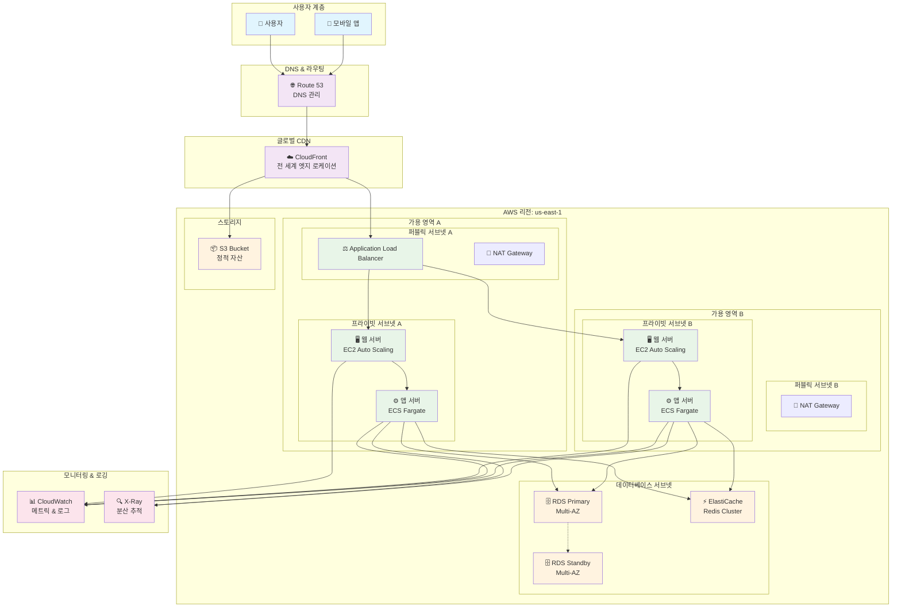
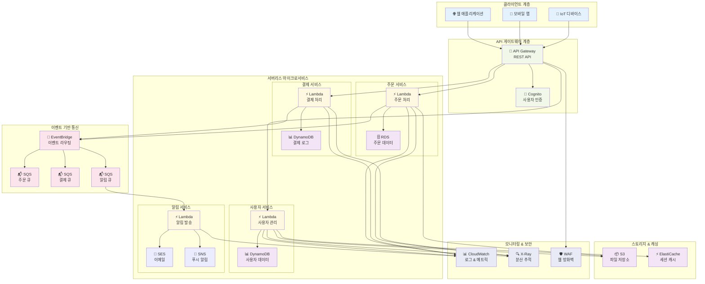
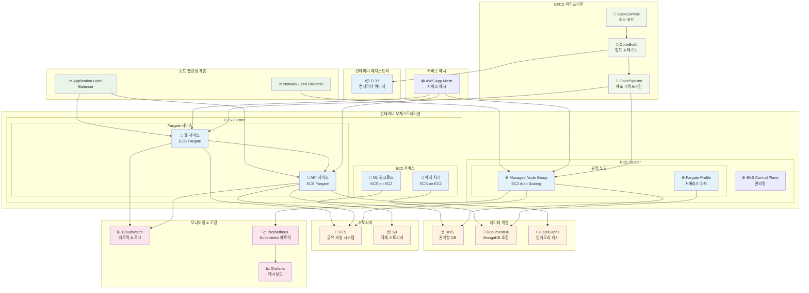
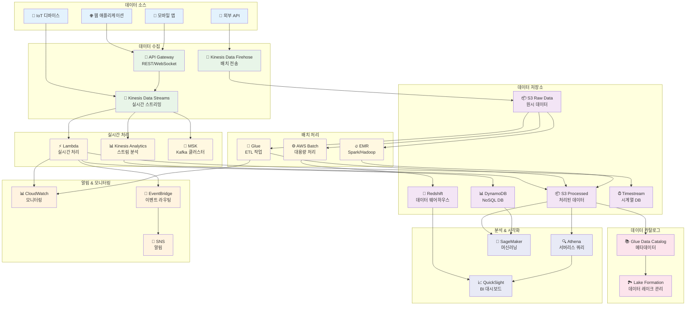
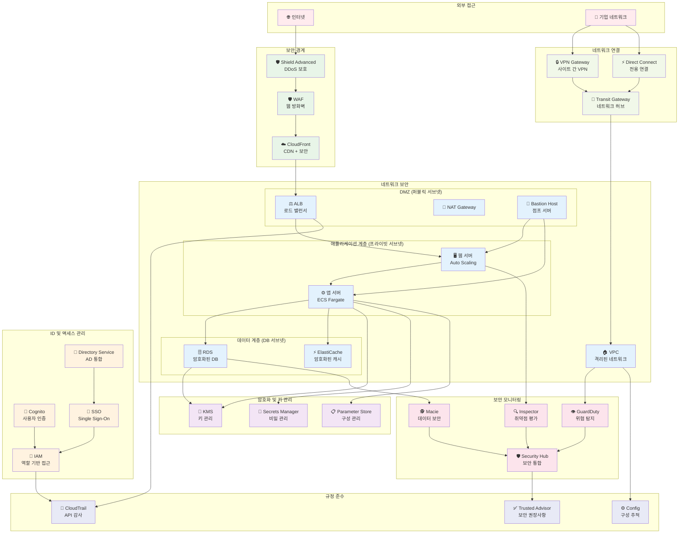

```mermaid
graph TB
    subgraph "글로벌 서비스"
        R53[🌐 Route 53<br/>글로벌 DNS]
        CF[☁️ CloudFront<br/>글로벌 CDN]
        WAF[🛡️ WAF<br/>글로벌 보안]
    end
    
    subgraph "미국 리전 (us-east-1)"
        subgraph "US 컴퓨팅"
            US_ALB[⚖️ ALB]
            US_ECS[🐳 ECS Fargate]
            US_LAMBDA[⚡ Lambda]
        end
        
        subgraph "US 데이터"
            US_RDS[🗄️ RDS Primary]
            US_DDB[📊 DynamoDB]
            US_S3[📦 S3 Bucket]
        end
    end
    
    subgraph "유럽 리전 (eu-west-1)"
        subgraph "EU 컴퓨팅"
            EU_ALB[⚖️ ALB]
            EU_ECS[🐳 ECS Fargate]
            EU_LAMBDA[⚡ Lambda]
        end
        
        subgraph "EU 데이터"
            EU_RDS[🗄️ RDS Primary]
            EU_DDB[📊 DynamoDB]
            EU_S3[📦 S3 Bucket]
        end
    end
    
    subgraph "아시아 리전 (ap-northeast-1)"
        subgraph "ASIA 컴퓨팅"
            ASIA_ALB[⚖️ ALB]
            ASIA_ECS[🐳 ECS Fargate]
            ASIA_LAMBDA[⚡ Lambda]
        end
        
        subgraph "ASIA 데이터"
            ASIA_RDS[🗄️ RDS Primary]
            ASIA_DDB[📊 DynamoDB]
            ASIA_S3[📦 S3 Bucket]
        end
    end
    
    subgraph "데이터 동기화"
        DDB_GLOBAL[🔄 DynamoDB<br/>Global Tables]
        S3_CRR[🔄 S3<br/>Cross-Region Replication]
        RDS_REPLICA[🔄 RDS<br/>Cross-Region Read Replica]
    end
    
    subgraph "글로벌 모니터링"
        CW_GLOBAL[📊 CloudWatch<br/>Cross-Region Dashboard]
        HEALTH_CHECK[❤️ Route 53<br/>Health Checks]
    end
    
    %% 사용자 연결
    R53 --> CF
    CF --> WAF
    
    %% 지역별 라우팅
    R53 -.->|"Geolocation: US"| US_ALB
    R53 -.->|"Geolocation: EU"| EU_ALB
    R53 -.->|"Geolocation: ASIA"| ASIA_ALB
    
    %% 리전 내 연결
    US_ALB --> US_ECS
    US_ECS --> US_RDS
    US_ECS --> US_DDB
    US_LAMBDA --> US_S3
    
    EU_ALB --> EU_ECS
    EU_ECS --> EU_RDS
    EU_ECS --> EU_DDB
    EU_LAMBDA --> EU_S3
    
    ASIA_ALB --> ASIA_ECS
    ASIA_ECS --> ASIA_RDS
    ASIA_ECS --> ASIA_DDB
    ASIA_LAMBDA --> ASIA_S3
    
    %% 데이터 동기화
    US_DDB -.-> DDB_GLOBAL
    EU_DDB -.-> DDB_GLOBAL
    ASIA_DDB -.-> DDB_GLOBAL
    
    US_S3 -.-> S3_CRR
    EU_S3 -.-> S3_CRR
    ASIA_S3 -.-> S3_CRR
    
    US_RDS -.-> RDS_REPLICA
    EU_RDS -.-> RDS_REPLICA
    ASIA_RDS -.-> RDS_REPLICA
    
    %% 헬스 체크
    HEALTH_CHECK --> US_ALB
    HEALTH_CHECK --> EU_ALB
    HEALTH_CHECK --> ASIA_ALB
    
    %% 모니터링
    US_ECS --> CW_GLOBAL
    EU_ECS --> CW_GLOBAL
    ASIA_ECS --> CW_GLOBAL
    
    %% 스타일링
    classDef globalLayer fill:#e1f5fe
    classDef usLayer fill:#e8f5e8
    classDef euLayer fill:#fff3e0
    classDef asiaLayer fill:#fce4ec
    classDef syncLayer fill:#f3e5f5
    classDef monitorLayer fill:#e8eaf6
    
    class R53,CF,WAF globalLayer
    class US_ALB,US_ECS,US_LAMBDA,US_RDS,US_DDB,US_S3 usLayer
    class EU_ALB,EU_ECS,EU_LAMBDA,EU_RDS,EU_DDB,EU_S3 euLayer
    class ASIA_ALB,ASIA_ECS,ASIA_LAMBDA,ASIA_RDS,ASIA_DDB,ASIA_S3 asiaLayer
    class DDB_GLOBAL,S3_CRR,RDS_REPLICA syncLayer
    class CW_GLOBAL,HEALTH_CHECK monitorLayer
```

# Day 21: 애플리케이션 아키텍처 패턴 다이어그램

## 개요

Week 3에서 학습한 AWS 서비스들을 활용한 다양한 애플리케이션 아키텍처 패턴을 시각적으로 표현합니다. 실제 프로덕션 환경에서 사용되는 검증된 패턴들을 통해 서비스 간의 관계와 데이터 흐름을 이해할 수 있습니다.

---

## 1. 현대적인 3-Tier 웹 애플리케이션

### 아키텍처 다이어그램

### 특징 및 장점

- **고가용성**: Multi-AZ 배포로 단일 장애점 제거
- **확장성**: Auto Scaling Group을 통한 자동 확장
- **성능**: CloudFront CDN으로 글로벌 성능 최적화
- **보안**: 프라이빗 서브넷에 애플리케이션 서버 배치
- **모니터링**: CloudWatch와 X-Ray를 통한 종합 모니터링

---

## 2. 서버리스 마이크로서비스 아키텍처

### 아키텍처 다이어그램

### 특징 및 장점

- **완전 서버리스**: 서버 관리 부담 없음
- **이벤트 기반**: 느슨한 결합으로 확장성 극대화
- **비용 효율성**: 사용한 만큼만 과금
- **자동 확장**: 트래픽에 따른 자동 스케일링
- **개발 생산성**: 인프라 관리 최소화

---

## 3. 하이브리드 컨테이너 아키텍처

### 아키텍처 다이어그램

### 특징 및 장점

- **유연한 컴퓨팅**: Fargate와 EC2 혼합 사용
- **다중 오케스트레이션**: ECS와 EKS 동시 활용
- **서비스 메시**: App Mesh로 마이크로서비스 통신 관리
- **완전한 CI/CD**: 컨테이너 기반 자동화 파이프라인
- **통합 모니터링**: AWS와 오픈소스 도구 조합

---

## 4. 글로벌 멀티 리전 아키텍처

### 아키텍처 다이어그램

### 특징 및 장점

- **글로벌 가용성**: 다중 리전으로 99.99% 이상 가용성
- **지연시간 최적화**: 사용자 근접 리전에서 서비스 제공
- **데이터 주권**: 지역별 데이터 규정 준수 (GDPR 등)
- **재해 복구**: 리전 장애 시 자동 페일오버
- **확장성**: 지역별 독립적인 확장 가능

---

## 5. 이벤트 기반 데이터 파이프라인

### 아키텍처 다이어그램

### 특징 및 장점

- **실시간 처리**: Kinesis를 통한 스트리밍 데이터 처리
- **확장 가능한 배치**: EMR과 Glue를 통한 대용량 데이터 처리
- **서버리스 분석**: Athena를 통한 즉석 쿼리
- **통합 카탈로그**: Glue Data Catalog로 메타데이터 관리
- **머신러닝 통합**: SageMaker를 통한 AI/ML 파이프라인

---

## 6. 보안 강화 엔터프라이즈 아키텍처

### 아키텍처 다이어그램

### 특징 및 장점

- **다층 보안**: 네트워크부터 애플리케이션까지 전방위 보안
- **제로 트러스트**: 모든 접근에 대한 검증 및 암호화
- **통합 모니터링**: Security Hub를 통한 중앙집중식 보안 관리
- **규정 준수**: CloudTrail과 Config를 통한 감사 추적
- **하이브리드 연결**: 온프레미스와 안전한 연결

---

## 아키텍처 패턴 선택 가이드

### 1. 비즈니스 요구사항별 패턴 선택

| 요구사항 | 권장 패턴 | 주요 고려사항 |
|---------|----------|-------------|
| **전통적인 웹 애플리케이션** | 3-Tier 아키텍처 | 안정성, 예측 가능한 성능 |
| **빠른 개발 및 배포** | 서버리스 마이크로서비스 | 개발 속도, 운영 부담 최소화 |
| **복잡한 애플리케이션** | 하이브리드 컨테이너 | 유연성, 다양한 워크로드 지원 |
| **글로벌 서비스** | 멀티 리전 아키텍처 | 지연시간, 데이터 주권 |
| **데이터 중심 비즈니스** | 이벤트 기반 파이프라인 | 실시간 분석, 확장성 |
| **엔터프라이즈 환경** | 보안 강화 아키텍처 | 규정 준수, 보안 요구사항 |

### 2. 기술적 고려사항

#### 확장성 요구사항
- **수직 확장**: 전통적인 3-Tier
- **수평 확장**: 마이크로서비스, 컨테이너
- **자동 확장**: 서버리스, Fargate

#### 운영 복잡성
- **낮은 복잡성**: 서버리스
- **중간 복잡성**: 관리형 컨테이너 (Fargate)
- **높은 복잡성**: 자체 관리 EC2, Kubernetes

#### 비용 최적화
- **예측 가능한 워크로드**: Reserved Instance, Savings Plans
- **가변적인 워크로드**: 서버리스, Spot Instance
- **개발/테스트 환경**: Fargate, Lambda

### 3. 마이그레이션 전략

#### Lift and Shift
1. 기존 애플리케이션을 EC2로 이전
2. 점진적으로 관리형 서비스 도입
3. 마이크로서비스로 분해

#### Re-architecting
1. 서버리스 우선 접근
2. 컨테이너 기반 현대화
3. 이벤트 기반 아키텍처 도입

---

## 실습 권장사항

### 1. 단계별 학습 경로

1. **기초**: 3-Tier 아키텍처 구축
2. **중급**: 서버리스 마이크로서비스 구현
3. **고급**: 하이브리드 컨테이너 환경 구성
4. **전문가**: 글로벌 멀티 리전 배포

### 2. 핸즈온 프로젝트

- **Week 3 통합 실습**: Day 21 마이크로서비스 아키텍처
- **보안 강화**: WAF, GuardDuty 설정
- **모니터링 구성**: CloudWatch 대시보드 생성
- **CI/CD 파이프라인**: CodePipeline 구축

### 3. 성능 최적화

- **캐싱 전략**: CloudFront, ElastiCache 활용
- **데이터베이스 최적화**: Read Replica, 인덱싱
- **네트워크 최적화**: VPC Endpoint, Direct Connect

---

이러한 아키텍처 패턴들은 실제 프로덕션 환경에서 검증된 설계입니다. 각 패턴의 특징을 이해하고 비즈니스 요구사항에 맞는 최적의 조합을 선택하여 활용하시기 바랍니다! 🚀