# Day 22: CloudWatch & 모니터링

## 학습 목표
- AWS CloudWatch의 핵심 개념과 기능 이해
- 메트릭, 로그, 이벤트의 차이점과 활용 방법 학습
- CloudWatch 대시보드와 알람 설정 방법 습득
- 모니터링 모범 사례와 비용 최적화 전략 이해

## 1. AWS CloudWatch 개요

AWS CloudWatch는 AWS 리소스와 애플리케이션을 실시간으로 모니터링하는 서비스입니다. 시스템 성능을 추적하고, 문제를 조기에 발견하며, 자동화된 대응을 가능하게 합니다.

### CloudWatch의 주요 구성 요소

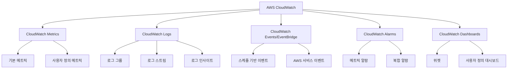

## 2. CloudWatch Metrics (메트릭)

### 2.1 기본 메트릭 vs 사용자 정의 메트릭

**기본 메트릭 (Default Metrics)**
- AWS 서비스에서 자동으로 제공
- 무료로 제공 (5분 간격)
- 예: EC2 CPU 사용률, RDS 연결 수, S3 요청 수

**사용자 정의 메트릭 (Custom Metrics)**
- 애플리케이션에서 직접 전송
- 비용 발생 (메트릭당 과금)
- 1초 단위까지 세밀한 모니터링 가능

### 2.2 주요 AWS 서비스별 메트릭

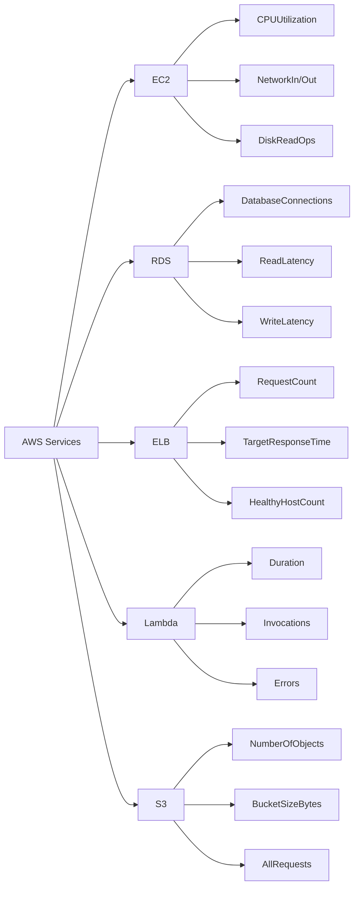

### 2.3 메트릭 해상도와 보존 기간

| 해상도 | 보존 기간 | 용도 |
|--------|-----------|------|
| 1분 | 15일 | 상세 모니터링 |
| 5분 | 63일 | 기본 모니터링 |
| 1시간 | 455일 | 장기 트렌드 분석 |

## 3. CloudWatch Logs

### 3.1 로그 구조

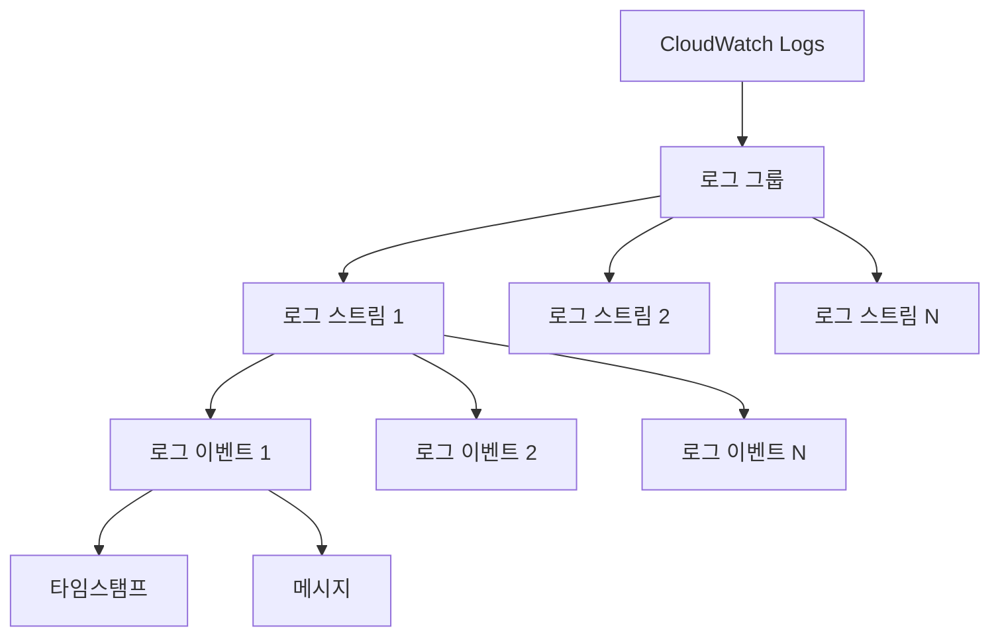

### 3.2 로그 수집 방법

**1. CloudWatch Logs Agent**
- EC2 인스턴스에 설치
- 로그 파일을 자동으로 CloudWatch로 전송
- 구버전 에이전트 (레거시)

**2. CloudWatch Unified Agent**
- 로그와 메트릭을 모두 수집
- 더 많은 시스템 메트릭 제공
- 권장되는 최신 에이전트

**3. AWS SDK/CLI**
- 애플리케이션에서 직접 로그 전송
- 프로그래밍 방식으로 로그 관리

### 3.3 CloudWatch Logs Insights

로그 데이터를 쿼리하고 분석하는 서비스입니다.

```sql
-- 예시 쿼리: 에러 로그 검색
fields @timestamp, @message
| filter @message like /ERROR/
| sort @timestamp desc
| limit 100

-- 예시 쿼리: Lambda 함수 실행 시간 분석
fields @timestamp, @duration
| filter @type = "REPORT"
| stats avg(@duration), max(@duration), min(@duration) by bin(5m)
```

## 4. CloudWatch Alarms (알람)

### 4.1 알람 유형

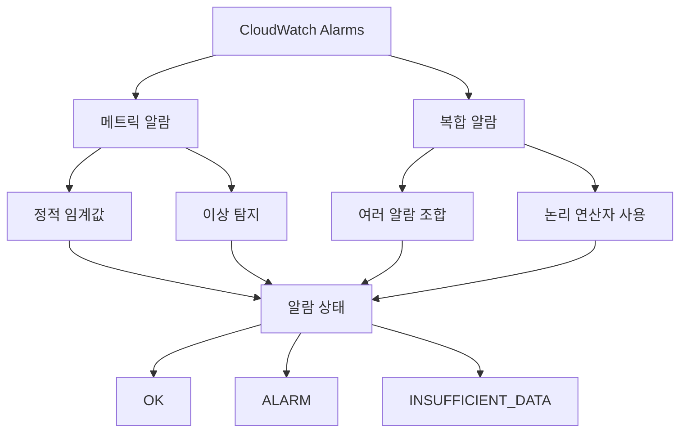

### 4.2 알람 작업 (Actions)

알람이 트리거될 때 수행할 수 있는 작업들:

1. **SNS 알림**: 이메일, SMS, HTTP 엔드포인트로 알림
2. **Auto Scaling 작업**: EC2 인스턴스 자동 확장/축소
3. **EC2 작업**: 인스턴스 중지, 종료, 재부팅, 복구
4. **Systems Manager 작업**: 자동화된 문제 해결

### 4.3 이상 탐지 (Anomaly Detection)

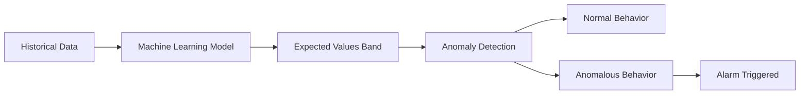

## 5. CloudWatch Dashboards

### 5.1 대시보드 구성 요소

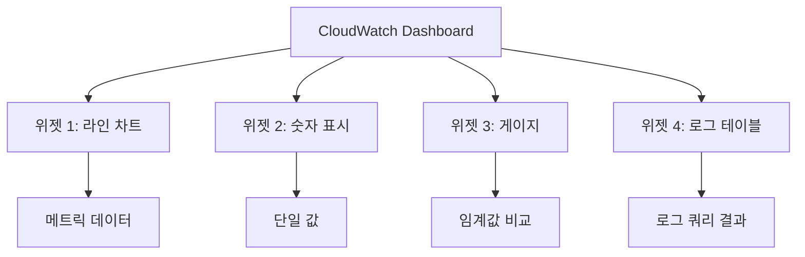

### 5.2 위젯 유형

| 위젯 유형 | 용도 | 데이터 소스 |
|-----------|------|-------------|
| Line | 시간별 트렌드 | 메트릭 |
| Stacked area | 누적 데이터 | 메트릭 |
| Number | 현재 값 | 메트릭 |
| Gauge | 임계값 대비 현재 상태 | 메트릭 |
| Pie | 비율 표시 | 메트릭 |
| Log table | 로그 검색 결과 | 로그 |

## 6. CloudWatch Events / EventBridge

### 6.1 이벤트 기반 아키텍처

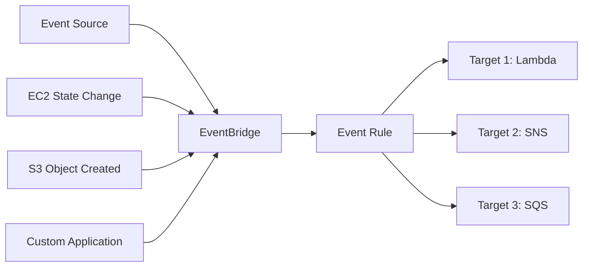

### 6.2 이벤트 패턴 예시

```json
{
  "source": ["aws.ec2"],
  "detail-type": ["EC2 Instance State-change Notification"],
  "detail": {
    "state": ["terminated"]
  }
}
```

## 7. 모니터링 모범 사례

### 7.1 계층별 모니터링 전략

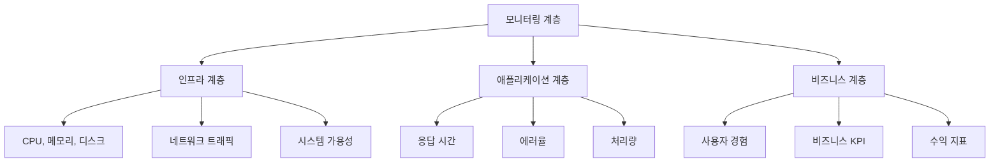

### 7.2 알람 설정 가이드라인

**DO (권장사항)**
- 비즈니스에 중요한 메트릭에만 알람 설정
- 알람 피로도를 방지하기 위해 적절한 임계값 설정
- 복합 알람을 사용하여 거짓 양성 줄이기
- 알람 설명에 대응 방법 포함

**DON'T (피해야 할 것)**
- 너무 많은 알람 설정 (알람 피로도)
- 너무 민감한 임계값 설정
- 대응 계획 없는 알람 설정
- 중복된 알람 설정

### 7.3 비용 최적화

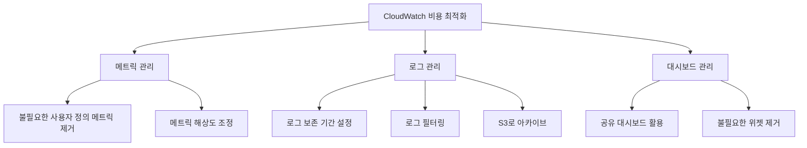

## 8. 실제 사용 시나리오

### 8.1 웹 애플리케이션 모니터링

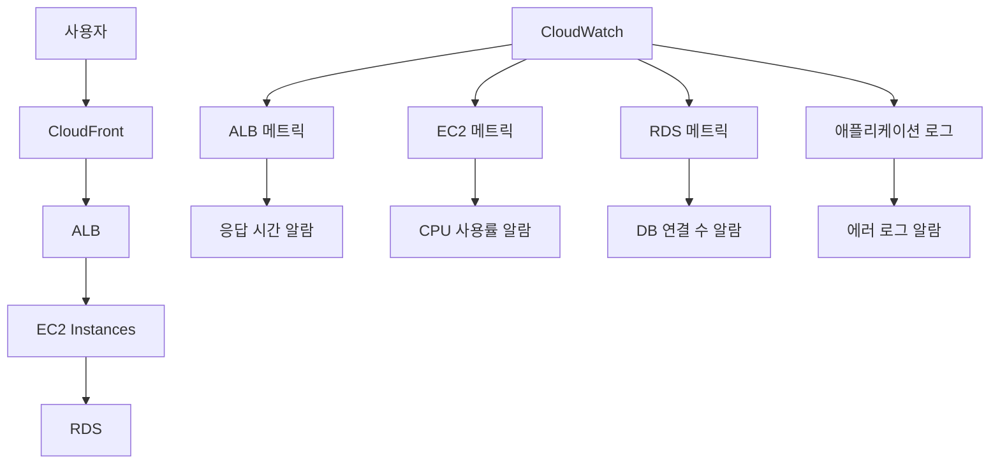

### 8.2 서버리스 애플리케이션 모니터링

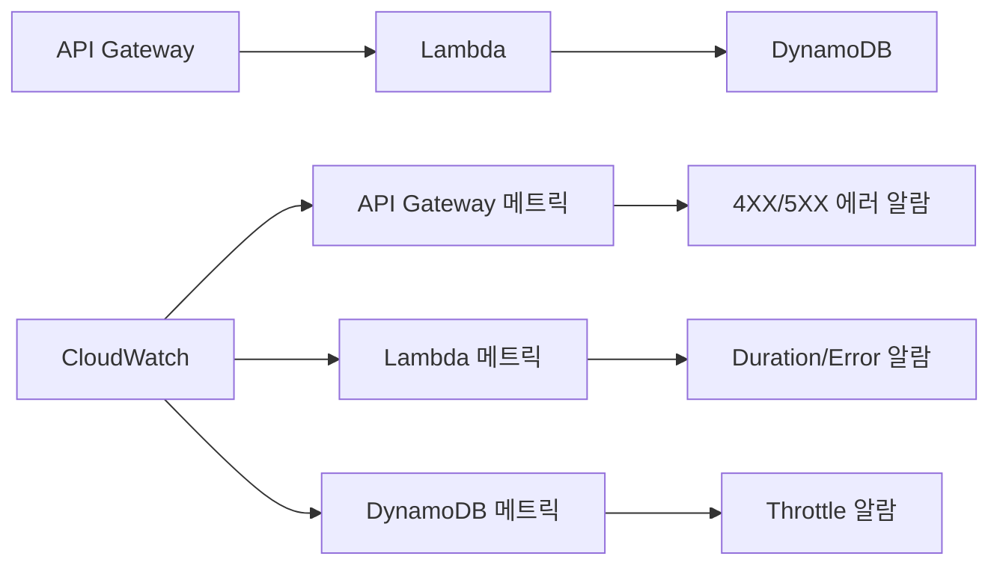

## 9. 고급 기능

### 9.1 Container Insights
- ECS, EKS, Fargate 컨테이너 모니터링
- 컨테이너 수준의 메트릭 제공
- 성능 로그 자동 수집

### 9.2 Lambda Insights
- Lambda 함수 성능 모니터링
- 메모리 사용량, 초기화 시간 등 상세 메트릭
- 비용 최적화 권장사항 제공

### 9.3 Application Insights
- .NET 및 SQL Server 애플리케이션 자동 모니터링
- 애플리케이션 상태 자동 감지
- 문제 진단 및 해결 방안 제시

## 10. 다른 AWS 서비스와의 통합

### 10.1 AWS X-Ray
- 분산 추적 서비스
- CloudWatch와 연동하여 성능 분석
- 마이크로서비스 아키텍처 디버깅

### 10.2 AWS Systems Manager
- CloudWatch 알람과 연동
- 자동화된 문제 해결
- 패치 관리 및 구성 관리

### 10.3 AWS Config
- 리소스 구성 변경 추적
- CloudWatch Events와 연동
- 컴플라이언스 모니터링

## 요약

CloudWatch는 AWS 환경의 종합적인 모니터링 솔루션입니다. 메트릭, 로그, 이벤트를 통합 관리하며, 대시보드와 알람을 통해 실시간 모니터링과 자동화된 대응을 가능하게 합니다.

**핵심 포인트:**
- 메트릭: 성능 지표 수집 및 분석
- 로그: 애플리케이션 및 시스템 로그 중앙 관리
- 알람: 임계값 기반 자동 알림 및 대응
- 대시보드: 시각적 모니터링 인터페이스
- 이벤트: 이벤트 기반 자동화

다음 실습에서는 실제 CloudWatch 대시보드를 구성하고 알람을 설정해보겠습니다.