# Day 23: CloudTrail & AWS 보안 서비스

## 학습 목표
- AWS CloudTrail의 역할과 중요성 이해
- AWS 보안 서비스들의 특징과 사용 사례 파악
- 보안 모니터링 및 컴플라이언스 전략 수립
- 보안 사고 대응 및 감사 로그 분석 방법 학습

## 1. AWS CloudTrail 개요

### CloudTrail이란?
AWS CloudTrail은 AWS 계정의 거버넌스, 컴플라이언스, 운영 감사, 위험 감사를 지원하는 서비스입니다. CloudTrail을 사용하면 AWS 인프라 전반에서 계정 활동과 관련된 작업을 기록, 지속적으로 모니터링 및 보관할 수 있습니다.

### CloudTrail의 핵심 기능

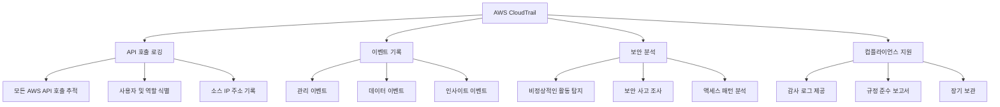

### CloudTrail 이벤트 유형

**1. 관리 이벤트 (Management Events)**
- AWS 리소스에 대한 관리 작업
- 예: EC2 인스턴스 생성, IAM 정책 변경, VPC 설정 수정

**2. 데이터 이벤트 (Data Events)**
- 리소스 내부의 데이터 액세스 작업
- 예: S3 객체 읽기/쓰기, Lambda 함수 실행

**3. 인사이트 이벤트 (Insight Events)**
- 비정상적인 활동 패턴 탐지
- 예: 평소보다 많은 API 호출, 비정상적인 오류율

## 2. CloudTrail 아키텍처

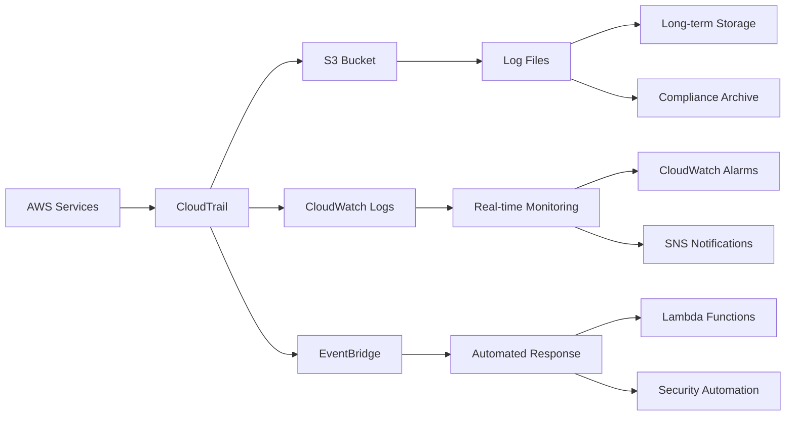

### CloudTrail 로그 구조

```json
{
  "eventVersion": "1.08",
  "userIdentity": {
    "type": "IAMUser",
    "principalId": "AIDACKCEVSQ6C2EXAMPLE",
    "arn": "arn:aws:iam::123456789012:user/johndoe",
    "accountId": "123456789012",
    "userName": "johndoe"
  },
  "eventTime": "2023-01-01T12:00:00Z",
  "eventSource": "ec2.amazonaws.com",
  "eventName": "RunInstances",
  "awsRegion": "us-east-1",
  "sourceIPAddress": "203.0.113.12",
  "userAgent": "aws-cli/2.0.0",
  "requestParameters": {
    "instanceType": "t3.micro",
    "imageId": "ami-0abcdef1234567890"
  },
  "responseElements": {
    "instancesSet": {
      "items": [
        {
          "instanceId": "i-1234567890abcdef0"
        }
      ]
    }
  }
}
```

## 3. AWS 보안 서비스 생태계

### 보안 서비스 전체 구조

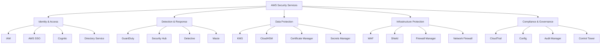

## 4. 핵심 보안 서비스 상세

### AWS GuardDuty
지능형 위협 탐지 서비스로, 머신러닝을 사용하여 악의적인 활동을 탐지합니다.

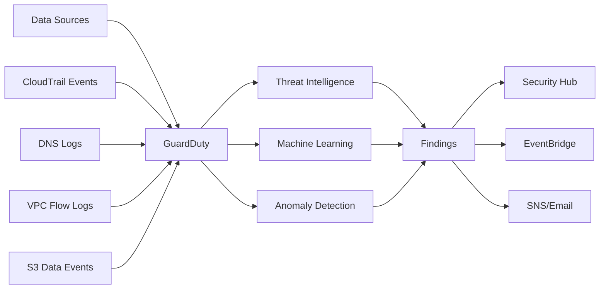

**GuardDuty 탐지 유형:**
- 악성 IP 통신
- 암호화폐 채굴
- 데이터 유출 시도
- 권한 상승 공격
- 봇넷 활동

### AWS Security Hub
중앙 집중식 보안 관리 대시보드로, 여러 보안 서비스의 결과를 통합합니다.

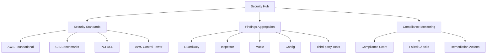

### AWS Config
AWS 리소스 구성을 지속적으로 모니터링하고 평가하는 서비스입니다.

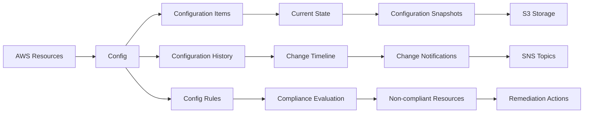

## 5. 데이터 보호 서비스

### AWS KMS (Key Management Service)

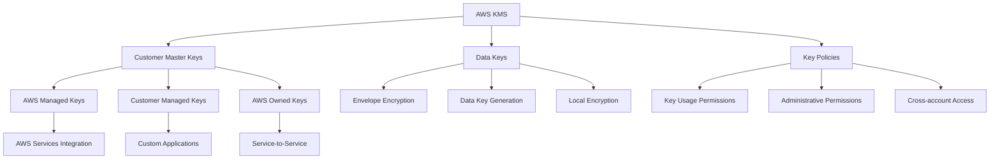

**KMS 암호화 프로세스:**

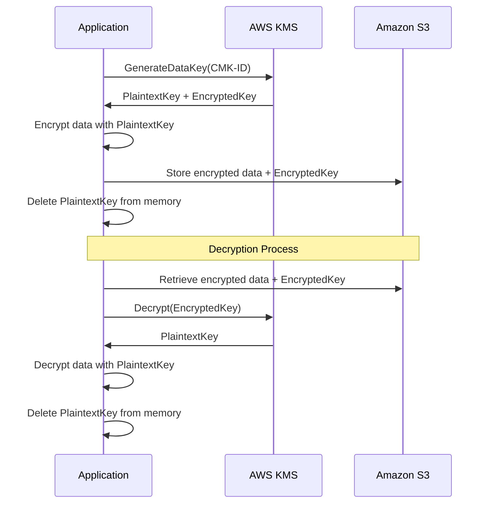

### AWS Secrets Manager
데이터베이스 자격 증명, API 키 및 기타 보안 정보를 안전하게 저장하고 관리합니다.

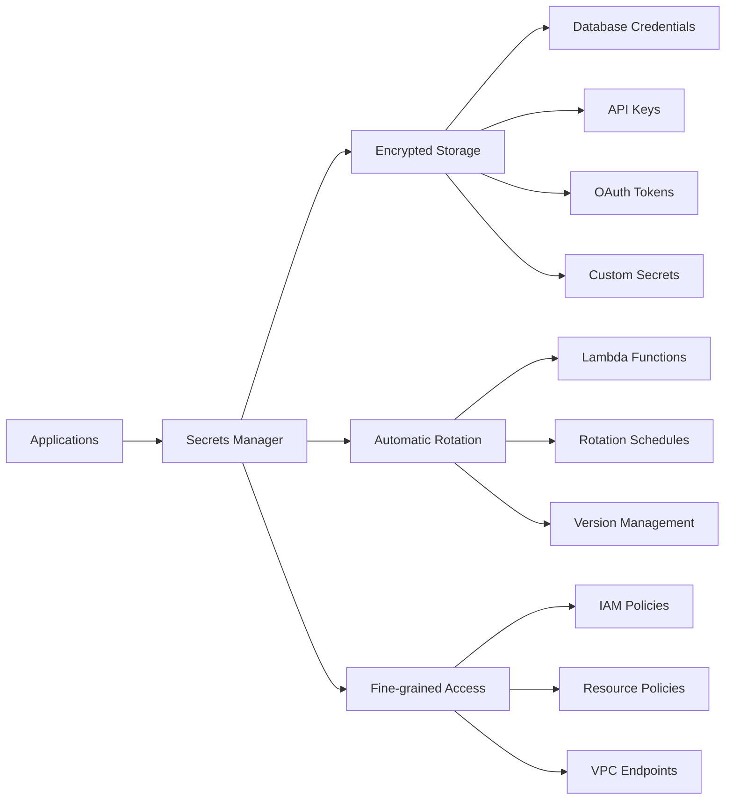

## 6. 네트워크 보안

### AWS WAF (Web Application Firewall)

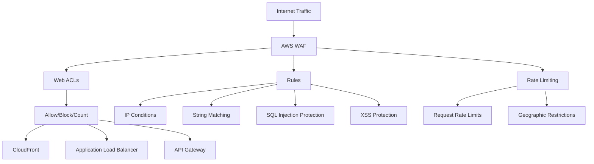

**WAF 규칙 예시:**
- SQL 인젝션 공격 차단
- 크로스 사이트 스크립팅(XSS) 방지
- 특정 국가에서의 접근 차단
- 비정상적인 요청 패턴 탐지

### AWS Shield
DDoS 공격으로부터 보호하는 관리형 서비스입니다.

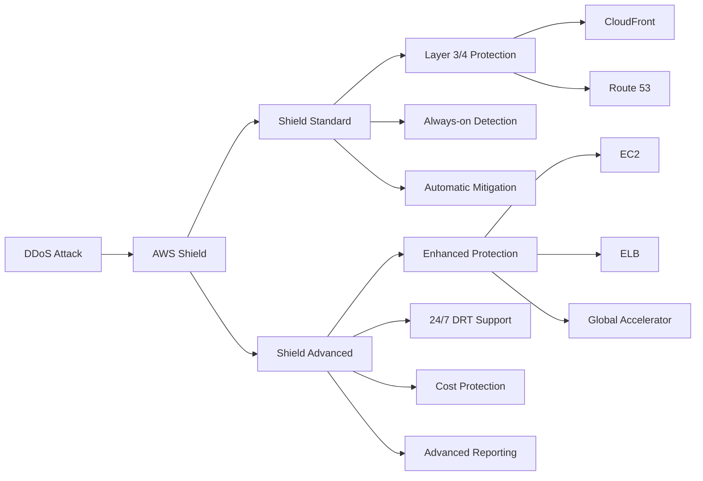

## 7. 보안 모니터링 및 대응

### 보안 이벤트 대응 워크플로우

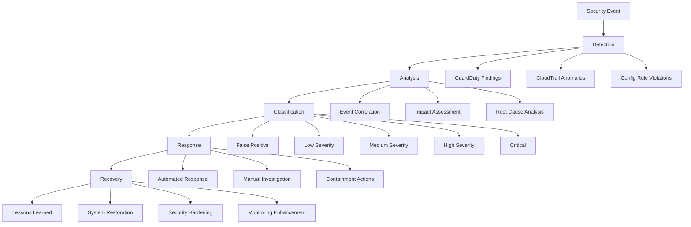

### 자동화된 보안 대응

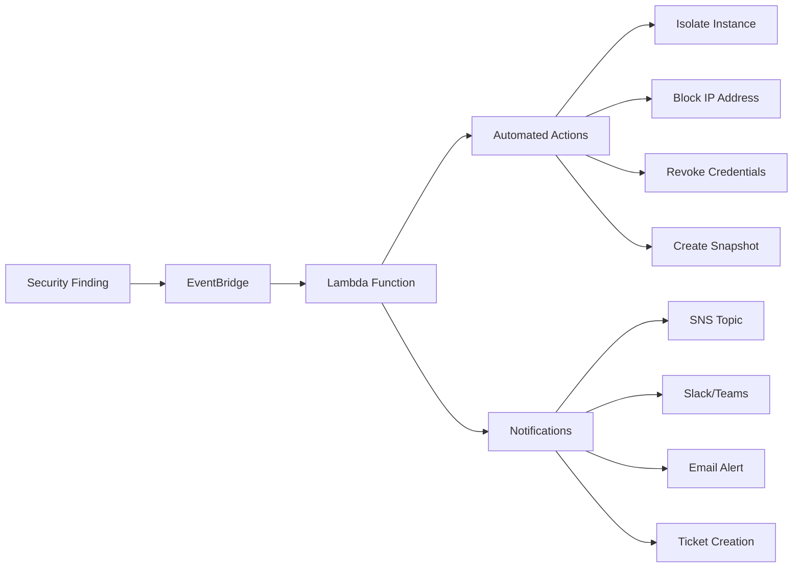

## 8. 컴플라이언스 및 거버넌스

### AWS Control Tower
멀티 계정 환경을 위한 거버넌스 및 컴플라이언스 서비스입니다.

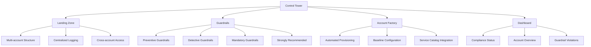

### 컴플라이언스 프레임워크 매핑

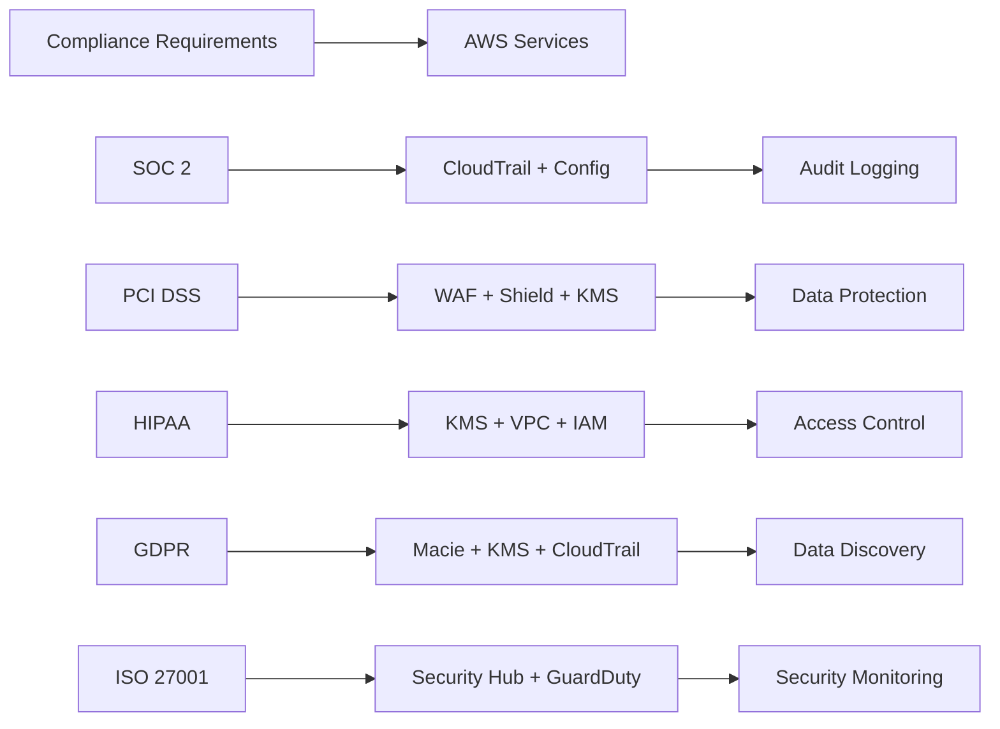

## 9. 보안 모범 사례

### 1. 최소 권한 원칙 (Principle of Least Privilege)
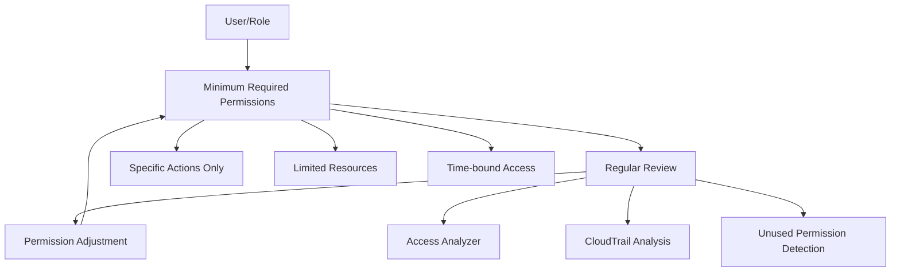

### 2. 심층 방어 (Defense in Depth)
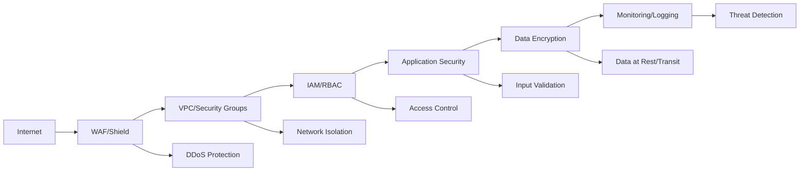

### 3. 지속적인 모니터링
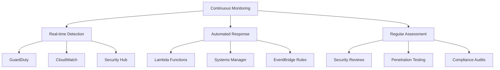

## 10. 실제 사용 사례

### 사례 1: 데이터 유출 탐지 및 대응
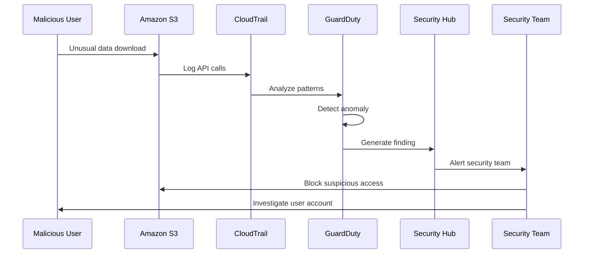

### 사례 2: 컴플라이언스 자동화
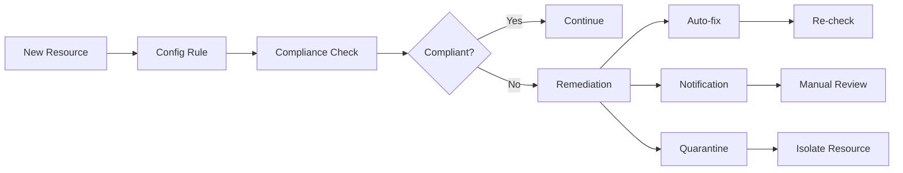

## 요약

AWS CloudTrail과 보안 서비스들은 클라우드 환경에서 포괄적인 보안 전략을 구현하는 데 필수적입니다:

1. **CloudTrail**: 모든 API 활동을 기록하여 감사 및 컴플라이언스 지원
2. **GuardDuty**: 지능형 위협 탐지로 실시간 보안 모니터링
3. **Security Hub**: 중앙 집중식 보안 관리 및 컴플라이언스 대시보드
4. **KMS**: 강력한 암호화 키 관리로 데이터 보호
5. **WAF/Shield**: 웹 애플리케이션 및 DDoS 공격 방어
6. **Config**: 리소스 구성 모니터링 및 컴플라이언스 확인

이러한 서비스들을 조합하여 사용하면 클라우드 환경에서 강력하고 포괄적인 보안 체계를 구축할 수 있습니다.

## 다음 학습 예고
내일은 **비용 최적화 및 관리**에 대해 학습합니다. AWS Cost Explorer, 예산 관리, 비용 최적화 전략 등을 다룰 예정입니다.