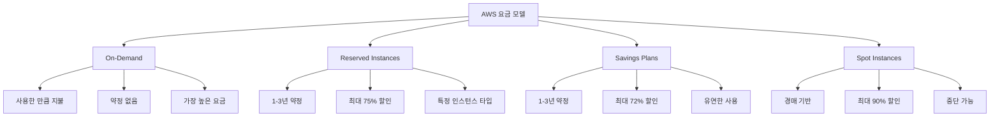
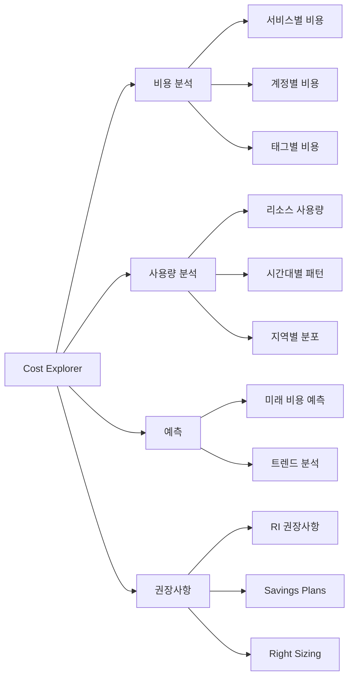
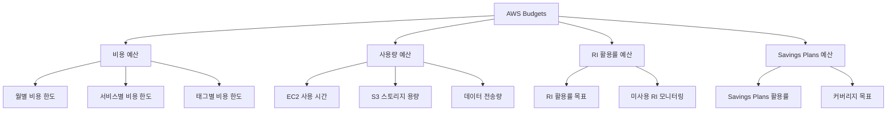
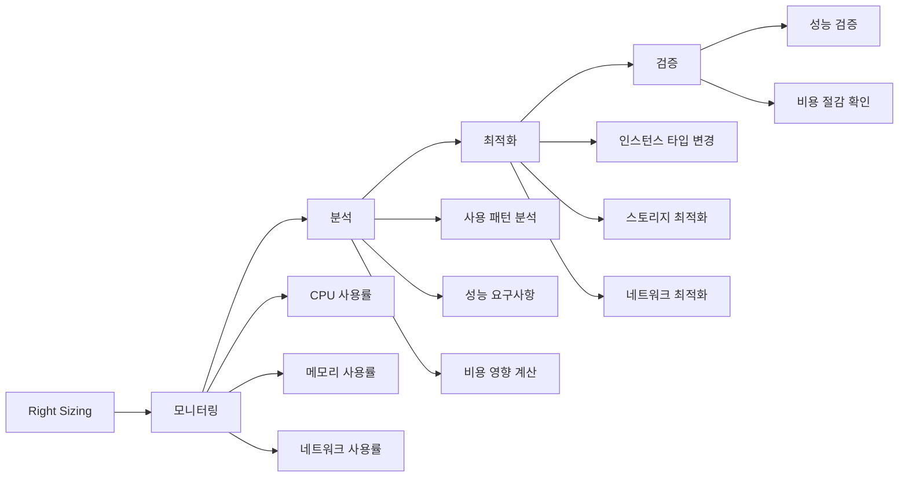
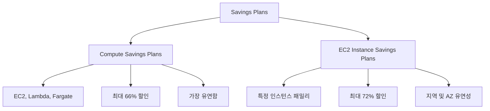
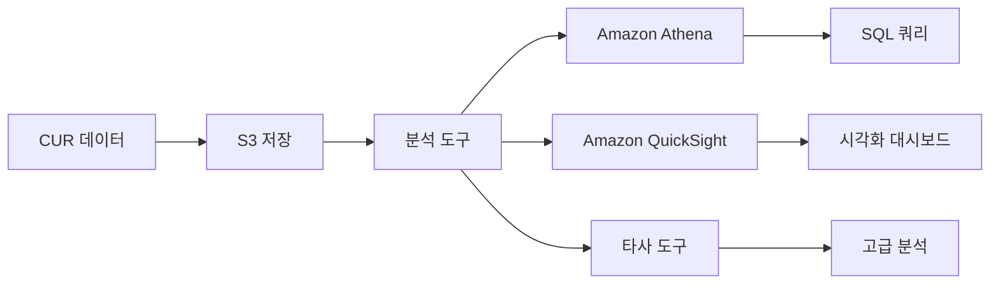
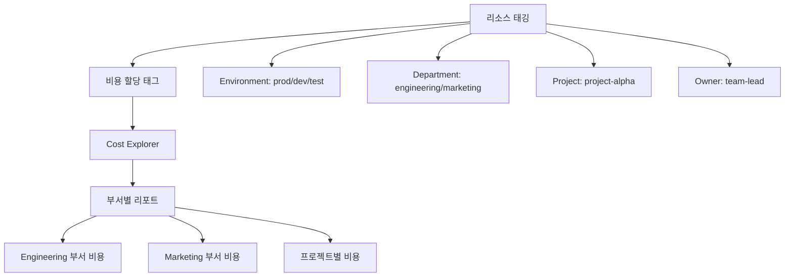
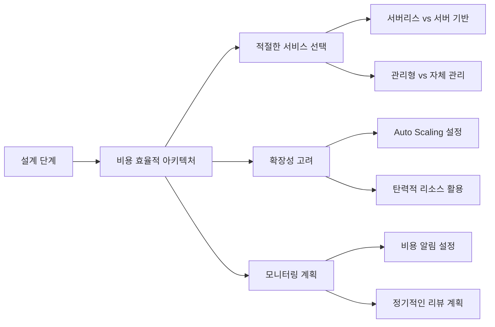

# Day 24: AWS 비용 최적화 및 관리

## 학습 목표
- AWS 비용 구조와 요금 모델 이해
- Cost Explorer와 Cost and Usage Reports 활용법 학습
- 예산 설정 및 비용 알림 구성 방법 습득
- 비용 최적화 전략과 모범 사례 적용
- Reserved Instances와 Savings Plans 활용법 이해

## 1. AWS 비용 구조 개요

AWS는 사용한 만큼만 지불하는 종량제(Pay-as-you-go) 모델을 기본으로 합니다. 하지만 다양한 요금 옵션과 할인 프로그램을 통해 비용을 최적화할 수 있습니다.

### AWS 요금 모델

### 주요 비용 구성 요소

1. **컴퓨팅 비용**
   - EC2 인스턴스 시간당 요금
   - Lambda 실행 시간 및 요청 수
   - ECS/EKS 클러스터 운영 비용

2. **스토리지 비용**
   - EBS 볼륨 용량 및 IOPS
   - S3 스토리지 클래스별 요금
   - 데이터 전송 비용

3. **네트워크 비용**
   - 데이터 전송 요금
   - CloudFront 배포 비용
   - VPC 엔드포인트 사용료

4. **데이터베이스 비용**
   - RDS 인스턴스 및 스토리지
   - DynamoDB 읽기/쓰기 용량
   - 백업 및 스냅샷 비용

## 2. AWS Cost Explorer

Cost Explorer는 AWS 비용과 사용량을 시각화하고 분석할 수 있는 도구입니다.

### Cost Explorer 주요 기능

### 비용 분석 차원

1. **시간 기반 분석**
   - 일별, 주별, 월별 비용 추이
   - 계절성 패턴 식별
   - 비용 급증 구간 분석

2. **서비스 기반 분석**
   - 서비스별 비용 분포
   - 가장 비용이 많이 드는 서비스 식별
   - 서비스 간 비용 비교

3. **태그 기반 분석**
   - 프로젝트별 비용 추적
   - 부서별 비용 할당
   - 환경별(개발/테스트/운영) 비용 분리

## 3. 예산 관리 (AWS Budgets)

AWS Budgets를 통해 비용과 사용량에 대한 예산을 설정하고 모니터링할 수 있습니다.

### 예산 유형

### 알림 설정

1. **임계값 기반 알림**
   - 예산의 80%, 100%, 120% 도달 시 알림
   - 실제 비용 및 예상 비용 기준
   - 이메일, SNS를 통한 알림 전송

2. **이상 탐지 알림**
   - 비정상적인 비용 증가 감지
   - 머신러닝 기반 이상 패턴 식별
   - 자동 알림 및 권장사항 제공

## 4. 비용 최적화 전략

### Right Sizing

적절한 크기의 리소스를 사용하여 비용을 최적화하는 전략입니다.

### Reserved Instances (RI) 전략

1. **RI 구매 전략**
   - 안정적인 워크로드에 대해 1-3년 약정
   - 표준 RI vs 컨버터블 RI 선택
   - 부분 선불, 전체 선불, 무선불 옵션

2. **RI 관리**
   - 활용률 모니터링
   - 미사용 RI 식별 및 교환
   - RI 마켓플레이스 활용

### Savings Plans

### 스토리지 최적화

1. **S3 스토리지 클래스 최적화**
   - Intelligent Tiering 활용
   - 라이프사이클 정책 설정
   - 불필요한 데이터 삭제

2. **EBS 최적화**
   - 사용하지 않는 볼륨 삭제
   - 스냅샷 라이프사이클 관리
   - gp3로 마이그레이션

## 5. 비용 모니터링 도구

### AWS Cost and Usage Reports (CUR)

가장 상세한 비용 및 사용량 데이터를 제공하는 보고서입니다.

### AWS Trusted Advisor

비용 최적화 권장사항을 제공하는 서비스입니다.

1. **비용 최적화 체크**
   - 사용하지 않는 EBS 볼륨
   - 유휴 RDS 인스턴스
   - 미사용 Elastic IP
   - 과도하게 프로비저닝된 EBS 볼륨

2. **성능 개선 권장사항**
   - CloudFront 사용 권장
   - EBS 최적화 인스턴스
   - RDS 성능 개선

## 6. 비용 할당 및 차지백

### 태그 기반 비용 할당

### 연결 계정 관리

AWS Organizations를 통한 통합 결제 및 비용 관리:

1. **통합 결제**
   - 모든 계정의 비용을 마스터 계정에서 통합
   - 볼륨 할인 혜택 공유
   - 단일 청구서 발행

2. **비용 가시성**
   - 계정별 비용 분석
   - 서비스별 사용량 추적
   - 예산 및 알림 설정

## 7. 실무 비용 최적화 체크리스트

### 즉시 적용 가능한 최적화

1. **리소스 정리**
   - [ ] 사용하지 않는 EC2 인스턴스 종료
   - [ ] 연결되지 않은 EBS 볼륨 삭제
   - [ ] 미사용 Elastic IP 해제
   - [ ] 오래된 스냅샷 삭제

2. **Right Sizing**
   - [ ] CPU 사용률 5% 미만 인스턴스 다운사이징
   - [ ] 메모리 사용률 낮은 인스턴스 최적화
   - [ ] 네트워크 사용량 기반 인스턴스 타입 조정

3. **스토리지 최적화**
   - [ ] S3 Intelligent Tiering 활성화
   - [ ] EBS gp2를 gp3로 마이그레이션
   - [ ] 라이프사이클 정책 설정

### 중장기 최적화 전략

1. **약정 기반 할인**
   - [ ] 안정적인 워크로드에 대한 RI 구매
   - [ ] Savings Plans 검토 및 구매
   - [ ] Spot Instances 활용 검토

2. **아키텍처 최적화**
   - [ ] 서버리스 아키텍처 도입 검토
   - [ ] 컨테이너화를 통한 리소스 효율성 개선
   - [ ] 멀티 AZ 배포 최적화

## 8. 비용 최적화 모범 사례

### 설계 단계에서의 비용 고려

### 운영 단계에서의 비용 관리

1. **정기적인 비용 리뷰**
   - 월별 비용 분석 및 트렌드 파악
   - 예산 대비 실제 비용 비교
   - 비정상적인 비용 증가 원인 분석

2. **자동화된 비용 관리**
   - Lambda를 통한 자동 리소스 정리
   - CloudWatch Events를 통한 비용 알림
   - 태그 기반 자동 종료 정책

3. **팀 교육 및 문화**
   - 개발팀 대상 비용 인식 교육
   - 비용 효율적인 개발 가이드라인
   - 비용 최적화 성과 공유

## 요약

AWS 비용 최적화는 단순히 비용을 줄이는 것이 아니라, 비즈니스 요구사항을 만족하면서 가장 효율적으로 리소스를 사용하는 것입니다. Cost Explorer, Budgets, Trusted Advisor 등의 도구를 활용하여 지속적으로 비용을 모니터링하고 최적화해야 합니다.

핵심은 사전 예방적 접근법입니다. 리소스를 생성할 때부터 비용을 고려하고, 정기적인 리뷰를 통해 지속적으로 최적화하는 문화를 만드는 것이 중요합니다.

## 다음 학습 주제

내일은 AWS Well-Architected Framework에 대해 학습하며, 비용 최적화를 포함한 5가지 핵심 원칙을 자세히 살펴보겠습니다.