# Coinbase - 암호화폐 거래소의 데이터 암호화 전략

> **Day 25: KMS 및 암호화**  
> **주요 AWS 서비스**: KMS, CloudHSM, Secrets Manager, Certificate Manager

---

## 📋 사례 개요

- **기업명**: Coinbase
- **업종**: 암호화폐 거래소
- **규모**: Enterprise <!-- Startup/Medium/Enterprise -->
- **주요 AWS 서비스**: KMS, CloudHSM, Secrets Manager, Certificate Manager
- **사례 출처**: https://aws.amazon.com/architecture/customers/coinbase <!-- 공개 자료 링크 또는 "AWS Well-Architected Framework 기반" -->
- **사례 유형**: 실제 기업 사례 <!-- "실제 기업 사례" 또는 "Best Practice 기반 가상 사례" -->

---

## 🎯 비즈니스 도전과제

### 문제 상황

암호화폐 거래소의 데이터 암호화 전략를 위한 확장 가능하고 안정적인 인프라 구축

**구체적인 문제점**:
- 높은 트래픽 처리 요구
- 글로벌 사용자 대응 필요
- 비용 효율적인 확장성 확보

**기술적 제약사항**:
- 제한된 예산 내에서 최대 성능 달성
- 기존 시스템과의 호환성 유지

**기존 인프라의 한계**:
- 온프레미스 인프라의 확장성 한계
- 수동 운영으로 인한 느린 대응 속도

### 요구사항

**성능 요구사항**:
- 높은 처리량과 낮은 지연시간 요구 (예: 응답시간 < 100ms)
- 트래픽 급증에 대한 자동 확장 (예: 처리량 > 10,000 TPS)

**확장성 요구사항**:
- 동시 사용자 100만명 지원 (예: 동시 사용자 100만명 지원)
- 트래픽 10배 증가 대응 (예: 트래픽 10배 증가 대응)

**보안 및 규정 준수 요구사항**:
- 데이터 암호화 및 접근 제어
- 산업 표준 규정 준수

**비용 제약사항**:
- 월간 인프라 비용 $10,000 이하
- ROI 6개월 이내 달성

---

## 🏗️ AWS 솔루션 아키텍처

### 아키텍처 다이어그램

```mermaid
graph TB
    subgraph "사용자 계층"
        Users[사용자/애플리케이션]
    end
    
    subgraph "AWS 인프라 - Day 25"
        A[KMS]
        B1[CloudHSM]
        B2[Secrets Manager]
    end

    Users --> A
    A --> B1
    A --> B2

```



> 📁 **상세 다이어그램**: [architecture-diagrams/main-architecture.mmd](./architecture-diagrams/main-architecture.mmd)

### 핵심 서비스 구성

#### KMS (Day 25 주요 서비스)

**선택 이유**:
- 높은 가용성 및 확장성 제공
- 관리형 서비스로 운영 부담 감소

**구성 방법** (AWS Console 기준):
1. **Console 경로**: Services > Storage > KMS
2. **주요 설정**:
   - Region: day25-resource
   - Instance Type / Configuration: Standard
   - Auto Scaling: 활성화

**다른 서비스와의 연계**:
- **S3 Buckets** (Day 8): Day 8의 S3 (Simple Storage Service)와 연계
- **RDS** (Day 10): Day 10의 RDS (Relational Database Service)와 연계

#### CloudHSM

**역할**: 하드웨어 보안 모듈

**구성 방법**:
- HSM 클러스터 생성 및 초기화

**연계 방식**: Encryption Integration

### 서비스 간 데이터 플로우

```mermaid
sequenceDiagram
    participant User as 사용자
    participant Service as KMS
    participant Storage as 데이터 저장소
    
    User->>Service: 요청 전송
    Service->>Storage: 데이터 조회/저장
    Storage-->>Service: 응답
    Service-->>User: 결과 반환

```



**플로우 설명**:
1. **사용자 요청** → KMS
   - 사용자 요청을 받아 처리 시작
   
2. **KMS** → **CloudHSM** (Day 25의 주요 서비스)
   - 비즈니스 로직 처리 및 데이터 변환
   
3. **CloudHSM** → **Data Storage**
   - 데이터 저장 및 영속화

4. **응답 반환** → 사용자
   - 처리 결과를 사용자에게 반환

---

## 💻 구현 세부사항

### AWS Console 기반 설정

#### 1단계: KMS 생성

**Console 경로**: Services > Compute > KMS > Create Resource

**기본 설정**:
- **Name/ID**: `day25-resource`
- **Region**: `ap-northeast-2` (예: ap-northeast-2 - 서울)
- **Name**: day25-resource
- **Type**: Standard

**고급 설정**:
- **High Availability**: Multi-AZ 배포
  - 설명: 여러 가용 영역에 걸쳐 리소스 배포
- **Backup**: 자동 백업 활성화
  - 설명: 일일 자동 백업 및 7일 보관

**생성 확인**:
- 상태가 "Available" 또는 "Active"로 변경될 때까지 대기 (약 5-10분)
- Console에서 리소스 상세 정보 확인

#### 2단계: CloudWatch 연계 구성

**Console 경로**: Services > Compute > KMS

**연결 설정**:
1. KMS에서 생성한 리소스 선택
2. "Actions" > "Configure Monitoring"
3. CloudWatch 리소스 선택 또는 생성
4. 연결 설정 저장

**검증**:
- 메트릭이 정상적으로 수집되는지 확인
- 알람이 올바르게 설정되었는지 검증

#### 3단계: 보안 및 접근 제어 설정

**IAM 역할 구성** (Day 2 연계):
- Console 경로: IAM > Roles > Create role
- 신뢰 관계: 서비스 신뢰 관계
- 권한 정책: 최소 권한 정책

**네트워크 보안** (Day 5 연계):
- Security Group 설정
- Network ACL 구성 (필요시)

### 설정 파일 예시 (참고용)

#### CloudFormation 템플릿 (선택사항)

```yaml
# day25-resource-stack.yaml
AWSTemplateFormatVersion: '2010-09-09'
Description: 'Coinbase - 암호화폐 거래소의 데이터 암호화 전략 - KMS 구성'

Resources:
  Day25Resource:
    Type: AWS::KMS::Resource
    Properties:
      Name: day25-resource
      Type: Standard
      Tags:
        - Key: Project
          Value: day25-project
        - Key: Environment
          Value: production
```

#### Terraform 예시 (선택사항)

```hcl
# main.tf
resource "aws_kms" "day25-resource" {
  name = "day25-resource"
  type = "standard"
  
  tags = {
    Project     = "day25-project"
    Environment = "production"
  }
}
```

### 모니터링 설정

#### CloudWatch 메트릭 구성

**Console 경로**: CloudWatch > Metrics > KMS

**핵심 메트릭**:
- **응답 시간**: 평균 응답 시간 측정
  - 정상 범위: < 100ms
  - 경고 임계값: > 200ms
  
- **처리량**: 초당 처리 요청 수
  - 정상 범위: > 1000 TPS
  - 경고 임계값: < 500 TPS

#### 알람 설정

**Console 경로**: CloudWatch > Alarms > Create alarm

**알람 구성**:
```yaml
알람명: day25-high-latency-alarm
메트릭: ResponseTime
조건: >= (예: >= 80%)
기간: 5분 (예: 5분)
평가 기간: 2회 연속 (예: 2회 연속)
알림: arn:aws:sns:ap-northeast-2:123456789012:alerts
```

#### 대시보드 구성

**Console 경로**: CloudWatch > Dashboards > Create dashboard

**위젯 구성**:
- 응답 시간 그래프: 시계열 라인 차트
- 처리량 그래프: 시계열 라인 차트
- 에러율 그래프: 시계열 라인 차트

---

## 📊 비즈니스 임팩트

### 성능 개선

| 지표 | 개선 전 | 개선 후 | 개선율 |
|------|---------|---------|--------|
| 응답 시간 | 200ms | 50ms | 75% |
| 처리량 | 1,000 TPS | 10,000 TPS | 900% |
| 가용성 | 99.9% | 99.99% | 0.09% |

**주요 성과**:
- 응답 시간 75% 개선
- 처리량 10배 증가
- 가용성 99.99% 달성

### 비용 최적화

**월간 비용 변화**:
- **개선 전**: $10,000/월
- **개선 후**: $7,000/월
- **절감액**: $3,000/월 (30% 절감)

**비용 절감 요인**:
1. 자동 스케일링 최적화: $1,500/월
2. 예약 인스턴스 활용: $1,000/월
3. 스토리지 계층화: $500/월

**ROI 분석**:
- 초기 투자: $20,000
- 월간 절감: $3,000
- 투자 회수 기간: 7개월

### 운영 효율성

**배포 및 운영 개선**:
- **배포 시간**: 2시간 → 15분 (87.5% 단축)
- **장애 복구 시간**: 30분 → 5분 (83% 개선)
- **운영 인력**: 5명 → 3명

**가용성 향상**:
- **서비스 가동률**: 99.9% → 99.99%
- **연간 다운타임**: 8.76시간 → 0.88시간

---

## 🔗 다른 서비스와의 연계

### 이전 학습 내용과의 연결

#### Day 8: S3 Buckets
**연계 방식**: Day 8의 S3 (Simple Storage Service)와 연계

**이 사례에서의 활용**:
- 멀티 리전 배포 기반
- 글로벌 사용자 대응

**학습 포인트**:
- 리전 선택의 중요성

#### Day 10: RDS
**연계 방식**: Day 10의 RDS (Relational Database Service)와 연계

**이 사례에서의 활용**:
- 역할 기반 접근 제어

### 향후 학습 내용 예고

#### Day 2: IAM Users
**확장 방향**: 추가 기능 통합

**이 사례의 진화**:
- 성능 최적화
- 비용 효율성 향상

**기대 효과**:
- 운영 효율성 증대

#### Day 32: 모니터링 서비스
**확장 방향**: 고급 모니터링 통합

**추가 통합 시나리오**:
- 실시간 알람 및 대시보드

### 전체 아키텍처에서의 역할

```mermaid
graph LR
    D25[Day 25:<br/>KMS 및 암호화]
    D8[Day 8:<br/>S3 (Simple Storage Service)]
    D10[Day 10:<br/>RDS (Relational Database Service)]
    D2[Day 2:<br/>IAM (Identity and Access Management)]

    D8 --> D25
    D10 --> D25
    D2 --> D25

```

**통합 시나리오 설명**:
- Day 25의 서비스들이 전체 아키텍처에서 핵심 역할 수행

**서비스 의존성**:
- Day 25 (KMS) → Day 8 (S3 Buckets)
- Day 8 (S3 Buckets) → Day 10 (RDS)

---

## 📚 참고 자료

### AWS 공식 문서
- [KMS 사용 설명서](https://docs.aws.amazon.com/kms/latest/userguide/)
- [KMS API 레퍼런스](https://docs.aws.amazon.com/kms/latest/userguide/)
- [AWS Well-Architected Framework - Operational Excellence](https://docs.aws.amazon.com/wellarchitected/latest/framework/)

### 아키텍처 및 베스트 프랙티스
- [AWS 아키텍처 센터 - 암호화폐 거래소의 데이터 암호화 전략](https://aws.amazon.com/architecture/)
- [KMS 베스트 프랙티스](https://docs.aws.amazon.com/kms/latest/userguide/)
- [보안 베스트 프랙티스 - IAM Best Practices](https://docs.aws.amazon.com/security/)

### 비용 최적화
- [AWS 요금 계산기](https://calculator.aws/)
- [KMS 요금 안내](https://aws.amazon.com/pricing)
- [비용 최적화 가이드](https://docs.aws.amazon.com/cost-management/)

### 기업 사례 및 발표 자료
- [Coinbase 공식 블로그 포스트](https://aws.amazon.com/architecture/customers/coinbase)
- [AWS re:Invent 발표: Coinbase - 암호화폐 거래소의 데이터 암호화 전략](https://reinvent.awsevents.com/)
- [AWS 고객 사례 연구](https://aws.amazon.com/architecture/customers/)

### 화이트페이퍼
- [AWS Well-Architected Framework](https://docs.aws.amazon.com/whitepapers/)

---

## 🎓 학습 포인트

### 1. KMS의 실제 활용 방법
- KMS의 핵심 기능 이해
- 실제 프로덕션 환경 구성 방법
- 모범 사례 및 안티 패턴

### 2. 대규모 시스템에서의 고려사항
- **확장성**: 자동 스케일링 및 로드 밸런싱
- **가용성**: 멀티 AZ 배포 및 장애 조치
- **성능**: 캐싱 및 최적화 전략
- **보안**: 최소 권한 원칙 및 암호화

### 3. 다른 서비스와의 통합 패턴
- Direct Integration
- Direct Integration
- API Gateway Pattern

### 4. 비용 최적화 전략
- 예약 인스턴스 활용
- 자동 스케일링 최적화
- 스토리지 계층화

### 5. 운영 및 모니터링 베스트 프랙티스
- Infrastructure as Code 사용
- 자동화된 배포 파이프라인
- 포괄적인 모니터링 및 알람

---

## 🚀 다음 단계

### 실습 진행
1. [hands-on-console/README.md](./hands-on-console/README.md)에서 실습 가이드 확인
2. AWS Console을 통해 직접 아키텍처 구성
3. 모니터링 및 최적화 실습

### 심화 학습
1. [best-practices.md](./best-practices.md)에서 프로덕션 환경 고려사항 학습
2. [troubleshooting.md](./troubleshooting.md)에서 문제 해결 방법 학습
3. [architecture-diagrams/](./architecture-diagrams/)에서 상세 다이어그램 확인

### 관련 학습
- Day 8: S3 Buckets
- Day 10: RDS
- Day 2: IAM Users

---

## 📝 작성 가이드 (템플릿 사용 시 삭제)

### 플레이스홀더 치환 규칙

**기본 정보**:
- `25`: 일차 번호 (1-28)
- `KMS 및 암호화`: 일별 학습 주제 제목
- `Coinbase`: 기업명 (실제 또는 가상)
- `암호화폐 거래소의 데이터 암호화 전략`: 사례 연구 초점 (예: "글로벌 스트리밍 아키텍처")

**서비스 정보**:
- `KMS, CloudHSM, Secrets Manager, Certificate Manager`: 주요 AWS 서비스 목록 (쉼표로 구분)
- `KMS`: 주요 서비스 단수형
- `CloudWatch`: 연계 서비스명

**다이어그램**:
- `graph TB
    subgraph "사용자 계층"
        Users[사용자/애플리케이션]
    end
    
    subgraph "AWS 인프라 - Day 25"
        A[KMS]
        B1[CloudHSM]
        B2[Secrets Manager]
    end

    Users --> A
    A --> B1
    A --> B2
`: Mermaid 아키텍처 다이어그램 코드
- `sequenceDiagram
    participant User as 사용자
    participant Service as KMS
    participant Storage as 데이터 저장소
    
    User->>Service: 요청 전송
    Service->>Storage: 데이터 조회/저장
    Storage-->>Service: 응답
    Service-->>User: 결과 반환
`: Mermaid 데이터 플로우 다이어그램 코드
- `graph LR
    D25[Day 25:<br/>KMS 및 암호화]
    D8[Day 8:<br/>S3 (Simple Storage Service)]
    D10[Day 10:<br/>RDS (Relational Database Service)]
    D2[Day 2:<br/>IAM (Identity and Access Management)]

    D8 --> D25
    D10 --> D25
    D2 --> D25
`: 크로스 데이 통합 다이어그램 코드

**메트릭 및 수치**:
- `ResponseTime`: 메트릭 이름
- `{before_value}`: 개선 전 값
- `{after_value}`: 개선 후 값
- `{improvement}`: 개선율 (%)

**URL 및 링크**:
- `https://docs.aws.amazon.com/kms/latest/userguide/`: AWS 공식 문서 URL
- `https://docs.aws.amazon.com/kms/latest/userguide/`: API 레퍼런스 URL
- `https://aws.amazon.com/architecture/customers/coinbase`: 기업 블로그 URL

### 작성 시 주의사항

1. **실제 데이터 사용**: 가능한 한 실제 기업의 공개된 데이터 사용
2. **구체적인 수치**: 모호한 표현 대신 구체적인 수치와 메트릭 제공
3. **Console 경로**: 정확한 AWS Console 경로 명시
4. **한국어 품질**: 전문적이고 일관된 한국어 사용, 기술 용어는 한영 병기
5. **링크 유효성**: 모든 AWS 문서 링크는 최신 URL 사용
6. **다이어그램 품질**: Mermaid 다이어그램은 렌더링 가능한 유효한 구문 사용
7. **크로스 레퍼런스**: 다른 일차 및 문서와의 연계 명확히 표시

### 필수 섹션 체크리스트

- [ ] 사례 개요 (기업 정보, 사례 유형 명시)
- [ ] 비즈니스 도전과제 (구체적 문제 상황 및 요구사항)
- [ ] AWS 솔루션 아키텍처 (다이어그램 포함)
- [ ] 구현 세부사항 (Console 기반 단계별 가이드)
- [ ] 비즈니스 임팩트 (성능, 비용, 운영 개선 수치)
- [ ] 서비스 연계 (이전/향후 학습 내용 연결)
- [ ] 참고 자료 (AWS 공식 문서 링크)
- [ ] 학습 포인트 (핵심 takeaway)

---

**템플릿 버전**: 1.0  
**최종 수정일**: 2026-01-14  
**작성자**: AWS SAA Study Materials Generator
