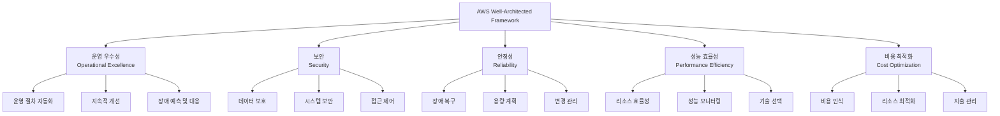
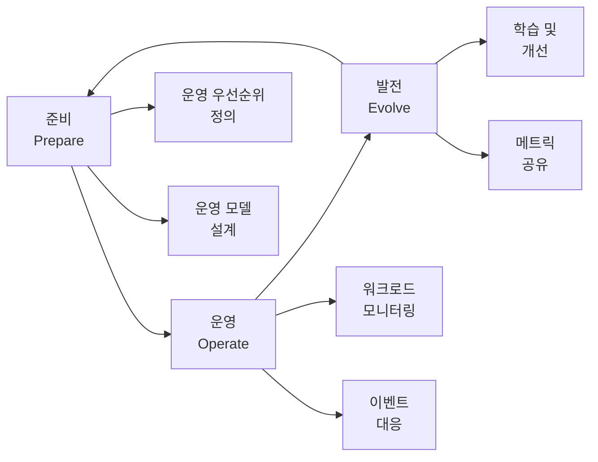
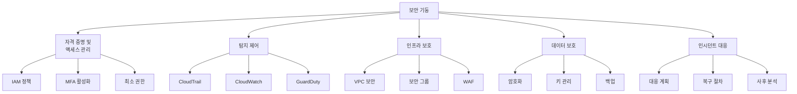
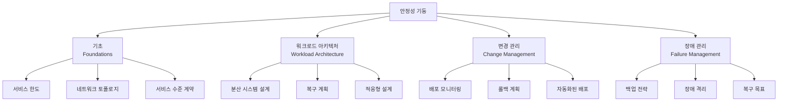
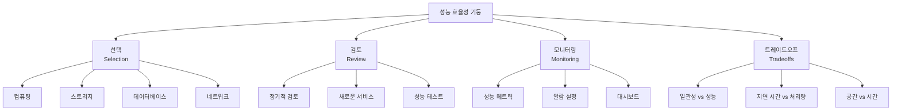
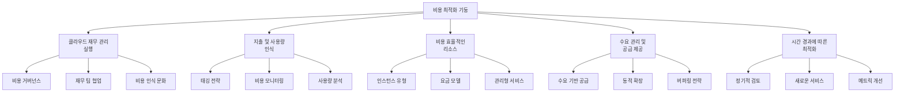
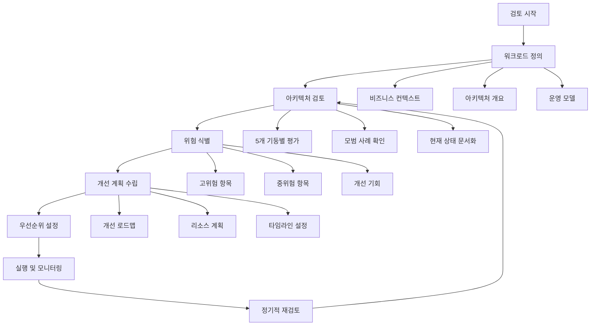
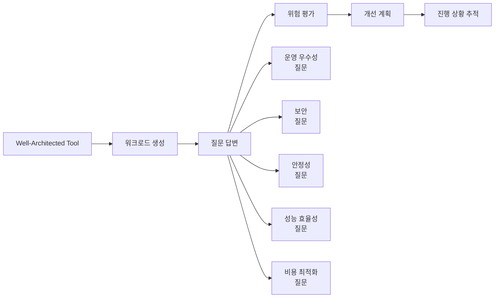
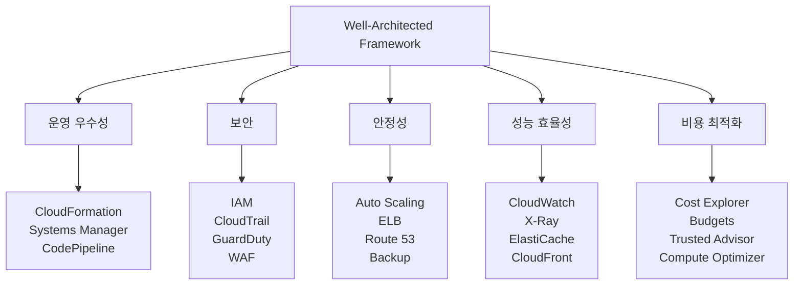

# Day 25: AWS Well-Architected Framework

## 📚 학습 개요

AWS Well-Architected Framework는 클라우드 아키텍처를 설계하고 평가하기 위한 AWS의 모범 사례 프레임워크입니다. 이 프레임워크는 5개의 핵심 기둥을 통해 안전하고 고성능이며 복원력 있고 효율적인 애플리케이션 인프라를 구축하는 방법을 제시합니다.

## 🏛️ Well-Architected Framework 5개 기둥

### 1. 운영 우수성 (Operational Excellence)

운영 우수성 기둥은 시스템을 실행하고 모니터링하여 비즈니스 가치를 제공하고 지원 프로세스와 절차를 지속적으로 개선하는 능력에 중점을 둡니다.

#### 핵심 설계 원칙
- **코드로서의 운영 수행**: 인프라와 운영 절차를 코드로 정의
- **문서화된 절차로 자주 작은 변경 수행**: 정기적이고 증분적인 변경
- **운영 절차를 정기적으로 개선**: 지속적인 프로세스 개선
- **장애 예측**: 잠재적 장애 시나리오를 미리 계획하고 대비
- **운영 장애로부터 학습**: 모든 운영 장애와 이벤트로부터 학습

#### 모범 사례 영역
1. **준비 (Prepare)**
   - 운영 우선순위 이해
   - 운영 모델 설계
   - 운영 준비 상태 평가

2. **운영 (Operate)**
   - 워크로드 상태 이해
   - 운영 상태 이해
   - 운영 이벤트에 대응

3. **발전 (Evolve)**
   - 운영에서 학습
   - 운영 개선

### 2. 보안 (Security)

보안 기둥은 정보, 시스템 및 자산을 보호하는 동시에 클라우드 기술을 통해 비즈니스 가치를 제공하는 능력에 중점을 둡니다.

#### 핵심 설계 원칙
- **강력한 자격 증명 기반 구현**: 최소 권한 원칙 적용
- **추적 가능성 활성화**: 모든 작업과 변경 사항 로깅 및 모니터링
- **모든 계층에서 보안 적용**: 심층 방어 전략
- **보안 모범 사례 자동화**: 수동 보안 작업 최소화
- **전송 중 및 저장 시 데이터 보호**: 암호화 및 토큰화
- **데이터에 대한 사람의 접근 최소화**: 자동화된 메커니즘 사용
- **보안 이벤트 대비**: 인시던트 대응 프로세스 구축

#### 모범 사례 영역

### 3. 안정성 (Reliability)

안정성 기둥은 워크로드가 의도된 기능을 올바르게 일관되게 수행하는 능력에 중점을 둡니다.

#### 핵심 설계 원칙
- **장애 복구 절차 테스트**: 정기적인 복구 테스트 수행
- **장애로부터 자동 복구**: 장애 감지 및 자동 복구 메커니즘
- **수평적 확장**: 전체 워크로드 가용성 증대
- **용량 추측 중단**: 자동 확장 활용
- **자동화를 통한 변경 관리**: 인프라 변경 자동화

#### 모범 사례 영역

### 4. 성능 효율성 (Performance Efficiency)

성능 효율성 기둥은 컴퓨팅 리소스를 효율적으로 사용하여 시스템 요구 사항을 충족하고 수요 변화와 기술 발전에 따라 효율성을 유지하는 능력에 중점을 둡니다.

#### 핵심 설계 원칙
- **고급 기술의 대중화**: 클라우드 서비스 활용으로 복잡성 감소
- **몇 분 만에 전 세계 진출**: 글로벌 배포 용이성
- **서버리스 아키텍처 사용**: 서버 관리 부담 제거
- **더 자주 실험**: 비용 효율적인 실험 환경
- **기계적 동조 고려**: 하드웨어에 최적화된 선택

#### 모범 사례 영역

### 5. 비용 최적화 (Cost Optimization)

비용 최적화 기둥은 시스템의 수명 주기 전반에 걸쳐 가장 낮은 가격으로 비즈니스 가치를 제공하는 능력에 중점을 둡니다.

#### 핵심 설계 원칙
- **클라우드 재무 관리 구현**: 조직 전반의 재무 책임
- **소비 모델 채택**: 필요한 만큼만 지불
- **전체 효율성 측정**: 비즈니스 결과 대비 비용 측정
- **차별화되지 않는 작업에 대한 지출 중단**: 관리형 서비스 활용
- **지출 분석 및 귀속**: 정확한 비용 추적

#### 모범 사례 영역

## 🔍 Well-Architected 검토 프로세스

Well-Architected 검토는 아키텍처를 평가하고 개선 기회를 식별하는 체계적인 프로세스입니다.

### 검토 프로세스 단계

### Well-Architected Tool 활용

AWS Well-Architected Tool은 아키텍처를 검토하고 개선하는 데 도움이 되는 무료 도구입니다.

#### 주요 기능
1. **워크로드 정의**: 애플리케이션과 인프라 정의
2. **질문 기반 검토**: 5개 기둥별 질문에 답변
3. **위험 평가**: 고위험, 중위험, 위험 없음으로 분류
4. **개선 계획**: 우선순위가 지정된 개선 권장 사항
5. **진행 상황 추적**: 시간 경과에 따른 개선 사항 추적

## 📊 아키텍처 평가 메트릭

각 기둥별로 측정해야 할 핵심 메트릭들입니다.

### 운영 우수성 메트릭
- 배포 빈도
- 변경 실패율
- 평균 복구 시간 (MTTR)
- 평균 장애 간격 (MTBF)
- 자동화 비율

### 보안 메트릭
- 보안 인시던트 수
- 취약점 해결 시간
- 규정 준수 점수
- 액세스 검토 완료율
- 암호화 적용 비율

### 안정성 메트릭
- 가용성 (SLA/SLO)
- 복구 시간 목표 (RTO)
- 복구 지점 목표 (RPO)
- 오류율
- 용량 활용률

### 성능 효율성 메트릭
- 응답 시간
- 처리량
- 리소스 활용률
- 확장성 메트릭
- 사용자 경험 점수

### 비용 최적화 메트릭
- 월별 비용 추이
- 비용 대비 성능
- 리소스 활용률
- 예약 인스턴스 활용률
- 비용 이상 탐지

## 🎯 Well-Architected 모범 사례

### 1. 정기적인 검토 수행
- 분기별 또는 주요 변경 시 검토
- 새로운 기능 출시 전 검토
- 인시던트 발생 후 검토

### 2. 팀 전체 참여
- 개발, 운영, 보안, 비즈니스 팀 참여
- 다양한 관점에서 아키텍처 평가
- 지식 공유 및 학습 문화 조성

### 3. 지속적인 개선
- 작은 단위의 점진적 개선
- 자동화를 통한 개선 사항 적용
- 메트릭 기반 의사결정

### 4. 문서화 및 지식 공유
- 아키텍처 결정 사항 문서화
- 모범 사례 공유
- 교육 및 훈련 프로그램 운영

## 🔗 관련 AWS 서비스

Well-Architected Framework 구현을 지원하는 주요 AWS 서비스들:

## 📚 추가 학습 자료

- [AWS Well-Architected Framework 백서](https://docs.aws.amazon.com/wellarchitected/latest/framework/welcome.html)
- [Well-Architected Tool 사용자 가이드](https://docs.aws.amazon.com/wellarchitected/latest/userguide/intro.html)
- [AWS Architecture Center](https://aws.amazon.com/architecture/)
- [Well-Architected Labs](https://wellarchitectedlabs.com/)

## 🎯 학습 정리

Well-Architected Framework는 클라우드 아키텍처의 품질을 체계적으로 평가하고 개선하는 프레임워크입니다. 5개 기둥(운영 우수성, 보안, 안정성, 성능 효율성, 비용 최적화)을 통해 균형 잡힌 아키텍처를 구축할 수 있습니다.

핵심은 정기적인 검토와 지속적인 개선을 통해 비즈니스 요구사항에 맞는 최적의 아키텍처를 유지하는 것입니다. Well-Architected Tool을 활용하여 체계적인 검토를 수행하고, 각 기둥별 모범 사례를 적용하여 안전하고 효율적인 클라우드 환경을 구축하세요.