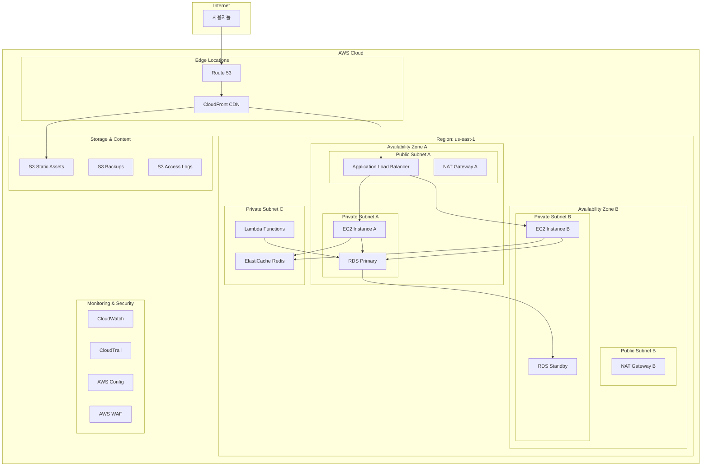

# Day 26 종합 실습 프로젝트: 엔터프라이즈급 3-Tier 웹 애플리케이션 구축

## 🎯 프로젝트 개요

이 종합 실습에서는 지난 25일간 학습한 모든 AWS 서비스를 활용하여 실제 엔터프라이즈 환경에서 사용할 수 있는 완전한 3-tier 웹 애플리케이션을 구축합니다.

### 프로젝트 목표
- 실제 운영 환경에 준하는 AWS 아키텍처 구현
- 보안, 가용성, 확장성, 비용 최적화를 모두 고려한 설계
- AWS Well-Architected Framework 5개 기둥 모두 적용
- 모니터링 및 로깅 시스템 완전 구축

### 예상 소요 시간
- **총 4-6시간** (단계별로 나누어 진행 가능)

## 🏗️ 아키텍처 개요



## 📋 사전 준비사항

### 필수 요구사항
- AWS 계정 (Free Tier 권장, 일부 비용 발생 가능)
- AWS CLI 설치 및 구성
- 기본적인 웹 개발 지식 (HTML, CSS, JavaScript)
- 도메인 이름 (선택사항, Route 53 테스트용)

### 예상 비용
- **Free Tier 내**: $0-5/일
- **Free Tier 초과시**: $10-20/일
- **주의**: 실습 완료 후 반드시 리소스 정리 필요

## 🚀 Phase 1: 네트워크 인프라 구축 (60분)

### Step 1.1: VPC 및 서브넷 생성

1. **VPC 생성**
   ```
   VPC 이름: enterprise-webapp-vpc
   CIDR 블록: 10.0.0.0/16
   DNS 호스트 이름: 활성화
   DNS 확인: 활성화
   ```

2. **서브넷 생성**
   ```
   Public Subnet A: 10.0.1.0/24 (us-east-1a)
   Public Subnet B: 10.0.2.0/24 (us-east-1b)
   Private Subnet A: 10.0.11.0/24 (us-east-1a)
   Private Subnet B: 10.0.12.0/24 (us-east-1b)
   Database Subnet A: 10.0.21.0/24 (us-east-1a)
   Database Subnet B: 10.0.22.0/24 (us-east-1b)
   ```

3. **인터넷 게이트웨이 생성 및 연결**
   - 이름: `enterprise-webapp-igw`
   - VPC에 연결

### Step 1.2: 라우팅 테이블 구성

1. **Public Route Table**
   ```
   이름: enterprise-webapp-public-rt
   라우트: 0.0.0.0/0 → Internet Gateway
   연결: Public Subnet A, B
   ```

2. **Private Route Table A**
   ```
   이름: enterprise-webapp-private-rt-a
   라우트: 0.0.0.0/0 → NAT Gateway A
   연결: Private Subnet A
   ```

3. **Private Route Table B**
   ```
   이름: enterprise-webapp-private-rt-b
   라우트: 0.0.0.0/0 → NAT Gateway B
   연결: Private Subnet B
   ```

### Step 1.3: NAT Gateway 생성

1. **NAT Gateway A**
   - 서브넷: Public Subnet A
   - Elastic IP 할당
   - 이름: `enterprise-webapp-nat-a`

2. **NAT Gateway B**
   - 서브넷: Public Subnet B
   - Elastic IP 할당
   - 이름: `enterprise-webapp-nat-b`

## 🔒 Phase 2: 보안 그룹 및 IAM 설정 (45분)

### Step 2.1: 보안 그룹 생성

1. **ALB Security Group**
   ```
   이름: enterprise-webapp-alb-sg
   인바운드:
   - HTTP (80): 0.0.0.0/0
   - HTTPS (443): 0.0.0.0/0
   아웃바운드: All traffic
   ```

2. **Web Server Security Group**
   ```
   이름: enterprise-webapp-web-sg
   인바운드:
   - HTTP (80): ALB Security Group
   - HTTPS (443): ALB Security Group
   - SSH (22): Bastion Security Group
   아웃바운드: All traffic
   ```

3. **Database Security Group**
   ```
   이름: enterprise-webapp-db-sg
   인바운드:
   - MySQL (3306): Web Server Security Group
   - MySQL (3306): Lambda Security Group
   아웃바운드: None
   ```

4. **Cache Security Group**
   ```
   이름: enterprise-webapp-cache-sg
   인바운드:
   - Redis (6379): Web Server Security Group
   - Redis (6379): Lambda Security Group
   아웃바운드: None
   ```

### Step 2.2: IAM 역할 생성

1. **EC2 Instance Role**
   ```json
   {
     "Version": "2012-10-17",
     "Statement": [
       {
         "Effect": "Allow",
         "Action": [
           "s3:GetObject",
           "s3:PutObject",
           "cloudwatch:PutMetricData",
           "logs:CreateLogGroup",
           "logs:CreateLogStream",
           "logs:PutLogEvents"
         ],
         "Resource": "*"
       }
     ]
   }
   ```

2. **Lambda Execution Role**
   ```json
   {
     "Version": "2012-10-17",
     "Statement": [
       {
         "Effect": "Allow",
         "Action": [
           "rds:DescribeDBInstances",
           "rds:Connect",
           "elasticache:DescribeCacheClusters",
           "logs:CreateLogGroup",
           "logs:CreateLogStream",
           "logs:PutLogEvents"
         ],
         "Resource": "*"
       }
     ]
   }
   ```

## 💾 Phase 3: 데이터베이스 및 캐시 구축 (60분)

### Step 3.1: RDS 서브넷 그룹 생성

1. **DB Subnet Group 생성**
   ```
   이름: enterprise-webapp-db-subnet-group
   설명: Database subnet group for enterprise webapp
   VPC: enterprise-webapp-vpc
   서브넷: Database Subnet A, Database Subnet B
   ```

### Step 3.2: RDS MySQL 인스턴스 생성

1. **Primary Database**
   ```
   엔진: MySQL 8.0
   템플릿: 프로덕션
   DB 인스턴스 식별자: enterprise-webapp-db
   마스터 사용자 이름: admin
   마스터 암호: [강력한 암호 설정]
   DB 인스턴스 클래스: db.t3.micro (Free Tier)
   스토리지: 20GB gp2
   Multi-AZ: 활성화
   VPC: enterprise-webapp-vpc
   서브넷 그룹: enterprise-webapp-db-subnet-group
   보안 그룹: enterprise-webapp-db-sg
   백업 보존 기간: 7일
   모니터링: 활성화
   ```

### Step 3.3: ElastiCache Redis 클러스터 생성

1. **Redis Cluster**
   ```
   이름: enterprise-webapp-cache
   엔진: Redis 7.0
   노드 유형: cache.t3.micro
   복제본 수: 1
   서브넷 그룹: 새로 생성 (Private Subnet A, B)
   보안 그룹: enterprise-webapp-cache-sg
   백업: 활성화
   ```

## 🖥️ Phase 4: 컴퓨팅 리소스 구축 (90분)

### Step 4.1: Launch Template 생성

1. **웹 서버 Launch Template**
   ```
   이름: enterprise-webapp-lt
   AMI: Amazon Linux 2023
   인스턴스 유형: t3.micro
   키 페어: [기존 키 페어 선택]
   보안 그룹: enterprise-webapp-web-sg
   IAM 인스턴스 프로파일: EC2InstanceRole
   ```

2. **User Data 스크립트**
   ```bash
   #!/bin/bash
   yum update -y
   yum install -y httpd mysql php php-mysql
   systemctl start httpd
   systemctl enable httpd
   
   # CloudWatch Agent 설치
   wget https://s3.amazonaws.com/amazoncloudwatch-agent/amazon_linux/amd64/latest/amazon-cloudwatch-agent.rpm
   rpm -U ./amazon-cloudwatch-agent.rpm
   
   # 샘플 웹 애플리케이션 배포
   cat > /var/www/html/index.php << 'EOF'
   <?php
   $servername = "enterprise-webapp-db.cluster-xxxxx.us-east-1.rds.amazonaws.com";
   $username = "admin";
   $password = "your-password";
   $dbname = "webapp";
   
   try {
       $pdo = new PDO("mysql:host=$servername;dbname=$dbname", $username, $password);
       $pdo->setAttribute(PDO::ATTR_ERRMODE, PDO::ERRMODE_EXCEPTION);
       echo "<h1>Enterprise Web Application</h1>";
       echo "<p>Database connection: SUCCESS</p>";
       echo "<p>Server: " . gethostname() . "</p>";
       echo "<p>Time: " . date('Y-m-d H:i:s') . "</p>";
   } catch(PDOException $e) {
       echo "<h1>Enterprise Web Application</h1>";
       echo "<p>Database connection: FAILED - " . $e->getMessage() . "</p>";
   }
   ?>
   EOF
   
   systemctl restart httpd
   ```

### Step 4.2: Auto Scaling Group 생성

1. **Auto Scaling Group 설정**
   ```
   이름: enterprise-webapp-asg
   Launch Template: enterprise-webapp-lt
   VPC: enterprise-webapp-vpc
   서브넷: Private Subnet A, Private Subnet B
   최소 용량: 2
   원하는 용량: 2
   최대 용량: 6
   상태 확인 유형: ELB
   상태 확인 유예 기간: 300초
   ```

2. **Scaling Policy 생성**
   ```
   Scale Out Policy:
   - 트리거: CPU > 70% for 2 minutes
   - 작업: Add 1 instance
   
   Scale In Policy:
   - 트리거: CPU < 30% for 5 minutes
   - 작업: Remove 1 instance
   ```

### Step 4.3: Application Load Balancer 생성

1. **ALB 생성**
   ```
   이름: enterprise-webapp-alb
   스키마: Internet-facing
   IP 주소 유형: IPv4
   VPC: enterprise-webapp-vpc
   서브넷: Public Subnet A, Public Subnet B
   보안 그룹: enterprise-webapp-alb-sg
   ```

2. **Target Group 생성**
   ```
   이름: enterprise-webapp-tg
   프로토콜: HTTP
   포트: 80
   VPC: enterprise-webapp-vpc
   상태 확인 경로: /index.php
   상태 확인 간격: 30초
   정상 임계값: 2
   비정상 임계값: 5
   ```

3. **Listener 구성**
   ```
   프로토콜: HTTP
   포트: 80
   기본 작업: Forward to enterprise-webapp-tg
   ```

## ☁️ Phase 5: 서버리스 및 스토리지 구성 (60분)

### Step 5.1: S3 버킷 생성

1. **Static Assets Bucket**
   ```
   버킷 이름: enterprise-webapp-static-[random-suffix]
   리전: us-east-1
   퍼블릭 액세스: 차단 해제 (CloudFront용)
   버전 관리: 활성화
   암호화: AES-256
   ```

2. **Backup Bucket**
   ```
   버킷 이름: enterprise-webapp-backups-[random-suffix]
   리전: us-east-1
   퍼블릭 액세스: 모두 차단
   버전 관리: 활성화
   암호화: KMS
   수명 주기 정책: 30일 후 IA, 90일 후 Glacier
   ```

### Step 5.2: Lambda 함수 생성

1. **Database Health Check Function**
   ```python
   import json
   import pymysql
   import boto3
   
   def lambda_handler(event, context):
       try:
           connection = pymysql.connect(
               host='enterprise-webapp-db.cluster-xxxxx.us-east-1.rds.amazonaws.com',
               user='admin',
               password='your-password',
               database='webapp'
           )
           
           with connection.cursor() as cursor:
               cursor.execute("SELECT 1")
               result = cursor.fetchone()
           
           connection.close()
           
           # CloudWatch 메트릭 전송
           cloudwatch = boto3.client('cloudwatch')
           cloudwatch.put_metric_data(
               Namespace='Enterprise/WebApp',
               MetricData=[
                   {
                       'MetricName': 'DatabaseHealth',
                       'Value': 1,
                       'Unit': 'Count'
                   }
               ]
           )
           
           return {
               'statusCode': 200,
               'body': json.dumps('Database health check passed')
           }
           
       except Exception as e:
           # CloudWatch 메트릭 전송
           cloudwatch = boto3.client('cloudwatch')
           cloudwatch.put_metric_data(
               Namespace='Enterprise/WebApp',
               MetricData=[
                   {
                       'MetricName': 'DatabaseHealth',
                       'Value': 0,
                       'Unit': 'Count'
                   }
               ]
           )
           
           return {
               'statusCode': 500,
               'body': json.dumps(f'Database health check failed: {str(e)}')
           }
   ```

2. **EventBridge Rule 생성**
   ```
   이름: enterprise-webapp-health-check
   스케줄: rate(5 minutes)
   대상: Lambda function (database-health-check)
   ```

## 🌐 Phase 6: CDN 및 DNS 구성 (45분)

### Step 6.1: CloudFront Distribution 생성

1. **Distribution 설정**
   ```
   Origin Domain: [ALB DNS 이름]
   Origin Protocol Policy: HTTP Only
   Viewer Protocol Policy: Redirect HTTP to HTTPS
   Allowed HTTP Methods: GET, HEAD, OPTIONS, PUT, POST, PATCH, DELETE
   Cache Policy: Managed-CachingOptimized
   Origin Request Policy: Managed-CORS-S3Origin
   ```

2. **Additional Origins**
   ```
   S3 Static Assets:
   - Origin Domain: enterprise-webapp-static-[suffix].s3.amazonaws.com
   - Origin Access Control: 생성 및 연결
   - Behavior Pattern: /static/*
   ```

### Step 6.2: Route 53 구성 (선택사항)

1. **Hosted Zone 생성**
   ```
   도메인 이름: [your-domain.com]
   유형: Public Hosted Zone
   ```

2. **A Record 생성**
   ```
   이름: www
   유형: A
   별칭: Yes
   별칭 대상: CloudFront Distribution
   ```

## 📊 Phase 7: 모니터링 및 로깅 설정 (60분)

### Step 7.1: CloudWatch 대시보드 생성

1. **Enterprise Dashboard**
   ```
   대시보드 이름: Enterprise-WebApp-Dashboard
   
   위젯 구성:
   - ALB Request Count (5분)
   - ALB Response Time (5분)
   - EC2 CPU Utilization (5분)
   - RDS CPU Utilization (5분)
   - RDS Database Connections (5분)
   - ElastiCache CPU Utilization (5분)
   - Lambda Invocations (5분)
   - Lambda Errors (5분)
   - Custom Database Health Metric (5분)
   ```

### Step 7.2: CloudWatch Alarms 생성

1. **Critical Alarms**
   ```
   ALB High Response Time:
   - 메트릭: TargetResponseTime > 2초
   - 기간: 2 datapoints within 10 minutes
   - 작업: SNS 알림
   
   RDS High CPU:
   - 메트릭: CPUUtilization > 80%
   - 기간: 2 datapoints within 10 minutes
   - 작업: SNS 알림
   
   Database Health Check Failed:
   - 메트릭: DatabaseHealth = 0
   - 기간: 1 datapoint within 5 minutes
   - 작업: SNS 알림
   ```

### Step 7.3: AWS Config 설정

1. **Configuration Recorder**
   ```
   이름: enterprise-webapp-config
   역할: AWS Config Service Role
   S3 버킷: enterprise-webapp-config-[suffix]
   리소스 유형: All supported resources
   ```

2. **Config Rules**
   ```
   - ec2-security-group-attached-to-eni
   - rds-multi-az-support
   - s3-bucket-ssl-requests-only
   - cloudtrail-enabled
   ```

### Step 7.4: CloudTrail 설정

1. **Trail 생성**
   ```
   이름: enterprise-webapp-trail
   S3 버킷: enterprise-webapp-logs-[suffix]
   로그 파일 암호화: 활성화
   CloudWatch Logs: 활성화
   이벤트 유형: Management events, Data events
   ```

## 🔐 Phase 8: 보안 강화 (45분)

### Step 8.1: AWS WAF 설정

1. **Web ACL 생성**
   ```
   이름: enterprise-webapp-waf
   리소스 유형: CloudFront distributions
   
   규칙:
   - AWS Managed Rules - Core Rule Set
   - AWS Managed Rules - Known Bad Inputs
   - Rate Limiting: 2000 requests per 5 minutes
   ```

### Step 8.2: Secrets Manager 설정

1. **Database Credentials**
   ```
   시크릿 이름: enterprise-webapp/db/credentials
   시크릿 유형: RDS database credentials
   데이터베이스: enterprise-webapp-db
   자동 로테이션: 30일
   ```

### Step 8.3: Systems Manager Parameter Store

1. **Application Parameters**
   ```
   /enterprise-webapp/db/endpoint: [RDS endpoint]
   /enterprise-webapp/cache/endpoint: [ElastiCache endpoint]
   /enterprise-webapp/s3/static-bucket: [S3 bucket name]
   ```

## 🧪 Phase 9: 테스트 및 검증 (60분)

### Step 9.1: 기능 테스트

1. **웹 애플리케이션 접근 테스트**
   ```bash
   # CloudFront URL로 접근
   curl -I https://[cloudfront-domain]/
   
   # ALB URL로 직접 접근
   curl -I http://[alb-dns-name]/
   
   # 응답 시간 측정
   curl -w "@curl-format.txt" -o /dev/null -s https://[cloudfront-domain]/
   ```

2. **데이터베이스 연결 테스트**
   ```bash
   # EC2 인스턴스에 SSH 접속 후
   mysql -h [rds-endpoint] -u admin -p
   ```

3. **Auto Scaling 테스트**
   ```bash
   # 부하 테스트 도구 사용
   ab -n 1000 -c 10 https://[cloudfront-domain]/
   ```

### Step 9.2: 보안 테스트

1. **보안 그룹 검증**
   - 불필요한 포트가 열려있지 않은지 확인
   - 소스가 적절히 제한되어 있는지 확인

2. **WAF 규칙 테스트**
   ```bash
   # SQL Injection 시도
   curl "https://[cloudfront-domain]/?id=1' OR '1'='1"
   
   # Rate Limiting 테스트
   for i in {1..100}; do curl https://[cloudfront-domain]/; done
   ```

### Step 9.3: 성능 테스트

1. **CloudWatch 메트릭 확인**
   - 응답 시간이 2초 이하인지 확인
   - CPU 사용률이 적정 수준인지 확인
   - 데이터베이스 연결 수가 정상인지 확인

2. **캐시 성능 확인**
   ```bash
   # 첫 번째 요청 (캐시 미스)
   curl -w "%{time_total}" https://[cloudfront-domain]/static/image.jpg
   
   # 두 번째 요청 (캐시 히트)
   curl -w "%{time_total}" https://[cloudfront-domain]/static/image.jpg
   ```

## 📈 Phase 10: 최적화 및 비용 관리 (30분)

### Step 10.1: 비용 최적화

1. **Reserved Instances 검토**
   - RDS 인스턴스에 대한 RI 구매 고려
   - EC2 인스턴스에 대한 Savings Plans 고려

2. **S3 Intelligent Tiering 설정**
   ```
   버킷: enterprise-webapp-static-[suffix]
   구성: Intelligent Tiering
   필터: 모든 객체
   ```

3. **CloudWatch Logs 보존 기간 설정**
   ```
   로그 그룹: /aws/lambda/database-health-check
   보존 기간: 30일
   ```

### Step 10.2: 성능 최적화

1. **ElastiCache 설정 최적화**
   ```
   파라미터 그룹: 사용자 정의
   maxmemory-policy: allkeys-lru
   timeout: 300
   ```

2. **RDS 파라미터 그룹 최적화**
   ```
   파라미터 그룹: 사용자 정의
   innodb_buffer_pool_size: 75% of available memory
   query_cache_size: 64MB
   ```

## 🧹 정리 및 리소스 삭제

### 중요: 비용 발생 방지를 위한 리소스 정리

실습 완료 후 다음 순서로 리소스를 삭제하세요:

1. **CloudFront Distribution 비활성화 및 삭제**
2. **Auto Scaling Group 삭제** (인스턴스 자동 종료)
3. **Application Load Balancer 삭제**
4. **RDS 인스턴스 삭제** (최종 스냅샷 생성)
5. **ElastiCache 클러스터 삭제**
6. **Lambda 함수 삭제**
7. **S3 버킷 비우기 및 삭제**
8. **NAT Gateway 삭제**
9. **Elastic IP 해제**
10. **VPC 및 관련 리소스 삭제**

## 🎓 학습 성과 확인

이 실습을 완료하면 다음을 달성할 수 있습니다:

### 기술적 성과
- ✅ 완전한 3-tier 아키텍처 구현
- ✅ 고가용성 및 내결함성 설계
- ✅ 자동 확장 및 로드 밸런싱
- ✅ 보안 모범 사례 적용
- ✅ 모니터링 및 로깅 시스템 구축
- ✅ 비용 최적화 전략 적용

### SAA-C03 시험 준비
- ✅ 모든 주요 AWS 서비스 실습 경험
- ✅ Well-Architected Framework 실제 적용
- ✅ 실제 시나리오 기반 문제 해결 능력
- ✅ 아키텍처 설계 및 최적화 경험

## 💡 추가 도전 과제

시간이 허용한다면 다음 고급 기능도 구현해보세요:

1. **Blue/Green 배포 구현**
   - CodeDeploy를 사용한 무중단 배포

2. **Multi-Region 아키텍처**
   - 다른 리전에 동일한 환경 구축
   - Route 53 Health Check 및 Failover

3. **컨테이너화**
   - Docker 이미지 생성
   - ECS 또는 EKS로 마이그레이션

4. **서버리스 아키텍처**
   - Lambda + API Gateway로 백엔드 재구성
   - DynamoDB로 데이터베이스 마이그레이션

이 종합 실습을 통해 AWS Solutions Architect Associate 시험에 필요한 모든 실무 경험을 쌓을 수 있습니다!