# 엔터프라이즈 아키텍처 템플릿 모음

## 🏗️ 개요

이 문서는 실제 엔터프라이즈 환경에서 사용할 수 있는 다양한 AWS 아키텍처 템플릿을 제공합니다. 각 템플릿은 특정 비즈니스 요구사항과 기술적 제약사항을 고려하여 설계되었습니다.

## 📋 템플릿 분류

### 1. 웹 애플리케이션 아키텍처
### 2. 마이크로서비스 아키텍처  
### 3. 데이터 레이크 아키텍처
### 4. 하이브리드 클라우드 아키텍처
### 5. 서버리스 아키텍처

---

## 🌐 Template 1: 고가용성 웹 애플리케이션

### 비즈니스 요구사항
- **가용성**: 99.9% 이상
- **확장성**: 트래픽 급증 대응
- **보안**: 엔터프라이즈급 보안
- **비용**: 최적화된 운영 비용

### 아키텍처 다이어그램

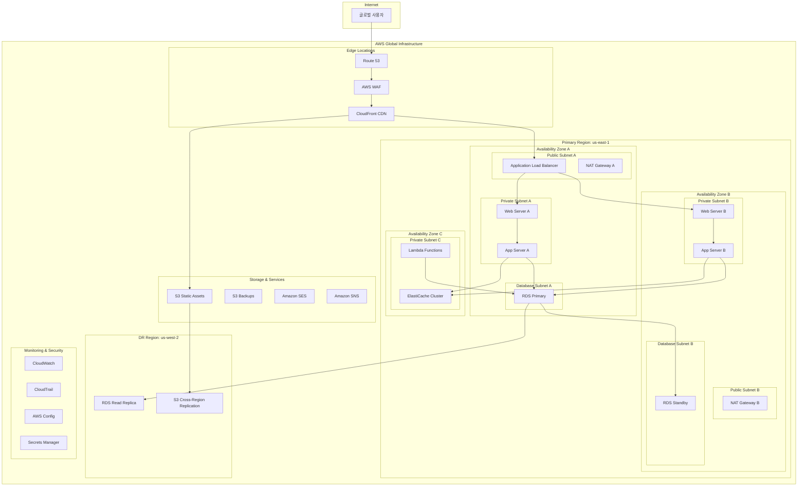

### 핵심 구성 요소

| 구성 요소 | 서비스 | 목적 | 설정 |
|-----------|--------|------|------|
| **DNS & CDN** | Route 53, CloudFront | 글로벌 트래픽 라우팅 | Health Check, Geo-routing |
| **보안** | WAF, Security Groups | 웹 애플리케이션 보호 | OWASP Top 10 규칙 |
| **로드 밸런싱** | Application Load Balancer | 트래픽 분산 | Multi-AZ, Health Check |
| **컴퓨팅** | EC2 Auto Scaling | 자동 확장 | Min: 2, Max: 10 |
| **데이터베이스** | RDS Multi-AZ | 고가용성 DB | MySQL 8.0, 자동 백업 |
| **캐싱** | ElastiCache Redis | 성능 최적화 | Cluster Mode, Multi-AZ |
| **스토리지** | S3, EBS | 정적 자산, 데이터 | Versioning, Encryption |
| **모니터링** | CloudWatch, CloudTrail | 운영 가시성 | 대시보드, 알람 |

### 비용 예상 (월간)

| 서비스 | 사양 | 예상 비용 |
|--------|------|-----------|
| EC2 (t3.medium × 2) | 24/7 운영 | $60 |
| RDS (db.t3.medium) | Multi-AZ | $85 |
| ALB | 1개 | $22 |
| ElastiCache (cache.t3.micro) | 1개 | $15 |
| CloudFront | 1TB 전송 | $85 |
| S3 | 100GB 저장 | $3 |
| **총 예상 비용** | | **$270/월** |

---

## 🔄 Template 2: 마이크로서비스 아키텍처

### 비즈니스 요구사항
- **확장성**: 서비스별 독립적 확장
- **개발 속도**: 팀별 독립적 배포
- **장애 격리**: 서비스 간 장애 전파 방지
- **기술 다양성**: 서비스별 최적 기술 스택

### 아키텍처 다이어그램

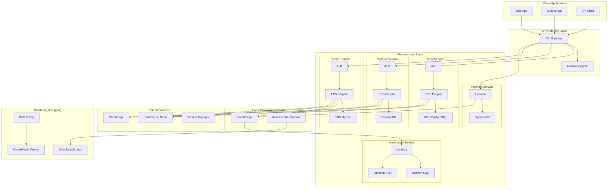

### 서비스별 기술 스택

| 서비스 | 컴퓨팅 | 데이터베이스 | 특징 |
|--------|--------|--------------|------|
| **User Service** | ECS Fargate | RDS PostgreSQL | 관계형 데이터, 트랜잭션 |
| **Product Service** | ECS Fargate | DynamoDB | NoSQL, 빠른 읽기 |
| **Order Service** | ECS Fargate | RDS MySQL | 복잡한 쿼리, 일관성 |
| **Payment Service** | Lambda | DynamoDB | 서버리스, 이벤트 기반 |
| **Notification Service** | Lambda | SQS/SNS | 비동기 처리 |

### 통신 패턴

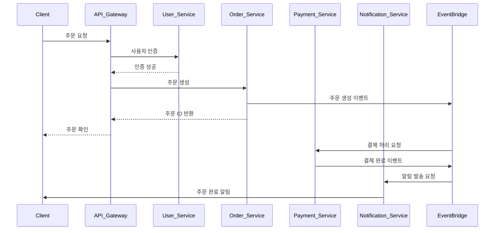

---

## 📊 Template 3: 데이터 레이크 아키텍처

### 비즈니스 요구사항
- **데이터 통합**: 다양한 소스의 데이터 수집
- **확장성**: 페타바이트급 데이터 처리
- **분석**: 실시간 및 배치 분석
- **거버넌스**: 데이터 품질 및 보안

### 아키텍처 다이어그램

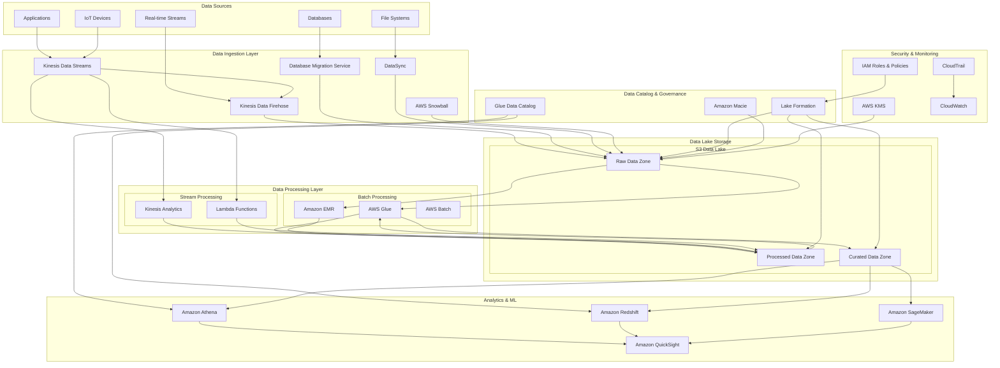

### 데이터 존 구성

| 존 | 목적 | 데이터 형태 | 보존 기간 |
|----|------|-------------|-----------|
| **Raw Zone** | 원본 데이터 저장 | 원본 형태 그대로 | 7년 |
| **Processed Zone** | 정제된 데이터 | Parquet, ORC | 3년 |
| **Curated Zone** | 분석용 데이터 | 최적화된 형태 | 1년 |

### 데이터 처리 파이프라인

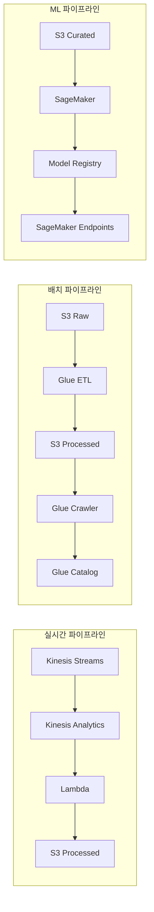

---

## 🔗 Template 4: 하이브리드 클라우드 아키텍처

### 비즈니스 요구사항
- **규정 준수**: 온프레미스 데이터 보관 필요
- **점진적 마이그레이션**: 단계적 클라우드 전환
- **성능**: 낮은 지연시간 요구
- **보안**: 기업 보안 정책 준수

### 아키텍처 다이어그램

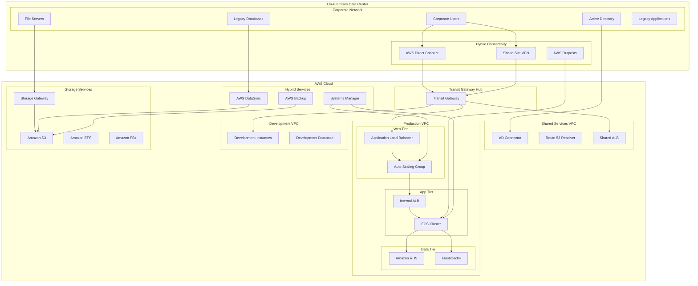

### 연결성 옵션

| 연결 방식 | 대역폭 | 지연시간 | 비용 | 사용 사례 |
|-----------|--------|----------|------|-----------|
| **Direct Connect** | 1Gbps-100Gbps | 낮음 | 높음 | 프로덕션 워크로드 |
| **Site-to-Site VPN** | 최대 1.25Gbps | 중간 | 낮음 | 백업, 개발 환경 |
| **AWS Outposts** | 로컬 | 매우 낮음 | 매우 높음 | 지연시간 민감 앱 |

### 데이터 동기화 전략

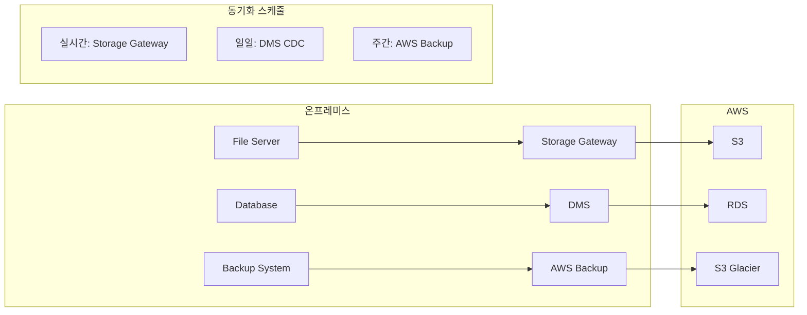

---

## ⚡ Template 5: 서버리스 아키텍처

### 비즈니스 요구사항
- **비용 효율성**: 사용한 만큼만 지불
- **자동 확장**: 무제한 확장성
- **운영 부담 최소화**: 서버 관리 불필요
- **빠른 개발**: 인프라 설정 시간 단축

### 아키텍처 다이어그램

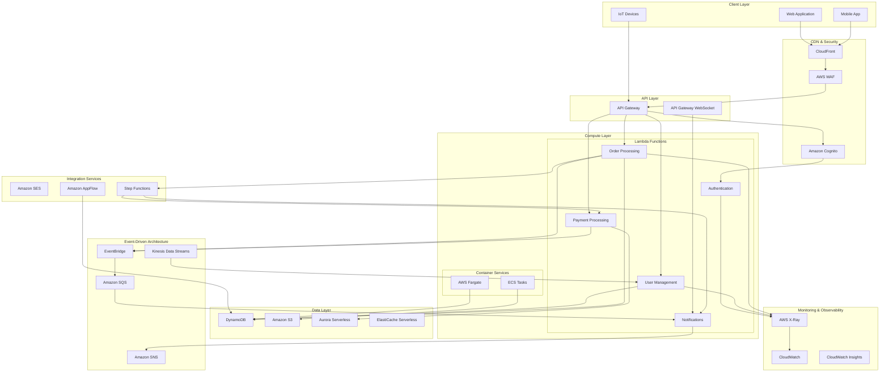

### 서버리스 서비스 매핑

| 기능 | 서버리스 서비스 | 대안 서비스 | 장점 |
|------|----------------|-------------|------|
| **컴퓨팅** | Lambda, Fargate | EC2 | 자동 확장, 비용 효율 |
| **데이터베이스** | DynamoDB, Aurora Serverless | RDS | 관리 불필요, 자동 확장 |
| **캐싱** | ElastiCache Serverless | ElastiCache | 사용량 기반 과금 |
| **API** | API Gateway | ALB + EC2 | 완전 관리형 |
| **인증** | Cognito | 자체 구현 | 보안 모범 사례 |
| **워크플로우** | Step Functions | 자체 구현 | 시각적 워크플로우 |

### 비용 최적화 전략

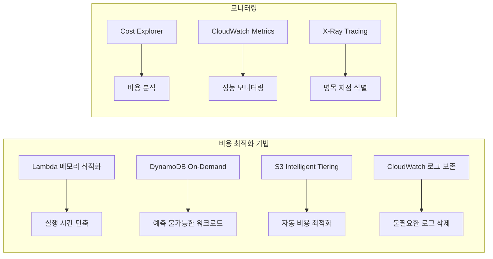

---

## 🎯 템플릿 선택 가이드

### 비즈니스 요구사항별 추천

| 요구사항 | 추천 템플릿 | 이유 |
|----------|-------------|------|
| **높은 가용성 필요** | Template 1 | Multi-AZ, Auto Scaling |
| **빠른 개발 속도** | Template 2, 5 | 마이크로서비스, 서버리스 |
| **대용량 데이터 처리** | Template 3 | 데이터 레이크 아키텍처 |
| **규정 준수** | Template 4 | 하이브리드 클라우드 |
| **비용 최적화** | Template 5 | 서버리스, 사용량 기반 |

### 기술적 복잡도

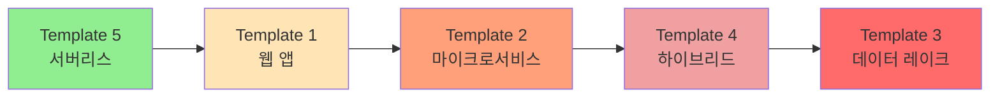

### 운영 복잡도 vs 비용 효율성

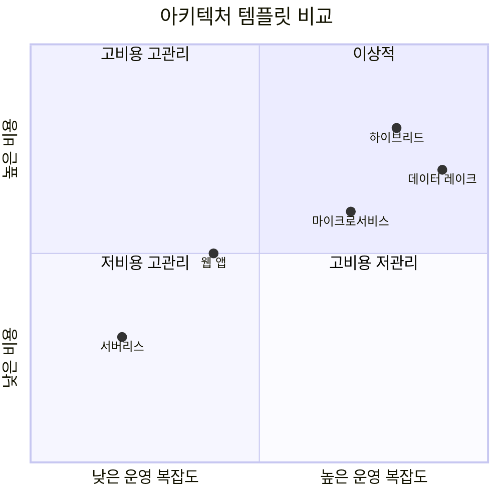

## 📚 추가 리소스

### AWS Well-Architected Framework 매핑

각 템플릿은 다음 5개 기둥을 모두 고려합니다:

1. **운영 우수성**: CloudWatch, X-Ray, Systems Manager
2. **보안**: IAM, WAF, Secrets Manager, KMS
3. **안정성**: Multi-AZ, Auto Scaling, 백업
4. **성능 효율성**: 적절한 인스턴스 타입, 캐싱
5. **비용 최적화**: Reserved Instances, Spot Instances

### 구현 순서 권장사항

1. **1단계**: Template 1 (기본 웹 앱) - AWS 기초 학습
2. **2단계**: Template 5 (서버리스) - 현대적 아키텍처 경험
3. **3단계**: Template 2 (마이크로서비스) - 복잡한 시스템 설계
4. **4단계**: Template 3 또는 4 - 특수 요구사항 대응

이러한 템플릿들을 통해 다양한 비즈니스 시나리오에 대응할 수 있는 엔터프라이즈급 AWS 아키텍처를 구축할 수 있습니다.