# AWS SAA-C03 시험 전략 및 준비 가이드

## 🎯 시험 개요

### 시험 정보
- **시험 코드**: SAA-C03
- **시험 시간**: 130분 (2시간 10분)
- **문제 수**: 65문제
- **합격 점수**: 720점 (1000점 만점)
- **문제 유형**: 객관식 (단일 선택, 다중 선택)
- **시험 비용**: $150 USD

### 시험 영역 및 가중치
1. **보안 아키텍처 설계** (30%)
2. **복원력 있는 아키텍처 설계** (26%)
3. **고성능 아키텍처 설계** (24%)
4. **비용 최적화 아키텍처 설계** (20%)

---

## ⏰ 시간 관리 전략

### 시간 배분 계획
```
총 130분 = 7,800초
65문제 ÷ 130분 = 문제당 평균 2분

권장 시간 배분:
- 1차 풀이: 90분 (문제당 1분 23초)
- 표시한 문제 재검토: 30분
- 전체 답안 검토: 10분
```

### 시간 관리 팁
1. **빠른 판단**: 확실한 문제는 즉시 답안 선택
2. **표시 기능 활용**: 어려운 문제는 표시 후 나중에 재검토
3. **시간 체크**: 30분마다 진행 상황 확인
4. **완벽주의 금지**: 모든 문제를 완벽히 이해하려 하지 말 것

### 시간대별 전략

```mermaid
gantt
    title 시험 시간 관리 계획
    dateFormat X
    axisFormat %M분

    section 1차 풀이
    문제 1-20    :0, 25
    문제 21-40   :25, 50
    문제 41-65   :50, 90

    section 재검토
    표시 문제 검토 :90, 120

    section 최종 점검
    답안 검토     :120, 130
```


---

## 📝 문제 유형별 접근 전략

### 1. 시나리오 기반 문제 (40-50%)

#### 특징
- 긴 문제 설명 (3-5줄)
- 복합적인 요구사항
- 여러 AWS 서비스 조합

#### 접근 방법
1. **핵심 요구사항 파악**
   - 성능 요구사항 (처리량, 지연시간)
   - 가용성 요구사항 (SLA, 다운타임)
   - 보안 요구사항 (규정 준수, 암호화)
   - 비용 제약사항 (예산, 최적화)

2. **제거법 활용**
   - 명백히 틀린 선택지 먼저 제거
   - 요구사항에 맞지 않는 옵션 제거
   - 남은 선택지 중 최적 솔루션 선택

#### 예시 문제 패턴
```
회사에서 웹 애플리케이션을 AWS에 마이그레이션하려고 합니다.
- 예상 트래픽: 월 100만 요청
- 가용성 요구사항: 99.9%
- 비용 최적화 필요
- 글로벌 사용자 지원

가장 적절한 아키텍처는?
```

**분석 과정:**
1. 트래픽 → Auto Scaling, Load Balancer 필요
2. 가용성 → Multi-AZ 배포 필요
3. 비용 최적화 → 예약 인스턴스, 적절한 인스턴스 타입
4. 글로벌 → CloudFront CDN 필요

### 2. 서비스 비교 문제 (20-30%)

#### 특징
- 유사한 서비스 간 선택
- 특정 사용 사례에 최적인 서비스 찾기

#### 주요 비교 포인트
| 비교 영역 | 고려사항 |
|----------|----------|
| **스토리지** | 액세스 패턴, 내구성, 비용 |
| **컴퓨팅** | 워크로드 타입, 확장성, 관리 오버헤드 |
| **데이터베이스** | 데이터 모델, 일관성, 성능 |
| **네트워킹** | 대역폭, 지연시간, 보안 |

#### 자주 출제되는 비교
- **EBS vs EFS vs S3**: 스토리지 타입별 사용 사례
- **RDS vs DynamoDB**: 관계형 vs NoSQL
- **ALB vs NLB vs CLB**: 로드 밸런서 타입별 특징
- **Lambda vs EC2 vs Fargate**: 컴퓨팅 옵션 비교

### 3. 모범 사례 문제 (15-20%)

#### 특징
- AWS Well-Architected Framework 기반
- 보안, 성능, 비용 최적화 모범 사례

#### 핵심 원칙
1. **보안**: 심층 방어, 최소 권한 원칙
2. **안정성**: 장애 격리, 자동 복구
3. **성능**: 적절한 리소스 선택, 캐싱
4. **비용**: 사용량 기반 과금, 예약 할인
5. **운영**: 자동화, 모니터링

### 4. 문제 해결 문제 (10-15%)

#### 특징
- 기존 아키텍처의 문제점 식별
- 개선 방안 제시

#### 접근 방법
1. **문제 증상 분석**: 성능 저하, 비용 증가, 보안 취약점
2. **근본 원인 파악**: 병목 지점, 설정 오류, 아키텍처 한계
3. **해결 방안 제시**: 최소한의 변경으로 최대 효과

---

## 🧠 문제 풀이 기법

### 1. 키워드 식별법

#### 성능 관련 키워드
- **"즉시", "실시간"** → ElastiCache, DynamoDB
- **"높은 처리량"** → Provisioned IOPS, 클러스터링
- **"낮은 지연시간"** → CloudFront, 엣지 로케이션

#### 가용성 관련 키워드
- **"고가용성", "99.9%"** → Multi-AZ, Auto Scaling
- **"재해 복구"** → Cross-Region 복제, 백업
- **"무중단"** → Blue/Green 배포, Rolling 업데이트

#### 보안 관련 키워드
- **"규정 준수"** → CloudTrail, Config, 암호화
- **"최소 권한"** → IAM 역할, 세밀한 권한
- **"네트워크 격리"** → VPC, Private Subnet

#### 비용 관련 키워드
- **"비용 효율적"** → 예약 인스턴스, 스팟 인스턴스
- **"사용량 기반"** → Lambda, DynamoDB On-Demand
- **"장기 보관"** → S3 Glacier, Deep Archive

### 2. 제거법 활용

#### 1단계: 명백히 틀린 선택지 제거
- 존재하지 않는 서비스나 기능
- 요구사항과 완전히 반대되는 옵션
- 기술적으로 불가능한 구성

#### 2단계: 부분적으로 맞는 선택지 제거
- 일부 요구사항만 만족하는 옵션
- 과도하게 복잡하거나 비용이 높은 솔루션
- 보안이나 성능 측면에서 부족한 옵션

#### 3단계: 최적 솔루션 선택
- 모든 요구사항을 만족하는 옵션
- 가장 간단하고 비용 효율적인 솔루션
- AWS 모범 사례에 부합하는 아키텍처

### 3. 우선순위 결정법

#### 요구사항 충돌 시 우선순위
1. **보안** > 성능 > 비용
2. **규정 준수** > 편의성
3. **가용성** > 성능 최적화
4. **데이터 무결성** > 처리 속도

---

## 📚 마지막 주 집중 학습 계획

### Day -7 to Day -5: 취약점 보완
```
Day -7: 모의고사 결과 분석 및 취약 영역 식별
Day -6: 취약 영역 집중 학습 (이론 + 실습)
Day -5: 추가 모의고사 및 개선 확인
```

### Day -4 to Day -2: 핵심 개념 정리
```
Day -4: 서비스별 핵심 기능 및 제한사항 정리
Day -3: 아키텍처 패턴 및 모범 사례 복습
Day -2: 자주 틀리는 문제 유형 재검토
```

### Day -1: 최종 점검
```
- 핵심 개념 요약 노트 검토
- 시험 당일 일정 및 준비물 확인
- 충분한 휴식 및 컨디션 관리
```

---

## 🎯 시험 당일 전략

### 시험 전 준비 (30분 전 도착)
- [ ] 신분증 및 확인서 지참
- [ ] 시험장 위치 및 교통편 확인
- [ ] 개인 물품 보관함 이용
- [ ] 화장실 이용 및 컨디션 점검

### 시험 시작 전 (5분)
- [ ] 시험 규칙 및 인터페이스 확인
- [ ] 계산기 및 메모 기능 테스트
- [ ] 시간 표시 위치 확인
- [ ] 심호흡으로 긴장 완화

### 시험 중 전략
1. **문제 읽기**: 질문을 먼저 읽고 핵심 키워드 파악
2. **선택지 분석**: 제거법을 활용하여 정답 범위 좁히기
3. **시간 관리**: 어려운 문제는 표시 후 넘어가기
4. **재검토**: 표시한 문제 우선 재검토

### 문제별 시간 배분
- **쉬운 문제 (40%)**: 30-60초
- **보통 문제 (40%)**: 1-2분
- **어려운 문제 (20%)**: 2-3분 (표시 후 재검토)

---

## 🔍 자주 틀리는 함정 문제

### 1. 용어 혼동
- **Multi-AZ vs Read Replica**: 고가용성 vs 읽기 성능
- **보안 그룹 vs NACL**: 상태 저장 vs 상태 비저장
- **CloudWatch vs CloudTrail**: 성능 모니터링 vs API 감사

### 2. 서비스 제한사항 간과
- **Lambda 실행 시간**: 최대 15분
- **API Gateway 타임아웃**: 최대 29초
- **S3 객체 크기**: 단일 PUT 최대 5GB

### 3. 비용 최적화 오해
- **"가장 저렴한" ≠ "가장 비용 효율적인"**
- 총 소유 비용(TCO) 고려 필요
- 운영 비용 vs 라이선스 비용

### 4. 보안 모범 사례 무시
- 루트 계정 일상 사용 금지
- 최소 권한 원칙 적용
- 정기적인 액세스 검토

---

## 📊 점수 향상 팁

### 80점 → 85점 (합격권 진입)
- [ ] 기본 서비스 기능 완벽 숙지
- [ ] 자주 출제되는 시나리오 패턴 암기
- [ ] 제거법 활용 능력 향상

### 85점 → 90점 (안정적 합격)
- [ ] 서비스 간 연동 및 통합 이해
- [ ] 복잡한 아키텍처 설계 능력
- [ ] 예외 상황 및 제약사항 숙지

### 90점 이상 (우수 등급)
- [ ] AWS 모범 사례 완전 이해
- [ ] 실무 경험 기반 문제 해결
- [ ] 최신 서비스 및 기능 업데이트

---

## 🎉 시험 후 계획

### 합격 시
- [ ] 디지털 배지 및 인증서 다운로드
- [ ] LinkedIn 프로필 업데이트
- [ ] 다음 단계 인증 계획 수립 (Professional 레벨)

### 불합격 시
- [ ] 결과 분석 및 취약점 파악
- [ ] 추가 학습 계획 수립
- [ ] 재시험 일정 계획 (14일 후 가능)

---

## 📞 응급 상황 대처

### 기술적 문제
- 컴퓨터 오작동 시 즉시 감독관에게 신고
- 네트워크 연결 문제 시 시간 연장 요청
- 시험 인터페이스 문제 시 스크린샷 요청

### 개인적 문제
- 몸이 아플 시 감독관과 상의
- 화장실 이용 시 시간 일시정지 요청
- 집중력 저하 시 짧은 휴식 취하기

이 전략 가이드를 숙지하고 실제 시험에서 차분하게 적용하여 좋은 결과를 얻으시기 바랍니다!