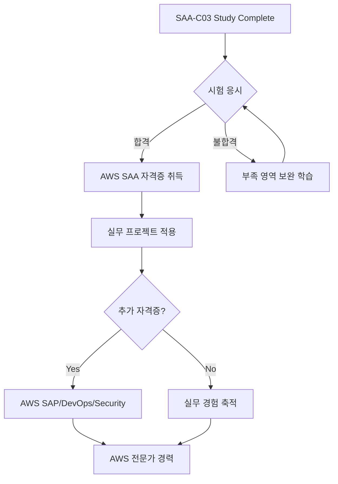

# AWS SAA-C03 학습 과정 완료 인증서 템플릿

## 인증서 디자인 (SVG 형식)

```svg
<svg width="800" height="600" xmlns="http://www.w3.org/2000/svg">
  <!-- 배경 -->
  <rect width="800" height="600" fill="#f8f9fa" stroke="#232f3e" stroke-width="8"/>
  
  <!-- 상단 장식 -->
  <rect x="50" y="50" width="700" height="4" fill="#ff9900"/>
  <rect x="50" y="546" width="700" height="4" fill="#ff9900"/>
  
  <!-- AWS 로고 영역 (텍스트로 대체) -->
  <rect x="350" y="80" width="100" height="40" fill="#232f3e" rx="5"/>
  <text x="400" y="105" text-anchor="middle" fill="white" font-family="Arial, sans-serif" font-size="16" font-weight="bold">AWS</text>
  
  <!-- 제목 -->
  <text x="400" y="160" text-anchor="middle" fill="#232f3e" font-family="Arial, sans-serif" font-size="32" font-weight="bold">
    Certificate of Completion
  </text>
  
  <!-- 부제목 -->
  <text x="400" y="190" text-anchor="middle" fill="#666" font-family="Arial, sans-serif" font-size="18">
    AWS Solutions Architect Associate (SAA-C03) Study Program
  </text>
  
  <!-- 구분선 -->
  <line x1="200" y1="220" x2="600" y2="220" stroke="#ff9900" stroke-width="2"/>
  
  <!-- 수료자 이름 영역 -->
  <text x="400" y="270" text-anchor="middle" fill="#232f3e" font-family="Arial, sans-serif" font-size="20">
    This certifies that
  </text>
  
  <!-- 이름 입력 영역 (밑줄) -->
  <line x1="250" y1="320" x2="550" y2="320" stroke="#232f3e" stroke-width="2"/>
  <text x="400" y="340" text-anchor="middle" fill="#666" font-family="Arial, sans-serif" font-size="14">
    [학습자 이름]
  </text>
  
  <!-- 완료 내용 -->
  <text x="400" y="380" text-anchor="middle" fill="#232f3e" font-family="Arial, sans-serif" font-size="18">
    has successfully completed the comprehensive
  </text>
  <text x="400" y="405" text-anchor="middle" fill="#232f3e" font-family="Arial, sans-serif" font-size="18" font-weight="bold">
    4-Week AWS SAA-C03 Preparation Course
  </text>
  
  <!-- 과정 세부사항 -->
  <text x="400" y="440" text-anchor="middle" fill="#666" font-family="Arial, sans-serif" font-size="14">
    Including 28 days of structured learning, hands-on labs, and comprehensive assessments
  </text>
  
  <!-- 날짜 영역 -->
  <text x="200" y="500" text-anchor="middle" fill="#232f3e" font-family="Arial, sans-serif" font-size="14">
    Date of Completion:
  </text>
  <line x1="120" y1="520" x2="280" y2="520" stroke="#232f3e" stroke-width="1"/>
  <text x="200" y="535" text-anchor="middle" fill="#666" font-family="Arial, sans-serif" font-size="12">
    [완료 날짜]
  </text>
  
  <!-- 서명 영역 -->
  <text x="600" y="500" text-anchor="middle" fill="#232f3e" font-family="Arial, sans-serif" font-size="14">
    Course Instructor:
  </text>
  <line x1="520" y1="520" x2="680" y2="520" stroke="#232f3e" stroke-width="1"/>
  <text x="600" y="535" text-anchor="middle" fill="#666" font-family="Arial, sans-serif" font-size="12">
    AWS Study Program
  </text>
  
  <!-- 하단 장식 -->
  <circle cx="100" cy="550" r="15" fill="#ff9900" opacity="0.3"/>
  <circle cx="700" cy="550" r="15" fill="#ff9900" opacity="0.3"/>
</svg>
```

## 인증서 생성 가이드

### 1. 개인화 정보 입력

#### 필수 입력 사항
- **학습자 이름**: 인증서에 표시될 이름
- **완료 날짜**: 28일 과정 완료 날짜
- **학습 기간**: 시작일 ~ 완료일

#### 선택 입력 사항
- **학습자 ID**: 고유 식별번호 (선택사항)
- **특별 성취**: 우수 성적, 완벽 출석 등
- **추가 메모**: 개인적인 메시지나 목표

### 2. 성취도 기록

#### 학습 통계 템플릿
```markdown
## 학습 성취도 요약

### 📊 전체 통계
- **총 학습 일수**: 28일
- **완료한 이론 모듈**: ___/28
- **완료한 실습**: ___/28  
- **완료한 퀴즈**: ___/28
- **평균 퀴즈 점수**: ___%

### 📈 주차별 성과
- **Week 1 (AWS 기초)**: 완료율 ___%
- **Week 2 (스토리지 & DB)**: 완료율 ___%
- **Week 3 (애플리케이션 서비스)**: 완료율 ___%
- **Week 4 (모니터링 & 최적화)**: 완료율 ___%

### 🏆 특별 성취
- [ ] 완벽 출석 (28일 연속 학습)
- [ ] 퀴즈 평균 90% 이상
- [ ] 모든 실습 완료
- [ ] 모의고사 720점 이상
- [ ] 추가 학습 자료 완료

### 💪 강점 영역
- [ ] Design Resilient Architectures
- [ ] Design High-Performing Architectures  
- [ ] Design Secure Applications
- [ ] Design Cost-Optimized Architectures

### 📝 개선 필요 영역
- [ ] ________________
- [ ] ________________
- [ ] ________________
```

### 3. 디지털 인증서 생성 스크립트

#### HTML 버전 인증서 템플릿
```html
<!DOCTYPE html>
<html lang="ko">
<head>
    <meta charset="UTF-8">
    <meta name="viewport" content="width=device-width, initial-scale=1.0">
    <title>AWS SAA-C03 학습 완료 인증서</title>
    <style>
        @import url('https://fonts.googleapis.com/css2?family=Roboto:wght@300;400;700&display=swap');
        
        body {
            margin: 0;
            padding: 20px;
            font-family: 'Roboto', sans-serif;
            background: linear-gradient(135deg, #f5f7fa 0%, #c3cfe2 100%);
            min-height: 100vh;
            display: flex;
            justify-content: center;
            align-items: center;
        }
        
        .certificate {
            width: 800px;
            height: 600px;
            background: white;
            border: 8px solid #232f3e;
            border-radius: 10px;
            position: relative;
            box-shadow: 0 10px 30px rgba(0,0,0,0.2);
            padding: 40px;
            box-sizing: border-box;
        }
        
        .header {
            text-align: center;
            margin-bottom: 30px;
        }
        
        .aws-logo {
            background: #232f3e;
            color: white;
            padding: 10px 20px;
            border-radius: 5px;
            display: inline-block;
            font-weight: bold;
            font-size: 18px;
            margin-bottom: 20px;
        }
        
        .title {
            font-size: 36px;
            font-weight: 700;
            color: #232f3e;
            margin-bottom: 10px;
        }
        
        .subtitle {
            font-size: 18px;
            color: #666;
            margin-bottom: 20px;
        }
        
        .divider {
            width: 400px;
            height: 2px;
            background: #ff9900;
            margin: 0 auto 30px;
        }
        
        .content {
            text-align: center;
            margin-bottom: 40px;
        }
        
        .certifies {
            font-size: 20px;
            color: #232f3e;
            margin-bottom: 20px;
        }
        
        .name-field {
            border-bottom: 2px solid #232f3e;
            width: 300px;
            margin: 0 auto 10px;
            padding: 10px 0;
            font-size: 24px;
            font-weight: 700;
            color: #232f3e;
            text-align: center;
        }
        
        .completion-text {
            font-size: 18px;
            color: #232f3e;
            margin: 20px 0;
        }
        
        .course-title {
            font-size: 20px;
            font-weight: 700;
            color: #232f3e;
            margin-bottom: 10px;
        }
        
        .details {
            font-size: 14px;
            color: #666;
            margin-bottom: 30px;
        }
        
        .footer {
            display: flex;
            justify-content: space-between;
            align-items: flex-end;
        }
        
        .date-section, .signature-section {
            text-align: center;
        }
        
        .label {
            font-size: 14px;
            color: #232f3e;
            margin-bottom: 10px;
        }
        
        .field {
            border-bottom: 1px solid #232f3e;
            width: 160px;
            padding: 5px 0;
            font-size: 12px;
            color: #666;
        }
        
        .decorative-circle {
            position: absolute;
            width: 30px;
            height: 30px;
            background: #ff9900;
            border-radius: 50%;
            opacity: 0.3;
        }
        
        .circle-left {
            bottom: 20px;
            left: 20px;
        }
        
        .circle-right {
            bottom: 20px;
            right: 20px;
        }
        
        @media print {
            body {
                background: white;
                padding: 0;
            }
            
            .certificate {
                box-shadow: none;
                border: 2px solid #232f3e;
            }
        }
    </style>
</head>
<body>
    <div class="certificate">
        <div class="decorative-circle circle-left"></div>
        <div class="decorative-circle circle-right"></div>
        
        <div class="header">
            <div class="aws-logo">AWS</div>
            <div class="title">Certificate of Completion</div>
            <div class="subtitle">AWS Solutions Architect Associate (SAA-C03) Study Program</div>
            <div class="divider"></div>
        </div>
        
        <div class="content">
            <div class="certifies">This certifies that</div>
            <div class="name-field" contenteditable="true">[학습자 이름을 입력하세요]</div>
            <div class="completion-text">has successfully completed the comprehensive</div>
            <div class="course-title">4-Week AWS SAA-C03 Preparation Course</div>
            <div class="details">Including 28 days of structured learning, hands-on labs, and comprehensive assessments</div>
        </div>
        
        <div class="footer">
            <div class="date-section">
                <div class="label">Date of Completion:</div>
                <div class="field" contenteditable="true">[완료 날짜]</div>
            </div>
            <div class="signature-section">
                <div class="label">Course Instructor:</div>
                <div class="field">AWS Study Program</div>
            </div>
        </div>
    </div>
    
    <script>
        // 인쇄 기능
        function printCertificate() {
            window.print();
        }
        
        // 현재 날짜 자동 입력
        document.addEventListener('DOMContentLoaded', function() {
            const today = new Date().toLocaleDateString('ko-KR');
            const dateFields = document.querySelectorAll('.field[contenteditable="true"]');
            if (dateFields.length > 1) {
                dateFields[1].textContent = today;
            }
        });
    </script>
</body>
</html>
```

### 4. 인증서 활용 가이드

#### 디지털 포트폴리오 활용
```markdown
## 인증서 활용 방법

### 1. LinkedIn 프로필 추가
- **자격증 섹션**에 "AWS SAA-C03 Study Program Completion" 추가
- **설명**: "4주간의 체계적인 AWS Solutions Architect Associate 시험 준비 과정 완료"
- **발급 기관**: "AWS Study Program"
- **취득 날짜**: [완료 날짜]

### 2. 이력서/CV 포함
- **자격증 및 교육** 섹션에 포함
- **상세 설명**: 
  - 28일간의 구조화된 학습 과정
  - 이론 학습, 실습, 퀴즈를 통한 종합적 준비
  - AWS 핵심 서비스 및 아키텍처 패턴 숙지

### 3. 포트폴리오 웹사이트
- **성취 섹션**에 인증서 이미지 포함
- **학습 여정** 페이지에 상세 내용 기록
- **기술 스택**에 AWS 관련 기술 추가

### 4. GitHub 프로필
- **README.md**에 배지 형태로 추가
- **AWS 관련 프로젝트**와 연결
- **학습 기록** 저장소 생성
```

### 5. 성취 배지 디자인

#### SVG 배지 템플릿
```svg
<svg width="200" height="60" xmlns="http://www.w3.org/2000/svg">
  <!-- 배경 -->
  <rect width="200" height="60" fill="#232f3e" rx="30"/>
  
  <!-- AWS 아이콘 영역 -->
  <circle cx="30" cy="30" r="20" fill="#ff9900"/>
  <text x="30" y="36" text-anchor="middle" fill="white" font-family="Arial, sans-serif" font-size="12" font-weight="bold">AWS</text>
  
  <!-- 텍스트 -->
  <text x="65" y="25" fill="white" font-family="Arial, sans-serif" font-size="14" font-weight="bold">SAA-C03</text>
  <text x="65" y="40" fill="#ff9900" font-family="Arial, sans-serif" font-size="12">Study Complete</text>
</svg>
```

### 6. 소셜 미디어 공유 템플릿

#### 공유 메시지 템플릿
```markdown
🎉 AWS SAA-C03 학습 과정 완료! 🎉

4주간의 체계적인 학습을 통해 AWS Solutions Architect Associate 시험 준비를 완료했습니다!

📚 학습 내용:
✅ 28일간의 구조화된 커리큘럼
✅ AWS 핵심 서비스 마스터
✅ 실습을 통한 실무 경험
✅ 종합 모의고사 및 복습

다음 목표: AWS SAA-C03 자격증 취득! 💪

#AWS #CloudComputing #SAA #StudyComplete #TechCareer
```

## 인증서 검증 시스템

### 디지털 서명 및 검증
```markdown
## 인증서 진위 확인

### 인증서 ID
- **고유 번호**: SAA-C03-2024-[MMDD]-[순번]
- **발급일**: [완료 날짜]
- **유효기간**: 무제한

### 검증 방법
1. **학습 기록 확인**: 28일간의 학습 로그 보존
2. **퀴즈 성적 기록**: 일별 퀴즈 결과 저장
3. **실습 완료 기록**: 실습 가이드 완료 여부 확인
4. **최종 평가 결과**: 모의고사 점수 및 분석

### 연락처
- **문의**: aws-study-program@example.com
- **검증 요청**: 인증서 ID와 함께 문의
```

## 지속적 학습 계획

### 인증서 취득 후 로드맵


### 추천 다음 단계
1. **AWS SAA-C03 시험 응시**
2. **실무 프로젝트에 AWS 적용**
3. **AWS 커뮤니티 참여**
4. **추가 AWS 자격증 준비**
5. **클라우드 아키텍트 커리어 개발**

---

## 축하 메시지

### 🎊 완주를 축하합니다! 🎊

4주간의 AWS SAA-C03 학습 여정을 성공적으로 완주하신 것을 진심으로 축하드립니다!

여러분은 이제:
- ✅ AWS 핵심 서비스에 대한 깊은 이해를 보유하고 있습니다
- ✅ 클라우드 아키텍처 설계 능력을 갖추었습니다  
- ✅ 실무에 적용할 수 있는 실습 경험을 쌓았습니다
- ✅ AWS Solutions Architect로서의 기초를 탄탄히 다졌습니다

이 인증서는 여러분의 노력과 성취를 증명하는 소중한 자산입니다. 

**다음 목표인 AWS SAA-C03 자격증 취득을 향해 화이팅! 🚀**

---

*"Every expert was once a beginner. Every pro was once an amateur."*
*- 모든 전문가도 처음에는 초보자였습니다. 여러분의 여정은 이제 시작입니다!*