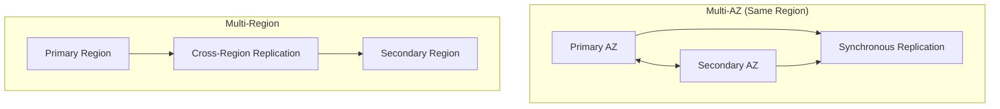
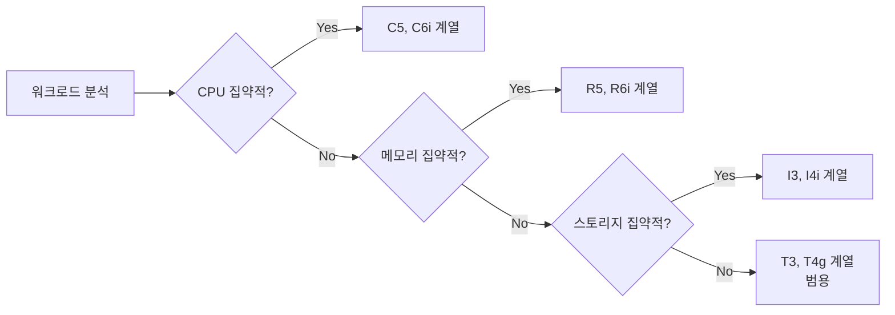
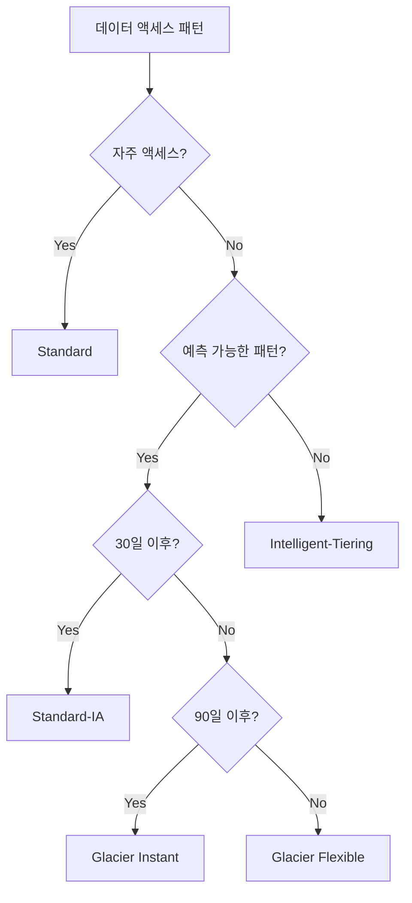
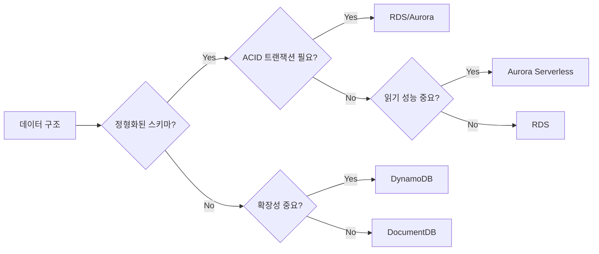
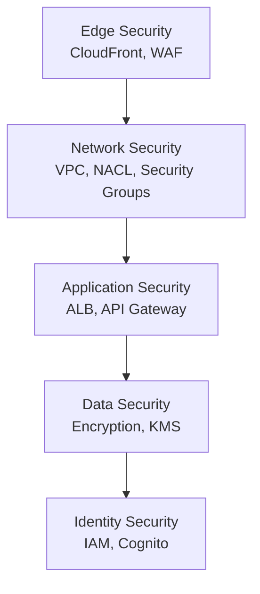
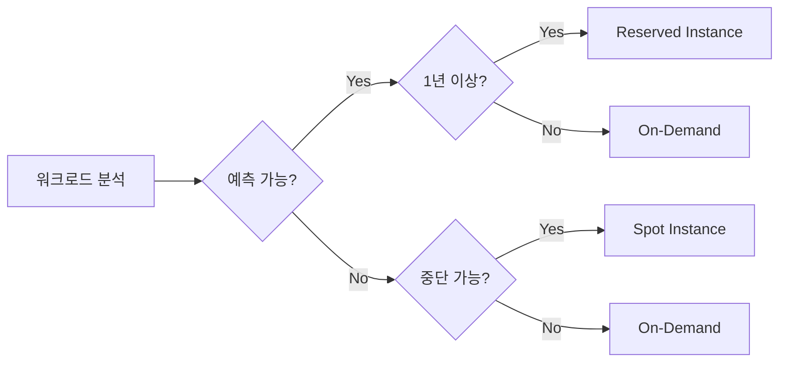

# AWS SAA-C03 핵심 개념 요약

## 시험 도메인별 핵심 개념

### Domain 1: Design Resilient Architectures (26%)

#### 고가용성 및 내결함성 설계

**Multi-AZ vs Multi-Region**

**핵심 포인트:**
- Multi-AZ: 자동 장애 조치, 동기식 복제, RTO/RPO 최소화
- Multi-Region: 재해 복구, 지연 시간 최적화, 규정 준수

#### 분리 메커니즘 설계

**서비스 분리 전략**
- **수평 분리**: Load Balancer, Auto Scaling Group
- **수직 분리**: 3-tier 아키텍처 (Web-App-DB)
- **기능 분리**: 마이크로서비스, Lambda 함수

**큐잉 및 메시징**
- SQS: 표준 vs FIFO, 가시성 타임아웃, DLQ
- SNS: Pub/Sub, 팬아웃 패턴, 필터링
- EventBridge: 이벤트 라우팅, 스케줄링

### Domain 2: Design High-Performing Architectures (24%)

#### 컴퓨팅 솔루션 선택

**EC2 인스턴스 타입 선택 가이드**

**서버리스 vs 컨테이너 vs EC2**
- **Lambda**: 이벤트 기반, 15분 제한, 자동 스케일링
- **Fargate**: 서버리스 컨테이너, 관리 오버헤드 없음
- **EC2**: 완전 제어, 지속적 워크로드, 커스터마이징

#### 스토리지 솔루션 선택

**S3 스토리지 클래스 결정 트리**

**EBS 볼륨 타입 선택**
- **gp3**: 범용, 비용 효율적, 성능 독립 조정
- **io2**: 고성능, 높은 IOPS, 미션 크리티컬
- **st1**: 처리량 최적화, 빅데이터, 로그 처리
- **sc1**: 콜드 스토리지, 아카이브, 백업

#### 데이터베이스 솔루션 선택

**관계형 vs NoSQL 선택 기준**

### Domain 3: Design Secure Applications and Architectures (30%)

#### 보안 설계 원칙

**심층 방어 전략**

**IAM 모범 사례**
- **최소 권한 원칙**: 필요한 최소한의 권한만 부여
- **역할 기반 액세스**: 사용자 대신 역할 사용
- **정기적 권한 검토**: Access Analyzer 활용
- **MFA 강제**: 중요한 작업에 대해 MFA 요구

#### 데이터 보호

**암호화 전략**
- **전송 중 암호화**: TLS/SSL, VPN
- **저장 시 암호화**: KMS, CloudHSM
- **키 관리**: 키 순환, 액세스 로깅

**네트워크 보안**
- **VPC 설계**: 퍼블릭/프라이빗 서브넷 분리
- **보안 그룹**: 상태 저장 방화벽, 허용 규칙만
- **NACL**: 상태 비저장 방화벽, 허용/거부 규칙

### Domain 4: Design Cost-Optimized Architectures (20%)

#### 비용 최적화 전략

**컴퓨팅 비용 최적화**

**스토리지 비용 최적화**
- **S3 수명주기 정책**: 자동 티어링, 삭제
- **EBS 최적화**: 사용하지 않는 볼륨 삭제, 스냅샷 관리
- **데이터 압축**: 전송 및 저장 비용 절감

## 시험 출제 빈도가 높은 서비스

### 1순위 (매우 자주 출제)
- **EC2**: 인스턴스 타입, 스토리지, 네트워킹
- **S3**: 스토리지 클래스, 수명주기, 보안
- **VPC**: 서브넷, 라우팅, 보안 그룹
- **IAM**: 정책, 역할, 권한
- **RDS**: Multi-AZ, Read Replica, 백업

### 2순위 (자주 출제)
- **Lambda**: 트리거, 제한사항, 모니터링
- **CloudFront**: 캐싱, 오리진, 보안
- **Route 53**: DNS, 라우팅 정책, 헬스 체크
- **Auto Scaling**: 정책, 메트릭, 쿨다운
- **ELB**: ALB vs NLB vs CLB

### 3순위 (종종 출제)
- **DynamoDB**: 파티션 키, GSI/LSI, 성능
- **CloudWatch**: 메트릭, 알람, 로그
- **CloudTrail**: 로깅, 감사, 규정 준수
- **KMS**: 키 관리, 암호화, 권한
- **SQS/SNS**: 메시징, 큐잉, 팬아웃

## 자주 헷갈리는 개념 정리

### 1. 스토리지 서비스 비교

| 서비스 | 타입 | 액세스 방법 | 사용 사례 |
|--------|------|-------------|-----------|
| S3 | 객체 스토리지 | REST API | 웹 애플리케이션, 백업 |
| EBS | 블록 스토리지 | EC2 연결 | 데이터베이스, 파일 시스템 |
| EFS | 파일 스토리지 | NFS | 공유 파일 시스템 |
| FSx | 관리형 파일 시스템 | SMB/NFS | 고성능 워크로드 |

### 2. 데이터베이스 서비스 비교

| 서비스 | 타입 | 관리 수준 | 사용 사례 |
|--------|------|-----------|-----------|
| RDS | 관계형 | 관리형 | 전통적인 애플리케이션 |
| Aurora | 관계형 | 클라우드 네이티브 | 고성능, 확장성 |
| DynamoDB | NoSQL | 서버리스 | 웹/모바일 앱 |
| Redshift | 데이터 웨어하우스 | 관리형 | 분석, BI |

### 3. 컴퓨팅 서비스 비교

| 서비스 | 관리 수준 | 확장성 | 사용 사례 |
|--------|-----------|--------|-----------|
| EC2 | 인프라 관리 | 수동/자동 | 모든 워크로드 |
| Lambda | 서버리스 | 자동 | 이벤트 기반 |
| Fargate | 컨테이너 서버리스 | 자동 | 마이크로서비스 |
| ECS | 컨테이너 관리 | 수동/자동 | 컨테이너 오케스트레이션 |

## 시험 팁 및 전략

### 문제 유형별 접근법

#### 시나리오 기반 문제
1. **요구사항 식별**: 성능, 비용, 보안, 가용성
2. **제약조건 파악**: 예산, 시간, 기술적 제약
3. **우선순위 결정**: 가장 중요한 요구사항 식별
4. **솔루션 검증**: 모든 요구사항 충족 확인

#### 비교 문제
1. **공통점과 차이점 분석**
2. **사용 사례별 최적 선택**
3. **비용 효율성 고려**
4. **운영 복잡성 평가**

### 자주 나오는 키워드

**고가용성**: Multi-AZ, Auto Scaling, Load Balancer
**비용 최적화**: Reserved Instance, Spot Instance, S3 Intelligent-Tiering
**보안**: IAM, KMS, VPC, Security Group
**성능**: CloudFront, ElastiCache, Read Replica
**확장성**: Auto Scaling, DynamoDB, Lambda

## 마지막 점검 사항

### 꼭 기억해야 할 숫자들
- Lambda 최대 실행 시간: 15분
- S3 객체 최대 크기: 5TB
- EBS 볼륨 최대 크기: 64TiB (gp3, io2)
- RDS 백업 보존 기간: 0-35일
- CloudWatch 로그 보존 기간: 무제한 (설정 가능)

### 서비스 제한사항
- Lambda 동시 실행: 1000개 (기본값)
- S3 버킷 수: 100개 (계정당)
- VPC 수: 5개 (리전당)
- 보안 그룹 수: 2500개 (VPC당)

### 모범 사례
- **태깅 전략**: 비용 추적, 리소스 관리
- **모니터링**: CloudWatch, CloudTrail 활용
- **백업**: 자동화된 백업 전략
- **보안**: 정기적인 보안 검토

---

**시험 성공을 위한 마지막 조언:**
- 문제를 끝까지 읽고 핵심 요구사항 파악
- 명백히 틀린 답부터 제거
- 비용 효율성과 운영 단순성 고려
- 시간 관리에 주의하며 모든 문제 답변
- 자신감을 가지고 침착하게 임하기

**여러분은 이미 충분히 준비되었습니다! 🎯**